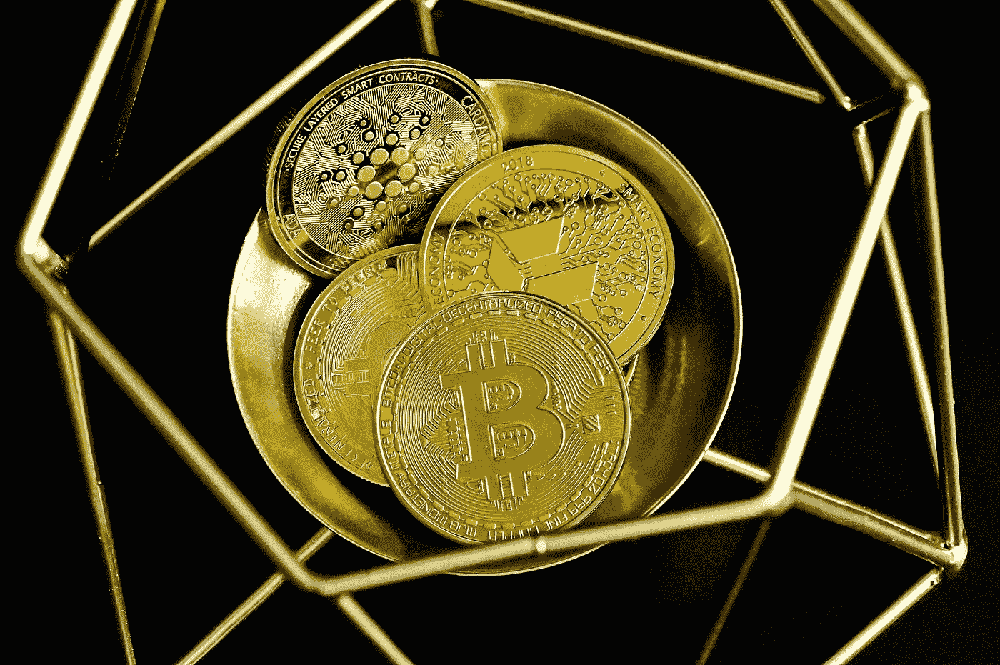

# 分散金融与集中金融。

> 原文：<https://medium.com/coinmonks/decentralized-finance-defi-vs-centralized-finance-cefi-ede87a0bde07?source=collection_archive---------49----------------------->

Source: Unsplash.com

分散金融，也称为 DeFi，是一种使用加密货币和区块链技术管理金融交易的新方式。DeFi 旨在通过用能够提供与传统银行相同服务的点对点交易取代中央机构，实现金融民主化。

DeFi 是一种基于点对点支付的新型银行和金融服务，由区块链技术实现。DeFi 使“不可信”银行绕过银行和经纪人等传统金融中介。

> ***亦见:*** [***以太坊可能过渡到 8 月份的股权证明。***](/coinmonks/ethereum-may-transition-to-proof-of-stake-in-august-b1908ee99df7)

**投资者是新的金融机构**

Source: Unsplash.com

DeFi 使投资者能够“成为银行”,为他们提供通过点对点交易放贷的机会，并获得比传统银行账户更高的回报。

此外，投资者可以快速将资金发送到世界任何地方，并且他们可以通过数字钱包访问他们的资金，而不会产生传统的银行费用。

**比较 DeFi 与 CeFi**

理解 DeFi 的最好方法之一是理解传统系统(CeFi)所面临的挑战。其中一些包括:

1.  大多数国家的很大一部分人口仍然没有银行账户。
2.  你的个人信息是金融服务的隐性成本。
3.  政府和中央集权机构可以随意关闭你的账户。
4.  营业时间通常受特定时区的限制。
5.  由于人工流程，汇款可能需要几天时间。
6.  银行手续费通常很贵。

> [***参见:2022 年值得关注的三大趋势。***](https://blog.blockmagnates.com/3-defi-trends-to-look-out-for-in-2022-e681f1548ed2)

了解你的客户(KYC)指的是金融机构在与客户开展业务之前用来确认客户身份和合法性的程序。传统银行部门(也称为 CeFi)依赖于 KYC。简而言之，顾客必须提供证据证明他们就是他们所声称的那个人。

如果你想从银行贷款，需要信用检查、身份证明和收入证明。

然而，使用 DeFi，客户通常可以保持匿名，隐藏他们的个人信息和身份。通常，您只需要数字资产。

DeFi 的参与者不再通过金融机构，而是签订“智能合同”，这是一种确保各方履行义务的计算机代码。

“通过消除中介，DeFi 促进了一个流动的、全球的金融系统，每个人都可以无障碍地使用，”从而使金融系统民主化。