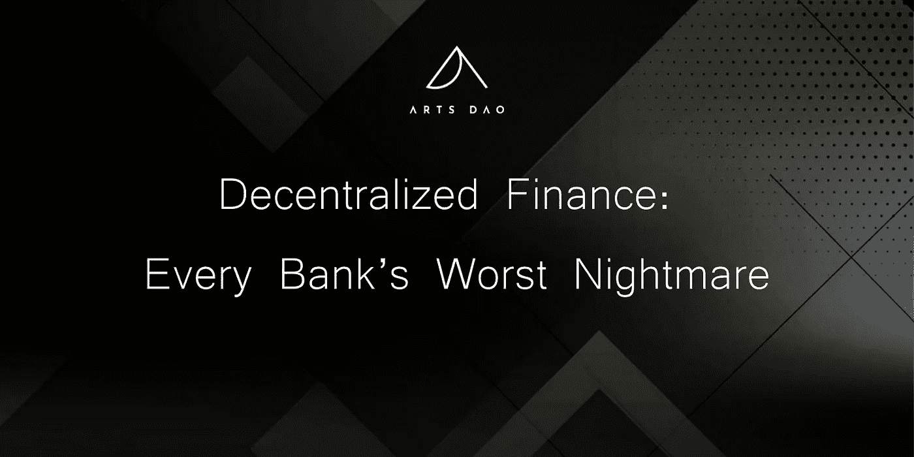
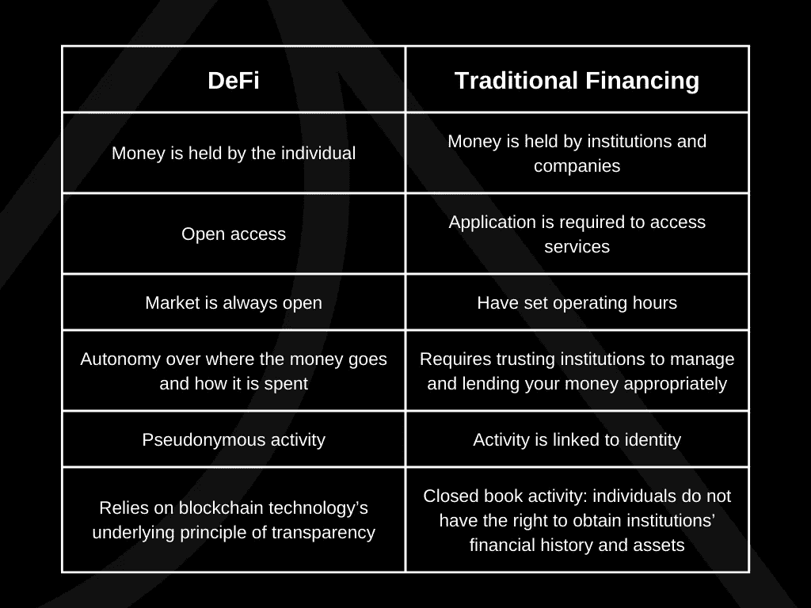
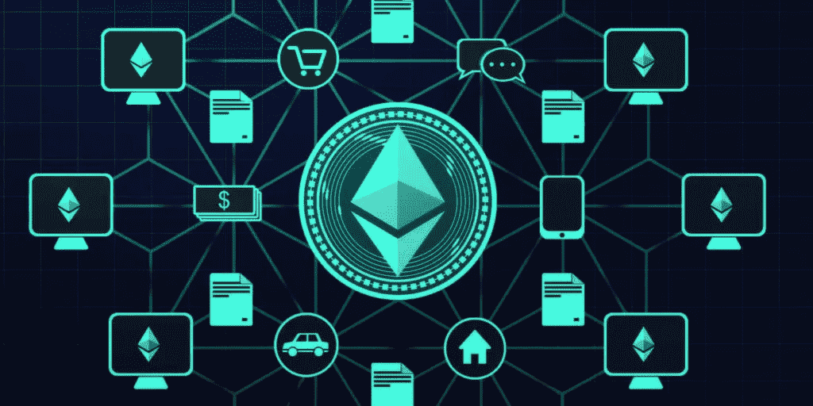

# 分散金融:每家银行最糟糕的噩梦

> 原文：<https://medium.com/coinmonks/decentralized-finance-every-banks-worst-nightmare-11d1413145aa?source=collection_archive---------21----------------------->

## DeFi 是如何颠覆传统金融世界的。

2008 年，在大衰退的狂热和动荡中，人们对银行的偏执和不信任日益加剧，美国金融体系基本崩溃，经济危机不断出现。在动荡期间，一份以“中本聪”为笔名的白皮书发表了，阐述了人们的钱被集中控制的方式，以及对当局管理他们的现金的信任。该论文提出了一种替代方案，即比特币，它将消除传统金融系统中存在的中介，并解决上文提到的其他问题。虽然术语*去中心化金融*直到几年后才被正式化，但比特币被广泛认为是去中心化金融的第一个应用。换句话说，它推动了向更广泛的社区快速引入去中心化的金融体系。

# **传统金融现代化**

去中心化金融，通常被称为 DeFi，包括公共区块链上用户可用的所有金融产品和服务。本质上，它利用智能合约和加密货币(如以太坊)来提供服务，在这个过程中不需要中间人。在传统体系中，金融机构在交易中扮演担保人的角色，赋予它们显著的权威和权力。另一方面，DeFi 依靠区块链技术，进而依靠智能合约，来消除中介机构的风险和成本，强制执行无法更改或删除的交易。

以以太坊的 DeFi 为例。一个智能合约，也称为以太坊钱包，具有保存和发送资金的能力，可以通过编程向另一个以太坊钱包进行每周计划的支付，其中该技术将确保首先只有在有足够资金的情况下才能进行交易，其次，没有人可以干预该合约。

DeFi 可分为四层:

1.  区块链技术包括交易历史、记录和账户状态
2.  资产
3.  协调 DeFi 的“De”的协议(即智能合同)
4.  管理和连接协议的应用程序

DeFi 的主要好处不仅仅是没有中介。它进一步实现了一个金融系统，增加了每个人获得更好回报的潜力，任何人只要有互联网连接就可以使用，从而降低了准入门槛。它反映了与 Web 3.0 相似的哲学:交易的透明性和可证明的资产所有权。实际上，它通过允许每个用户成为自己的银行，允许陌生人之间通过执行智能合同来交换资产和金融活动，从而消除了对银行的需求。

## **DeFi vs 常规**

DeFi 是在认识到传统银行和机构中存在的大量问题后建立和发展起来的。下表强调了这两种系统工作方式的主要区别:

## **DeFi 的效用**

对于银行等机构提供的任何金融服务，可能都有一个分散的替代方案。各种加密货币的快速采用导致了对新金融系统的更高依赖，允许每天不断开发服务。DeFi 的一些最常见用途包括:

*   交易:以点对点的方式交易加密资产(可以比作在没有经纪人的情况下买卖股票)
*   借出:借出某人的密码并按分钟赚取利息，而不是按月分期付款
*   获得贷款:无需填写文件就可以获得贷款。DeFi 还提供了获得传统银行通常不提供的短期贷款的可能性
*   储蓄:密码可以储存在储蓄账户中，比银行提供的利率更高
*   访问稳定的货币:稳定的货币，加密社区对波动性的回答，很容易获得

## **以太坊叛乱**

尽管比特币被誉为 DeFi 出现和发展的始作俑者，但它也有自己的局限性。最初，它的用途仅限于存储和发送资产，不允许用户做其他事情。这就是以太坊进入画面的地方:它采用了去中心化的理念，并将其动员起来，使其服务于不止一个目的。

以太坊被认为是 DeFi 的“完美基础”,因为它符合所有必要条件。首先，以太坊和其上存在的智能合约都不属于任何人，这确保了所有人都可以开放，并强化了规则不可改变的事实。其次，幕后有一种共享的语言，允许各种产品在区块链上协同工作。最后，代币和加密货币内置于共享分类账中，用于记录交易和所有权。以太坊还拥有一个技术成员社区，他们能够检查和监控系统中的不良合同，在代码进一步开发的同时保持开源，直到不再需要这样的角色。

## **DeFi 应用**

DeFi 的一个显著特点是进入门槛低。生态系统对所有人开放，不再限制创新思维构建和开发自己的程序。以以太坊为例，该技术使人们更容易制作自己的去中心化应用程序(Dapp ),而无需等待授权和许可。

最受欢迎的 DeFi 应用之一是分散交换(dex)。它进行在线交易，帮助用户将货币兑换成其他货币，例如用美元兑换 ETH。dex 将用户直接联系起来进行交易，而无需引入第三方来促进他们的资金交换。此外，由于它们在区块链上运行，因此该过程不需要传统的 KYC，也不需要在特定的运行时间内完成。另一个流行的应用是包装比特币(WBTC)，通过这种方式，比特币可以被发送到以太坊网络，直接在他们的 DeFi 系统中使用。用户通常使用 WBTCs 从通过分散式借贷平台借出的密码中赚取利息。每天都有许多新的想法和概念被培养出来，一个著名的例子是产量农业，即扫描 DeFi 令牌以寻求更大回报的实践。

## **结论**

DeFi 的使用和效用超越了简单的价值转移；这是一项彻底的创新，它处理复杂的金融用例，有利于用户。不可忽视的是，该技术在许多方面仍然是新的和实验性的，然而，开发者继续解决和纠正这些问题的速度为 DeFi 的主流采用提供了一个充满希望的未来。其核心是，DeFi 坚持与传统金融实践中至关重要的看门人分道扬镳，而是强调一个开放和包容的环境，将个人从以前设置的金融障碍中解放出来。

# 与我们联系

在这里关注我们，在 [**Twitter**](https://twitter.com/arts_dao?ref_src=twsrc%5Egoogle%7Ctwcamp%5Eserp%7Ctwgr%5Eauthor) 上获取新闻，并留意我们的 [**不和**](https://discord.com/invite/ArtsDao) 与我们聚集在一起的未来主义者、艺术家、收藏家和创作者社区的更深层次的联系。

*   **阿纳斯**:[twitter.com/ananasbrb](https://twitter.com/ananasbrb)
*   **达诺斯奇**:[twitter.com/thecryptosheikh](https://twitter.com/thecryptosheikh)
*   拉希姆:[twitter.com/rahim_mahtab](https://twitter.com/rahim_mahtab)
*   **扎亚安**:[twitter.com/thenftpenguin](https://twitter.com/thenftpenguin)
*   **山姆 Z:**twitter.com/zuckerswag
*   克里斯特尔:【twitter.com/atelier_kristel】T2

# 谢谢你

感谢您及早参与道艺术之旅。我们奉献我们所拥有的每一刻，来建设并成为区块链技术、NFT 空间以及更广泛的艺术发展的一部分。我们期待在现实生活中或元宇宙的其他地方与您见面！

> *加入 Coinmonks* [*电报频道*](https://t.me/coincodecap) *和* [*Youtube 频道*](https://www.youtube.com/c/coinmonks/videos) *了解加密交易和投资*

# 另外，阅读

*   [3 商业评论](/coinmonks/3commas-review-an-excellent-crypto-trading-bot-2020-1313a58bec92) | [Pionex 评论](https://coincodecap.com/pionex-review-exchange-with-crypto-trading-bot) | [Coinrule 评论](/coinmonks/coinrule-review-2021-a-beginner-friendly-crypto-trading-bot-daf0504848ba)
*   [莱杰 vs n rave](/coinmonks/ledger-vs-ngrave-zero-7e40f0c1d694)|[莱杰 nano s vs x](/coinmonks/ledger-nano-s-vs-x-battery-hardware-price-storage-59a6663fe3b0) | [币安评论](/coinmonks/binance-review-ee10d3bf3b6e)
*   [Bybit Exchange 审查](/coinmonks/bybit-exchange-review-dbd570019b71) | [Bityard 审查](https://coincodecap.com/bityard-reivew) | [Jet-Bot 审查](https://coincodecap.com/jet-bot-review)
*   [3 commas vs crypto hopper](/coinmonks/3commas-vs-pionex-vs-cryptohopper-best-crypto-bot-6a98d2baa203)|[赚取加密利息](/coinmonks/earn-crypto-interest-b10b810fdda3)