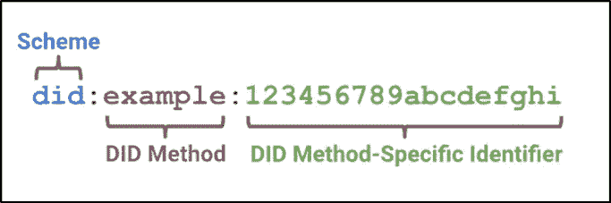

# 分散标识符是 Web3 的一个关键组成部分:原因如下。

> 原文：<https://medium.com/coinmonks/decentralized-identifier-is-a-key-component-for-web3-heres-why-c8b03f7eff92?source=collection_archive---------14----------------------->

# 什么是分散标识符？

分散标识符(DID)是个人、公司或实体的伪匿名标识符。它由公钥-私钥加密系统保护。私钥由个人安全存储，而公钥存储在区块链上。只有私钥所有者可以证明或控制他们的身份。此外，个人可以选择创建多个 did，并拥有跨不同平台的独立标识符。

分散身份使个人能够控制自己的身份，以便他们可以决定如何共享和访问他们的个人信息，从而在保护隐私的同时实现可信的交互。
DID 的四个核心属性(根据 W3C):

1.  这是一个**持久标识符**:它永远不需要改变。
2.  这是一个**可解析的标识符**:DID 包含一个对区块链上的公钥的引用，可以用来解析 DID 文档。
3.  这是一个**可数字验证的标识符**:用户可以用密码证明其身份。
4.  是**分权**:不需要中央权威。

一些现有的数字身份系统满足这四个属性中的一些，但是它们不满足所有这四个属性。

# 对自主身份和数字标识符的需求

*   安全问题:集中式身份解决方案将所有用户凭据存储在一个集中式数据库中，这为黑客创造了单点高价值目标。在这种情况下，用户需要为不同的网站设置数百个不同的密码，从而增加了复杂性。为了解决这个问题，用户可以在不同的平台上重复使用密码。但是这造成了更多的安全问题:一个网站的安全漏洞可能导致不同网站的帐户劫持。
*   隐私问题:在现有的集中式身份解决方案中，用户数据和凭证可能会被网站或平台本身滥用。这在剑桥分析的情况下可以看到。
*   身份所有权:拥有私钥的用户，真正拥有并控制他们的身份。在集中式身份解决方案中，这由平台本身控制。
*   高可用性:分散式身份利用区块链来存储公钥，这比集中式数据库更可靠，运行时间也更长，这是因为区块链固有的冗余和分散性。
*   零知识证明:零知识证明可以极大地提高 DID 的效率和安全性。例如:
*   用户可以证明他们的年龄在 18 岁以上，而不用透露他们的出生日期。
*   用户可以明确地证明他们的 CIBIL 分数在 750 以上，而不暴露他们的实际 CIBIL 分数。

# DIDs 如何工作:系统概述

在传统的身份管理解决方案中，身份由第三方提供，比如谷歌或脸书。在这种情况下，用户可以在这些平台上创建一个名为身份提供商(IDP)的帐户，然后使用单点登录来登录各种在线服务，如 Medium 或 LinkedIn。这种在线服务被称为“依赖方”，因为它依赖于 IDP 来提供身份。用户和依赖方都与该 IDP 建立信任关系。
在去中心化身份中，IDP 的角色被用户本身所取代。用户本质上能够呈现其自己的身份。为了实现这一点，我们需要一个分散的账本(区块链)、一个公私密钥基础设施和一个标准化协议系统，以便各方能够有效地沟通。

让我们看一个分散身份的真实用例。在这个例子中，我们将看到人、系统和软件如何相互作用来促进数字护照的分散识别。

INTERACTION BETWEEN PEOPLE, SYSTEMS AND SOFTWARE IN A DID

在这个例子中，有三方，用户(Alice)，护照的发行者(美国政府)和凭证的验证者，航空公司。
首先，Alice 在手机上安装身份钱包并生成公私钥对，钱包将公钥发布到账本。这样，Alice 可以在分散的身份生态系统中生成并保持她“自己的”身份。

下一步，美国向爱丽丝颁发证书，即护照。这个护照是美国数字签名的，它包含了 Alice 的数字身份的公钥，这是她在前面的步骤中生成的。
最后一步，爱丽丝对护照进行数字签名，然后交给航空公司。航空公司然后验证护照是否由美国政府签署，之后验证是否由爱丽丝本人签署。这可以通过加密来验证，因为爱丽丝和美国政府的公钥都存放在账本上。
本质上，分散身份使用户成为发行者和验证者之间的重要纽带，防止发行者和验证者绕过用户。它使用户能够呈现和控制他们自己的身份，并对他们自己做出可加密验证的断言。

> “在中央集权的体制下，身份就是别人对你的评价。在一个去中心化的系统中，身份就是你对自己的评价。”

事实上，在分散式身份系统中，各方都是平等的，每一方都可以担任身份发布者、验证者和持有者的角色。理论上，爱丽丝可以向美国政府签发证件，或者爱丽丝甚至可以验证任何其他美国公民的护照。

# DIDs 如何工作:技术概述

数字标识符是一个全球唯一的标识符，它不需要集中注册来创建。

SKELETAL STRUCTURE OF A DID, ACCORDING TO W3C STANDARD

所有 DID 都以关键字 DID 开头，后面是 DID 方法。随后是一个唯一的标识符。

方法是否指定了标识符所在的分类帐。它还指定了如何将标识符解析为分类帐中的公钥。以下是比特币区块链上的 did 示例:did:btcr:xkyt-fzzq-q4wq-f2d
同样，还有与各种区块链和分类账相关联的 DID 方法:

DID 方法还指定如何发布、更新和停用分类帐上的标识符。发行者/提供者通常执行 DID 解析，而发布/更新/去激活操作由身份持有者执行。

ROLE OF ENTITIES AND SIGNIFICANCE OF DID METHOD

重要的是要重申，在分散的系统中，所有实体都可以扮演身份持有者、发行者和提供者的角色。个人公民没有必要成为持有者，公司没有必要成为发行者/提供者。现在，让我们详细了解一下决心是如何起作用的。

**做了决议**

决心是分散识别工作的核心吗？DID 解析可以被认为是一个将 DID 作为输入并检索和输出 DID 文档的函数。

> 对数字标识符来说，有用性不仅仅来自标识符本身，而是来自为使用这种特定类型的标识符而设计的应用程序如何使用它

当 DID 被解析时，它被解析为 DID 文档。DID 文档包含基本数据，以便与受试者进行交互。

DID RESOLUTION

DID 主题由 DID 标识，DID 可解析为 DID 文档。同样，DID 主体也是 DID 文档的控制者。

**DID 文档**

它定义了发布和签署一组声明以及以可验证的方式呈现这些声明的方法。声明只是关于个人或实体的陈述。这是一份公开文件，存放在区块链。理论上，它可以包含任何任意信息，甚至像姓名或电子邮件。尽管出于隐私考虑不鼓励这样做。技术社区已经在 W3C 的一个规范上达成一致，称为 DID 文档的可验证凭证。
DID 文件包含:

*   一个或多个公钥，用于用户验证
*   一个或多个服务与 DID 主题相关联。它指定了服务端点的可用协议。
*   时间戳等附加元数据。

A TYPICAL DID DOCUMENT, ACCORDING TO THE W3C STANDARD

# 分散身份面临的挑战

**技术碎片**
虽然存在 DID 文档的突出标准，但没有普遍接受的、可互操作的凭证交换标准。DID 方法中也有很多技术碎片。有 100 多种 DID 方法，每一种都有自己分散的身份生态系统、自己的钱包和自己的分类帐，它们之间很少甚至没有互操作性。

佐科三角三难定理
根据佐科三角三难定理，任何网络中的命名系统都不能满足以下三个
性质中的两个以上:

1.  **人间——意味深长:**意味深长，令人难忘
2.  安全:网络是安全的，不会受到恶意实体的攻击。
3.  **去中心化:**名称的解析没有任何去中心化的授权。

这种三难困境在分散式系统中很重要，因为我们希望有一个不仅分散、安全，而且具有人类可读地址的系统。集中式系统没有这个问题，因为它们的身份是集中创建的。
这个问题可以通过一个附带的、分散的命名服务来解决，该服务将复杂的地址映射到人类可读的名称。

**分散身份的采用**
DIDs 的广泛采用面临诸多挑战。一个突出的问题是收养和发展的“循环因果困境”。DIDs 的采用需要投资、开发者的参与和分散的基础设施。但是，投资和开发商的参与本身需要广泛的采用，投资才能带来可观的回报。这是许多新兴技术面临的问题。对于这个问题有许多建议的解决方案:

*   没有必要单独实现 DID，它可以与联合/集中式身份解决方案一起部署，因此采用是渐进的。组织和企业可以从将公钥存储在中央数据库开始，然后逐步走向完全分散的解决方案。
*   **GitHub 认证**使用公钥基础设施进行用户认证，但是账本是集中的。
*   **对 PDF 进行数字签名**，但在这种情况下，公钥位于 Adobe 的中央数据库:AATL (Adobe 认可的信任列表)。
*   分散识别可以在发行者和验证者是同一实体的系统中实现。例如，在航空公司的忠诚度计划中，或者在公司或大学中。

# 来源

[https://consensys . net/区块链-use-cases/digital-identity/](https://consensys.net/blockchain-use-cases/digital-identity/)
[https://ssimeetup . org/dids-fundamentals-identity book-info-Drummond-reed-Markus-Saba dello-webinar-46/](https://ssimeetup.org/decentralized-identifiers-dids-fundamentals-identitybook-info-drummond-reed-markus-sabadello-webinar-46/)
[https://w3c.github.io/did-core](https://w3c.github.io/did-core)
[https://w3c-ccg.github.io/did-primer/](https://w3c-ccg.github.io/did-primer/)
[https://medium . com/uport/ens-names-is-decorated-identifiers-dids-722](/uport/ens-names-are-decentralized-identifiers-dids-724f0c317e4b)

> 加入 Coinmonks [电报频道](https://t.me/coincodecap)和 [Youtube 频道](https://www.youtube.com/c/coinmonks/videos)了解加密交易和投资

# 另外，阅读

*   [如何在 FTX 交易所交易期货](https://coincodecap.com/ftx-futures-trading) | [OKEx vs 币安](https://coincodecap.com/okex-vs-binance)
*   [OKEx vs KuCoin](https://coincodecap.com/okex-kucoin) | [摄氏替代品](https://coincodecap.com/celsius-alternatives) | [如何购买 VeChain](https://coincodecap.com/buy-vechain)
*   [ProfitFarmers 回顾](https://coincodecap.com/profitfarmers-review) | [如何使用 Cornix Trading Bot](https://coincodecap.com/cornix-trading-bot)
*   [如何匿名购买比特币](https://coincodecap.com/buy-bitcoin-anonymously) | [比特币现金钱包](https://coincodecap.com/bitcoin-cash-wallets)
*   [瓦济里克斯 NFT 评论](https://coincodecap.com/wazirx-nft-review)|[Bitsgap vs Pionex](https://coincodecap.com/bitsgap-vs-pionex)|[Tangem 评论](https://coincodecap.com/tangem-wallet-review)
*   [如何使用 Solidity 在以太坊上创建 DApp？](https://coincodecap.com/create-a-dapp-on-ethereum-using-solidity)
*   [币安 vs FTX](https://coincodecap.com/binance-vs-ftx) | [最佳(SOL)索拉纳钱包](https://coincodecap.com/solana-wallets)