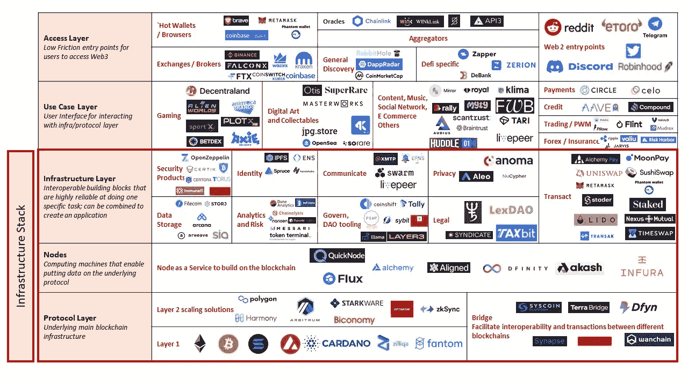
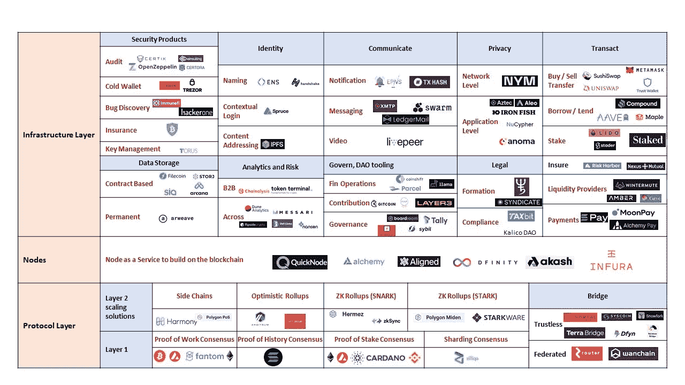
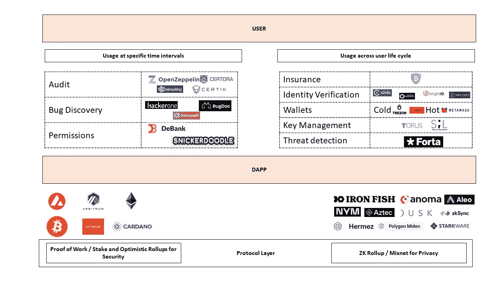

# 分散式基础设施:Web 3.0 的基石

> 原文：<https://medium.com/coinmonks/decentralized-infrastructure-bedrock-of-web-3-0-7890a8a1eab5?source=collection_archive---------3----------------------->

夏兰亚·萨海

随着世界继续转向 Web 3.0，鉴于目前世界上只有 0.71%的人口使用区块链支持的技术，分散式基础设施堆栈将有助于确保主流采用不仅限于区块链“创新者”。分散技术的新的使用案例不断出现----无论是供应链管理(Scantrust)、气候变化(Klima)、出版(Mirror)、创收(Axie Infinity)还是对外援助(Ukraine DAO)等等。尽管围绕个人对中央集权机构(如政府或大型 Web 2.0 看门人)的失望和低信任度存在争议，但用户将转向 Web 3.0 替代品，不是出于意识形态原因，而是出于实用主义原因。这进一步强调了建立分散基础设施栈的健壮性的重要性，这使得 Web 3.0 成为一个可靠的替代方案，赢得了开发人员和用户的信任。

本文试图解释以下内容

一.什么是权力下放？

二。Web 3.0 和底层基础设施堆栈

三。分散式基础架构相对于集中式产品的优势

四。打开基础架构堆栈的包装

动词 （verb 的缩写）深入分析隐私和安全基础设施

不及物动词分散式产品面临的挑战

七。激动人心的主题在前进

**一.** **区块链背景下的权力下放**

随着比特币的引入，由区块链促成的去中心化理念首次浮出水面。比特币网络是开放的，因此任何人都可以连接。它还展示了其他关键特征，如透明度，任何人都可以在需要时验证交易。在这样的网络中，连接到网络的机器被称为“节点”最终，存在一个由数千个节点组成的网络，这些节点可以相互发送和接收资金。

让我们想象一个真实世界的例子来理解分散式基础设施的力量。一个分散的支付网络可以使人们相互联系和支付，而不必为此向中介支付高额费用。这种分布式支付网络将依赖于区块链技术，而没有指定的中央机构，产生交易的节点可以与网络共享交易并直接获得支付。所涉及的费用将是传统支付解决方案的一小部分，结算可能在几秒钟内完成，而如今的支付产品尤其是跨境支付需要长时间的延迟。

**二世。** **Web 3.0 和底层基础设施栈**

下图描述了由包括基础设施 stack⁷在内的区块链支持的构成 Web 3.0 的各个层

Decentralized infrastructure stack supporting Web 3.0

**三世。** **分散式基础设施相对于集中式产品的优势**

与集中式系统相比，分散式基础架构堆栈具有四大优势:

**控制:**分散式基础架构堆栈的用户可以完全控制他们在区块链上的交互，因为他们不需要从集中式实体那里获得许可，集中式实体经常会设置障碍，例如利用他们的数据为自己谋利，或者阻止对他们应用程序的访问(例如 twitter)。

可组合性:一个高度可组合的系统，比如一个由分散的基础设施支持的系统，提供了可以被选择和以各种组合来组装的组件，以满足特定的用户需求。例如:根据所需的安全性/可伸缩性级别，用户可以在 Solana(高吞吐量)或 Ethereum(高安全性)上构建应用程序

**不变性:**区块链技术的数据结构是 append-only。这意味着一旦数据被存储，任何人都没有机会修改或更改数据。根据用户的需求，这可能是好事也可能是坏事！在黑客攻击或意外交易的情况下，底层区块链上的数据无法逆转，因此不可能恢复交易前的状态。另一方面，区块链上的数据是抗审查的，这对于在逆境中存储重要信息是极其重要的。

**安全性:**分散式基础设施没有单点故障，这使得黑客攻击变得困难，因此不像集中式产品那样容易发生数据泄漏。例如:如果有人要黑比特币网络，就必须同时黑掉该网络 50%以上的节点，这使得这一壮举几乎不可能实现。

**四。** **打开基础架构堆栈的包装**

下面的框架用于进一步了解分散式基础架构堆栈中的多种使用情形

Decentralized Infrastructure Stack Deep Dive

基础架构堆栈在网络、计算、存储、安全、分析、治理和交易方面提供了类似乐高积木的支柱，这些支柱的可组合性足以支持跨多个用例构建应用程序，而这些用例往往超出了 Web 2.0 世界的可能性范围

我们可以将基础设施发展分为两大类:

(1)**Web 2.0 产品的替代品:**这包括 Web 2.0 领域的公司已经提供的基础设施/服务。例如:临时存储提供商 Filecoin 与亚马逊、谷歌等集中式云存储提供商直接竞争。分散式提供商的成功取决于他们在成本/效率基础上为用户提供更好选择的能力，这两者都很难规模化，尤其是在与拥有大量可支配资本的巨头竞争时。

(2) **Web 3.0 原生产品:**Arweave 坚持去中心化的存储空间，提供了现有厂商没有的永久存储。虽然该服务的价格要高得多，但它与非永久存储服务不佳的特定使用案例非常相关，如法律合同、遗产、无审查出版等。随着世界走向可追溯的链上可见性，这种产品的效用只会增加。

虽然构建在分散基础设施上的一些应用程序将取代它们的前辈，但 Web 3.0 的优势(通过分散化、自主身份、开放、公共、可组合的后端来定义)将取决于所构建的应用程序的具体类型。

为了简化比较，下面是 Web 2.0 和 Web 3.0 世界中跨几大支柱的基础设施提供商的一些示例

Infrastructure providers across Web 2.0 and Web 3.0

**诉**深入分析隐私和安全基础设施

在基础设施堆栈中，隐私和安全提供商看起来特别有趣，因为它们在区块链的存在中对支持者(Crypto native users，Gen Z)和反对者(监管者、保守派/传统派)都非常重要。一枚硬币的两面被用来支持采用/消除加密运动。虽然支持者主张用户数据的完全隐私和他们的储蓄/财富的安全，没有不必要的中介或中央当局，但持不同意见者认为匿名和新生技术的脆弱性是导致非法活动的一个严重原因。

然而，主要的推论是，分散的应用程序可以满足这些利益相关者的需求，其中底层堆栈可互换地用于满足定制的用例。这是在遵守土地法的同时发生的，而土地法也必须随着技术和社会的发展而变化。例如:印度/美国政府可以使用区块链进行选举投票。该系统将是"防篡改"的，在投票记录中提供可追溯性、匿名性和安全性，同时还保证最终结果的完整性；虽然很难想象这样的场景，但澳大利亚政府已经制定了一个计划，从较小的 elections⁴开始

隐私产品可以用下面的框架详细解释

Privacy and Security Solutions for Dapps and Users

分散堆栈提供的独特功能的一个有趣的例子是 *NYM* ，它使用混合网络在发送者和接收者之间创建难以追踪的通信。敏感信息，如患者的健康记录或公司内部团队之间的秘密消息，可以使用这种技术来确保传达的信息只能由预期方访问。另一方面， *Aleo* 使用零知识密码技术来迎合企业对隐私和可编程性的需求。零知识加密允许第三方验证交易的真实性，而无需透露交易的所有细节。简而言之，它允许用户以预定义的方式在彼此之间转移价值，而不披露导致价值转移的输入。

虽然上述规定为要构建的 Dapp(去中心化应用程序)构建了可定制的基础，但在用户端还出现了其他创新，以确保最大限度地控制身份披露以及个人数据和财富的安全性。

越来越多的 Dapps 通过接受可信机构如 *Certik、Open Zeppelin* 的审计或通过 *Forta* 利用威胁检测基础设施来获得用户信任。由于 Web 3.0 的不可逆转性，暴露漏洞非常重要，因此 Immunefi 和 *Hackerone* 等漏洞发现平台已经获得了巨大的吸引力。

安全解决方案不仅限于软件，为了确保提高用户交易的安全性，随着个人开始转向以有意义的方式投资和使用区块链，硬件钱包也称为冷钱包，如由*莱杰*和*特雷佐*提供的那些钱包越来越多地被使用。由 *Civic* 和 *Self Key* 提供的身份验证服务使个人能够参与许可市场，同时还允许机构参与者通过保留完全由用户控制的真实身份记录来管理分散金融生态系统中的风险。

大约 1850 万个价值约 1500 亿美元的比特币似乎在丢失或搁浅的钱包中，Torus 和 Silence Laboratories 等密钥管理解决方案正在提供独特的解决方案，以确保私钥永远不会暴露给恶意实体(浏览器恶意软件或钓鱼欺诈)。虽然 Torus 支持社交登录的多重签名，但 Silence Laboratories 一直在为真正的分散签名构建多模态证明支持的门限签名方案。

企业支持社会恢复和私人密钥的分割；从而允许用户在没有中央实体的情况下容易地恢复密钥。

**六。** **分散式产品的挑战**

由基础设施栈驱动的 Web 3.0 革命在最近几年吸引了大量资本流动和高质量人才，几个大型区块链专用基金推动了该领域的进一步发展。然而，下面详述的挑战仍然是打开主流使用和接受的关键

**maintenance⁵**–dapp 可能更难维护，因为发布到区块链的代码和数据更难修改。一旦部署了 Dapp(或 Dapp 存储的底层数据),开发人员很难对其进行更新——即使在旧版本中发现了错误或安全风险。

**性能 overhead⁵**–性能开销巨大，伸缩困难。例如:为了达到以太坊渴望的安全性、完整性、透明性和可靠性的水平，每个节点运行并存储每个事务。除此之外，工作证明也需要时间。粗略计算得出的开销大约是目前标准计算的 1，000，000 倍。然而，已经出现了几种解决方案，包括乐观和零知识(zk)汇总以及可扩展的第 1 层链，如 Solana。

**用户体验—**当前的用户体验在去中心化的空间里极度破碎。不仅外行人很难与分散的应用程序进行交互；诸如仅桌面可用性、多重检查、不吸引人的视觉效果等特性使得用户甚至很难尝试去中心化的应用程序，更不用说采用它们了。

**网络拥塞和成本—**目前大多数 Dapps 都构建在以太坊上，当一个应用程序使用太多计算资源时，以太坊就会阻塞，导致交易验证的准备时间过长。此外，复杂的交易涉及高额费用，这使得常规交互链上的费用极其昂贵。为了解决这一问题，诸如 Polygon(以太坊上的第 2 层扩展解决方案)之类的解决方案应运而生，使开发人员能够通过使用 rollup 技术仅将最重要的数据放在以太坊网络上，来构建能够以更低成本实现更大交易量的应用程序。汇总通过将成批转移处理合并到单个事务中来提高可伸缩性。

**七世。** **精彩主题继续前进**

如今的区块链相当于 20 世纪 90 年代中期的互联网，有着巨大的增长空间，这得益于卓越的产品供应和随后的采用。随着我们对 Web 3.0 之旅的深入，我特别兴奋的一些最值得投资的主题包括

机构支持:比特币在很大程度上是机构对 Web 3.0 感兴趣的原因。虽然这一趋势可能会继续下去，但必须扩大区块链运动的整体吸引力。机构采用是一个渐进的过程，基础设施提供商将帮助他们了解和获得分散堆栈的优势，从而取得成功。例如: *Conduit* 是“让主流 fintechs 向其终端客户提供 DeFi 产品，而无需从头开始构建一切”。⁶

**多链兼容性:**区块链的未来将包括一个多链世界，其中各种区块链服务于定制用例，因此需要无摩擦的跨链转移。目前，分散式基础设施提供商跨链的可用性远非最佳，解决这一痛点的解决方案可以创造巨大的成果。

**改善用户体验:**吸引下一波个人使用 Web 3.0 需要无缝、直观的工具来帮助非本地加密用户浏览分散的基础架构堆栈。简化用户体验和提供 Web 2.0 平台的混合产品是底层技术长期成功的关键。例如:西联汇款与 Coin.ph 的区块链使能平台合作，为其客户提供跨境汇款便利。

分散式基础设施构成了 Web 3.0 的基石，并将一直存在。虽然它可能会面临一些阻碍大规模采用的变化，并且可能不会完全取代集中式基础架构，但它正在推动新的对话并引起投资者的极大兴趣。组织开始意识到在他们的产品中加入某种形式的去中心化的重要性，并且正在为这个动态的领域分配大量的资源和空间。虽然分散式基础设施的长期前景是光明的，但由于政府限制、来自 Web 2.0 的竞争、投资者的过度投资以及仅限于游戏、交易和娱乐的用例，它在中短期内会有很大的波动。然而，这反过来将刺激创新的机会，并为更方便的技术支持的未来提供动力！

选定的参考文献

1.[创新扩散理论](https://www.ou.edu/deptcomm/dodjcc/groups/99A2/theories.htm)，罗杰斯 1971

2. [45 区块链统计&会让你思考的事实:超资本主义的黎明](https://fortunly.com/statistics/blockchain-statistics/#gref)，I. Mitic 2022

3.价值数百亿的比特币被忘记带钥匙的人锁定。

4.[图表:区块链在政府中的应用](https://govinsider.asia/smart-gov/charted-blockchain-use-in-governments/)，Charlene Chin

5.[进化阶段 vs 互联网:加密货币在哪里？](https://www.ledger.com/blog/stage-of-evolution-vs-internet-where-are-cryptocurrencies-at)、莱杰博客 2021

6.[下一波加密/金融科技融合](https://mirror.xyz/mgiampapa.eth/T0qIfmrCnz9HefXHSpcGg-cIqy52mAXkhzpsNVLSSR4)，Mike Giampapa 2022

7.[web 3 栈的简单指南](https://blog.coinbase.com/a-simple-guide-to-the-web3-stack-785240e557f0)，比特币基地博客 2022

> 加入 Coinmonks [电报频道](https://t.me/coincodecap)和 [Youtube 频道](https://www.youtube.com/c/coinmonks/videos)了解加密交易和投资

# 另外，阅读

*   [非洲最佳加密交易所](https://coincodecap.com/crypto-exchange-africa) | [Hoo 交易所评论](https://coincodecap.com/hoo-exchange-review)
*   [eToro vs robin hood](https://coincodecap.com/etoro-robinhood)|[MoonXBT vs by bit vs Bityard](https://coincodecap.com/bybit-bityard-moonxbt)
*   [风暴增益评论](https://coincodecap.com/stormgain-review) | [普罗比特评论](https://coincodecap.com/probit-review) | [北海巨妖评论](/coinmonks/kraken-review-6165fc1056ac)
*   [如何在势不可挡的域名上购买域名？](https://coincodecap.com/buy-domain-on-unstoppable-domains)
*   [印度的秘密税](https://coincodecap.com/crypto-tax-india) | [altFINS 审查](https://coincodecap.com/altfins-review) | [Prokey 审查](/coinmonks/prokey-review-26611173c13c)
*   [Blockfi vs 比特币基地](https://coincodecap.com/blockfi-vs-coinbase) | [BitKan 评论](https://coincodecap.com/bitkan-review) | [期货交易机器人](/coinmonks/futures-trading-bots-5a282ccee3f5)