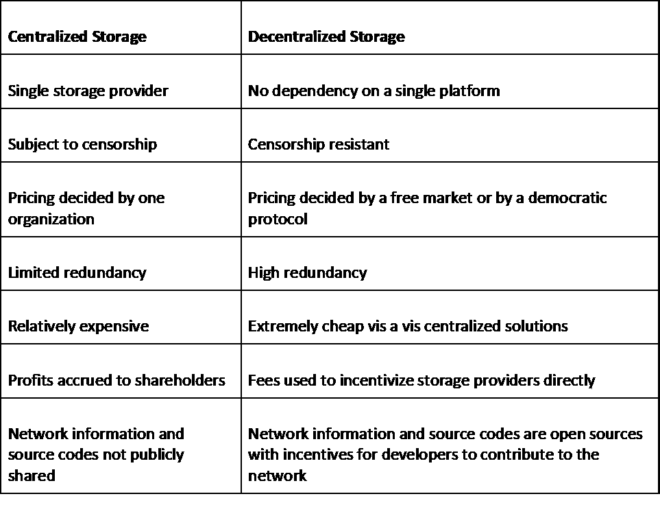
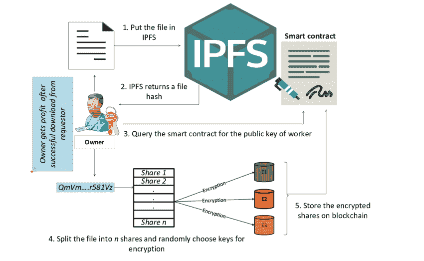
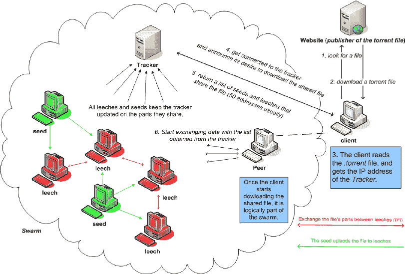
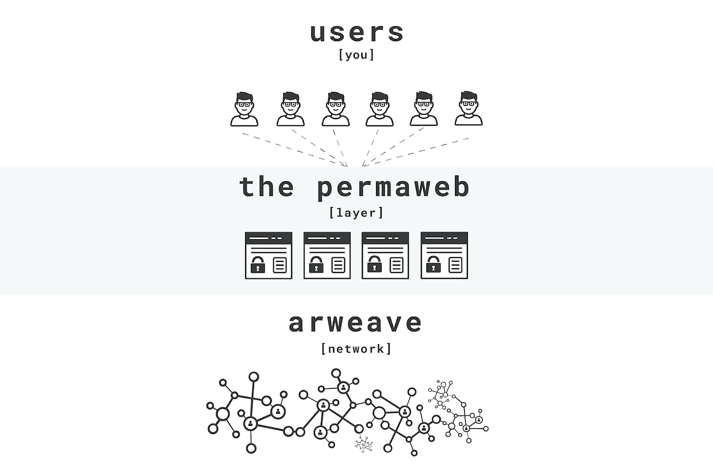
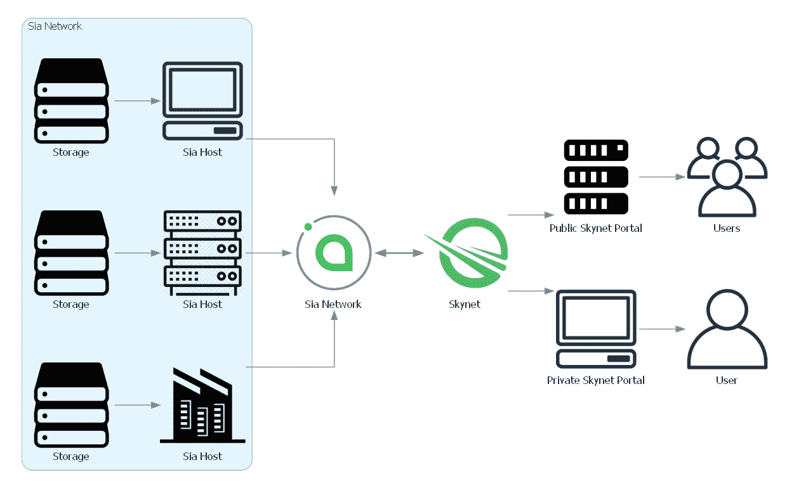
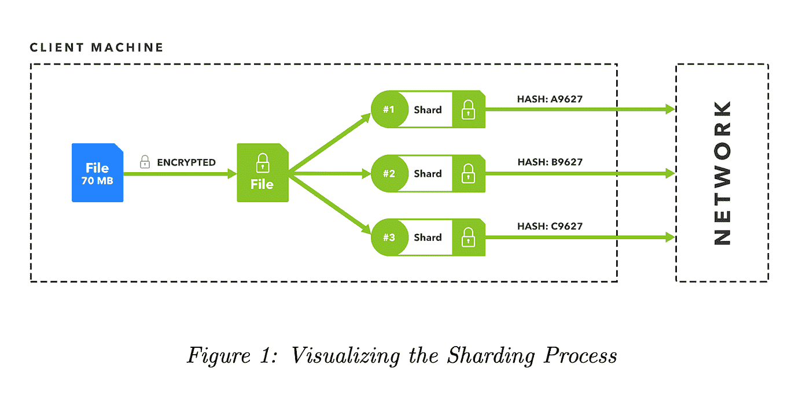

# 分散存储

> 原文：<https://medium.com/coinmonks/decentralized-storage-701d53c4aa76?source=collection_archive---------9----------------------->

**简介**

开源和去中心化是 Web 3.0 的核心精神。 [Chris Dixon](https://twitter.com/cdixon) 解释了为什么去中心化在这个媒体中如此重要[博客](https://onezero.medium.com/why-decentralization-matters-5e3f79f7638e)。分散式文件存储对于 Web 3.0 的成功以及用户和创作者掌控互联网至关重要。虽然区块链是为分散存储而构建的，但它们不是为存储大文件而设计的，而是用于存储交易数据、智能合约和代码。从长远来看，比特币和以太坊账本都不到 1 TB，而在 2020 年，互联网存储了 400 亿 TB 数据。互联网上的大多数价值创造或价值转移都涉及某种内容或文件，需要分散的永久存储解决方案。好消息是，有许多解决方案专门用于分散式永久存储。

# 存储历史

长久以来，人类一直试图找出记录和重要信息的最佳方式。无论是在工作中还是在家里，存储和检索数据的能力在我们的日常生活中都是必不可少的。以下是早期计算机时代的一些有趣的存储设备:

1.  选择管(Selectron Tube):最初开发于 1946 年，这种记忆存储设备被证明价格昂贵，并受到生产问题的困扰。
2.  **穿孔卡:**早期的计算机常用穿孔卡来输入程序和数据。它们最早发明于 1725 年，并在 20 世纪 40 年代得到改进，以便可以读取数据。
3.  **磁鼓存储器:**1932 年发明，在五六十年代作为计算机的主要工作存储器被广泛使用。
4.  **硬盘:**1956 年由 IBM 发明，第一个硬盘占据了一个房间的大部分空间，使用快速旋转的磁盘来存储数据。
5.  **软盘:**软盘是 IBM 发明的，从 20 世纪 70 年代中期到 90 年代后期广泛使用。
6.  **DVD:**这种革命性的数据存储形式使人们能够在外部资源上存储各种媒体，从文件、录音到视频。
7.  **USB 驱动器:** USB(通用串行总线)最初是在 1996 年开发和推出的，通过取代多种串行和并行端口，作为一种在计算机和外围设备之间建立通信的方式。
8.  **今天—云存储:**超过一半的企业使用云存储。截至 2013 年，1 EB 的数据存储在云中(即 1，073，741，824 GB)。

# 集中式存储与分散式存储

# 区块链存储问题:

1.  **存储成本:**所有区块链协议都是为智能合约等特定应用而构建的，不支持大文件的存储。第 1 层和第 2 层协议支持使用令牌传输价值，同时单独引用区块链存储解决方案来访问实际内容。
2.  **持久性:**持久性是系统在停机后仍然存在并保留数据的能力。在对等网络中，存储节点不断进入和退出网络，因此需要一种机制来确保数据得以保留。
3.  **持久性:**确保数据永久存储的能力。这将需要存储节点在任何时候都受到极大的激励。存储系统还会受到多种攻击和威胁，需要设计为在这些情况下能够生存、修复和检索数据。
4.  **不变性:**确保数据一旦保存就不能被操纵、破坏或更改的能力。
5.  **去中心化:**不受单一实体控制，确保没有单点故障或控制。
6.  **共识:**解决方案达成共识的机制，以确认这是“正确的”数据。
7.  **审查阻力:**审查阻力是一把双刃剑——虽然存储解决方案需要确保没有来自机构或权威机构的审查，从而自由地允许存储内容，但它也需要保持存储节点不承担责任，并允许节点自由选择存储或不存储特定内容。
8.  **糟糕的交易:**矿商可以从第三方服务提供商那里将自己的数据分层，并获得奖励。存储解决方案的经济性需要以这样一种方式设计，即糟糕的交易代价高昂。
9.  **平衡矿工报酬和存储成本:**虽然需要低存储成本来推动需求，但矿工需要得到足够的报酬来收回他们的设备和运营成本。
10.  隐私:对等存储系统上的内容和流量是公开的。即使内容被加密，恶意节点也可能试图用暴力破解它。上传到 P2P 存储系统上的内容需要是这样的，即使被解密也不会有任何后果。然而，同样的被恶意用户解密的风险也存在于集中式存储系统中。

# 致力于解决上述问题的项目:

****:****

**协议实验室的胡安·班纳特发明了星际文件系统。IPFS 在分布式文件系统中用于存储和共享数据。它类似于 [torrent](https://fossbytes.com/how-torrent-works-what-is-bittorrenting/) ，但是对于网络来说——文件不是托管在一个单独的位置，而是由任何拥有副本并想要托管它的人托管。**

****概念:****

*   ****分布式哈希表:**用于存储和检索网络节点间的数据。**
*   ****BitSwap:** 对等文件共享协议，协调不信任群之间的数据传输。**
*   ****Merkle DAG:** 用于以分布式友好的方式跟踪网络上文件的变化。**

****IPFS 数据共享:****

****

****来源:** [ResearchGate](https://www.researchgate.net/figure/Data-sharing-on-IPFS-by-owner_fig1_335652136)**

## **持久性:**

**IPFS 运行一个称为“垃圾收集”的过程，通过删除不经常使用的对象来优化内存使用。可以添加一个本地“Pin ”,以确保数据保存在本地。为了更大的数据大小和安全性，可以使用“锁定服务”。钉住服务确保数据保存在多个节点中，并收取费用。**

## **永久性:**

**IPFS 不保证长期储存。然而，IPFS 可以与 Filecoin 等多种工具集成，以确保持久性。这些集成需要最小的文件大小，涉及成本，并且可能需要更长的检索时间。**

## **不变性:**

**使用内容标识符(CID)的内容寻址确保了内容的不变性。内容的任何变化都将生成新的内容标识符，以确保不变性。web 3 使用案例(如 NFT)的完整性通过链接链上的“元数据”来确保，其中包括使用 IPFS 上存储的内容的 CID 创建的 IPFS URL。**

## **共识:**

**IPFS 的默认层没有共识机制。然而，建立在 IPFS 之上的层，如 IPFS 集群和 Filecoin，有它们自己的共识机制。**

**IPFS 集群提供 CRDT(无冲突复制数据类型)和 raft 共识机制。CRDT 用于流动对等网络，其中对等体频繁地进入和退出，并且不是所有对等体都具有修改许可。这也支持固定/取消固定操作的批处理操作。Raft 共识是在对等网络完全受信任时使用的一种较老但经过验证的机制。Filecoin 使用自己的共识机制，称为“存储证明”。**

## **存储成本:**

**IPFS 是免费使用的。然而，在 IPFS 上上传文件并不能确保永久保存，因为数据只存储在你的电脑上。为了确保数据在多个地方被复制，需要产生费用的锁定服务和永久性工具。**

## **独特的功能:**

1.  **使用内容标识符(CID)的内容寻址确保了不变性**
2.  **使用 Merkle 有向无环绘图技术优化内容的链接和寻址**
3.  **使用分布式哈希表(DHT)的内容发现**

*   **[**BitTorrent 文件系统**](https://www.bittorrent.com/token/btt/) **:****

**BitTorrent 是一个分散的文件共享协议，由开发者 Brad Cohen 于 2001 年创建。2018 年， [Tron 基金会](https://tron.network/)收购 BitTorrent 基金会，2019 年推出 [BTT](https://coinmarketcap.com/currencies/bittorrent-new/) token。**

**用户不是将文件下载或上传到一台服务器上，而是加入一个运行软件的计算机网络，这样他们就可以相互交换文件和数据。BTT 令牌支持分散式应用程序，包括 DLive、BitTorrent Speed、BitTorrent 文件系统和许多其他应用程序。**

****BitTorrent 中的数据共享:****

****

****来源:** [ResearchGate](https://www.researchgate.net/figure/How-BitTorrent-works_fig2_242097832)**

## **持久性:**

**存储合同证明— BTFS 使用租赁者(文件所有者)和主机(存储提供商)之间的多个智能合同来确保文件得到存储。主机定期提供存储证明，如果做不到这一点，就会被罚款。**

## **永久性:**

**数据永远不会存储在 BitTorrent 服务器上。用户一旦下载了 BitTorrent 客户端，就可以一辈子管理一段数据。即使程序脱机，同步用户也可以使用同步。**

## **令牌组学:**

**BTT 代币的总供应量和最高供应量为 990，000，000，000，而当前流通供应量为 923，767.70 BTT**

## **不变性:**

**CID —内容标识符**

## **共识:**

**桩合同-主机桩位种子令牌(BTT)的基础上，上传的文件将被发送到他们的存储。**

## **存储成本:**

**0.00675 美元/GB/月**

## **独特的功能:**

**BTFS 是 IPFS 的分支。它有额外的功能，如令牌经济与位种子令牌(BTT)集成，文件加密，文件删除主机**

******:******

1.  ****Arweave 最初被命名为 Archain。是由[萨姆·威廉姆斯](https://www.linkedin.com/in/sam-williams-2b5111144/)和[威廉姆·琼斯](https://www.linkedin.com/in/william-jones-b661b314a/)创立的一个去中心化的存储网络。Arweave 的目标是通过分布式计算机网络永久存储文件。****

******Arweave 协议工作在两层:******

1.  ******Blockweave:** Arweave 将其数据存储在一个块图中。在 Arweave 中，每个块都与两个更早的块相连，形成一种称为“块编织”的结构****
2.  ****Permaweb 上发布的所有内容永远可用。permaweb 提供低成本、零维护、永久托管的网络应用程序和网页。****

******Arweave 中的数据共享:******

********

******来源:**[Arweave.org](https://www.arweave.org/images/diagram/permaweb-layers-vertical.png)****

## ****持久性:****

****Arweave 使用令牌经济学来实现 AR 令牌的持久性。存储捐赠通过维持比维护数据的支出更高的回报，确保 Arweave 的开采保持盈利和可持续。矿工奖励包括%的交易费(一个区块中所有交易费的总和)、通货膨胀奖励(区块高度的递减函数)和捐赠奖励(如果其他两个组成部分低于支出，则支付)。10%的交易费被直接存入捐赠钱包.****

## ****永久性:****

****Arweave 是为“数据持久性”而设计的，同时认识到一种新的、更好的永久性数据存储机制可能会出现，Arweave 的数据可能会包含在其中。****

## ****不变性:****

****blockweave 数据结构确保了不变性，在该数据结构中，矿工被激励来存储块。此外，与需要固定复制次数的传统存储不同，block weave 使用概率方法来确保正确的复制次数，从而更好地存储稀有数据。****

## ****共识:****

****访问证明:可以访问随机选择的“召回”块的节点赢得该块，验证器验证该证明。PoA 是对工作证明的增强，激励矿工存储区块并赢得奖励。****

## ****存储成本:****

****每 GB 约 8 美元的一次性终身存储成本。没有包月****

## ****独特的功能:****

****永久存储只需支付一次费用****

****块编织:每个块链接到 2 个先前的块:先前的块和来自区块链先前历史的随机块，一个召回块。****

******访问证明:**激励矿工存储稀有块，从而遵循概率和激励驱动的方法在网络中复制数据。****

******状态记忆:**新节点不需要下载所有之前的块。新用户只能从受信任的对等方下载当前块，或者使用块数据结构-块哈希列表和钱包列表，并验证/请求旧块。这些列表由矿工同步并保持最新。每个节点都可以根据自己的偏好或资源确定存储的优先级，网络仍然能够保证存储和复制。****

# ****4. [FileCoin](https://filecoin.io/) :****

****Filecoin 是一个分散的存储网络，任何人都可以在其中租用存储空间。不用把你的文件委托给一家公司，它们可以被拆分并存储在世界各地的计算机上。这是一个建立在 IPFS 之上的激励层，通过向用户支付 [FIL](https://coinmarketcap.com/currencies/filecoin/) 代币来激励他们出租存储空间。****

******Filecoin 中的数据共享:******

******来源:** [Filecoin 文档](https://docs.filecoin.io/about-filecoin/what-is-filecoin/#for-users)****

## ****持久性:****

****Filecoin 使用“复制证明”来验证节点是否存储了数据，并使用“时空证明”来确保数据在一定时间范围内得以保存。****

## ****永久性:****

****Filecoin 使用 FIL 令牌和与令牌相关联的多种机制来激励长期存储。****

1.  ******网络基线:**为了防止矿工在兑现早期奖励后退出网络，块奖励按比例增加，直到网络达到一定基线。****
2.  ******担保品:**矿工锁定担保品资金，保证一定时间的存储。如果矿商未能提供存储或在保证期限内离线，一部分抵押品和整体奖励将被拿走。****
3.  ******可靠性:** Filecoin 提供了使用多个独立挖掘器存储文件的选项，以及验证是否存储了独立副本的选项，这使其具有容错能力。****

## ****不变性:****

****Filecoin 是在 IPFS 建造的。它使用 CID 来寻址内容，这确保了不变性——内容的任何变化都会产生新的 CID。****

## ****共识:****

****Filecoin 使用“有用功”共识协议，其中矿工被分配的概率与矿工分配的存储成比例。****

## ****存储成本:****

****web3.storage 等一些存储提供商免费提供 Filecoin 上的存储。这是因为如果矿工已经在存储数据，他们的回报会更高。根据 [file.app](https://file.app/) 的平均成本为. 0000009 美元/GB/月****

## ****独特的功能:****

1.  ****使用复制证明和时空证明的存储证明****
2.  ****共识协议奖励矿工更高的存储****
3.  ****确保可靠性的抵押品****

# ****5. [Siacoin](https://sia.tech/) :****

****Siacoin (SC)是 Sia 网络的本地令牌。它允许任何计算机将未使用的硬盘空间出租给希望存储文件的用户。Sia 设计了能够创建对等存储(P2P)网络的软件，允许任何人成为该网络的一部分。****

****它的平台有能力使用智能合约。它们充当客户和存储服务提供商之间的协议。作为分散存储，它没有单点故障。****

******新航数据共享:******

********

******来源:** [天网指南](https://support.skynetlabs.com/getting-started/skynet-basics)****

# ****6.Storj :****

****StorJ 分散式云存储是一个用于存储数据的开源分散式网络。它旨在以最小的膨胀解决高耐久性问题。它不遵循在多个节点中复制文件的典型方法，而是将文件分割到多个节点中，从而在低扩展(需要额外存储)的情况下保持高耐用性(经受住中断的可能性)。****

****存储节点和应用程序:使任何有空闲磁盘空间和互联网的人都能加入网络。****

****上行客户端，开发者工具:上传和下载数据的机制****

****卫星节点:在缺乏共识机制的情况下，可信节点管理元数据、节点信息、数据修复和支出****

******Storj 中的数据共享:******

********

******来源:** [Storj 白皮书](https://www.storj.io/storjv2.pdf)****

## ****持久性:****

****使用擦除代码来确保数据持续存在，而不会增加网络流量。数据被分成片段、编码并保存在多个节点中。与复制相比，这需要小得多的扩展系数，即额外的存储，以获得相同的持久性或在发生故障时恢复数据的可能性。背后的数学是[这里](https://innovation.vivint.com/introduction-to-reed-solomon-bc264d0794f8)。****

## ****永久性:****

****运行审核是为了检测系统的性能。失败的审核将导致文件从剩余的节点中恢复，丢失的部分被重建并保存在其他节点中。****

## ****不变性:****

****元数据项—任何修改都需要修改元数据项****

## ****共识:****

****目前没有任何机制依赖卫星运营商达成共识。计划在未来建立一个机制。****

## ****存储成本:****

****0.004 美元/GB/月****

## ****独特的功能:****

****高耐用性，带碎片(擦除代码)****

****AWS S3 兼容性****

****加密隐私****

# ****参考资料:****

1.  ****[https://academy.binance.com/en](https://academy.binance.com/en)****
2.  ****https://coinmarketcap.com/alexandria****
3.  ****[https://one zero . medium . com/why-decentralization-matters-5e 3f 79 f 7638 e](https://onezero.medium.com/why-decentralization-matters-5e3f79f7638e)****
4.  ****[https://cluster.ipfs.io/documentation/guides/consensus/](https://cluster.ipfs.io/documentation/guides/consensus/)****
5.  ****[https://www.arweave.org/yellow-paper.pdf](https://www.arweave.org/yellow-paper.pdf)****
6.  ****[https://docs.storj.io/dcs/](https://docs.storj.io/dcs/)****
7.  ****[https://ethereum.org/en/developers/docs/storage/](https://ethereum.org/en/developers/docs/storage/)****
8.  ****[https://docs.ipfs.io/](https://docs.ipfs.io/)****
9.  ****[https://www . ping DOM . com/blog/the-history-of-computer-data-storage-in-pictures/](https://www.pingdom.com/blog/the-history-of-computer-data-storage-in-pictures/)****

****======================================================================****

# ****关于作者:****

****Shuwam Rana 是一名技术分析师、数字营销人员和 SEO 专家，热衷于帮助企业发展。他也有工程背景。你可以在推特上关注他****

****Harsha Karanth 在接触 web 3.0 之前一直在能源和电子商务行业工作。他热衷于在 web 3 上建立影响力项目，尤其是在环境、动物护理和教育领域。你可以在推特上关注他****

> ****加入 Coinmonks [电报频道](https://t.me/coincodecap)和 [Youtube 频道](https://www.youtube.com/c/coinmonks/videos)了解加密交易和投资****

# ****另外，阅读****

*   ****[在美国如何使用 BitMEX？](https://coincodecap.com/use-bitmex-in-usa) | [BitMEX 评论](https://coincodecap.com/bitmex-review)****
*   ****[最佳期货交易信号](https://coincodecap.com/futures-trading-signals) | [期交所评论](https://coincodecap.com/liquid-exchange-review)****
*   ****[南非的加密交易所](https://coincodecap.com/crypto-exchanges-in-south-africa) | [BitMEX 加密信号](https://coincodecap.com/bitmex-crypto-signals)****
*   ****[MoonXBT 副本交易](https://coincodecap.com/moonxbt-copy-trading) | [阿联酋的加密钱包](https://coincodecap.com/crypto-wallets-in-uae)****
*   ****[Remitano 审查](https://coincodecap.com/remitano-review)|[1 英寸协议指南](https://coincodecap.com/1inch) | [购买 Floki](https://coincodecap.com/buy-floki-inu-token)****