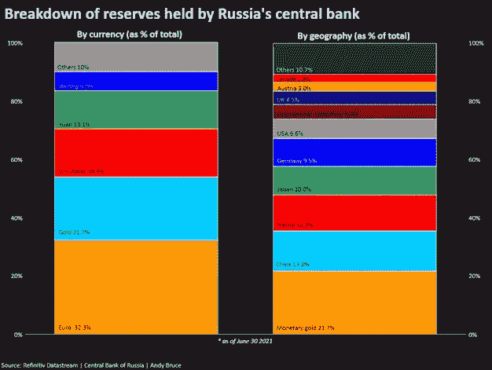
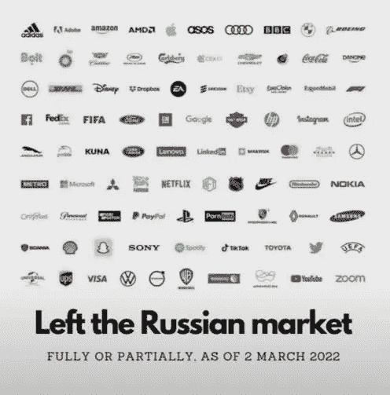
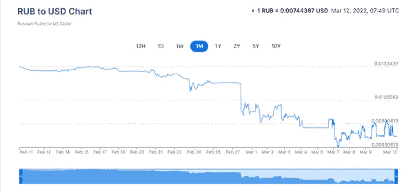
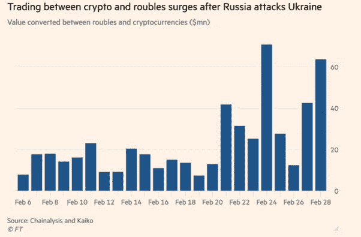

# 战争中的分散系统

> 原文：<https://medium.com/coinmonks/decentralized-systems-in-wars-9f817020d608?source=collection_archive---------59----------------------->

战争不再是核武器或生物武器。它们是金融危机，当前的俄罗斯-乌克兰局势不能证明更多。

我和这里任何地方的人都没有任何关系，我的兴趣也是如此，但是让我们来看看这两个国家都需要分权制的一些情况。

> 加入 Coinmonks [电报集团](https://t.me/joinchat/Trz8jaxd6xEsBI4p)，了解加密交易和投资

**集中式雨燕:-**

环球银行间金融电信协会(SWIFT)自称是促进快速跨境支付的安全金融信息服务的全球提供商。自 2015 年以来，俄罗斯一直是该组织的董事会成员。

2022 年，来自 200 多个国家和地区的 11，000 多个机构成员。

根据俄罗斯国家 SWIFT 协会的数据，约有 300 家银行和金融机构属于 SWIFT 网络，这是除美国之外的第二大用户群。俄罗斯超过一半的信用组织也属于 SWIFT。

卡内基莫斯科中心(Carnegie Moscow Center)2021 年的一项分析估计，将所有俄罗斯银行从 SWIFT 中完全移除将导致俄罗斯国内生产总值下降 5%。

正如预期的那样，在英国、欧盟和美国宣布将俄罗斯主要银行从 SWIFT 中移除，使其与全球金融系统断开后，该国经济正在崩溃。

请看一下-[https://www . the guardian . com/world/2022/mar/02/Russia-economy-can-shrink-by-respections-Ukraine-war-recession-covid。](https://www.theguardian.com/world/2022/mar/02/russia-economy-could-shrink-by-7-per-cent-as-result-of-ukraine-sanctions-war-recession-covid.)

类似的情况也发生在 2012 年，当时欧盟禁止几家伊朗银行使用 SWIFT，伊朗因此损失了约 30%的对外贸易。

**英国、美国&其他几个国家冻结了俄罗斯的银行和加密账户。**

你住在俄罗斯；在一场生存战争中，你也需要钱，当许多中央集权组织暂停服务，卢布价格持续下跌，政府印更多的钱，导致日常购买产品的价格波动。

你把钱或密码存在其他国家的银行账户或集中交易所，以备急用，它们会被冻结。

就这样，你看到了 DeFi 的必要性。

**组织暂停服务**

最近，VISA、MasterCard、Google Pay、Paypal、Apple Pay 等公司和许多其他科技巨头暂停了在俄罗斯的服务，以支持乌克兰。

我不赞成这样，俄罗斯人也不赞成。

瞧，我们又有了一个热爱权力下放的国家。

**作为法定货币的加密货币(BTC)**

2 月 17 日，就在战争爆发前，乌克兰将比特币完全合法化。

尽管战争导致国家财富大量流失，但乌克兰人民可以选择以安全、分散和全球化的方式储存财富。

因为在战争期间，经济和货币下跌很多。

另一方面，俄罗斯支持 Cryptos，但考虑到许多因素，它无法快速实现这种东西。

考虑到目前的形势，他们可能会很快对其进行监管。

**乌克兰密码，NFT 捐款**

乌克兰通过从加密社区获得超过 1 亿美元的加密捐款，利用技术来争取自由。

像 Uniswap 这样的平台通过创建单独的网站，使世界各地的人们向他们发送捐款变得很容易。

像朋克和 BAYC 这样的 NFT 精英社区也参与了捐赠。

人们还通过焚烧俄罗斯护照并将其转化为非关税壁垒来进行捐赠。

**美元霸权&卢布价格下跌，加密技术采用**

长期以来，美元一直是连接世界的优势货币，这也是各国严重依赖美国的主要原因之一。

自 2 月中旬以来，俄罗斯卢布兑美元下跌了约 50%。

在 2 月 24 日乌克兰被入侵时，卢布和比特币的日交易量飙升至 9 个月高点，而卢布和 USDT(一种经常被用作进入更广泛加密市场入口的稳定货币)的日交易量也跃升至 8 个月高点。

BTC 的市值现在比俄罗斯卢布更重要。

至少战争有助于各国认识到分散经济、权力和货币的必要性。

我也很乐意看到任何人分享他们的观点。

感谢阅读:)