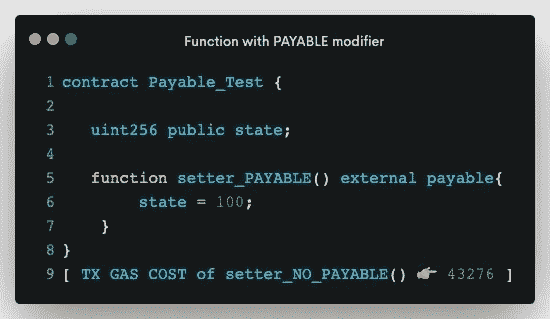
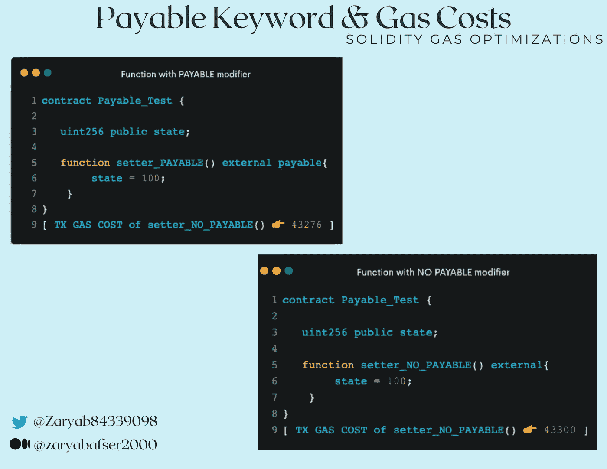
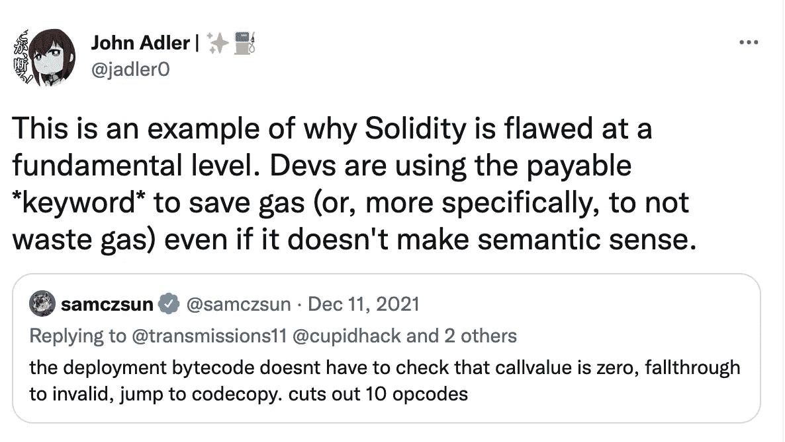

# 解密扎实:加一个可支付的关键词实际上省油吗？

> 原文：<https://medium.com/coinmonks/deciphering-solidity-does-adding-a-payable-keyword-actually-save-gas-89d1d8298d3f?source=collection_archive---------8----------------------->

嘿，范姆👋🏻

欢迎阅读*解密系列*中的另一篇文章，在这篇文章中，我们将选取一个特定的智能合约/Web3 主题并深入了解它。

如果你最近一直在使用 Solidity 开发智能合同，你可能会遇到**应付款**关键字。

这个博客也是如此，我们在这里破译了它所有有趣的*和怪异的*秘密。😃

# 快速介绍:支付关键字的基础知识

在智能合约能做的所有美妙事情中，储存你的钱(ETH)是其中之一。现在，为了在智能合约中获得 receive ETH，Solidity language 获得了一个名为 **payable 的特定关键字。**

**应付款**关键字，用非常简单的话来说，就是 solidity 语言中的修饰语，可以附加到任何函数上。一旦附加，这个关键字允许函数接收以太。换句话说，在用 payable 关键字触发一个函数的同时，你可以将 ether(***msg . value***)和那个交易一起发送。

虽然这一切都很好，但几个月前，当我在 Twitter 上滚动时，我遇到了一个有趣的关于应付款关键字的警告。它吸引了我所有的注意力，我发现每当一个**应付款**修饰符被附加到任何函数上时，就会发生一个有趣的( ***但是真正关联的*** )场景👀。

*让我们快速看一下这个有趣的场景:*

A setter function with NO Payable Keyword

在上面的图片中，我们有一个非常简单的 setter 函数，它将 uint256 变量的状态设置为 100。如果你触发这个功能，你会发现交易气成本在 **43300 左右。**

好，现在让我们看看第二个条件。

A setter function WITH Payable Keyword

在第二种情况下，我们有完全相同的函数，它执行完全相似的设置状态变量的事务。然而，这里唯一的区别是附加在函数上的一个额外的**应付款修饰符**。

非常有趣的是，如果你看看调用这个函数的交易气体成本，它在 **43276** 左右，低于上面提到的没有*应付款关键字*的函数。

是的，你说得对。

***增加一个简单的应付关键字只是减少了函数中的用气量。😃***

# 啊哈时刻💡💡

好了，现在是时候理解了——为什么应付款修改量会降低油耗？

这个问题的一个非常简单的答案是:

> ***增加一个 payable 关键字，降低正在执行的操作码数量，从而降低耗气量。***

很奇怪，不是吗？如何在函数中增加额外的修饰符来减少而不是增加操作码的数量？？？

这里有一些技术上的(*和逻辑上的*)解释。😃

1.  正如我们已经知道的，对于一个能够接收以太的函数，一个 **payable 修饰符**必须被附加到它上面。而没有任何**应付款**修饰符的函数将永远不能接收任何以太。
2.  必须注意的是，这在可靠性方面是一个严格的规则，因此如果你试图在调用一个**不可支付的**函数时传递以太，它将简单地恢复。
3.  因此，在**不可支付**函数的情况下，在调用**不可支付**函数时会执行额外的操作码，以确保只有在随事务一起发送的 ether ( **msg.value** )恰好等于**零时才会执行该函数。**
4.  然而，对于**应付款**功能来说，情况并非如此。Payable 函数允许用户在调用函数时传入非零或零的值。
5.  这基本上意味着，即使在调用**应付款函数时发送了零以太( ***msg.value == 0*** )，交易也不会恢复。因此，在应付函数的情况下，不需要显式检查**消息值**。**

# 简单地🥜

GAS Difference between PAYABLE and NON-PAYABLE Functions in Solidity

**对于非付费功能:**

*答:包括额外的检查，以确保在调用函数时没有以太值通过。*

这些检查增加了被执行的操作码的数量。

操作码数量的增加最终会导致更高的气体使用量。

**对于付费功能:**

*答:无需额外检查，因为该功能可接受乙醚的零值或非零值。*

*b .没有额外的检查意味着没有额外的操作码被执行。*

*c .执行中操作码越低，意味着气体消耗越低。*

# 我的两分钱🪙🪙

***上述所有细节，是否意味着我们应该使用付费功能来节省汽油？***

好吧，那可以讨论一下。

天然气优化无疑是每个智能合同向导在合同中梦寐以求的事情。

然而，一个迫切的问题是:

虽然节省汽油很重要，但在函数的预期行为上妥协，尽量减少必要的状态改变，或者仅仅为了节省一些额外的汽油而使用不适当的策略，都不是一个好主意。

> 换句话说，如果一个函数与接收以太无关，那么它就不应该附加任何 payable 关键字，即使这样可以节省一些汽油。

Dropping [John Adler](https://medium.com/u/a005f91be571?source=post_page-----89d1d8298d3f--------------------------------)’s 2 Cents as well 😇

所以我坚信，仅仅为了省油而在一个函数中增加一个不必要的 payable 关键字，很可能是一个糟糕的决定。上面提到的加了 payable 关键字的同时减气的场景，只是一个有线的 solidity 语言设计，一点效果都没有。

# 关于我自己

## 我是谁？🙋🏻‍♂️

𝙃𝙞, 𝙄 𝙖𝙢 𝙕𝙖𝙧𝙮𝙖𝙗 👋🏻我是一名精通区块链和智能合同的工程师，我的愿景是用 Web3 去中心化和保护传统网络。主要从事智能合约工作，在开发和智能合约安全方面都有丰富的经验。

## 我做什么🧑🏼‍💻

*   我撰写安全和优化的智能合同
*   我对智能合同进行安全审计，并提高 EVM 连锁店智能合同的整体安全性
*   我撰写和谈论 Web3 和智能合约&为扩展 Web3 的边界贡献我的一份力量。

## 打声招呼，保持联系🤝

[***领英***](https://www.linkedin.com/in/zaryab-afser-97085b157/) ***。|*** [***推特***](https://twitter.com/zaryab_eth)***|***[***关注我的每周简讯***](https://www.linkedin.com/newsletters/decipher-with-zaryab-6944516958839021568/)***|***[***邀请我参加 Web3 活动***](https://zaryab2000.notion.site/Invite-me-to-your-Next-Web3-Event-78bcd204b866426687e1afbcdc61c5c7)

> *加入 Coinmonks* [*电报频道*](https://t.me/coincodecap) *和* [*Youtube 频道*](https://www.youtube.com/c/coinmonks/videos) *了解加密交易和投资*

# 另外，阅读

*   [Bookmap 评论](https://coincodecap.com/bookmap-review-2021-best-trading-software) | [美国 5 大最佳加密交易所](https://coincodecap.com/crypto-exchange-usa)
*   最佳加密[硬件钱包](/coinmonks/hardware-wallets-dfa1211730c6) | [Bitbns 评论](/coinmonks/bitbns-review-38256a07e161)
*   [新加坡十大最佳密码交易所](https://coincodecap.com/crypto-exchange-in-singapore) | [收购 AXS](https://coincodecap.com/buy-axs-token)
*   [红狗赌场评论](https://coincodecap.com/red-dog-casino-review) | [Swyftx 评论](https://coincodecap.com/swyftx-review) | [CoinGate 评论](https://coincodecap.com/coingate-review)
*   [投资印度的最佳加密软件](https://coincodecap.com/best-crypto-to-invest-in-india-in-2021)|[WazirX P2P](https://coincodecap.com/wazirx-p2p)|[Hi Dollar Review](https://coincodecap.com/hi-dollar-review)