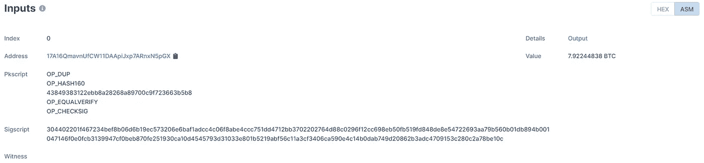
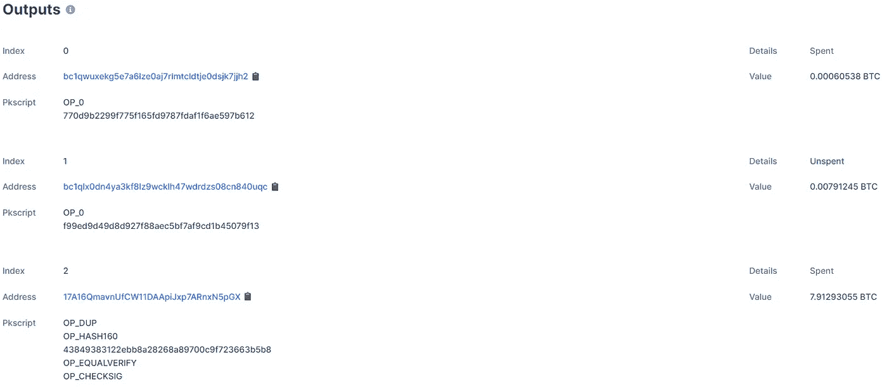
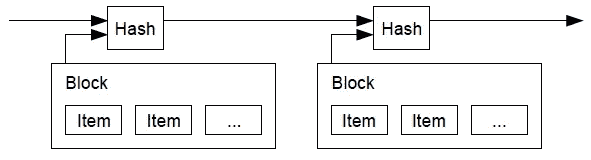

# 解读比特币白皮书第 2 部分——简介、交易和时间戳服务器

> 原文：<https://medium.com/coinmonks/decoding-the-bitcoin-paper-part-2-introduction-transactions-and-timestamp-server-c58ea4463da5?source=collection_archive---------53----------------------->

本帖是*解码比特币论文*系列的第二篇。

我们将讨论本文的下三个部分——简介、事务和时间戳服务器。我建议你阅读[第一部分](/coinmonks/decoding-the-bitcoin-paper-part-1-prerequisites-and-abstract-a35579d0ffd9)的前言，以便更好地理解这篇文章。

Photo by [Kanchanara](https://unsplash.com/@kanchanara?utm_source=medium&utm_medium=referral) on [Unsplash](https://unsplash.com?utm_source=medium&utm_medium=referral)

# 词汇表

## 证据与信任

这两者之间的区别似乎很难解释，因为我们知道这些单词来自英语。但是，从历史上看，我们的系统是建立在信任的基础上的，我们不理解对基于证据的系统的需求。

如果你有同样的感觉，我推荐你阅读[这篇文章](/coinmonks/why-im-bullish-about-blockchain-and-you-should-be-too-2e966fc4cd7b)(“个人例子”小节的第三点)。

在当前的上下文中，我将证明定义为“你相信 X 能完成工作吗？”这个问题的确定性答案

# 介绍

本节通过指出现有制度中的缺陷来解释权力下放的重要性。这些缺陷，如由中间人行使控制权、高交易价格等。产生了对基于**证据而非信任**工作的电子系统的需求。

这一部分进一步谈到了论文所解决的问题。技术部分现在开始！

# 处理

> 我们将电子硬币定义为一串数字签名。

仅仅是报纸上的这个短语，我就花了几个小时才明白它在说什么。

在传统的银行系统中，我们账户的余额存储在数据库中。这样做是为了当我们付款时，银行可以检查我们是否有足够的余额进行交易。

一旦满足这个条件，我们账户的余额就会减少，这样我们就不能再使用同样的钱了。同样，当我们收到一笔付款时，余额就会增加，这样我们就可以在未来的交易中花更多的钱。

因此，银行数据库中的余额是唯一的真实来源。我们相信银行会保证这个号码的安全和正确。

相反，比特币的工作原理是交易链*。与传统系统类似，承诺支付的金额应归付款人所有。如何在不需要信任的情况下做到这一点？*

*每笔交易都有一定的输入和输出。输入代表付款人拥有的比特币。付款人拥有这些比特币的**证据**是通过参考过去的交易给出的，在这些交易中，该付款人是收款人，因此收到了一些他们现在可以花费的比特币。*

*我们将通过一个例子来理解这一点。*

**

*Inputs taken from [a real transaction](https://www.blockchain.com/btc/tx/71b62d233018b158344ff0296cac9bf3e966fc86eed7a8fc3a28bf0bff6a75d4).*

*输出包含受款人的地址(类似于银行账户)和要转移到这些地址的金额。现在，投入的比特币总量应该足以满足产出的数量。*

*我们不能在多项交易中使用相同的投入(重复支出)。如果我们尝试这样做，网络将使该交易无效，因为它将看到我们在过去的交易中使用过这些输入。*

**

*Outputs in the same transaction as before.*

***例子***

*爱丽丝给了我 5 美元，鲍勃给了我 3 美元，查理给了我 7 美元。这些都是过去发生过的交易，是区块链可以证明的。*

*现在，我必须为两个供应商的服务付款。我欠第一个卖主 10 美元，欠第二个卖主 4 美元。*

*为了支付这笔款项，我将提供我收到钱的前 3 笔交易的证明。他们总计 15 美元。这将作为我的投入。*

*接下来，我将提供这些供应商的地址，以及分别为 10 美元和 4 美元的金额。这总共是 14 美元。投入中还有 1 美元未用完，我可以寄回给自己(类似于你用现金支付时剩余的零钱)。*

*您可以在第三个输出中看到这一点，其中所有者将输出地址设置为与输入地址相同。*

*如果我不把找零还给自己，它将被用作网络处理您交易的激励。稍后再谈激励。*

> *每个所有者通过对前一次交易的散列和下一个所有者的公钥进行数字签名，并将这些添加到硬币的末尾，来将硬币转移给下一个所有者。*

*这部分解释了在区块链的一个街区里有什么。正如我们在本系列的第 1 部分中看到的，交易是由付款人签署的。交易的细节需要包含在里面。*

*除了输入和输出，事务还包含前一个块的散列。区块链就是这样形成的。通过使用当前块中的“先前散列”数据来查询具有该散列的块的区块链，可以读取先前块的内容。*

*为什么我们需要前一个块？一个块包含多个事务。因此，块的顺序也有助于确定事务的顺序。*

*我们需要维持交易的秩序。为什么？如果 Alice 付给 Bob 10 美元，Bob 付给 Charlie 10 美元，我们需要在第二笔交易之前进行第一笔交易，以便 Bob 在付款之前收到这 10 美元。*

*你可以在这里看到一个真实的区块[，在这里](https://www.blockchain.com/btc/block/000000000000000000040f6dcec8a73ca04ef758260875d6953eb55494777a26)看到一个真实的交易[。](https://www.blockchain.com/btc/tx/88d5951f88eb81967f7b0f35c1bac5b40e7894422a0b340672b78c35d628339d)*

*此外，下一个所有者的公钥被添加到块中。这对应于收款人的钱包地址。*

*本节的其余部分以防止重复支出为基础。在传统体系中，如果有人试图重复支出，中央政府会知道。但是在区块链怎么做呢？*

*我们制定了一个规则——只有具有特定输入的第一个交易才算数，使用这些输入的其他交易将被拒绝。为此，我们需要两样东西:*

## *每个人都应该知道过去发生的所有交易*

*这是必需的，因为我们需要在输入中引用以前的交易。如果我们丢失了历史记录，就没有办法证明你拥有你试图消费的比特币。*

## *每个人都应该同意交易的顺序*

*这是必要的，以便在多次使用相同输入的情况下，我们可以拒绝第二个事务，但允许第一个事务。*

*这是前一个散列包含在块中的另一个原因。*

# *时间戳服务器*

*这是一种建议的方法，用于维护添加块的顺序，并让每个人都同意它。让我们看看它是如何工作的。*

*验证过程结束后，时间戳服务器会生成一个哈希。该散列由当前块的数据和时间戳服务器生成的先前散列(针对先前块)组成，并将该散列广播给每个人。*

**

*Taken from the bitcoin paper*

*这样做是为了当一个试图重复花费的新交易到来时，可以证明在过去已经存在一个使用这些输入的块。*

*这也加强了先前的阻碍；意思是说，给定的块的真实性和它的顺序在它之后添加块时更加稳固。为什么？*

*多个节点总是在确认事务并将块添加到链中。当一个节点添加一个块时，意味着它已经接受了它之前的块的真实性。*

*如果不是这种情况，该节点会将该块添加到它接受为真实的最后一个块之后。这不一定是整个链条的最后一环。*

*因此，当在给定的块之后添加更多的块时，这意味着更多的节点已经同意该块的事务发生在随后的块中的事务之前，从而巩固了顺序。*

*通过这种方式，我们保持了区块的顺序，并取得了多数同意。*

# *结论*

*   *我们定义了信任和证据。*
*   *我们看到了比特币的账户余额系统是如何不同的。*
*   *我们了解如何使用输入和输出进行交易。*
*   *我们知道了维护交易秩序的重要性以及如何实现。*

*关注，以便在下一部分出现时得到通知。*

*在 [Linkedin](https://www.linkedin.com/in/aditya-rana-swe/) 和 [Twitter](https://twitter.com/RealAdityaRana) 上与我联系。*

*上一部分:[第 1 部分—前提条件和摘要](/coinmonks/decoding-the-bitcoin-paper-part-1-prerequisites-and-abstract-a35579d0ffd9)*

*下一部分:[第三部分——工作证明、网络和激励](/coinmonks/decoding-the-bitcoin-paper-part-3-proof-of-work-network-and-incentive-87d3a2fd5c0d)*