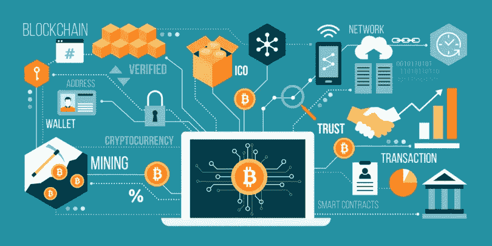
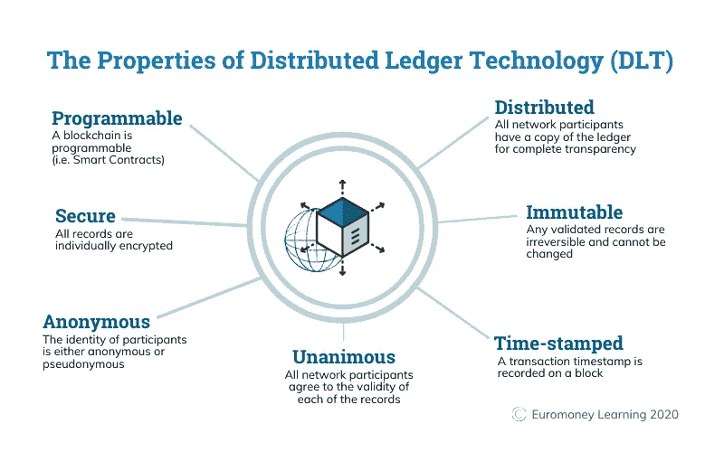

# 解耦区块链

> 原文：<https://medium.com/coinmonks/decoupling-blockchain-a8cb75759593?source=collection_archive---------59----------------------->

什么是区块链？

区块链，有时被称为分布式账本技术(DLT)，通过使用去中心化和加密哈希，使任何数字资产的历史都不可更改和透明。

理解区块链技术的一个简单类比是谷歌文档。当我们创建一个文档并与一群人共享它时，该文档是被分发的，而不是被复制或传输的。这就形成了一个分散的分发链，让每个人都能同时访问文档。没有人被锁在外面等待另一方的更改，而对文档的所有修改都被实时记录，使更改完全透明。当然，区块链比谷歌文档更复杂，但这种类比是恰当的，因为它阐明了这项技术的三个关键思想:

区块链解释说:快速概述

区块链是一种数据库，它存储加密的数据块，然后将它们链接在一起，形成按时间顺序排列的数据的单一来源。
数字资产是分布式的，而不是复制或转移的，创建了一个不可变的资产记录。
资产是分散的，允许公众完全实时访问和透明

> 交易新手？试试[密码交易机器人](/coinmonks/crypto-trading-bot-c2ffce8acb2a)或者[复制交易](/coinmonks/top-10-crypto-copy-trading-platforms-for-beginners-d0c37c7d698c)

透明的变更分类帐保持了文档的完整性，从而建立了对资产的信任。
区块链固有的安全措施和公共账本使其成为几乎每个行业的主要技术
区块链是一项特别有前途的革命性技术，因为它有助于降低风险，杜绝欺诈，并以可扩展的方式为无数用途带来透明度。

**公立区块链 vs 私立区块链**

区块链有公立的也有私立的。在公共区块链中，任何人都可以参与，这意味着他们可以读取、写入或审核区块链上的数据。值得注意的是，很难更改公共区块链中记录的事务，因为没有单个机构控制节点。

与此同时，私人区块链由一个组织或团体控制。只有它能决定谁被邀请到系统中，并且它有权力返回并改变区块链。这种私有区块链进程更类似于内部数据存储系统，只是为了提高安全性而分布在多个节点上。

区块链是如何工作的？

使用区块链的全部目的是让人们——尤其是不信任彼此的人——以安全、防篡改的方式共享有价值的数据。

区块链由三个重要概念组成:区块、节点、矿工。
区块
每个链由多个区块组成，每个区块有三个基本元素:

块中的数据。一个 32 位的整数叫做随机数。随机数是在创建块时随机生成的，然后生成块头哈希。
哈希是一个 256 位的数字，与随机数绑定在一起。它必须以大量的零开始(即，非常小)。

当创建链的第一个块时，nonce 生成加密哈希。数据块中的数据被认为是经过签名的，除非被挖掘，否则将永远与 nonce 和 hash 绑定在一起。

矿工
矿工通过一种叫做采矿的过程在链条上创造新的区块。
在区块链中，每个块都有其唯一的 nonce 和 hash，但也会引用链中前一个块的 hash，因此挖掘一个块并不容易，尤其是在大型链中。

矿工使用特殊的软件来解决难以置信的复杂数学问题，即找到一个生成可接受散列的随机数。因为 nonce 只有 32 位，而 hash 是 256，所以在找到正确的组合之前，必须挖掘大约 40 亿个可能的 nonce-hash 组合。当这种情况发生时，矿工们被认为找到了“黄金随机数”，他们的区块被添加到链中。

对链中较早的任何块进行更改不仅需要重新挖掘发生更改的块，还需要重新挖掘后面的所有块。这就是为什么操纵区块链技术极其困难。可以认为这是“数学上的安全”,因为寻找黄金随机数需要大量的时间和计算能力。

当一个区块被成功开采时，网络上的所有节点都接受这种改变，并且开采者得到经济上的回报。

节点
区块链技术中最重要的概念之一是去中心化。没有一台计算机或组织可以拥有这个链。相反，它是一个通过连接到链的节点的分布式分类账。节点可以是维护区块链副本并保持网络运行的任何类型的电子设备。

每个节点都有其区块链的副本，网络必须通过算法批准任何新挖掘的块，以便链被更新、信任和验证。由于区块链是透明的，账本中的每一个动作都可以很容易地被检查和查看。每个参与者都有一个唯一的字母数字标识号，显示他们的交易。
将公共信息与制衡系统相结合有助于区块链保持其完整性，并在用户中建立信任。本质上，区块链可以被认为是信任通过技术的可扩展性。

用途
区块链使用加密货币

加密货币:区块链技术崛起的开端
区块链最广为人知的用途(也可能是最具争议的)是在加密货币中。加密货币是数字货币(或代币)，如比特币、以太坊或莱特币，可用于购买商品和服务。就像现金的数字形式一样，密码可以用来购买从你的午餐到你下一个家的任何东西。与现金不同，crypto 使用区块链作为公共分类账和增强的加密安全系统，因此在线交易总是被记录和保护的。

加密货币是如何工作的？
加密货币是使用区块链技术记录和保护每一笔交易的数字货币。加密货币(例如比特币)可以作为一种数字形式的现金来支付从日常用品到汽车和房屋等大宗购买的一切费用。它可以使用几个数字钱包或交易平台中的一个来购买，然后在购买物品时进行数字转移，区块链记录交易和新主人。加密货币的吸引力在于一切都记录在公共账本中，并使用加密技术进行保护，对每笔支付进行不可辩驳的、带时间戳的安全记录。

迄今为止，世界上大约有 6700 种加密货币，总市值约为 1.6 万亿美元，其中比特币占据了大部分价值。这些代币在过去几年里变得非常受欢迎，一个比特币相当于 6 万美元。以下是大家突然关注加密货币的一些主要原因:

区块链的安全性使得盗窃更加困难，因为每种加密货币都有其不可辩驳的可识别号码，这些号码都属于一个所有者。
加密减少了对个性化货币和中央银行的需求——有了区块链，加密可以发送到世界上任何地方和任何人，而不需要货币兑换或中央银行的干预。
加密货币可以让一些人变得富有——投机者一直在推高加密货币的价格，尤其是比特币，帮助一些早期采用者成为亿万富翁。这是否是积极的还有待观察，因为一些撤回者认为，投机者没有考虑到加密的长期好处。

越来越多的大公司开始接受在区块链使用数字货币进行支付的想法。2021 年 2 月，特斯拉宣布将向比特币投资 15 亿美元，并接受其作为他们汽车的付款。当然，有许多合理的理由反对区块链的数字货币。首先，加密不是一个非常规范的市场。许多政府很快投入到加密中，但很少有一套坚定的关于它的成文法律。此外，由于前面提到的投机者，加密非常不稳定。2016 年，比特币的定价为每枚令牌 450 美元左右。随后，2018 年，每枚代币的价格飙升至约 16，000 美元，降至约 3，100 美元，此后又升至逾 6 万美元。缺乏稳定导致一些人变得非常富有，而大多数人仍然失去了数千美元。

数字货币是否是未来还有待观察。目前看来，区块链的迅速崛起似乎更多地开始扎根于现实，而不是纯粹的炒作。尽管区块链仍在这个全新的、高度探索性的领域取得进展，但它也展现出了比特币之外的前景。
区块链使用以太坊

比特币之外:以太坊区块链
作为比特币运行的超透明账本系统，区块链长期以来一直与加密货币联系在一起，但该技术的透明度和安全性在几个领域得到了越来越多的采用，其中很大一部分可以追溯到以太坊区块链的发展。

2013 年底，俄罗斯-加拿大开发人员 Vitalik Buterin 发表了一份白皮书，提出了一个结合传统区块链功能和一个关键区别的平台:计算机代码的执行。于是，以太坊项目诞生了。
以太坊区块链允许开发者创建复杂的程序，这些程序可以在区块链上相互交流。

令牌
以太坊程序员可以创建令牌来代表任何类型的数字资产，跟踪其所有权，并根据一组编程指令执行其功能。

令牌可以是音乐文件、合同、音乐会门票，甚至是病人的医疗记录。最近，不可替代代币(NFT)风靡一时。NFT 是基于区块链的独特令牌，用于存储数字媒体(如视频、音乐或艺术)。每个 NFT 可以验证数字媒体的真实性、历史和唯一所有权。NFT 已经变得非常受欢迎，因为它们为新一波数字创作者提供了买卖其作品的能力，同时获得适当的信贷和公平的利润份额。区块链的新用途扩大了分类帐技术渗透到媒体、政府和身份安全等其他领域的潜力。成千上万的公司目前正在研究和开发完全基于新兴技术的产品和生态系统。
区块链正在挑战当前的创新现状，让公司尝试开创性的技术，如点对点能源分配或新闻媒体的分散形式。就像区块链的定义一样，分类账系统的用途只会随着技术的发展而发展。

“由于加密货币不稳定，它们还没有被广泛用于购买商品和服务。但随着 PayPal、Square 和其他货币服务公司向供应商和零售客户广泛提供数字资产服务，这种情况正在发生变化，”Foley & Lardner 高级合伙人、该公司区块链工作小组负责人 Patrick Daugherty 指出。

银行业
除了加密货币，区块链还被用于处理美元和欧元等法定货币的交易。这可能比通过银行或其他金融机构汇款更快，因为交易可以在正常营业时间之外更快地得到验证和处理。

资产转移
区块链还可以用来记录和转移不同资产的所有权。这在 NFTs 等数字资产中非常流行，NFTs 是数字艺术和视频所有权的一种表现形式。
然而，区块链也可以用于处理现实生活中资产的所有权，比如房地产和车辆的契约。一方的双方将首先使用区块链来验证一方拥有财产，另一方有钱购买；然后他们可以完成并记录区块链上的销售。

使用这一流程，他们可以转让房契，而无需手动提交文书来更新当地县政府的记录；它会在区块链即时更新。

智能合同
区块链的另一项创新是自动执行合同，通常被称为“智能合同”一旦条件得到满足，这些数字合同就会自动生效。例如，一旦买方和卖方满足交易的所有指定参数，货物的付款可能会立即释放。
“我们看到了智能合同领域的巨大潜力——使用区块链技术和编码指令来自动化法律合同，”Gray 说。分布式账本上正确编码的智能法律合同可以最大限度地减少或最好消除外部第三方验证履约的需要

供应链监控
供应链涉及大量的信息，尤其是当商品从世界的一个地方运往另一个地方时。使用传统的数据存储方法，很难追踪问题的根源，比如哪个供应商的劣质商品来自哪里。将这些信息存储在区块链上可以更容易地追溯和监控供应链，例如 IBM 的食品信托，它使用区块链技术来跟踪食品从收获到消费的整个过程。

专家们正在寻找运用区块链来防止投票舞弊的方法。理论上，区块链投票将允许人们提交无法篡改的选票，并消除人们手动收集和验证纸质选票的需要。

区块链的优势

更高的交易准确性
因为区块链交易必须由多个节点验证，这可以减少错误。如果一个节点在数据库中有一个错误，其他节点会发现它的不同并捕捉到错误。
相比之下，在传统数据库中，如果有人出错，可能更容易通过。此外，每一项资产都在区块链分类账中被单独识别和跟踪，因此没有重复支出的可能(就像一个人透支了银行账户，从而花了两次钱)。

不需要中介
使用区块链，交易双方可以确认并完成某些事情，而无需通过第三方。这样既节省了时间，也节省了支付银行等中介的费用。“它可以为所有数字商务带来更高的效率，增加世界上没有银行账户或银行服务不足的人口的金融能力，并因此推动新一代互联网应用，”Shtylman 说。

额外的安全性
从理论上讲，像区块链这样的分散式网络使得某人几乎不可能进行欺诈交易。要输入伪造的交易，他们需要侵入每个节点，更改每个分类账。虽然这不一定是不可能的，但许多加密货币区块链系统使用利害关系证明或工作证明交易验证方法，这使得添加欺诈性交易变得困难，并且不符合参与者的最佳利益。

更高效的转移由于区块链全天候运营，人们可以更高效地进行金融和资产转移，尤其是国际转移。他们不需要为银行或政府机构手动确认一切而等待数日。

区块链的缺点

每秒交易量的限制
鉴于区块链依赖一个更大的网络来批准交易，它的速度是有限的。例如，比特币每秒只能处理 4.6 笔交易，而 Visa 每秒能处理 1700 笔交易。此外，越来越多的交易会造成网络速度问题。在这种情况得到改善之前，可伸缩性是一个挑战。

高能源成本
让所有节点都工作来验证交易比单个数据库或电子表格消耗的电力多得多。这不仅使区块链的交易更加昂贵，而且也给环境造成了巨大的碳负担。
正因为如此，一些行业领袖开始远离某些区块链技术，比如比特币:例如，埃隆·马斯克最近表示，特斯拉将停止接受比特币，部分原因是他担心对环境的破坏。

资产损失的风险
一些数字资产使用密钥进行保护，比如区块链钱包中的加密货币。你需要小心保管这把钥匙。
“如果数字资产的所有者丢失了让他们能够访问其资产的私有密钥，目前没有办法找回它，因为资产已经永远消失了，”Gray 说。因为这个系统是分散的，你不能打电话给一个中央机构，比如你的银行，要求重新获得访问权。

潜在的非法活动
区块链的去中心化增加了更多的隐私和保密性，不幸的是，这使其对犯罪分子具有吸引力。追踪区块链的非法交易比追踪与一个名字相关的银行交易更难。

如何投资区块链
你不能投资区块链本身，因为它仅仅是一个存储和处理交易的系统。然而，你可以利用这项技术投资资产和公司。

“最简单的方法是购买加密货币，如比特币、以太坊和其他在区块链上运行的代币，”格雷说。
另一个选择是投资使用这种技术的区块链公司。例如，桑坦德银行正在试验总部位于区块链的金融产品，如果你有兴趣在你的投资组合中获得区块链技术，你可以购买它的股票。为了更多元化，你可以购买投资于区块链资产和公司的交易所交易基金(ETF ),比如 Amplify transformation Data Sharing ETF(BLOK ),它将至少 80%的资产投资于区块链公司。

区块链应用
区块链几乎在每个行业都有无穷无尽的应用。ledger 技术可以应用于跟踪金融欺诈，在医疗保健专业人员之间安全地共享患者病历，甚至可以作为跟踪商业知识产权和艺术家音乐版权的更好方法。
为什么围绕区块链科技有如此多的炒作？
过去曾有许多创造数字货币的尝试，但都失败了。
最主要的问题是信任。如果有人创造了一种叫做 X 美元的新货币，我们怎么能相信他们不会给自己一百万 X 美元，或者为自己窃取你的 X 美元？

比特币旨在通过使用一种称为区块链的特定类型的数据库来解决这个问题。大多数普通的数据库，比如 SQL 数据库，都有负责人可以更改条目(比如给自己一百万 X 美元)。区块链不一样，因为没人管；它是由使用它的人管理的。更重要的是，比特币不能被伪造、破解或重复消费——所以拥有这些钱的人可以相信它有一些价值。

区块链的历史
虽然区块链是一项新技术，但它已经拥有丰富有趣的历史。以下是区块链发展过程中一些最重要和最引人注目的事件的简要时间表。
2008
中本聪，一个人或团体的笔名，出版了《比特币:点对点电子现金系统》
2009 年
计算机科学家哈尔·芬尼和神秘的中本聪首次成功进行比特币(BTC)交易。2010 年
佛罗里达州的程序员 Laszlo Hanycez 首次使用比特币购买了两份棒约翰披萨。Hanycez 转了 10，000 BTC，当时价值约 60 美元。今天它价值 8000 万美元。
比特币的市值正式超过 100 万美元。
2011
1 BTC = 1 美元，使加密货币与美元平价。
电子前沿基金会、维基解密和其他组织开始接受比特币作为捐赠。
2012
区块链和加密货币在热门电视节目《傲骨贤妻》中被提及，将区块链注入流行文化。
比特币杂志由早期比特币开发者维塔利克·布特林(Vitalik Buterin)创办。2013 年
BTC 的市值超过 10 亿美元。
比特币首次达到 100 美元/BTC。
布特林发表了“以太坊项目”论文，提出区块链除了比特币还有其他可能性(例如智能合约)。
2014
游戏公司 Zynga、拉斯维加斯酒店和 Overstock.com 都开始接受比特币作为支付方式。布特林的以太坊项目通过首次发行硬币(ICO)在 BTC 筹集了超过 1800 万美元的众筹资金，为区块链开辟了新的道路。
R3，一个由 200 多家区块链公司组成的组织，成立的目的是发现区块链在技术上实现的新方法。
PayPal 宣布整合比特币。
2015
接受 BTC 的商户数量超过 10 万。纳斯达克和旧金山区块链公司联手测试私人公司股票交易技术。科技巨头 IBM 宣布了基于云的商业解决方案的区块链战略。日本政府承认区块链和加密货币的合法性。
2017
比特币首次达到 1000 美元/BTC。
加密货币市值达到 1500 亿美元。摩根大通首席执行官杰米·戴蒙表示，他相信区块链是一项未来技术，这给总账系统投了一张来自华尔街的信任票。
比特币达到 19783.21 美元/BTC 的历史新高。迪拜宣布其政府将在 2020 年实现区块链供电。
2018
脸书承诺成立一个区块链集团，并暗示有可能创建其加密货币。IBM 开发了一个总部位于区块链的银行平台，花旗银行和巴克莱银行等大型银行都加入了该平台。
2019
中国国家主席季新平公开拥抱区块链，因为中国央行宣布正在研究其加密货币
Twitter & Square 首席执行官杰克·多西宣布，Square 将聘请区块链工程师参与该公司未来的加密计划
纽约证券交易所(NYSE) 宣布成立 Bakkt——一家包括加密交易的数字钱包公司
2020 年
到 2020 年底比特币几乎达到 30，000 美元
PayPal 宣布将允许用户购买、出售和持有加密货币
巴哈马成为世界上第一个推出中央银行数字货币的国家，被恰当地称为“沙币”
区块链成为对抗新冠肺炎的关键角色，主要用于安全存储医学研究数据和患者信息

底线
尽管有其承诺，区块链仍然是一个利基技术。格雷看到了区块链在更多情况下使用的潜力，但这取决于未来的政府政策。“像证交会这样的监管机构何时以及是否会采取行动，还有待观察。有一点很明显——目标将是保护市场和投资者，”他表示。Shtylman 将区块链比作互联网的早期阶段。“在我们看到谷歌的第一个版本之前，互联网用了大约 15 年的时间，而脸书用了 20 多年。很难预测区块链技术在未来 10 年或 15 年的发展方向，但就像互联网一样，它将极大地改变我们未来的交易和互动方式。”
障碍依然存在，特别是交易限制和能源成本，但对于看到该技术潜力的投资者来说，区块链的投资可能值得一试。

> 加入 Coinmonks [电报频道](https://t.me/coincodecap)和 [Youtube 频道](https://www.youtube.com/c/coinmonks/videos)了解加密交易和投资

# 另外，阅读

*   [CoinDCX 评论](/coinmonks/coindcx-review-8444db3621a2) | [加密保证金交易交易所](https://coincodecap.com/crypto-margin-trading-exchanges)
*   [红狗赌场评论](https://coincodecap.com/red-dog-casino-review) | [Swyftx 评论](https://coincodecap.com/swyftx-review) | [CoinGate 评论](https://coincodecap.com/coingate-review)
*   [Bookmap 评论](https://coincodecap.com/bookmap-review-2021-best-trading-software) | [美国 5 大最佳加密交易所](https://coincodecap.com/crypto-exchange-usa)
*   [如何在 FTX 交易所交易期货](https://coincodecap.com/ftx-futures-trading) | [OKEx vs 币安](https://coincodecap.com/okex-vs-binance)
*   [CoinLoan 评论](https://coincodecap.com/coinloan-review) | [YouHodler 评论](/coinmonks/youhodler-4-easy-ways-to-make-money-98969b9689f2) | [BlockFi 评论](https://coincodecap.com/blockfi-review)