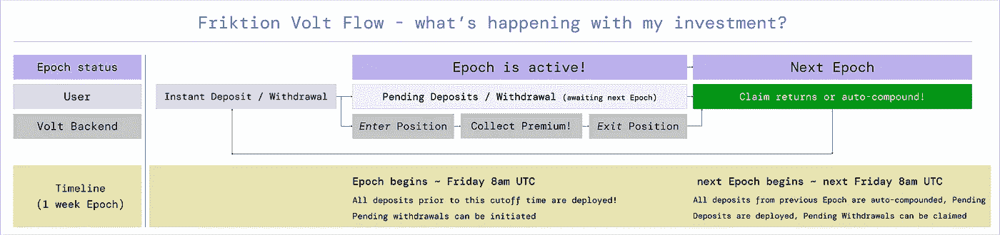
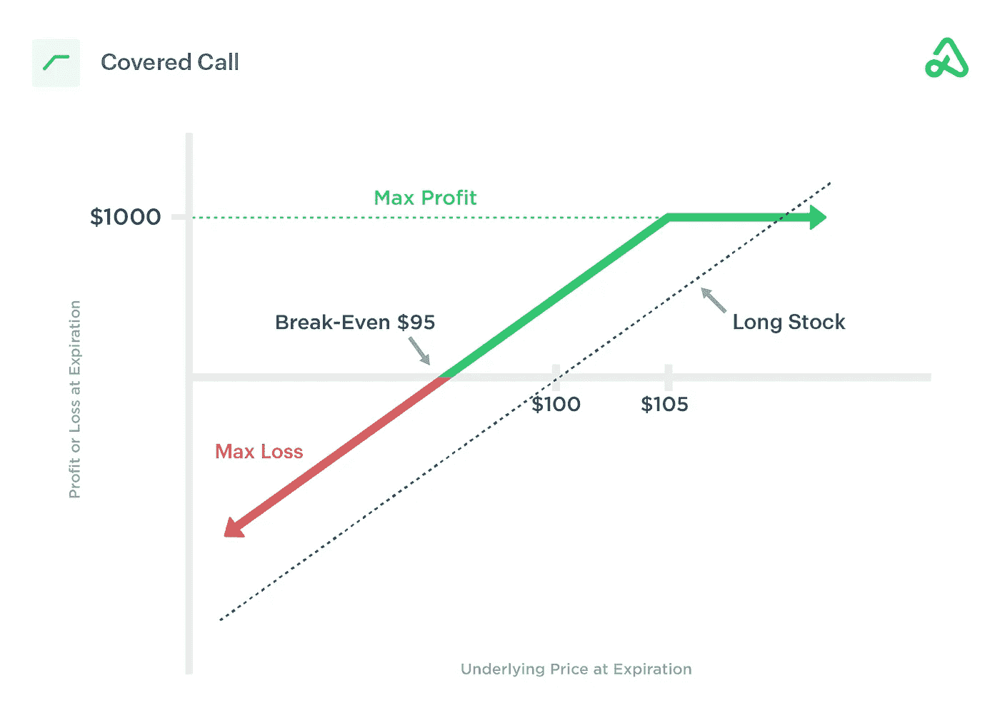
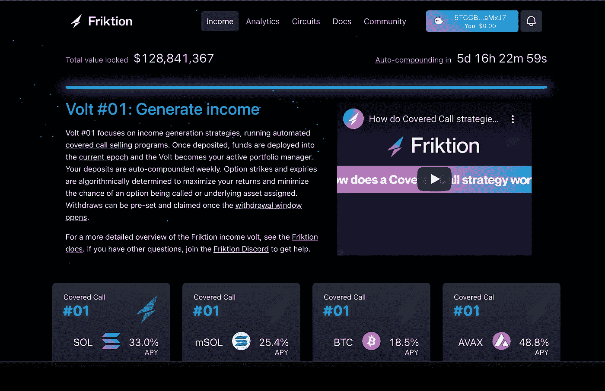
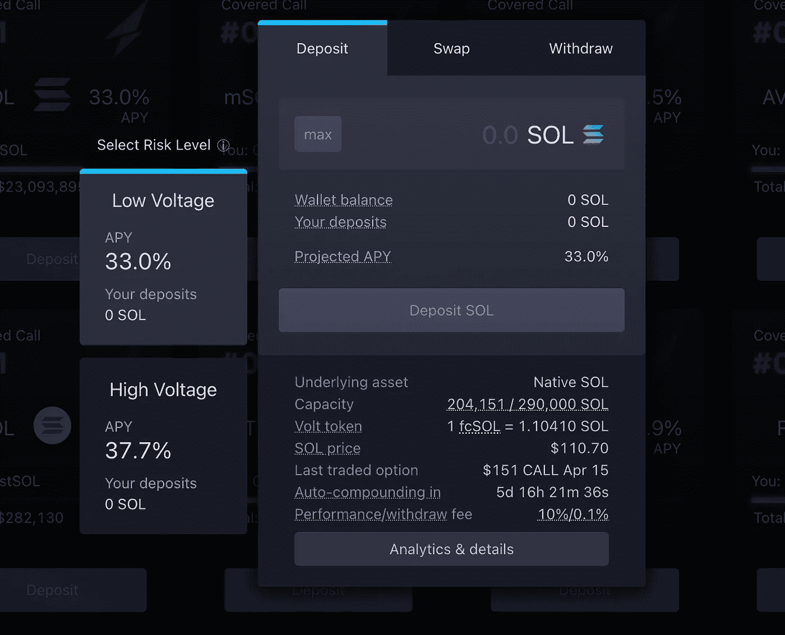
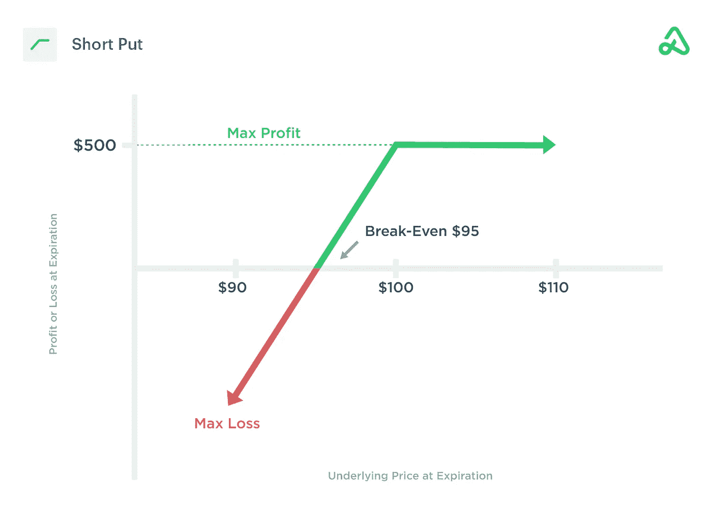
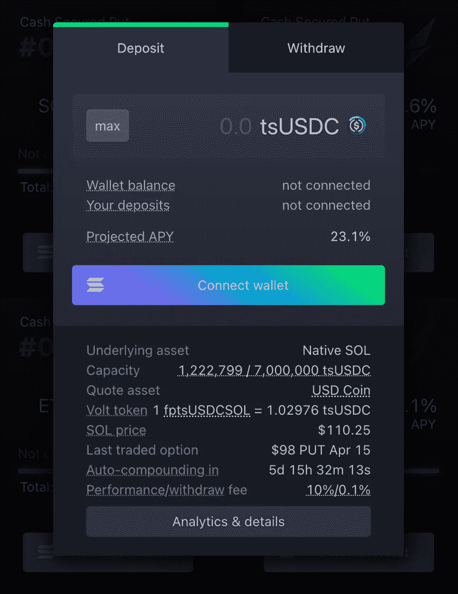
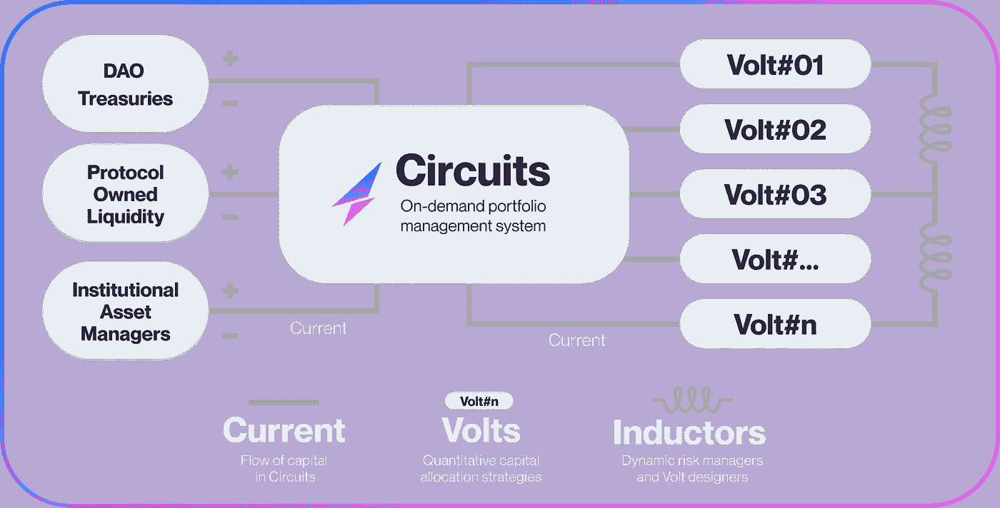
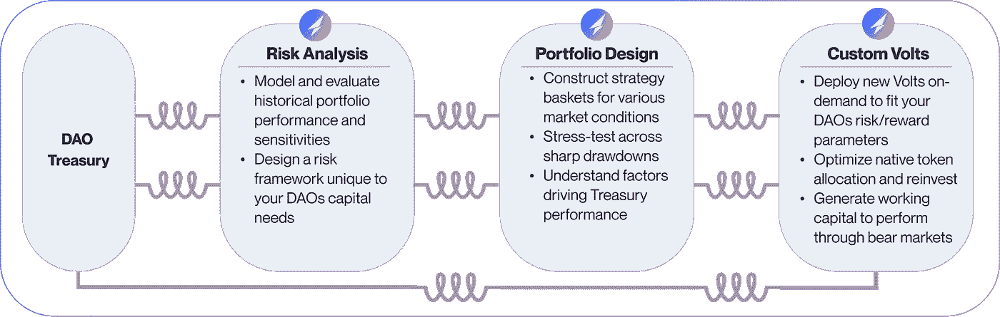

# frik tion:Solana 网络的自动化投资组合管理

> 原文：<https://medium.com/coinmonks/deep-dive-friktion-2f078caf7bf2?source=collection_archive---------27----------------------->

[Friktion](https://medium.com/u/4cdc2ad977f8?source=post_page-----2f078caf7bf2--------------------------------) 是一个用于加密资产的 ***自动化投资组合管理*** 平台。它在 DeFi 生态系统中的产品包括主动和被动策略，适用于各种类型的终端用户，以满足不同风险承受水平的需求。Friktion 的 APM 算法在不同资产的各种市场条件下找到最佳机会，利用*期权、永久资产和动力永久资产*等衍生品持续获取波动收益。

***Friktion 目前提供的产品包括电压和电路。***

# 伏特

***伏特*** 是 Friktion 的本土产品，其运作类似于结构性产品，以满足各种要求，如创收、本金保护、波动资本化、对冲非永久性损失等。

伏特由不同的金融结构组成，其中包括备兑买入期权、现金担保看跌期权，它们是通过识别链内交易所和链外做市商的期货、期权、现货、动力交易等的最佳价格而产生的。 **Friktion 不承担交易对手或市场风险。**

不同类型的投资者和具有不同目标和风险承受能力的各方可以使用伏特。被动投资者和流动性提供者可以锁定他们的资产，通过最少的交易管理来创造回报。积极的交易者可以利用复杂的结构来对冲风险，创造阿尔法。Dao 可以利用 volts 进行风险管理和资金管理。

伏特目前使用**欧式期权**，只能在到期时行使。

# 伏特是如何工作的？

伏特以被称为 ***时代的周期运行。*** 根据部署的资产或策略，时期的范围可以是 1 到 2 周。流程如下。

Source : Friktion Docs

# 存款流量

储户可以随时将资产存入所选择的策略。这些存款将在下一个时段(星期五凌晨 2 点)部署到所需的策略中。

一旦资产被存入，就会生成***volt token***并授予存款人，代表 volt 的所有权。这些 volt 代币的功能基本上类似于合伙企业中的股权或股份，表示所选 volt 所有权的数值。

待定存款是指未部署到 volt 中的存款。这些作为记录存在于 Friktion 智能合同中。一旦沉积物被部署到下一个纪元，VoltTokens 就可以被铸造。

即时存款适用于第一个时期尚未开始的新资产。

# 撤回流程

一旦存款没有被挂起，就可以生成 Friktion 共享令牌，这是可选的，并且不产生费用。一旦存款人有权获得一定数量的代币，其数量就不会改变。这些代币在钱包里。

在撤销过程中，协议收回份额令牌。未完成的取款不会显示在钱包中，而是作为记录条目存在于 Friktion 智能合约中。撤回的状态只能在 Friktion 应用程序上查看。在每个时期结束时处理未决提取后，资产以选择的形式存放。SOL 中需要交易结算所需的燃气费。

# 伏特#1:创收。

Volt #1 在各种主流代币(如 SOL、BTC、ETH 等)上采用 ***备兑买入*** 结构，通过长期持有资产并卖出其买入期权来产生收益。让我们了解一下什么是备兑电话。

# 什么是承保电话？

***备兑买入*** 是一种金融结构，其中资产的多头头寸被用作卖出价外买入期权的掩护。备兑买入在平盘或低波动市场表现良好，在这种市场中，资产长期看涨，但短期上涨预期有限。只要标的在到期前没有触及执行价格，卖空交易产生的溢价就会被捕获。

为了执行这样的结构，投资者进入他们想要持有的资产的多头头寸。利用这种多头头寸作为掩护，一种承诺交付等量标的股票的看涨期权以更高的执行价格出售。只要标的在到期前没有达到执行价格，卖出看涨期权产生的溢价就会被期权卖方收入囊中。如果标的越过了做空看涨期权的执行价格，投资者有义务向交易对手(即购买了 OTM 看涨期权的期权买方)提供做空看涨期权的交割。

备兑买入的确包含下跌风险。如果标的价格下跌，多头头寸会损失价值，但空头看涨期权会用收到的溢价抵消这一损失。此外，随着时间的推移，θ衰减或时间衰减对期权卖方有利。隐含波动率的降低(通常称为 IV-Crash)也会降低卖出期权的价格，反之亦然。

# 例子

例如，如果以 100 美元购买 ABC，以 5 美元的执行价格以 105 美元的价格出售看涨期权，则原始头寸的成本现在减少了 5 美元。因此，现在多头股票头寸的成本基础和盈亏平衡点是 95 美元。

如果 ABC 跌破该价格，下跌风险是无限的，直到股票达到 0 美元，减去调整后的成本基础。如果卖空期权在到期时是有价的并被转让，那么潜在利润就仅限于期权的执行价格加上卖出看涨期权所获得的溢价。如果被转让，期权卖方有义务以短期执行价格出售 ABC 股票，因此平仓 ABC 多头头寸。

如果 ABC 在到期时收于 105 美元以上，每份合约将实现 1000 美元的利润，因为股票每股收益 5.00 美元(500 美元)，加上出售备兑买入期权获得的信贷(500 美元)。如果美国广播公司在到期时收盘低于卖空要求，期权将失效，收到的信贷被投资者收入囊中。

Source : Option Alpha

# 以下是以伏特表示的备兑看涨期权的工作原理

一旦资产被存入作为出售期权的掩护的代币，volt 通过算法确定适当的执行价格和到期日，以产生最大回报，同时降低被出售期权被行使的风险。

Screenshot Source : app.friktion.fi

风险等级可以在高电压和低电压之间选择。低电压出售更远的 OTM 看涨期权，这种期权不太可能赚钱；高电压出售更近的看涨期权，这种期权风险更大，收益更高。存款必须以代币形式进行，代币将用作卖出备兑买入期权的基础。如果钱包中没有所需的令牌，可以使用 Jupiter 聚合器支持的平台上的嵌入式交换来交换令牌。

在这种情况下生成的伏特令牌生成为 fcsol，表示当前周期中的所有权。在这种情况下，SOL 的现货价格为 110.70 美元，出售的 OTM 看涨期权价格为 151 美元，将于 4 月 15 日到期。如果 SOL 在 4 月 15 日之前没有达到 151 美元，卖出的看涨期权将失效。回报是自动复合的。所产生的收益返回到用作抵押品的基础资产中，即 SOL。提款很简单，回报是存入钱包。Friktion 收取 10%的表演费和 0.1%的提现费。

Screenshot Source : app.friktion.fi

# Volt #1 的支持资产包括

*   溶胶
*   索拉纳液态打桩衍生物:
*   mSOL
*   scnSOL
*   stSOL
*   BTC(索尔特
*   ETH (Sollet)
*   近程导弹(Short Range Missile)
*   FTT
*   MNGO
*   小触须（同 small bristles）
*   射线
*   步骤
*   虫洞
*   月神(虫洞)

# 伏特#2:可持续发展的马厩

Volt #2 采用现金担保，放在各种代币上，如索尔、BTC 等，由稳定硬币形式的 100%抵押品担保。稳定硬币用于在卖出看跌期权被执行时完全覆盖交割成本。让我们了解现金担保卖出是如何工作的

# 什么是现金担保看跌期权？

现金担保看跌期权是一种金融结构，在这种结构中，如果资产跌至卖出看跌期权合同的执行价格，则卖出裸看跌期权，并由接受基础资产交割所需的现金进行担保。现金担保看跌期权可以用来产生溢价，同时等待以更低的价格购买资产。只要资产没有跌破看跌期权的执行价格，期权卖方就会获得溢价。

为了执行这种结构，看跌期权以低于资产现货价格的特定执行价格出售。在资产跌破执行价的情况下，接受资产交割所需的现金被锁定作为掩护。利用现金作为担保，只要标的在到期时不低于行使价，就可以卖出看跌期权，溢价就会被收入囊中。如果标的资产跌破看跌期权执行价，看跌期权卖方有义务以该价格交割标的资产。

现金担保看跌期权可以在各种市场条件下使用。它们可以用来卖出看跌看涨资产的看跌期权，以赚取溢价，也可以用来在等待以有利价格收购资产时获得报酬。现金担保看跌期权的下行风险是指资产跌破看跌期权执行价，看跌期权卖方不得不以高于市场价格的价格收购资产。现金安全看跌期权也有机会成本，因为持有快速升值的资产的多头头寸可能比卖出 OTM 看跌期权更有利可图。

# 例子

例如，如果 XYZ 的一个执行价格为 100 美元的看跌期权以 5 美元出售，最大利润潜力为 500 美元。10，000 美元用作购买 100 股 XYZ 股票的担保或抵押，以防看跌期权到期时处于价内(ITM)。盈亏平衡点以下未定义最大亏损。执行价格减去收取的溢价等于 95 美元的盈亏平衡价格。如果 XYZ 的价格低于执行价，那么看跌卖方有义务交割 100 股价值 10，000 美元的 XYZ 股票。如果 XYZ 的价格在到期时高于执行价格，期权就是价外期权(OTM)。该合同将失效，卖方将保留最初收取的全部保费。

Source : Option Alpha

伏特#2 的存款是稳定的硬币。不同的资产可以作为出售现金担保期权的基础。

# 以下是现金担保如何在 Volt #2 中发挥作用

在下面的示例中，SOL 用作基础。一旦 USDC 被存入当前纪元，fptsUSDCSOL 令牌被生成为伏特令牌，其表示当前周期中的所有权。SOL 的现货价格为 110.25 美元，而卖出的看跌期权为 98 美元，将于 4 月 15 日到期。除非 SOL 在 4 月 15 日跌至 98 美元以下，否则看跌期权将一文不值，溢价仍将保留。生成的产量作为 USDC 返回。在 Friktion 收取 10%的性能费和 0.1%的取款费后，取款以 USDC 的身份存入钱包。

Screenshot Source : app.friktion.fi

# Volt #2 支持的资产包括

*   UST /露娜
*   USDC /溶胶(低压和高压)
*   tsUSDC / SOL
*   USDC / BTC
*   USDC /联邦理工学院
*   USDC /跨国公司

# 电压#3:收获波动收益

Volt #3 部署了一只 ***短期电力永久*** ，它收取融资利率，同时用同一标的的一只 ***长期永久*** 进行对冲，以中和方向性风险。Volt #3 是*短织女星*和*市场中性*在平淡市场表现良好。

这类似于部署短跨在钱捕捉织女星和太塔。

Volt #3 每天(时段长度—24 小时)或当抵押率达到 Friktion 在其文档中描述的安全阈值 150%时进行再平衡。

目前，Volt #3 不可用于投资，该应用程序声明其“即将推出”

# 电路

Circuits 是本地按需投资组合管理系统，旨在为 Dao 创造长期回报。

Screenshot Source : app.friktion.

***电流*** 代表资本通过电路的流动。

***伏*** ，如上所述都是 ***电感*** 设计的资金配置策略/产品。

***电感*** 是动态的风险管理者和伏特设计者。

Screenshot Source : app.friktion.fi

一旦一个 DAO 被电路接受，电感器就设置风险、回报和流动性参数。基于这些参数，在各种市场条件下设计、回溯测试和压力测试策略和结构。然后，这些策略可以部署为伏特。

巡回赛的参与者包括**Dao、TradFi 机构和 MMs。**

# 合作伙伴和社区

## Friktion 的基础设施合作伙伴包括

[RFQ 频道](https://twitter.com/ChannelRfq) : Solana 本地询价拍卖系统进行盲荷兰式拍卖，以显示期权和现货交易的流动性。由[项目血清](https://medium.com/u/57414c9668e9?source=post_page-----2f078caf7bf2--------------------------------)提供动力。

**惯性**:Friktion Volts # 01 和#02 使用的欧式现金结算期权原语。简而言之，惯性让 Volt#01 储户在基础资产(即 SOL)中获得回报(PnL)，让 Volt#02 储户在 USDC 获得回报(PnL)。

[**熵**](https://org-docs.friktion.fi/entropy/) **:** 电力与波动永续交换

[**(SPL 治道):**](https://realms.today/) 索拉纳道治道

[**特里贝卡**](https://twitter.com/TribecaDAO) **:** 启动 DAOs 的开源协议

[**Jupiter Aggregator**](http://jup.ag/):Solana 的流动性聚集器，跨 Solana DEXs 互换任何资产

# 社区

**推特:**[*@ frik tion _ labs*](https://twitter.com/friktion_labs)

**不和**:[discord.gg/friktion](http://discord.gg/friktion)

**中等【https://friktionlabs.medium.com/】:[中等](https://friktionlabs.medium.com/)**

# 参考

冷冻文件:[https://docs.friktion.fi/](https://docs.friktion.fi/)

冷冻培养基:[https://friktionlabs.medium.com/](https://friktionlabs.medium.com/)

投资媒体:[https://www.investopedia.com/](https://www.investopedia.com/)

选项α:[https://optionalpha.com/](https://optionalpha.com/)

*部分图片和列表来自 Friktion Docs 和 Friktion 的网络应用。*

> 加入 Coinmonks [电报频道](https://t.me/coincodecap)和 [Youtube 频道](https://www.youtube.com/c/coinmonks/videos)了解加密交易和投资

# 另外，阅读

*   [3 商业评论](/coinmonks/3commas-review-an-excellent-crypto-trading-bot-2020-1313a58bec92) | [Pionex 评论](https://coincodecap.com/pionex-review-exchange-with-crypto-trading-bot) | [Coinrule 评论](/coinmonks/coinrule-review-2021-a-beginner-friendly-crypto-trading-bot-daf0504848ba)
*   [莱杰 vs n rave](/coinmonks/ledger-vs-ngrave-zero-7e40f0c1d694)|[莱杰 nano s vs x](/coinmonks/ledger-nano-s-vs-x-battery-hardware-price-storage-59a6663fe3b0) | [币安评论](/coinmonks/binance-review-ee10d3bf3b6e)
*   [Bybit 交易所评论](/coinmonks/bybit-exchange-review-dbd570019b71) | [Bityard 评论](https://coincodecap.com/bityard-reivew) | [Jet-Bot 评论](https://coincodecap.com/jet-bot-review)
*   [3 commas vs crypto hopper](/coinmonks/3commas-vs-pionex-vs-cryptohopper-best-crypto-bot-6a98d2baa203)|[赚取加密利息](/coinmonks/earn-crypto-interest-b10b810fdda3)
*   最好的比特币[硬件钱包](/coinmonks/hardware-wallets-dfa1211730c6) | [BitBox02 回顾](/coinmonks/bitbox02-review-your-swiss-bitcoin-hardware-wallet-c36c88fff29)
*   [block fi vs Celsius](/coinmonks/blockfi-vs-celsius-vs-hodlnaut-8a1cc8c26630)|[Hodlnaut 审核](/coinmonks/hodlnaut-review-best-way-to-hodl-is-to-earn-interest-on-your-bitcoin-6658a8c19edf) | [KuCoin 审核](https://coincodecap.com/kucoin-review)