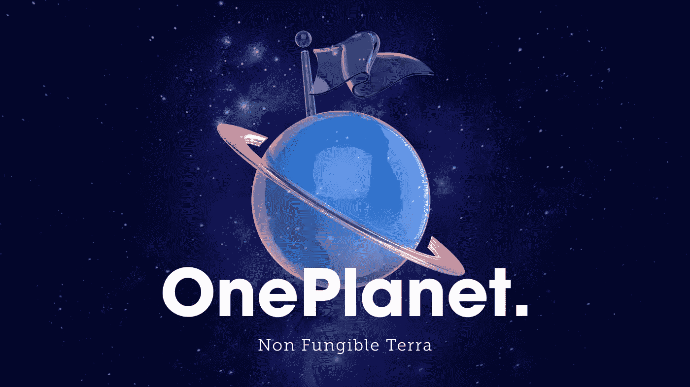
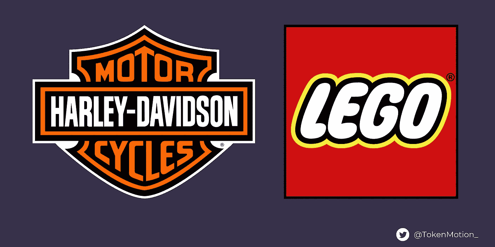
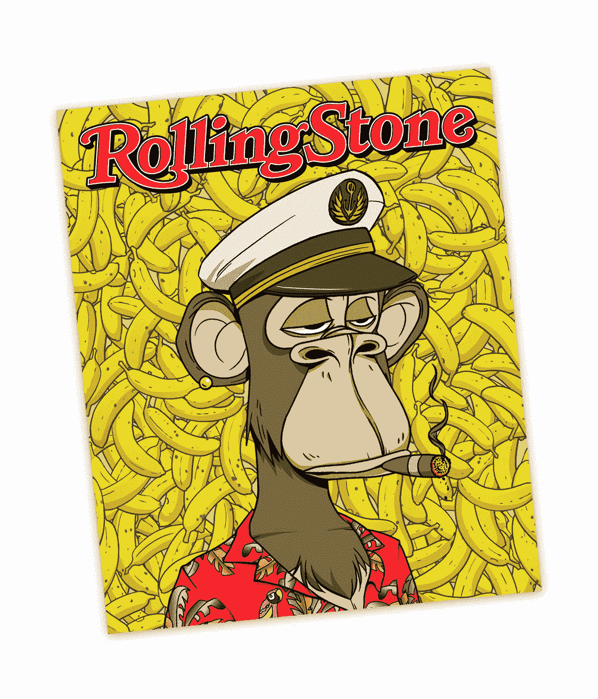
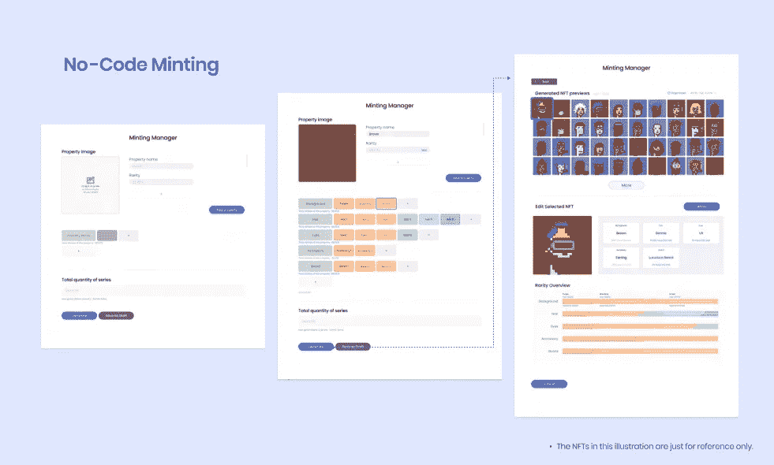
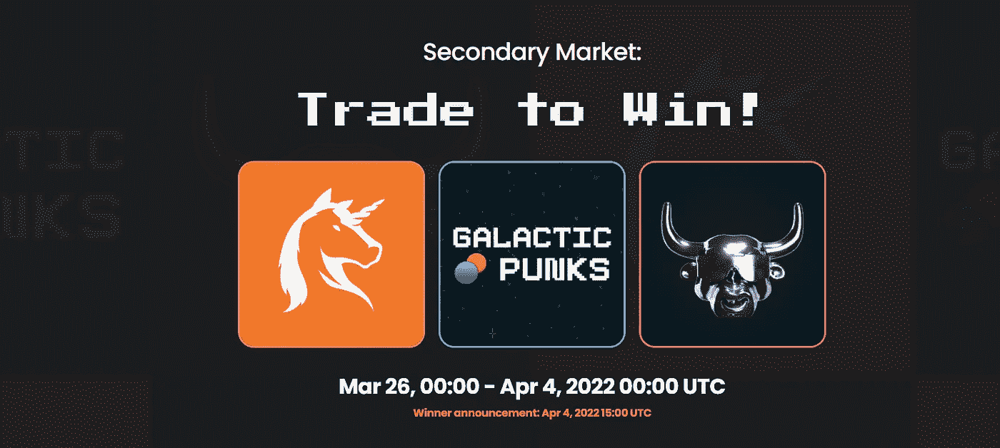
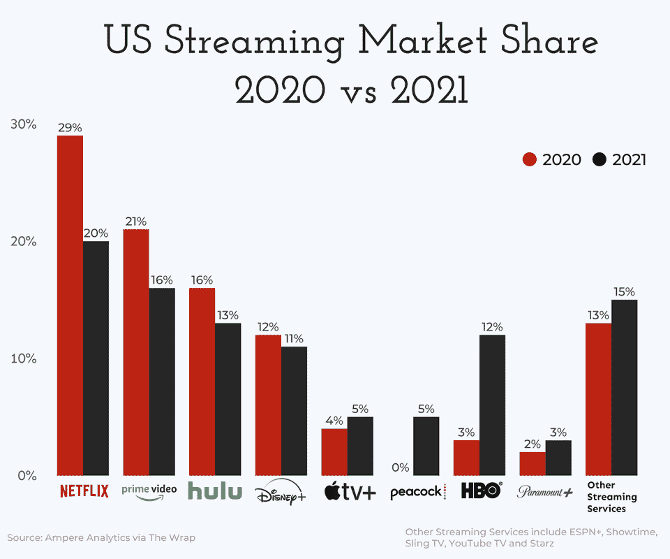
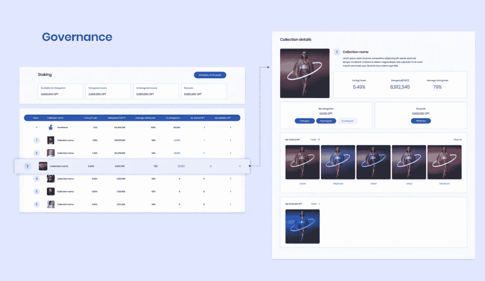

# OnePlanet NFT 市场概述

> 原文：<https://medium.com/coinmonks/deep-dive-oneplanet-nft-marketplace-on-terra-54ae2e808ea3?source=collection_archive---------16----------------------->

*对于 TL/DR:这里* *阅读我这篇文章的 twitter 帖子* [。](https://twitter.com/TokenMotion_/status/1513596997764145152?s=20&t=JQX56vmdGyWPSGKy3uOPEg)

OnePlanet NFT Marketplace (Source: [https://www.oneplanetnft.io/](https://www.oneplanetnft.io/))

*是什么让 OnePlanet 在区块链土地上的 NFT 市场脱颖而出？*

OnePlanet 通过专注于促进 NFT 创作者和他们的社区之间的紧密联系，在 NFT 市场找到了自己的位置。

但是在深入研究之前，积极的社区参与实际上是什么样子的呢？

让我们从传统公司和 web 3.0 品牌的例子开始，看看它们有什么共同点。

***传统品牌成功的社区参与***

虽然传统公司通常为 Web 3.0 公司提供非常不同的产品和服务选择，但成功的社区参与原则对两者来说通常是非常相同的。让我们看两个例子:

*   ***哈雷戴维森*** —继 1985 年拯救公司的杠杆回购之后，哈雷戴维森通过专注于如何有机地发展他们的社区，将事情引向了正确的方向。由共同的精神特质团结起来的车手“兄弟情谊”为哈雷戴维森建立自己的品牌奠定了基础，重点是促进真正的人与人之间的联系。
*   ***乐高***——在 21 世纪初濒临破产后，乐高成功扭转公司局面，超越美泰成为世界上最大的玩具制造商。这是通过启动乐高创意平台实现的，粉丝可以在这里提交新乐高玩具的概念。提交创意并被选为新发布乐高套装的粉丝将获得 1%的版税。

Brands who have nailed their community engagement: Harley Davidson Motorcycles (left) and Lego (right). Sources: [https://upload.wikimedia.org/wikipedia/commons/thumb/d/de/Harley-Davidson_logo.svg/1200px-Harley-Davidson_logo.svg.png](https://upload.wikimedia.org/wikipedia/commons/thumb/d/de/Harley-Davidson_logo.svg/1200px-Harley-Davidson_logo.svg.png) and [https://upload.wikimedia.org/wikipedia/commons/thumb/2/24/LEGO_logo.svg/2048px-LEGO_logo.svg.png](https://upload.wikimedia.org/wikipedia/commons/thumb/2/24/LEGO_logo.svg/2048px-LEGO_logo.svg.png))

***Web 3.0 品牌的成功社区参与***

如果你在 NFT 呆过一段时间，你可能已经知道这个社区可以成为一个项目的成败点。两个 NFT

*   ***无聊猿游艇俱乐部(BAYC)*** —坐落于区块链以太坊，BAYC 是 NFT 最知名的项目之一。拥有者包括斯蒂芬·库里、麦当娜、阿姆、史努比·道格和波斯特·马龙。最重要的是，拜克登上了《滚石》杂志的封面，并与阿迪达斯合作。BAYC 成功的关键是他们能够围绕自己独特的数字艺术作品形成一个专属社区。每个 BAYC NFT 本质上相当于这个专属社区的门票或身份证，持有人可以有机会参加各种高知名度个人的私人活动。
*   *——虽然不如 BAYC 那么出名，但 LunaBulls NFTs 是 Terra 区块链上最成功的集合之一。与 BAYC 类似，这种成功在很大程度上可以归功于他们围绕自己的项目建立专属社区的能力。具体来说，冰封公牛是一个高调的子社区，其中的成员必须持有 152 只具有“冰封”特征(即赤膊和戴金链)的罕见 LunaBulls 中的一只。通过手持冰镇公牛，成员们加入了一个据信由 Terra 生态系统中一些最优秀和最聪明的大脑组成的专属社区。*

**

*Bored Ape Yacht Club (BAYC) on cover of RollingStone Magazine (Source: [https://shop.rollingstone.com/collections/special-edition-sets/tl_made](https://shop.rollingstone.com/collections/special-edition-sets/tl_made))*

*那么，成功的 web2 和 web3 社区参与策略有什么共同点呢？*

*   ***协助发展人际关系***
*   ***为用户提供专属机会***
*   ***奖励参与的会员***
*   ***信任他们的社区***

*既然我们已经知道在成功的社区参与方面应该寻找什么，我们可以开始解开一些使 OnePlanet 真正脱颖而出的特征。*

# ***帮助发展人际关系***

*通过营销活动提供网络渠道和曝光率，OnePlanet 帮助将 NFT 创作者与他们的社区联系起来，并将志同道合的个人聚集在一起。*

*OnePlanet 的社区发展计划包括:*

*   ****Twitter 空间每周圆桌会议***——one planet 邀请著名的 Terra 社区成员讨论项目并分享他们的见解。之前的嘉宾包括来自 TerraBites 的 Danku_r 和 Evan。*
*   ****在即将到来的特拉达普博览会*** 上赞助 NFT 博物馆——特拉达普博览会将在得克萨斯州奥斯汀举办，并将成为今年最大的特拉事件。在这里了解更多关于 Dapp 博览会的信息:[https://twitter.com/TerraDappExpo](https://twitter.com/TerraDappExpo)*

*此外，OnePlanet 还进一步支持社区发展，帮助减少希望参与 NFT 场景的创作者和用户的准入门槛。*

*创作 NFT 作品集是艺术家与世界分享才华并从版税中公平获利的绝佳机会。然而，铸造 NFT 的技术要求是一个巨大的进入壁垒，阻止了许多人实现他们的雄心壮志。这就是 OnePlanet 开发出无代码 NFT 造币工具的原因。*

****无代号 NFT 铸币****

*有了 OnePlanet 的无代码铸造工具，创作者和社区成员将能够在没有任何编码或智能合同知识的情况下铸造 NFT。更好的是，OnePlanet 的无代码生成工具将免费使用，这将使创作者更容易专注于建设他们的社区，而不会陷入技术细节。*

****社会特征****

*此外，OnePlanet 还在他们的平台上构建了一套社交功能。用户最初将能够通过类似 Instagram 的界面关注彼此。在此之后，OnePlanet 计划引入更多的社交功能，如 DMs、社区板和视频聊天。*

**

*No-Code Minting on OnePlanet (Source: TerraBites Interview [https://www.youtube.com/watch?v=-C1OHOtfEAY&t=102s](https://www.youtube.com/watch?v=-C1OHOtfEAY&t=102s))*

# ***奖励会员参与***

*激励和奖励成员的投入在加强社区方面发挥着重要作用。强大的社区存在是为了服务他们的成员。以乐高为例，提交新乐高玩具概念的成员，如果他们的想法得到实施，可以从该玩具中获得 1%的版税。*

*在 OnePlanet 上，在他们的平台上交易产生的协议费 100%将分配给生态系统中的不同方。从这一收入流中，OnePlanet 平台的用户可以获得两种主要形式的奖励:*

*   *赠品活动*
*   *持有经核实的非功能性交易的被动收入*

****赠品事件****

*最近，OnePlanet 举办了一场“交易赢”活动，向在其平台上交易的用户赠送了价值 15，000 UST 的蓝筹 NFT，包括银河朋克、LunaBulls 和德比之星。*

**

*OnePlanet Secondary Market: Trade to Win with 15,000+ UST worth of NFT prizes (Source: [https://www.oneplanetnft.io/event/2022-03-secondary](https://www.oneplanetnft.io/event/2022-03-secondary))*

****持有已核实非流通股的被动收入****

*OnePlanet 将在不久的将来发布他们自己的$OPT 令牌。虽然 OnePlanet 尚未发布最终的令牌组学，但他们暗示的$OPT 令牌的愿景为 NFT 收藏家带来了一些非常令人兴奋的被动收入机会。*

*在一个高层次上，OnePlanet 用户的被动收益机会将专为持有$OPT 并积极参与治理的 NFT 收藏家提供。*

*持有 NFT 的奖励将以类似于传统下注奖励的方式发放。基本上，投资者将能够代表他们最喜爱的 NFT 系列，将他们的$OPT 委托给多签名钱包设置，以获得奖励，类似于你将你的 LUNA 委托给验证器节点以接收赌注奖励的方式。*

*虽然用户需要同时持有 NFTs 和$OPT 令牌才能获得被动收益，但这种机制的好处在于，你不需要将 NFT 本身锁定在一个赌注合同中一段固定的时间才能获得奖励。*

*这是有利的，因为与可替代代币(即$OPT)相比，NFT 是相对缺乏流动性的资产。因此，在一段时间内将非功能性交易锁定在赌注合同中会带来更大的机会成本。这意味着，如果你的 NFT 被锁定时市场上涨，你可能会错过向愿意出价高到无法拒绝的买家出售的机会。或者，如果市场下跌，而你的 NFT 藏品被锁定，如果急需流动性，可能很难以理想的价格出售。相比之下，对于可替代代币，在分散交易所(DEX)以公平的市场价格立即出售要容易得多。*

*此外，由于 OnePlanet 支持个人钱包的私人存储，而不是拥有协议持有合同，因此即使 NFT 被出售，也有可能获得被动收入！*

*但是如果没有任何实际价值，奖励有什么用呢？幸运的是，OnePlanet 的$OPT 概念是基于可持续的长期价值积累而开发的。*

****$OPT 值计提****

*如前所述，用户需要将$OPT 委托给他们最喜欢的 NFT 收藏，以便在他们的 NFT 上获得奖励。但是，需要注意的是，奖励将只分配给根据 OPT 授权数量排名的前 15 个集合。这给$OPT 带来了积极的购买压力，因为为了在 NFTs 上获得奖励，收藏家可能需要积累越来越多的$OPT，并将其委托给他们最喜爱的 NFT 藏品。*

*将 OPT 委托给 NFT 收藏会使$OPT 退出流通，充当供应汇，帮助推高$OPT 的价格。*

# ***为用户提供专属机会***

*在 Web 2.0 领域，独家内容在吸引用户方面发挥着巨大的作用。对于流媒体平台来说尤其如此，比如网飞、迪士尼、亚马逊 Prime 等等。在一天结束时，用户将简单地去平台，给他们想要的，特别是当他们有选择的时候。*

**

*US Streaming Market Share (Source: u/keshava7 on Reddit/r/dataisbeautiful [https://www.reddit.com/r/dataisbeautiful/comments/mtld5f/oc_us_streaming_services_market_share_2020_vs_2021/](https://www.reddit.com/r/dataisbeautiful/comments/mtld5f/oc_us_streaming_services_market_share_2020_vs_2021/). Data from Ampere Analytics via the Wrap).*

*推出独家 NFT 系列在其他市场的成功中发挥了重要作用。例如，Luart 通过发布一些高知名度的系列，如 Hellcats、DystopAI 和 Rekt Wolf，迅速增加了他们在特拉区块链的市场份额。*

*但是 OnePlanet 紧随其后，许多有前途的项目已经以他们的名字命名，还有更多令人兴奋的项目即将到来。*

*OnePlanet 上一些值得关注的独特项目包括:*

*   ****蒂姆:隐形人。一部由社区主导故事情节的动画短片，由一个拥有迪士尼、网飞和喜力等主要品牌工作经验的创意团队开发。****
*   ****可玩。*** 玩赚幻想运动平台。粉丝们将能够以 200 UST 的价格为他们的 MLB 梦幻联盟购买包含运动员 NFT 的首发包。考虑到 Terra Labs 已经与华盛顿州国民 MLB 合作，Playible 很有可能会被大量采用。*

# ***建立信任***

*分散的 NFT 市场将控制平台的权力放在社区手中。与大多数分散式系统一样，这需要对社区寄予很大的信任。就 OnePlanet 而言，关于平台如何运行和运作的决定将由 OPT 持有者投票决定。*

*但是这种对信任的强调并不止于此！OnePlanet 不仅委托社区决定他们的平台如何运作，他们还让 NFT 持有者能够对 OnePlanet 平台上列出的 NFT 收藏所做的决定进行投票。这进一步加强了 NFT 创作者和他们的粉丝之间的联系，其中社区为每个项目的成功分担责任。*

*为了促进积极参与治理，OnePlanet 开发了智能合同，如果未达到 NFT 集合的标准投票率，将扣留对 NFTs 持有者的奖励。这激励创作者和社区作为一个团队为他们喜爱的 NFT 项目塑造未来。*

*在就“一个地球，道”或项目的发展方向进行投票时，用户的投票权将由以下等式决定:*

*将 OPT 委托给集合* 1/N(# staked NFT)*

*这有助于减轻先发优势的风险，当涉及到验证 NFT 排名。如果一个成功的验证 NFT 项目获得了强大的早期追随者，他们的大部分收藏集中在少数富裕的个人，这些个人将需要委托更高比例的 OPT 以保持他们的投票权。因此,“一个星球”不仅鼓励积极参与治理，而且以公平的方式让每个人的声音都能被听到。*

*让所有 NFT 奖获得者就他们最喜欢的项目应该采取的方向发表意见，有助于创建充满激情和更积极参与的社区，在那里个人更有可能做出贡献，因为他们真正被赋予了改变的权力。*

**

*OnePlanet governance and verified NFT collections (Source: TerraBites Interview [https://www.youtube.com/watch?v=-C1OHOtfEAY&t=102s](https://www.youtube.com/watch?v=-C1OHOtfEAY&t=102s))*

# ****结论****

*通过加强 NFT 创作者和他们的社区之间的接触，每个人都是赢家。OnePlanet 以这一理念为核心开发了他们的 NFT 市场，这反映在他们目前正在开发的一系列创新的社交功能、铸造工具、代币设计和治理机制中。*

*通过专注于加强 NFT 创作者和他们的社区之间的互动，OnePlanet 显然是在建立一个长期的愿景——这是他们真正成为区块链土地上的 NFT 市场的原因。*

## *参考资料和进一步阅读:*

*把你的客户变成你的社区:[https://HBR . org/2020/01/把你的客户变成你的社区](https://hbr.org/2020/01/turn-your-customers-into-your-community)*

*让品牌社区走上正轨—【https://hbr.org/2009/04/getting-brand-communities-right *

*how-the-Bored-Ape Yacht Club 成为最成功的 NFT 品牌:[https://better marketing . pub/how-the-Bored-Ape-Yacht-Club-been-the-most-successful-NFT-brand-5158 a 80 f1 BD 9](https://bettermarketing.pub/how-the-bored-ape-yacht-club-became-the-most-successful-nft-brand-5158a80f1bd9)*

*地球一号对地球人的采访:[https://www.youtube.com/watch?v=-C1OHOtfEAY&t = 102s](https://www.youtube.com/watch?v=-C1OHOtfEAY&t=102s)*

**免责声明:本文无一是理财建议。总是 DYOR。**

> *加入 Coinmonks [电报频道](https://t.me/coincodecap)和 [Youtube 频道](https://www.youtube.com/c/coinmonks/videos)了解加密交易和投资*

# *另外，阅读*

*   *[3 商业评论](/coinmonks/3commas-review-an-excellent-crypto-trading-bot-2020-1313a58bec92) | [Pionex 评论](https://coincodecap.com/pionex-review-exchange-with-crypto-trading-bot) | [Coinrule 评论](/coinmonks/coinrule-review-2021-a-beginner-friendly-crypto-trading-bot-daf0504848ba)*
*   *[莱杰 vs n 格拉夫](/coinmonks/ledger-vs-ngrave-zero-7e40f0c1d694) | [莱杰纳诺 s vs x](/coinmonks/ledger-nano-s-vs-x-battery-hardware-price-storage-59a6663fe3b0) | [币安评论](/coinmonks/binance-review-ee10d3bf3b6e)*
*   *[Bybit Exchange 审查](/coinmonks/bybit-exchange-review-dbd570019b71) | [Bityard 审查](https://coincodecap.com/bityard-reivew) | [Jet-Bot 审查](https://coincodecap.com/jet-bot-review)*
*   *[3 commas vs crypto hopper](/coinmonks/3commas-vs-pionex-vs-cryptohopper-best-crypto-bot-6a98d2baa203)|[赚取加密利息](/coinmonks/earn-crypto-interest-b10b810fdda3)*
*   *最好的比特币[硬件钱包](/coinmonks/hardware-wallets-dfa1211730c6) | [BitBox02 回顾](/coinmonks/bitbox02-review-your-swiss-bitcoin-hardware-wallet-c36c88fff29)*