# 用于交易加密货币的深度强化学习

> 原文：<https://medium.com/coinmonks/deep-reinforcement-learning-for-trading-cryptocurrencies-5b5502b1ece1?source=collection_archive---------0----------------------->

## 使用被称为*决斗深度 Q 网络的深度强化学习算法，根据资产的历史价格生成买入/卖出信号。*

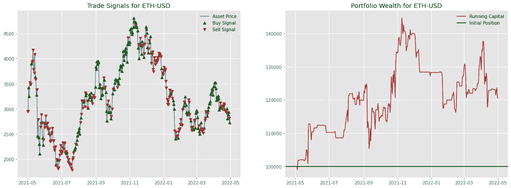

Trading Signals generated by Deep Reinforcement Learning Agent for Etherium Coin (ETH-USD)

## 目录:

**🧩简介
⚒️方法论
⚖️交易环境
🤖交易代理
⛹️‍培训
💹结果&推论
👋结论&下一步**

# 🧩简介

在这个项目中，我们将尝试建立一个智能系统来实现金融市场交易的自动化。我们将借用深度强化学习算法，特别是**决斗深度 Q 网络**，在加密货币领域实现这一点。我们的主要目标是实现一个智能的人工交易代理，与基线策略相比，它可以产生利润。👨‍💻

我试图用类比来简化复杂的理论，并为更高级的理论提供链接。为了保持本文的范围简单，我在本文中省略了许多重要的概念，如马尔可夫决策过程(完全和部分可观察的)、基于模型和无模型的强化学习、贝尔曼方程和 Q 学习、基于值和基于策略的算法等。如果你以后想了解他们，我在下面提供一个参考。

 [## 深度强化学习的正式介绍

### 利用深度 Q 学习从零开始进行深度强化学习

lorenzotinfena.medium.com](https://lorenzotinfena.medium.com/a-formal-introduction-to-deep-reinforcement-learning-db639d8c48b8) 

如果您只是对交易代理的结果和表现感兴趣，您可以简单地浏览文章并跳到最后的**结果**部分。

首先是一些概念性的定义…📖

## 交易策略

在现代社会，有两种赚钱的方式。第一种方法是赚取收入，要么为自己工作，要么为别人工作。另一种增加财富的方法是投资你的资产，让它们随着时间的推移而增值。无论你选择什么样的金融证券，目标都是产生现金。

交易策略是用于证券市场买卖的系统方法。交易策略是基于交易决策时使用的预定义规则和标准。

算法交易策略利用复杂的公式，结合数学模型和人工监督，做出买卖金融证券的决定。

策略可能简单，也可能复杂，涉及投资风格(如价值与增长)、市值、技术指标、基本面分析、行业、投资组合多元化水平等因素。关键是交易策略是根据客观数据和分析制定的，并坚持不懈。同时，随着市场条件或个人目标的变化，交易策略应该定期重新评估和调整。

## 强化学习

强化学习是一种基于条件作用的心理学概念的机器学习。它的工作原理是将算法放在一个有翻译和奖励系统的工作环境中。在算法的每次迭代中，输出结果被提供给解释器，解释器决定结果是否有利。如果程序找到了正确的解决方案，解释器通过向算法提供奖励来强化解决方案。如果结果不理想，算法被迫重复，直到找到更好的结果。在大多数情况下，奖励制度与结果的有效性直接相关。

我们将在这项工作中使用强化学习算法来实现我们有利可图地交易加密货币的目标。更具体地说，我们将训练一个人工智能体，通过考虑历史价格数据和从这些数据中得出的特征来做出买入或卖出的决定。💪

> ***📝注意:***
> 在我们继续下一步之前，这严格来说不是投资建议，而是基于自动化机器学习的交易策略的演示。

# ⚒️方法论

每个强化学习设置有 2 个主要参与者:**环境**和**代理。**代理观察环境 ***状态*** 并采取 ***动作*** 。然后环境观察这个行为，并通过一个奖励机制基于它的行为奖励或惩罚这个主体。代理然后收集 ***奖励*** 并通过观察环境的下一个状态再次采取行动。代理人的目标是最大化从环境中积累的总回报。

这个整个过程或者持续一段时间直到满足终止条件，或者根据应用无限期地持续。前者被称为情节性学习任务，后者是持续性学习任务。在我们的例子中，我们将把它作为一个带有预定义终止条件的情节任务。

设计合适的奖励机制是强化学习系统中的一项关键任务。它决定了我们向代理描述任务的能力。一个例子是当代理大多数时候选择“什么也不做”动作。这可能会减少损失，但也会减少利润。当最后几个连续的动作是“什么都不做”时，我们可以通过分配负奖励来防止这种情况。这样我们就可以用一个好的定制奖励机制工程来控制代理的学习过程。

在我们的例子中，下面的映射帮助我们理解这个 RL 设置中的各种组件。

> ***环境::资产市场
> 代理人::交易算法
> 状态::历史价格、成交量&波动率数据
> 代理人动作::买入、卖出、无为而治
> 报酬::下一期收益基于选择的动作和投资组合的最终收益。***

# ⚖️贸易环境

我们需要一个环境让代理人进行交互并做出决策。环境将:

*   以一系列资产特征的形式将观察空间、状态暴露给代理，这些资产特征例如回报、交易量的变化、技术动量指标、不同时间框架内的部门 ETF 回报以及可用于投资的金额。
*   从代理那里收集行动，并相应地计算报酬。
*   根据行动更新投资组合资本。
*   将下一个状态的向量和计算出的奖励一起发送给代理。

代理的目标是最大化从交易环境中获得的总回报。

## 🪙运营资本(投资组合财富)

我们将有 10 万美元的初始资本。在每个时间点，根据代理给出的买入/卖出/不做操作，20%的流动资金可用于投资。交易的利润/损失被加回到流动资本中。如果流动资金低于初始金额的 **30%** ，环境将停止交易。这是终止的条件。

## 观察空间(状态)

观察空间是代理观察到的状态的矩阵/向量表示。它可以被认为是对我们代理的输入。它允许我们设计特性，并将它们作为输入传递。

分析中考虑的特征空间是以下各项的矢量表示:

*   **N 天的资产收益、成交量变化和波动率**
*   **行业 ETF 回报和波动性(在我们的案例中是比特币)**
*   **移动平均线收敛发散(MACD)**
*   **相对强弱指标**
*   **布林线**
*   **每次交易后的资本比例。**
*   **代理对先前状态采取的先前操作。**

**MACD** 、 **RSI** 和**布林线**是广泛使用的技术指标。你可以在这里了解更多信息:

 [## 每个交易者都应该知道的 10 个交易指标

### 布林线是一个指标，它提供了一个资产价格通常交易的范围。宽度…

www.ig.com](https://www.ig.com/us/trading-strategies/10-trading-indicators-every-trader-should-know-190604) 

## 行为空间

动作空间表示给定一个状态表示，我们的代理可以选择的动作范围。它们是:

*   **-1 =出售资产**
*   **0 =什么都不做**
*   **1 =购买资产**

代理通过从上面给出的定义中选择一个值 **{-1，0，1}** 来进行买卖通信。我们解码动作值的机制取决于代理的底层算法。我们将在下面的代理部分进一步了解它。

## 终端状态

终端状态类似于视频游戏中阶段的**游戏。当满足结束状态的条件时，代理将收到此状态。这表示情节任务中一集的结束，我们将对典型深度学习流水线中的 **N** ***集*** (类似于但不等同于 ***时期*** )重复该过程。)**

在我们的案例中，当运营资本低于初始资本的 30%时，或者当环境达到时间序列训练数据的末尾时，代理将收到终止状态。

## 🏆奖励机制

**运行奖励:** 运行奖励是环境给智能体的，只要状态是非终结。环境根据代理采取的行动对其进行奖励。让我们用一个例子来说明这一点:

*   让时间段**的**未来回报**tt**为 ***r(t)***
*   ***【t】***是代理人在时间 ***t*** 的动作。*可以取值 **{-1，0，1}***
*   **S 为时间状态的矢量表示**

***那么代理人在采取行动***【A(t)***后观察到***【S(t)***将收到的奖励 ***可以计算为:******

*****R(t)= R(t)* A(t)-(A(t)-A(t-1))| * C*****

**其中 ***r(t)*** 是资产的未来回报，而 ***C*** 代表**交易成本**，我们假设交易成本在每笔交易 1-5 个基点的范围内。 *(1 个基点= 1%的 1% = 0.0001)***

**例如，如果*为**正(*负* )** 并且代理选择***【A(t)***为 **1( *-1* )** ，即*和 ***A(t)*** 具有相同的符号反之，如果 ***r(t)*** 和 ***A(t)*** 符号相反，即如果未来收益为负，代理人决定买入，那么报酬为负，代理人将受到负报酬的惩罚。****

**这是一个严重的过度简化，但它是强化学习代理学习的基本方式。顾名思义，环境**通过正负奖励来强化**代理人做出的决策。**

****终端奖励:**
这是当智能体完成任务即达到终端状态时，环境给予的奖励。给予的奖励取决于代理如何达到最终状态。**

*   **如果代理商用完了 70%的资金，那对我们来说就不是一个非常有利的情况。因此，我们通过给予大量负面奖励来严厉惩罚代理人。**
*   **如果代理人带着足够的资金到达这一集的结尾，那么我们将向代理人提供最终投资组合回报的倍数。如果最终的投资组合回报是正的，回报是非常积极的，我们正在教导代理人，它正在向有利可图的方向学习。负回报也一样，只是我们用一大笔负回报来惩罚代理人，这会让代理人改变策略。**
*   **我们也可以使用更高的负乘数，让代理人对负回报更加厌恶风险。**

## **💻代码实现**

**在每个数据挖掘管道中，我们需要不断地调整模型的超参数，以改进训练过程。由于一切都连接在强化学习管道中，我们在单个块中定义所有参数，以使修改重要参数更容易，如下所示:**

**These variables control various parameters of both Agent and Environment.**

**现在我们需要生成观察空间。下面的代码片段做了同样的事情。首先，它使用[*yfinance*](https://pypi.org/project/yfinance/)**python 模块从雅虎财经网站下载给定股票、日期和频率所需的时间序列数据。随后，它为观察空间设计所需的特征。****

****Feature Engineering****

****下面的代码片段是交易单个资产的自定义交易环境实现。它将资产的`DataGetter`类作为输入。虽然环境类中有很多函数，但两个主要函数是`step()`和`reset()`。****

****Single Asset Trading Environment****

****`step()`函数从代理接收`action`，使用`calculate_reward()`函数计算奖励，并返回奖励和下一个状态。完成一次训练后，在主执行循环中调用`reset()`函数，将所有参数重置为初始状态。****

# ****🤖贸易代理****

****到目前为止，我们已经遇到了强化学习空间中的许多重要概念，这些概念可以在某种程度上简化为类比和直觉。但是本节需要一些重要的复杂概念的工作知识来理解 RL 代理的底层工作。为了保持简单，解释强化学习算法发展背后的这些理论超出了本文的范围。但是下面的系列教程是理解本节中实现的重要概念的良好起点。****

**** [## 深度强化学习解释-乔迪托雷斯。人工智能

### 这是一个轻松的介绍性系列，采用实用的方法，试图涵盖…

torres.ai](https://torres.ai/deep-reinforcement-learning-explained-series/) 

## ⚔️决斗深度 q 网络算法

代理的底层算法是 RL 设置的核心模块。简而言之，RL 代理学习最大化目标函数的动作序列，而不是像典型的深度学习流水线那样最小化目标函数。我们使用*贝尔曼方程*递归地做这件事。

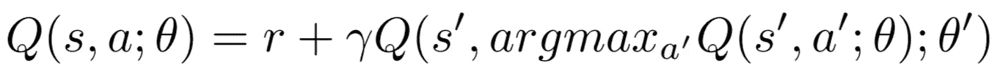

Bellman Equation for Deep Q Networks

***Q(s，a；θ)*** 表示在状态*中选择行动 ***a*** 的最大预期未来报酬。 ***Q 值*** 通过迭代过程不断更新。深度 Q 网络包括充当 Q 表的函数近似的神经网络。在 DQN 内部，神经网络将状态作为输入，并为每个动作输出 *Q 值*。然后选择具有最大值的动作，并将其反馈给环境。*

*决斗 DQN 是深度 Q 网络的扩展，它包括在最终输出层计算动作相对于其他动作的*优势*。*

*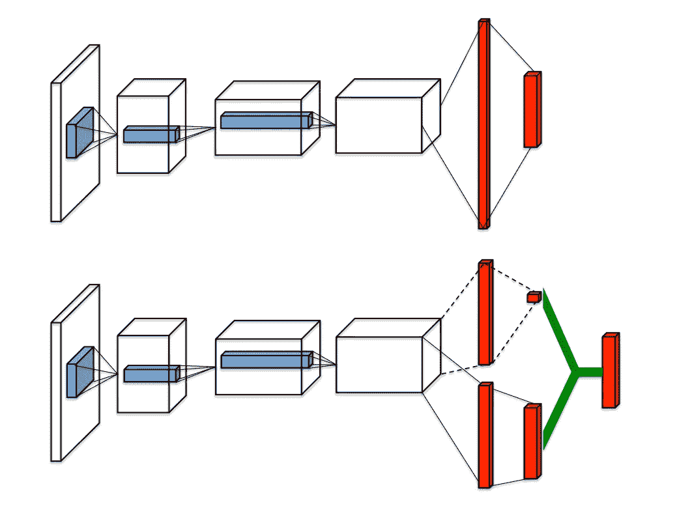*

*Typical DQN Architecture (Above); Duelling DQN (Below) [Source](https://arxiv.org/pdf/1511.06581.pdf)*

*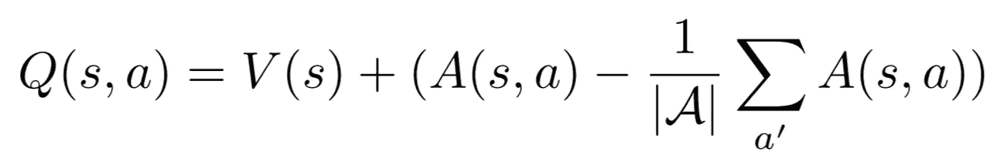*

*The Advantage is Action Values less their mean.*

****架构(在线&目标网络)*** 代理包含两个相同的人工神经网络，称为在线和目标网络，具有相同的架构。输入的形状与状态表示向量的形状相同，输出的形状是可用动作的数量。在我们的例子中，它是 3(买入，卖出&什么都不做)*

*在线网络是从经验中学习并执行优化步骤的网络。每隔几个时间步，在线网络的权重被复制到目标网络。这两个网络都用于目标函数中。在线网络用 ***Q(s，a；θ)*** 而目标网络由***Q(s’，a 给出；θ’)***在上面给出的贝尔曼方程中。学习步骤包括最小化贝尔曼方程中 LHS 和 RHS 之间的差异。*

*从经验中学习和更新目标网络权重的频率可以由参数代码块中的参数 **LEARN_AFTER、LEARN_EVERY** 和 **UPDATE_EVERY** 变量控制。*

****体验回放*** 每当 agent 从环境中接收到一个状态，它就将体验元组*(当前状态、采取的行动、收到的奖励、下一个状态、终端状态的指示变量)*存储在一个容量有限的存储器中，一般是一个 *Deque* 数据结构。如果记忆变满，那么新的经历会简单地覆盖旧的经历。一旦收集了足够多的经验，代理就会从这些经验中随机抽取样本，并开始每隔几个时间步长进行学习。*

*这是为了防止用太少的数据点过早地更新神经网络的权重，并且还为了消除由环境给予代理的连续状态之间的时间相关性。*

*Agent Memory to store the transitions*

****探索 vs 剥削困境*** 有时，我们应该允许代理随机采取一个行动(*探索*)，而不是按照策略规定采取行动(*剥削*)，看看除了建议的行动之外，其他行动如何影响收到的奖励。这可能会导致更好或更差的奖励，但它会增加代理学习过程的价值。在培训开始时，我们需要对代理进行更多的探索，随着培训的进行，我们将需要更多的开发。换句话说，我们希望代理人逐渐减少行动选择的随机性。这可以通过参数 **EPS_START、EPS_END** 和 **EPS_DECAY** 来控制。*

*最终的代理算法如下:*

*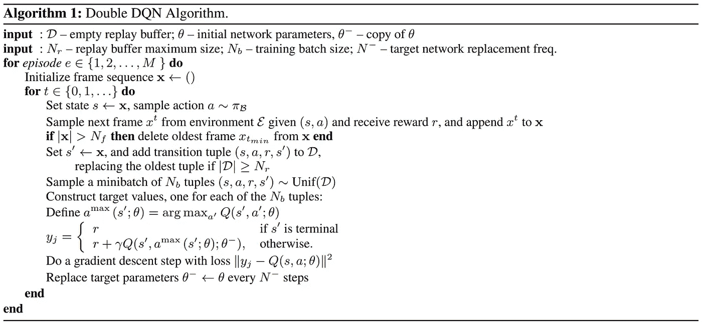*

*Double DQN Algorithm. [Source](https://arxiv.org/abs/1511.06581)*

*Duelling Deep Q Networks Agent***** 

# ****⛹️‍♂️培训****

****对代理人的培训以 **2015/01/10** 至 **2021/05/01** 的历史价格数据为依据，验证以 **2021/05/01** 至 **2022/05/01 为依据。******

****深度学习模型通常需要大量数据。对于所选的培训期，每项资产大约有 1600 个数据点，这是不够的。因此，我们选择多种资产来培训代理，因为它可以为我们提供更多的数据点。****

****Main Training/Execution loop****

# ****💹结果和推论****

******我们如何知道我们的代理人是否是一个有利可图的交易者？💸**
我们可以通过观察初始资本的演变来知道。向代理人分配 100，000 美元的初始资本，其职责是管理资本和增加价值。在代理交易时，每种资产环境都会跟踪所产生的利润和损失。****

****让我们看看在给定密码货币的情况下，代理的表现如何。我们将通过检查测试环境中产生的信号和积累的投资组合财富来做到这一点。下面，展示了著名硬币的大图:埃瑟伦币、多戈琴币和币安币。****

****左侧的子图显示了代理产生的交易信号(买入/卖出),而右侧的子图表示投资组合的价值。黑色水平表示投资组合的初始资本。****

********

****Ethereum****

****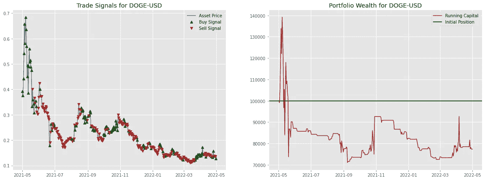****

****DogeCoin****

****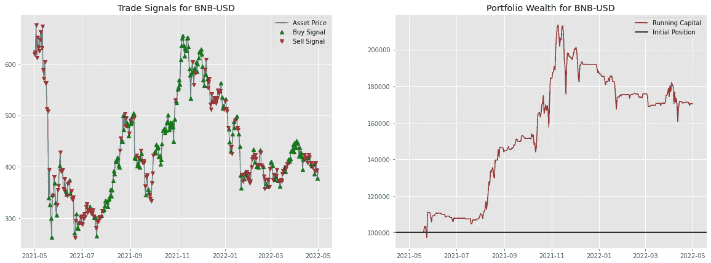****

****Binance-USD****

****代理人在剩余硬币的情况下的表现绘制如下。****

****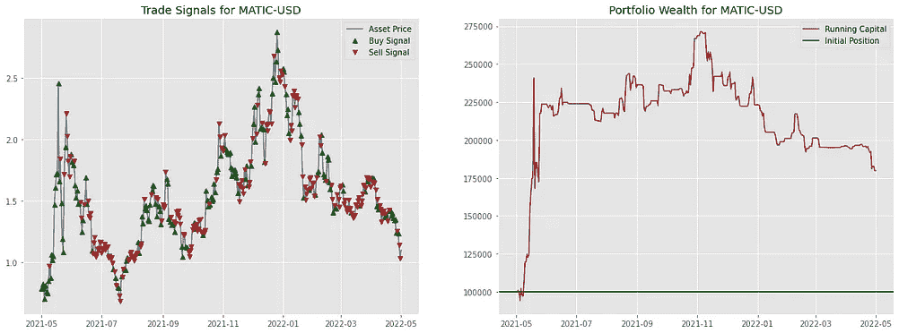********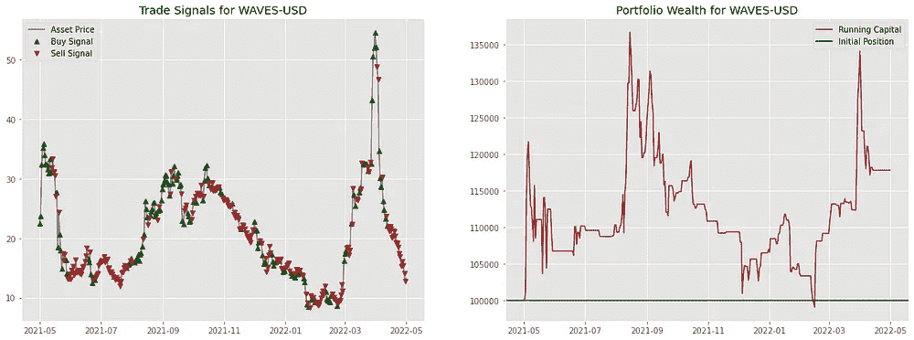****

****Polygon (Left) & Waves (Right)****

****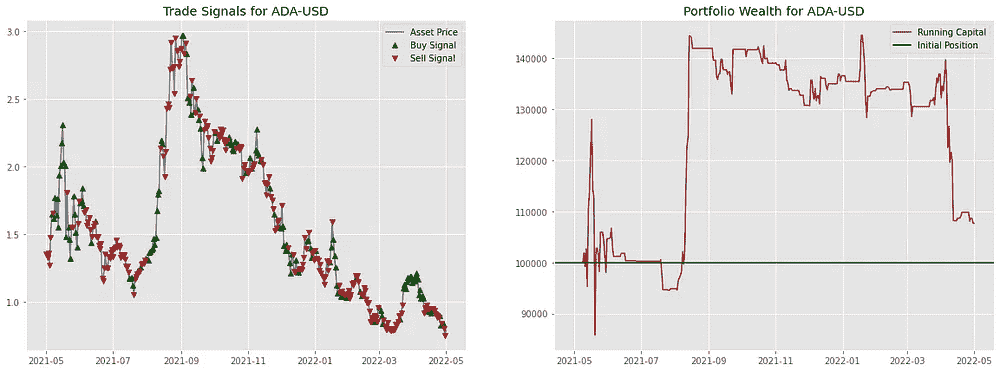********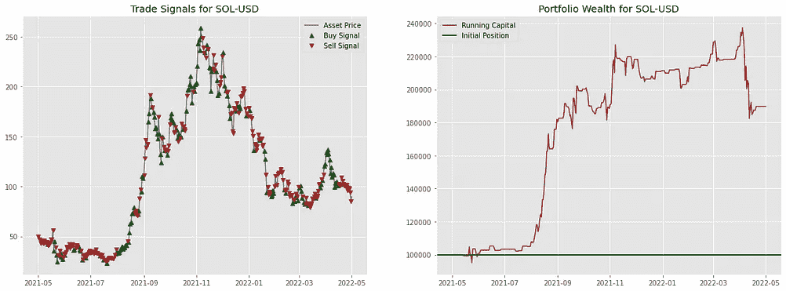****

****Cardano (Left) & Solano (Right)****

****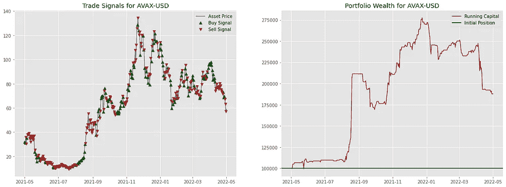********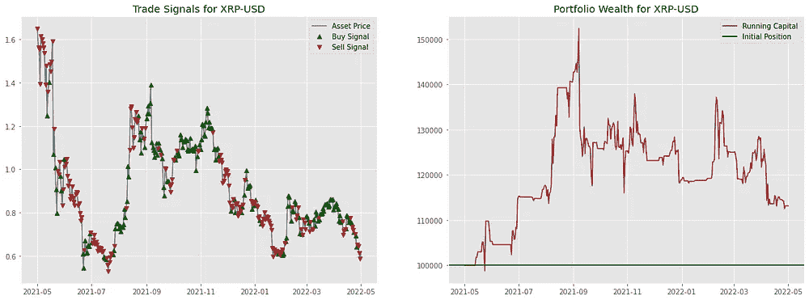****

****Avalanche (Left) & XRP (Right)****

****从上面的可视化可以看出，除了最终资本从初始金额减少产生负回报的 DOGE-USD 之外，代理人可以产生利润。还可以看出，在某些阶段，该值既不增加也不减少。这可能是因为代理人可能选择了“什么也不做”，即使它获得了通常复制人类交易者行为的负面运行报酬。****

*******但这是否值得编译数百行代码呢？*** 🤷‍♂
为了回答这个问题，让我们将我们代理人策略的回报与分析所考虑的同一时期简单基线买入&持有策略的回报进行比较。比较如下:****

****Excess Returns generated by the Agent Trading Strategy compared with Buy and Hold Strategy.****

****通过这种比较，我们可以了解我们的战略相对于基线战略的表现。在所有情况下，代理的表现都优于买入并持有策略。在某些方面微不足道，但在其他方面却有很大的不同。由于ɛ-greedy 随机性，当重复实验时，结果可能会略有不同。****

****我们的深度强化学习代理平均产生大约 **50%** 的超额回报。即使在 DogeCoin 的情况下，当买入&持有策略产生了 **-63.18%** 的损失时，代理人仅损失了初始资本的 **-22.66%** 。在币安-美元硬币的案例中，它产生了基准策略的 **107.32%** 的超额收益。💰****

****虽然回报可能看起来很诱人，但在现实生活中实施该策略时，人们应该检查各种投资组合指标，如回报分布、投资组合缩减、预期短缺等。agent❗正在实施的算法策略****

# ****👋结论和后续步骤****

****鉴于撰写本文时的情况，美国的宏观经济形势并不乐观，经济中的高通胀和加密货币在分析所考虑的同一测试期间经历了崩溃。即使在这样一个动荡的时期，与我们的基线策略相比，深度强化学习代理在所有资产上都表现良好。****

****为了进一步提高代理的性能，我们可以做如下一些更改:****

*   ****使用 LSTM 编码器架构，注意从时间序列数据中提取特征，然后将特征向量作为输入传递给代理，而不是现有的架构。****
*   ****选择基于策略的方法，如深度确定性策略梯度算法，来指定要购买或出售的资产数量，而不是最大限度地做多或做空投资。****
*   ****通过在呈现给代理的观察空间中包括 Twitter/Reddit/News 情绪，进行更多的特征工程。****
*   ****甚至进一步微调超参数，并用不同的隐藏层节点、层激活函数和权重初始化来尝试不同的网络架构。****

****使用强化学习也有一些缺点，其中最大的缺点是底层算法的模型可解释性。我们无法从人类交易者的角度调试和解释为什么代理为某个状态选择了某个动作。使用神经网络的这一缺点使得在金融服务行业中实现这些算法有些缺乏吸引力，因为在金融服务行业中有许多风险和控制框架。****

*****感谢阅读！🤝*****

> *****加入 Coinmonks* [*电报频道*](https://t.me/coincodecap) *和* [*Youtube 频道*](https://www.youtube.com/c/coinmonks/videos) *了解加密交易和投资*****

# ****另外，阅读****

*   ****[有哪些交易信号？](https://coincodecap.com/trading-signal) | [Bitstamp vs 比特币基地](https://coincodecap.com/bitstamp-coinbase) | [买索拉纳](https://coincodecap.com/buy-solana)****
*   ****[如何给 MetaMask 钱包添加 Arbitrum？](https://coincodecap.com/how-to-add-arbitrum-to-metamask-wallet)****
*   ****[KuCoin vs 北海巨妖 vs BitYard](https://coincodecap.com/kucoin-vs-kraken-vs-bityard)****
*   ****[加密交易的最佳 VPN](https://coincodecap.com/best-vpns-for-crypto-trading)****
*   ****[ProfitFarmers 回顾](https://coincodecap.com/profitfarmers-review) | [如何使用 Cornix Trading Bot](https://coincodecap.com/cornix-trading-bot)****
*   ****[西班牙 5 大最佳文案交易平台](https://coincodecap.com/copy-trading-spain)****