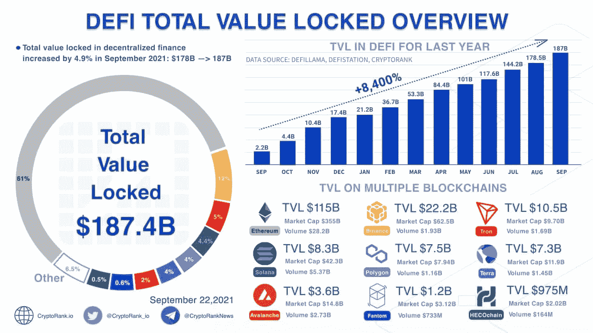
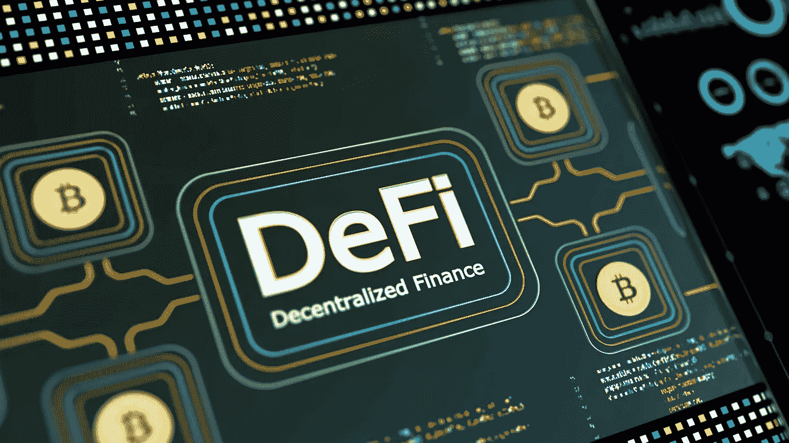

# DeFi 101:你需要知道的关于 DeFi 的一切，简单来说…

> 原文：<https://medium.com/coinmonks/defi-101-all-about-defi-you-can-learn-a2d6774be556?source=collection_archive---------22----------------------->

让我们从你的加密投资开始。

你投资加密吗？

我知道你买了一些代用币；如果没有，你至少会在 FOMO 投资比特币或以太坊。我说的对吗？

没有吗？你错过了很多帮助你提前退休的机会。

如果你已经是 crypto 的投资者，你知道钱是怎么运作的，为什么每个人都看好 crypto 的钱吗？

这就是 Defi 发挥作用的地方。

在我们理解 Defi 的核心之前，让我们先来解构一下你身边嗡嗡作响的术语。

它们分为两类；

1)有趣的行话😁

2)严肃的术语🔗

有趣的术语是 web3 空间中人们相互交流的一种方式。这里有一些

*   🌞gm-早上好，我回到太空了
*   💲wag mi——即使你错过了一些，那也不是问题；我们来得很早，我们都会按时到达
*   **🙄**文令牌 **:** 你是什么时候笑令牌的？
*   🍜NGMI——不会成功的。人们在像这个项目这样的场景中使用是不会成功的。
*   🚀月亮——这个标志会跨越国界，让你变得非常富有。一些人正在显示他们现在有多乐观。

Hope you remembered this show:P

是时候使用一些被认为是运行 web3 生态系统的严肃术语了。

*   👨‍💻智能合约(Smart contracts):这些是存储在区块链上的程序，在满足预定条件时运行。

合同应用包括交易、投资、借贷等金融用途。

*   ⛓一级和二级区块链:

**第一层**网络是指区块链。L1 解决方案更安全，更倾向于保持网络分散。

例如:比特币和以太坊。

A **第 2 层**处理新交易的速度更快，同时降低第 1 层的天然气费用。

例如:多边形

*   🧱 **非保管钱包**:区块链钱包让你成为自己的银行。例如:元掩码
*   🈸 **DAAPS** :这是一款基于分散式网络的应用，结合了智能合约和前端用户界面。这些都是建立在以太坊，EOS，TRON 上的

例如:Uniswap

*   **🎱流动性池**:这是一种智能合约，允许交易者交易代币和硬币，不管有没有买家或卖家。—
*   **🔓TVL:** Total value locked 是存放在分散金融(Defi)协议中的加密资产的总价值。

2021 年 9 月的 TVL👇

Image credits: Google

让我们深入了解的核心💰🔗

Image Credits: Google

> 什么是 **Defi** ？

## Defi 是一个为互联网时代而建立的开放的全球金融系统。

> 我们为什么需要 Defi？

*   公开透明的会计，以及彻底的风险评估。
*   现代化的基础设施、提高的市场效率和稳定性。
*   统一市场和全球准入。
*   减少进入壁垒，降低转换成本，并提供灵活性。

听起来很有趣，对吧！！

Defi 在上面提到的每一个参数上帮助我们，把钥匙掌握在我们手中。

> 下面是 Defi 的**属性**:

*   无权限:任何人都可以在其上访问/构建。
*   可组合性:可以构建在另一个协议之上。
*   透明性:链上的所有数据都是可访问的。
*   不变性:区块链账本保持不变。

但是一切都要付出一些代价；不是吗？

这里有几个太空中的问题和解决方案

**问题**:

-> >这一领域最关键的问题是高昂的油费和低效率。

这些是像以太坊一样的第一层上的问题，它使事情变得复杂，费用增加，以及效率问题。

**解决方案**:

-> >解决方案来自 **L2** 区块链喜欢多边形，使低汽油费和新的交易更快，同时减少负荷。

我们能用 Defi 做什么？

我们了解 Defi 的工作原理；为什么我们需要定义、问题和解决方案！！

> 现在我们可以使用 Defi 的最好方法是什么？

跟随这篇文章，看看你如何赚钱👇

*   **掉期**:这些不是我们在衍生品市场看到的掉期:D 加密交易指的是将你持有的一种加密货币兑换成等值的另一种加密货币。

Ex: Uniswaps

*   产量农业是用你的密码制造更多密码的一种方式。
*   **借贷**:领导把自己固化为用户借贷 Defi 令牌的优先权。

Defi 最大的贷款人是制造商、Aave 和化合物。

*   **期权和永久**:这些是 Defi 空间中复杂的衍生产品，由算法驱动。(如果你很早就开始定义空间，不要太专注于此)

> **增长战略**

与 Web2 相比，情况完全不同。通过脸书广告和谷歌广告推销产品和服务不会对 web3 领域产生影响。以下是增长策略

*   第一层区块链:

最好的例子是 Terra 引入锚定协议(Anchor protocol)的策略，这是一个贷方和借方的市场，它导致了一方的增长，另一方创造了流量。

*   第二层区块链

多边形就是这个空间最好的例子； [Polygon](https://medium.com/u/ea91a1cf958?source=post_page-----a2d6774be556--------------------------------) 通过解决以太坊的两个重要问题(如上所述)来介绍自己。

*   像 Uniswap、ens 这样的协议有望吸引新客户和新用户加入社区。

事实:Uniswap Gold 向其早期信徒空投了 1.5 亿枚 UNI 代币。

如果你第一次来这里，我写的是关于创业、产品管理和 Web3 的内容。关注[柴坦尼亚·阿图库里](https://medium.com/u/35c038041eb7?source=post_page-----a2d6774be556--------------------------------)获得更多有趣的见解。

如果你想了解更多关于 Web3 的内容，这里有几篇文章可以帮助新手更好地理解 web 3

*   [打造你的第一个 Web3.0 项目；解释的好像我 5](https://chaitanya-athukuri.medium.com/top-10-crypto-for-2022-explain-like-you-are-5-49cbd8d222a3)
*   2022 年十大密码；像我 5 岁一样解释— [阅读此处](https://chaitanya-athukuri.medium.com/top-10-crypto-for-2022-explain-like-you-are-5-49cbd8d222a3)

与我联系- [点击这里](http://chaitanyaathukuri.bio.link/)

> 加入 Coinmonks [电报频道](https://t.me/coincodecap)和 [Youtube 频道](https://www.youtube.com/c/coinmonks/videos)了解加密交易和投资

# 另外，阅读

*   [CBET 评论](https://coincodecap.com/cbet-casino-review) | [库科恩 vs 比特币基地](https://coincodecap.com/kucoin-vs-coinbase) | [拜比特 vs 比特币基地](https://coincodecap.com/bybit-vs-coinbase)
*   [如何在加拿大购买加密货币？](https://coincodecap.com/how-to-buy-cryptocurrency-in-canada)
*   [无聊猿游艇俱乐部(BAYC)评论](https://coincodecap.com/bored-ape-yacht-club-bayc-review)
*   [5 款最佳加密交易终端](https://coincodecap.com/crypto-trading-terminals) | [最佳 DeFi 应用](https://coincodecap.com/best-defi-apps)
*   [在美国如何使用 BitMEX？](https://coincodecap.com/use-bitmex-in-usa) | [BitMEX 评论](https://coincodecap.com/bitmex-review)
*   [最佳期货交易信号](https://coincodecap.com/futures-trading-signals) | [期交所评论](https://coincodecap.com/liquid-exchange-review)
*   [南非的加密交易所](https://coincodecap.com/crypto-exchanges-in-south-africa) | [BitMEX 加密信号](https://coincodecap.com/bitmex-crypto-signals)