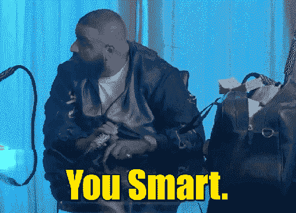
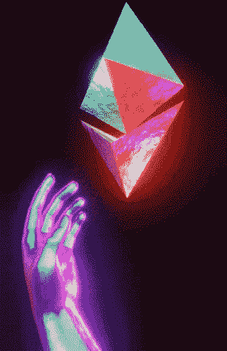
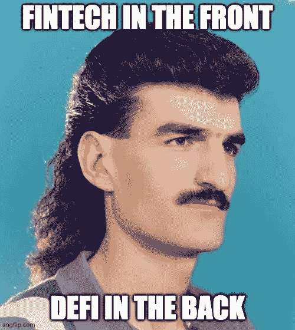

# DeFi 101

> 原文：<https://medium.com/coinmonks/defi-101-c2efa9be902c?source=collection_archive---------43----------------------->

## 这是由[西达尔特·维尔马](https://twitter.com/sidsverma)在 [The Product House](https://twitter.com/0xTPH) web3 社区上对 DeFi 101 会议的分解。西达尔特是朱诺上的[的联合创始人，这使得用密码支付工资成为可能。这篇文章是以一种推特友好的方式写的，享受吧。](https://onjuno.com/)

开始之前，让我们先了解一些术语:

💡智能合约(Smart Contract):无需人工干预即可实现资金可编程移动的神奇调味汁。这是一个游戏规则改变者，它赋予 web3 力量，并使去伪存真成为可能。

💎 **L1，L2 网络:**第一层网络指的是区块链([比特币](https://bitcoin.org/en/)、[以太坊](https://ethereum.org/en/)、[索拉纳](https://solana.com/))，而第二层网络指的是坐在第一层区块链上面的第三方集成([多边形](https://polygon.technology/))。

用非技术术语来说，L2 网络将多项交易整合到 L1 的一个街区，从而提供了高速和低油费。

👛**非保管人钱包**:用户拥有 web3 钱包的私钥([元掩码](https://metamask.io/))# notyourkeysnotyourcounts

📱Dapp :分散式应用程序是在区块链上运行的智能合约的接口。( [Uniswap](https://uniswap.org/) )

🏊**流动性池**:储存在智能合约中用于交易的代币集合。

🔐 **TVL** :锁定的总价值是存放在 DeFi 协议中的加密资产的总价值。

## 数字上的炒作！价值 1.8 万亿美元的密码在流通，其中 8000 亿美元是 BTC。市场上有一万枚代币。在过去的 24 小时内，价值 1000 亿美元的密码被交换。Metamask 每月有 2100 万活跃用户。此外，萨尔瓦多已接受 BTC 作为法定货币。#去月亮

> “最聪明的人在周末做的事情，是十年后其他人在工作日都会做的事情。”— [cdixon](https://cdixon.org/)

五年前，最聪明的人都在区块链工作。

现在我们知道了一些基本知识，让我们来解决 DeFi 问题。

## DeFi 是一个为互联网时代而建立的开放的全球金融系统。它适用于在区块链上运行的智能合同。TVL 是 800 亿美元。

想想那些缓慢的、传统的金融机构以手动干预的集中方式运行银行服务。DeFi 恰恰相反！

## DeFi 的属性:

🔒**无权限**:任何人都可以访问/建造

♾️ **可组合性**:可以建立在另一个协议之上

🔍**透明**:所有数据都可以在区块链上访问

💪不变性:建立在区块链之上

你能用 DeFi 做什么？赚取甜蜜的密码对不对？

您还可以执行以下操作:

📑**互换**:在区块链上用一个代币与另一个代币进行交易，而不需要中央实体( [Uniswap](https://uniswap.org/) )

💸**放款&借款**:放款人创建一个流动性池，借款人可以用这个池来借款。这笔贷款由抵押品担保。( [Aave](https://aave.com/) )

🤑**收益农业**:通过给用户代币作为奖励，激励用户将资金放入流动性池。

🆕**新兴用例**是信用评分和保险。由于 DeFi 相对年轻，新的用例正在构建中！

DeFi 有哪些增长策略？

DeFi 的增长等于让更多的用户和令牌进入您的 DeFi 协议。

📈**L1**:Terra 中的 Anchor Protocol 是一个市场，通过激励借款人，在稳定的硬币上提供 19%的 APY。TVL:150 亿美元

👨‍🔧 **L2** :以太坊链上建造的多边形，激励开发者建造 dapps。

🎡像 Uniswap 这样的协议通过[空投](https://en.wikipedia.org/wiki/Airdrop_(cryptocurrency))激励用户。

😈**吸血鬼攻击**就像[寿司](https://www.sushi.com/)在 Uniswap 上一样。在这里，现有的项目是目标，用户被激励离开该项目，并加入另一个项目，提供更多的奖励/令牌。

该理发了吗？看看 DeFi Mullet:前面是传统金融科技，后面是 DeFi。这是当今产品推出和发展的一个很好的方式。(不要把这个告诉你的理发师😅)

这是对 DeFi 101 的总结。希望你学到了新东西。干杯！

> 加入 Coinmonks [电报频道](https://t.me/coincodecap)和 [Youtube 频道](https://www.youtube.com/c/coinmonks/videos)了解加密交易和投资

# 另外，阅读

*   [Bookmap 点评](https://coincodecap.com/bookmap-review-2021-best-trading-software) | [美国 5 大最佳加密交易所](https://coincodecap.com/crypto-exchange-usa)
*   最佳加密[硬件钱包](/coinmonks/hardware-wallets-dfa1211730c6) | [Bitbns 评论](/coinmonks/bitbns-review-38256a07e161)
*   [新加坡十大最佳加密交易所](https://coincodecap.com/crypto-exchange-in-singapore) | [购买 AXS](https://coincodecap.com/buy-axs-token)
*   [红狗赌场评论](https://coincodecap.com/red-dog-casino-review) | [Swyftx 评论](https://coincodecap.com/swyftx-review) | [CoinGate 评论](https://coincodecap.com/coingate-review)
*   [投资印度的最佳密码](https://coincodecap.com/best-crypto-to-invest-in-india-in-2021)|[WazirX P2P](https://coincodecap.com/wazirx-p2p)|[Hi Dollar Review](https://coincodecap.com/hi-dollar-review)
*   [加拿大最佳加密交易机器人](https://coincodecap.com/5-best-crypto-trading-bots-in-canada) | [库币评论](https://coincodecap.com/kucoin-review)