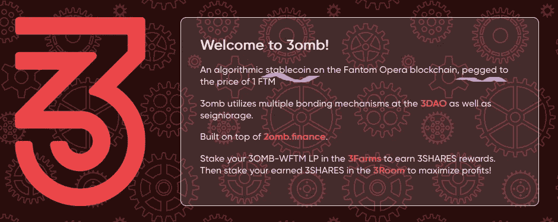
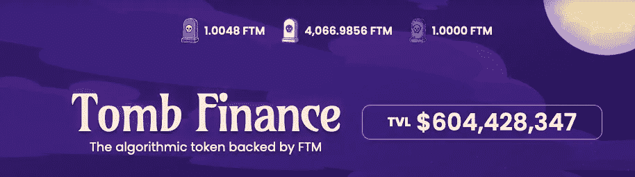

# DeFi 101:如何不成为狒狒

> 原文：<https://medium.com/coinmonks/defi-101-how-to-make-money-by-not-being-a-baboon-7763ab69746f?source=collection_archive---------5----------------------->

两周前，我全力以赴，将“找到的”钱投入高风险的坟墓。这是我学到的。

Image: PixTeller

> 非理性的乐观可以很伟大；这就是为什么只有大约 15%的人而不是 99%的人患有临床抑郁症

# 概述和更正

在我的[上一篇文章](/coinmonks/defi-conservative-goes-full-degen-ape-how-i-doubled-my-bag-in-a-week-b8efd9129df0)中，我违背了我自己的秘密投资哲学，把钱投在了[3mb](https://3omb.finance/)和 [Ripae](https://ripae.finance/) 上。如果你一直在观望，想知道所有的炒作是关于什么的，在你跳进这些高风险/高回报的池子之前，这可能是一个好的开始。

就修正而言，我在过程中的某个地方重复计算了令牌。我以为我已经从 425 [Fantom](https://coinmarketcap.com/currencies/fantom/) (FTM)到了 720 FTM，但实际上更接近 600 FTM。不坏，但不完全是我在文章中声称的“两倍”。

在我发表了这篇文章后，我从 Ripae 中撤出了我的利润，并让价值约 120 美元的 pae(股票)继续运行。我简单地将我的 3mb/WFTM 对移动到 20mb/FTM，但第二天就停止了。我想我很幸运。

一觉醒来，我发现 20mb 的流动性从 1.1 亿美元下降到了 8000 万美元左右，20mb 的挂钩汇率也下降到了 0.87 左右。在那之前，我对 2omb 的(看似)巨大的流动性池感到有些安全。

我想，如果出了什么问题，它会给我足够的时间退出。公平地说，这确实给了我一些反应时间。但是 3000 万美元的流动资金消失得比我想象的要快得多。

大概一个小时后看到了关于俄罗斯和乌克兰的新闻。到那时，20 兆和 30 兆挂钩已经完全崩溃。两者都在 0.35 到 0.5 之间(用 FTM 应该是 1:1)。在我平仓后，我的 600 多 FTM 现在在 520 左右。

还没睡:)

我是 Fantom 歌剧连锁店的 100%支持者。我认为它有巨大的增长潜力。在交易量大幅上升的情况下，它也相当吃紧。交易时间从几秒钟到几分钟，费用基本上翻了 10 倍。

Fantom 的美妙之处在于，我抱怨不得不为每笔交易支付 0.45 美元。这太荒谬了！我想，完全忘记了以太坊上所有耗时三小时、花费我 50 美元的交易。这让我想起了路易斯·C·K 的这个小喜剧

范顿绝对宠坏了我(或者说，宠坏了我的英国朋友)。我还可以看到，如果采用率开始上升，他们需要迅速扩大规模。

## 墓叉就像悬浮滑板上的回旋镖

只要还有人站在旁边扶着爷爷，他就稳定了。他们一松手，爷爷可能就需要一个新的髋关节了。这就是为什么我一看到 2omb 的麻烦就放弃了。它不稳定。

对我来说，卖点是 T2|3 是一个稳定的核心，也就是与范顿挂钩的 T2。我喜欢 Fantom。我想叠 Fantom。这似乎是一个有趣的方法，同时降低了[非永久性损失的风险。](/coinmonks/crypto-101-liquidity-pools-and-impermanent-loss-feb297ce5fba)

3omb 在他们的主页上写道:

Image: 3omb Finance

从简单的角度来看，如果一个令牌的钉住率下降了 50%以上，那么它既不稳定，也不钉住。创始人在他们的 AMA 中澄清了这一点。他们说债券/国库机制是为了*帮助*，但是挂钩需要[社区](https://www.twitch.tv/videos/1405911146)(00:14:50 声明)。

嗯……没有。

这些文件非常清楚地表明，股票会导致超额挂钩，债券会导致超额挂钩，而国债是抵御向下抛售压力(极度超额挂钩)的“第二道防线”。他们显然动用了财政部的资金进行 50 万美元的回购，但什么也没做。

市场放开了 2omb | 3omb 的爷爷，他摔了一跤。[墓](https://tomb.com/)全程钉住。他们也有一个亿万富翁的支持者，在 TVL 有 6 亿美元，还有一个庞大的国库。

## ***必要的修正***

> 不少人指出，Tomb.com 的确说过“盯住汇率”。他们 100%正确。虽然我向你保证这是一个懒惰的疏忽，但我不会责怪任何人认为我是故意煽动。按照协议，我买了(现在仍有)3 只债券。我希望这些协议成功。我认为所有人，包括“噩”墓，都需要致力于稳定机制以保持生存——TM

坟墓金融在他们的网站上更诚实。没有关于“钉子”或“稳定的硬币”的声明，只有这个:

Image: Tomb Finance

这是最公平的。简单的事实是，没有财政部的干预，债券机制就不起作用。句号。如果财政部没有足够的资金来维持联系汇率，它可能会在外部冲击的抛售压力下崩溃。

请记住，打破 T2 3 美元盯住汇率制度的外部冲击，是一个相对贫穷的国家入侵了一个真正贫穷的国家，而这两个国家过去基本上是同一个国家(苏联)。就整体地缘政治市场风险而言，市场似乎打了个小嗝，然后继续前行。

更广泛的加密市场似乎也在缓慢复苏，但在撰写本文时，2omb | 3omb 仍未触及 peg。2omb 在慢慢爬回来。3mb 的日子更不好过。从长远来看，当协议崩溃时，[铁银行](https://beincrypto.com/iron-finance-details-defi-bank-run-titan-token-collapse/)“稳定币”关闭了 50%。

Ripae 从来没有在 peg，但它总是在很远的地方。他们的股价大幅下跌，但他们发现了财政部代码中的一个漏洞，该漏洞会让黑客肆无忌惮地抽走资金。

哎呀。

## 墓叉外卖

与其喋喋不休，我会把我的发现/想法列成一个清单:

1.  **股价极易受到鲸鱼行动**的影响*。鲸鱼很容易启动水泵，把狒狒带过来。然后，当它们的锁过期时，它们就会转储。如果你认为这不是真的，只要看看 2Share 和 3Share pumps 期间 FTMscan 上的存款和取款就知道了。见鬼，看看图表，就很明显了。让狒狒吃蛋糕，米丽特？*
2.  债券是彻底的失败。兑换奖励不足以冒险无限期锁定代币。如果在钉住汇率制下，等待钉住汇率制回归比锁定债券要安全得多。如果挂钩不再回来，债券基金将一去不复返，但至少你可以(希望)减少损失。
3.  **低 TVL 使整个协议容易受到外部冲击和价格操纵**。5 亿美元以上的 TVL 只是极端价格波动的一个缓冲。足够大的冲击也会耗尽这个池子，除了*社区*(也许还有[亿万富翁风险投资](https://www.harryyeh.com/))之外，没有什么可以支撑它。只要记住我们正在谈论的*社区*是一群追逐 3000%年利率的狒狒(包括我自己)。
4.  协议过度依赖用户对协议的理解。这只是一个理论，但我的猜测是许多狒狒买了 20mb/30mb/pFTM，因为他们期待一个泵，没有认识到协议正在积极(试图)推动价格下降。狒狒很容易受惊，它们会很快逃跑。文月嫂？
5.  业余程序员正在野外部署未经测试的代码。创建这些分叉的“团队”(通常)甚至根本没有资格在现实环境中用真金白银部署这些合同。你很可能是在“投资”一个由两个孩子在拿掉他们的烟枪时因争吵而发起的协议。
6.  **我仍然对自动售货机的产品持怀疑态度。魔鬼金融、健壮金融、冷酷金融(最近[被黑](https://decrypt.co/88727/grim-finance-hacked-30-million-fantom-tokens))、液态驱动等等，这些都处于阿尔法/实验阶段。如果你不能告诉，我不认为坟墓分叉是可行的(无论如何没有重大的协议变化)。我看不出在此基础上增加显著的代码复杂性/风险是一个好主意，但是 YMMV。我不想让我的手指碰到那个洞。**
7.  尽管如此，我仍然在坟墓里。哈里·叶是个聪明人。我毫不怀疑他看到了他的新“伙伴”在 T2|3 发生了什么，并正在努力解决这个问题。时间会证明一切，但我认为结合机制的改变可能会带来稳定。与此同时，我仍然对我 95%的 APR 感到非常兴奋。我们相信哈利，对吗？

## 但是我想要我的 APR！

[**Terra**](https://www.terra.money/)**/**[**主播**](https://www.anchorprotocol.com/) **，**[**AAVE**](https://aave.com/)**，** [**星球财经，**](/coinmonks/defi-gems-planet-finance-7c6a81649cbe) [**曲线**](https://curve.fi/) **等**。成对、单个赌注、和/或借出稳定的硬币(*实际的*稳定的硬币)或单边(只有一方的赌注)，赚取 4–35%(+)并且快乐。仅供参考，这些是持有 xUSDx 或你喜欢的代币的惊人回报。

或者

**共识股份**。NEAR、Fantom、Polygon、Terra(以及许多其他公司)都提供了赌注池，其唯一的功能是验证交易。在技术熟练的网络工程师运行服务器的情况下，你可以轻松获得 8-15%的年利率。作为一项服务，它每天都在增长。轻松赚钱，风险很小(如果服务器停机或打印坏块)。

看在上帝的份上，拜托，糖放在上面，不要借钱投资其他东西。我可以绝对肯定地说，上周有一卡车人被清算了。象征性的价格下跌很糟糕，但清算是永恒的。另一方面，如果你玩对了牌，购买清算资产实际上是免费的。狒狒玩牌很糟糕。

当然，这些只是我 ***的意见*。**我不是财务顾问，这不是财务建议，而且总是 [DYOR](/coinmonks/crypto-investing-how-to-dyor-1e6dabdb1de9) 。遵循这些想法中的任何一个都可能会让你失去所有的钱。我对此 100%认真。我喜欢摆弄这些东西，但我现在公开表现得像个彻头彻尾的狒狒。相应投资。

直到下一次，安全，聪明，并确保[绑骆驼](https://www.oxfordreference.com/view/10.1093/acref/9780199539536.001.0001/acref-9780199539536-e-2318)。

> 加入 Coinmonks [电报频道](https://t.me/coincodecap)和 [Youtube 频道](https://www.youtube.com/c/coinmonks/videos)了解加密交易和投资

# 另外，阅读

*   [BigONE 交易所评论](/coinmonks/bigone-exchange-review-64705d85a1d4) | [电网交易机器人](https://coincodecap.com/grid-trading)
*   [氹欞侊贸易评论](https://coincodecap.com/anny-trade-review) | [CoinSpot 评论](https://coincodecap.com/coinspot-review)
*   [新加坡十大最佳加密交易所](https://coincodecap.com/crypto-exchange-in-singapore) | [购买 AXS](https://coincodecap.com/buy-axs-token)
*   [投资印度的最佳加密软件](https://coincodecap.com/best-crypto-to-invest-in-india-in-2021) | [WazirX P2P](https://coincodecap.com/wazirx-p2p)
*   [7 个最佳零费用加密交换平台](https://coincodecap.com/zero-fee-crypto-exchanges)
*   [最佳网上赌场](https://coincodecap.com/best-online-casinos) | [期货交易机器人](/coinmonks/futures-trading-bots-5a282ccee3f5)
*   [分散交易所](https://coincodecap.com/what-are-decentralized-exchanges) | [比特恩斯 FIP](https://coincodecap.com/bitbns-fip) | [宾邦评论](https://coincodecap.com/bingbon-review)
*   [用信用卡购买密码的 10 个最佳地点](https://coincodecap.com/buy-crypto-with-credit-card)
*   [加拿大最佳加密交易机器人](https://coincodecap.com/5-best-crypto-trading-bots-in-canada) | [Bybit vs 币安](https://coincodecap.com/bybit-binance-moonxbt)