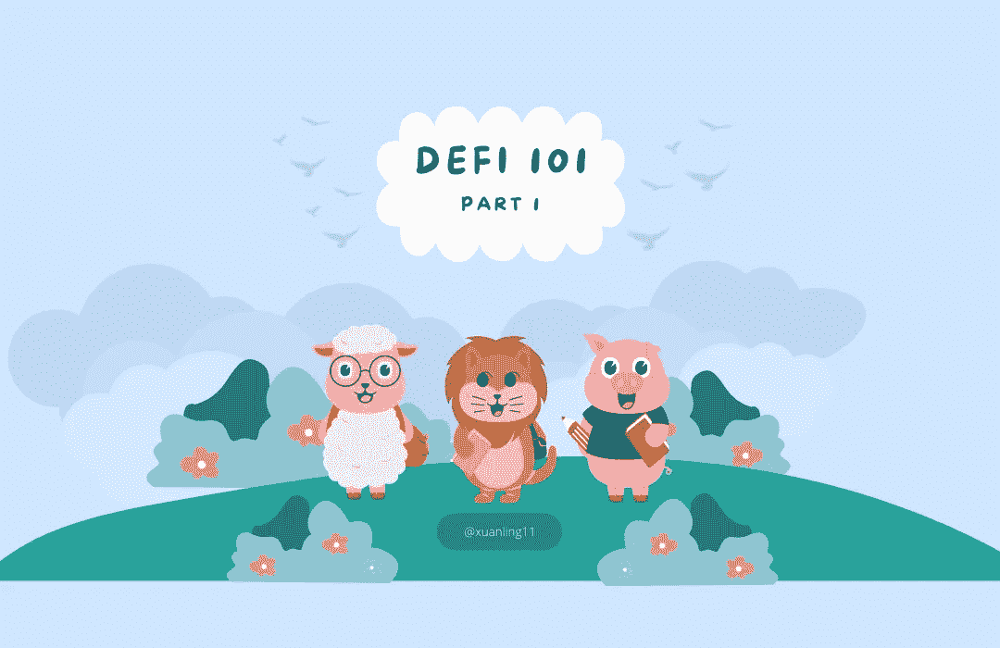

# Defi 101 —第 1 部分

> 原文：<https://medium.com/coinmonks/defi-101-part-1-2e9d183327eb?source=collection_archive---------46----------------------->

所以，你想学去货币化金融。问题是 Defi 非常混乱😲。

为什么？因为如果你不理解 TradFi(传统金融)或 Cefi(集中金融),你会满脑子想为什么 Defi 要这么做🤔。

好消息是我会在这里和你分享一些传统知识😏！