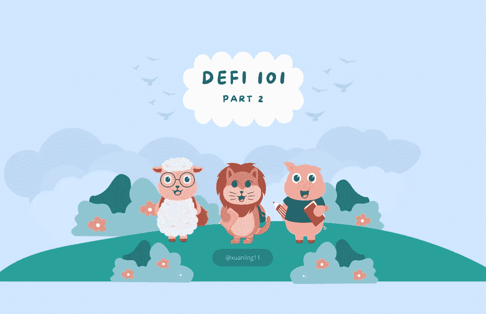

# Defi 101 —第 2 部分

> 原文：<https://medium.com/coinmonks/defi-101-part-2-b6dd296da93?source=collection_archive---------63----------------------->

在我以前的文章中，我提到过与传统金融相比，Defi 存在波动性问题。

你觉得传统金融(TradFi)稳定吗？🤫

答案是:大概不会！😱

让我告诉你为什么👉

**美联储交易时✊市场**

美联储有两项工作:控制通货膨胀和降低失业率。