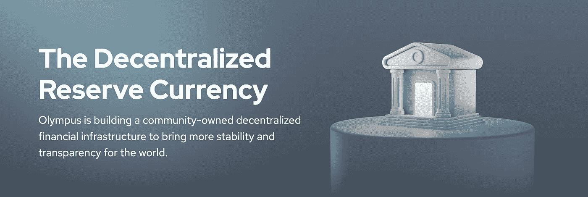

# DeFi 2.0:简介和 DeFi 1.0 问题

> 原文：<https://medium.com/coinmonks/defi-2-0-introduction-defi-1-0-issues-364891694acf?source=collection_archive---------8----------------------->

## DeFi 2.0 是区块链世界的一个发展趋势，旨在解决早期版本的问题，为项目创造长期可持续的流动性。让我们看看如何

在过去的几周里，一种新的趋势正在进入加密货币社区，特别是…