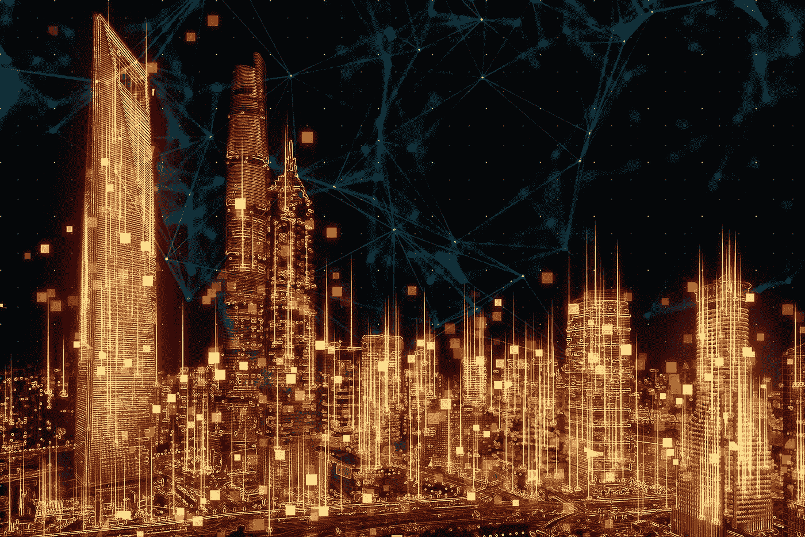

# DeFi 2.0 —真实资产

> 原文：<https://medium.com/coinmonks/defi-2-0-real-world-assets-b451b30ab675?source=collection_archive---------1----------------------->

securities.io

## 介绍

我们最近写了很多关于分散金融的文章。分散金融(DeFi)是区块链公共金融服务的总称。有了 DeFi，你可以做银行支持的大部分事情——赚取利息、借款、贷款、购买保险、交易衍生品、交易资产等等——但它更快，不需要文书工作或第三方。

最近，DeFi 领域出现了一项新的创新，它可以彻底改变传统的贷款/借款方式，并推动全球所有大小企业采用 DeFi。这项创新被称为真实世界资产。

## 真实世界资产(RWA)

RWA 允许 DeFi 协议获得稳定性并访问另一个资产类别。非加密相关资产的整合对整个行业都有重大影响。

DeFi 现在是一个 3000 多亿美元的行业，它将 RWA 视为下一个成倍扩大市场规模的机会。

释放数万亿美元真实世界资产的贷款潜力，使 DeFi 与银行和传统贷款机构展开直接竞争。

最重要的是，引入类似于传统金融部门的有形资产和动态(同时消除其限制)让规避风险的参与者安心，直到现在，他们一直在观察和等待更安全的投资渠道。

本质上，它将通过将发票、版税、房地产等资产连接到 DeFi 来释放现实世界资产的流动性，允许借款人在没有银行或其他中介的情况下为他们的现实世界资产融资。

## 认识 AAVE

Source: research.binance.com

Aave 是一种 DeFi 协议，允许人们借出和借入加密货币，而无需通过中央中介。当他们贷款时，他们赚取利息；当他们借钱时，他们支付利息。

Aave 碰巧也是迄今为止最大的 DeFi 协议，在 TVL 的销售额超过 270 亿美元(总价值锁定)。2021 年 12 月 28 日，Aave 增加了一个使用真实资产(RWA)的新市场。

附注:虽然 Aave 不是第一个在 DeFi 上引入 RWA 的公司，但由于其规模和影响力，它无疑是最突出的一家。

## 它是如何工作的？

Source: centrifuge.io

这些市场的主要特征是企业经营的令牌化，也可以理解为传统金融中的证券化。

建立在离心机上的 Tinlake 正是帮助企业做到这一点的平台。

Tinlake 池由有形资产支持，如发票、房地产、贷款和应收账款。在天湖为这些资产融资需要一个法律框架，为投资者提供对这些资产的法律主张。为了确保这种追索权，每个资产发起者建立一个传统金融系统中典型的法律实体——特殊目的载体，或 SPV。

单个资产抵押品被分配给该法人实体，以保证投资者对基础资产拥有合法权利，并且该资产与资产发起人分开持有，也称为破产远程。

Tinlake 每秒钟赚利息；像所有的 DeFi 协议一样，你每时每刻都在获得收益。

## 规模和机会

Tinlake 上目前有 11 个不同的 RWA 市场，范围从令牌化房地产、货物和运费发票到预付款。一旦代币化，投资者就可以购买这些代币，其行为类似于债券，并从其持有的债券中获得收益。根据市场的不同，这一收益率从 3%到 10%不等。天池的价格是以戴为单位的(1 戴等于 1 美元)。

Source: centrifuge.io

随着 DeFi 的不断扩张和采用，可以想象这些市场的价值会不断扩大和上升，也许有一天会达到数十亿美元。

这种安排对所涉及的企业是有益的，因为它使它们能够获得融资，否则这是不可能的或极其昂贵的。

## 资产池实例:资产发起人和资产类型

说你对房地产过桥贷款感兴趣。见下文

Source: centrifuge.io

这个资产池的资产类型、资产到期日、APY 和资产价值都可以在这里找到。资产到期表明你的投资的流动性，任何融资的到期日表明资产发起人需要偿还贷款的时间。在还款时，投资者总是可以选择在资产发起人利用他们的资金进行新的融资之前赎回他们的资金。资产到期可以被认为是一个“软锁定”期，在此期间你可以从你的储备金中提取现金。

## 摘要

根据第一太平戴维斯世界研究公司(Savills World Research)的数据，2016 年，全球所有房地产的价值估计为 217 万亿美元(六年内增长 334%)，投资该行业有各种好处。

考虑到对流动性、信任和透明度的明确需求，去中心化金融或许可以解决这一问题，因为它允许个人/公司在全世界范围内自由地、低成本地借贷，而无需利用寻租的中间人或传统金融的低效率。

这是一个全新的、更加公平的经济，没有国界，没有中间人，也没有政府控制的货币，允许任何人发起连锁信贷基金，创建抵押品支持的贷款池。

*免责声明:本文包含的信息仅用于教育目的，并不构成 Wheatstones 的任何形式的建议或推荐，用户在做出(或避免做出)任何投资决定时也不打算依赖这些信息。*

> 加入 Coinmonks [电报频道](https://t.me/coincodecap)和 [Youtube 频道](https://www.youtube.com/c/coinmonks/videos)了解加密交易和投资

## 另外，阅读

*   [交易杠杆代币的最佳交易所](https://blog.coincodecap.com/leveraged-token-exchanges) | [购买 Floki](https://blog.coincodecap.com/buy-floki-inu-token)
*   [3 commas vs . Pionex vs . crypto hopper](https://blog.coincodecap.com/3commas-vs-pionex-vs-cryptohopper)|[Bingbon Review](https://blog.coincodecap.com/bingbon-review)
*   [加密复制交易平台](/coinmonks/top-10-crypto-copy-trading-platforms-for-beginners-d0c37c7d698c) | [如何在 WazirX 上购买比特币](/coinmonks/buy-bitcoin-on-wazirx-2d12b7989af1)
*   [CoinLoan 点评](https://blog.coincodecap.com/coinloan-review)|[Crypto.com 点评](/coinmonks/crypto-com-review-f143dca1f74c) | [火币保证金交易](/coinmonks/huobi-margin-trading-b3b06cdc1519)
*   [最佳网上赌场](https://blog.coincodecap.com/best-online-casinos) | [币安评论](/coinmonks/binance-review-ee10d3bf3b6e) | [BitMEX 评论](https://blog.coincodecap.com/bitmex-review)
*   [麻雀交换评论](https://blog.coincodecap.com/sparrow-exchange-review) | [纳什交换评论](https://blog.coincodecap.com/nash-exchange-review)
*   [美国最佳加密交易机器人](https://blog.coincodecap.com/crypto-trading-bots-in-the-us) | [经常性评论](https://blog.coincodecap.com/changelly-review)
*   [在印度利用加密套利赚取被动收入](https://blog.coincodecap.com/crypto-arbitrage-in-india)
*   [Godex.io 审核](/coinmonks/godex-io-review-7366086519fb) | [邀请审核](/coinmonks/invity-review-70f3030c0502) | [BitForex 审核](https://blog.coincodecap.com/bitforex-review)
*   [最佳比特币保证金交易](/coinmonks/bitcoin-margin-trading-exchange-bcbfcbf7b8e3) | [萝莉点评](/coinmonks/lolli-review-e6ddc7895ad8) | [比特币保证金交易](https://blog.coincodecap.com/bityard-margin-trading)
*   [创造并出售你的第一个 NFT](https://blog.coincodecap.com/create-nft) | [密码交易机器人](https://blog.coincodecap.com/best-crypto-trading-bots)
*   [如何在 CoinDCX 上购买柴犬(SHIB)币？](https://blog.coincodecap.com/buy-shiba-coindcx)
*   [折叠 App 回顾](https://blog.coincodecap.com/fold-app-review) | [LocalBitcoins 回顾](/coinmonks/localbitcoins-review-6cc001c6ed56) | [Bybit vs 币安](https://blog.coincodecap.com/bybit-binance-moonxbt)