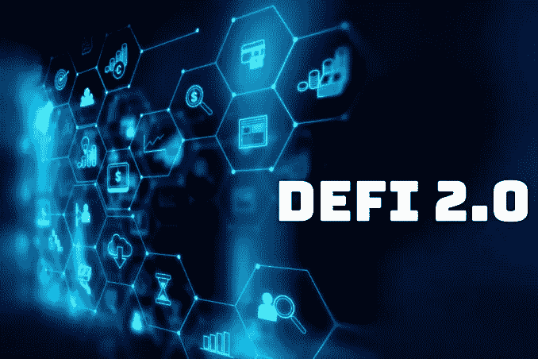
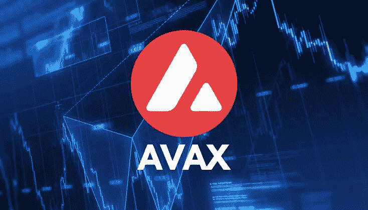

# DeFi 2.0？期待什么以及为什么它很重要。

> 原文：<https://medium.com/coinmonks/defi-2-0-what-to-expect-and-why-it-matters-d2d698d8739d?source=collection_archive---------41----------------------->

[**DeFi 2.0**](https://cointelegraph.com/defi-101/defi2-0-a-beginners-guide-to-the-second-generation-of-defi-protocols/amp) 简单来说就是对分权金融的交替一代的简短描述。本书探索了 DeFi 2.0 的所有相关内容及其在技术领域的适用性。

每一项倾向于技术的发明总是将世界从其原始阶段带入一个新的革命性阶段，因为这些发明总是有新模式和革命性共性的空间。分散金融(DeFi)也不例外，它是一项基于区块链的发明，因为世界以前一直在谈论 DeFi2.0，这是在 DeFi 产生后多次出现的下一代 DeFi 协议。

随着去中心化金融开始接近一个新的提升共性和重塑模型的时期，让我们彻底了解 DeFi2.0 是关于什么的。

## **DeFi 2.0 只是 DeFi 惯例的另一个时代的代名词:**

顾名思义， [**DeFi2.0**](https://cointelegraph.com/defi-101/defi2-0-a-beginners-guide-to-the-second-generation-of-defi-protocols/amp) 是分权财务协议的替代代。总的来说，正确理解分权金融将使理解新的解释变得容易得多。

[**DeFi**](https://en.m.wikipedia.org/w/index.php?title=Decentralized_finance&action=edit&section=1) 是一个生态系统，它庇护了所有去中心化的平台和系统，这些平台和系统旨在引入新的基于区块链的财政模式和有利可图的野蛮人，同时释放传统的财政系统。

分散运营和系统的分配取决于基于财政协议的成熟模型。这些协议发展的基础是，它们具有无许可的可组合性和开源开发文化，这种文化造成了对独占利益的苛求。

DeFi 在区块链空间中赢得了很高的重要性。自 2021 年以来，分散融资的放弃一直在快速增长，因为它给财政系统带来了优势。因此，它进入了一个新的分散金融时期，通常被称为 DeFi2.0，这是对现有 DeFi 模型的升级和革命性解释。

在 DeFi1.0 的限制中，该系统开始看到产量管理、流动性约束等方面的改进，因此成为一个先驱，开始对 DeFi 1.0 的另一种解释抱有许多期望。

## DeFi 2.0 重要的原因:

[**DeFi 2.0**](https://cointelegraph.com/defi-101/defi2-0-a-beginners-guide-to-the-second-generation-of-defi-protocols/amp) 的复制将世界带入了一个革命性的 DeFi 协议的新时代，teten 确实用早期的分散金融解决了这些限制。对 DeFi 的另一种解释提出了新的发明和结果，它只是为 DeFi 空间带来了进步，同时为消费者提供了新的激励机制，促使他们走向财政自由。

可扩展性问题和不友好的 stoner 界面一直是早期 DeFi 协议的主要挑战，因为最大的 DeFi 结果是在以太坊区块链上建立的。模型结构中的复杂性使得吸毒者，尤其是新手使用分散产品具有挑战性。

高额的天然气价格和执行交易的漫长等待时间一直是 DeFi 领域的主要挑战，这导致许多人对使用 DeFi 平台失去兴趣。尽管如此，DeFi2.0 将为解决以太坊的扩展问题提供必要的架构。

DeFi 领域面临的另一个值得注意的挑战是，与流动性问题相关的最大手段是静态的和未充分利用的。毫无疑问，由于流动性结果不佳，DeFi 协议的应用率较低。

虽然， [**自动做市商(AMM)**](https://www.cnbctv18.com/cryptocurrency/automated-market-maker-what-is-amm-and-what-is-its-role-in-defi-12037162.htm/amp) 允许独家获得运营资金。由于 AMM 的设计，该模型没有得到有效利用，这阻止了流动性的集中。与此同时，DeFi2.0 允许存放的手段被用于他们的全部可能性。因此，它为良好的现金流入让路，以有效地维持和支持系统。

当前 DeFi 协议的其他挑战，它的未来解释试图检查包括神谕和中心信息，集中化，安全问题，等等。

## DeFi 2.0 插图

一些新兴系统以前使用 DeFi2.0 工具包建立协议，因此为即将到来的分散财务阶段做准备。这些系统的一些范例包括

[**奥林巴斯道(欧姆)**](https://www.olympusdao.finance/) **:** 一种分散的储备货币模式，有债券、LP、跑马圈地等。

[**【AVAX】**](https://www.avax.network/)**:一个**敏捷、低成本的可编程智能合约平台，DeFi2.0 的去中心化操作可以建立在这个平台上。

[**无忧金融(YFI)**](https://yearn.finance/) **:区块链以太坊上的一家**收益率和借贷聚合商和保险提供商。

[**(CRV)**](https://curve.fi/):DeFi 协议的领军 TVL。风是道、交易所、LP、stablecoin 等等，其上竖立着产量养殖台凸。

## DeFi2.0 的优势

替代代的 DeFi 承诺了许多功能，使 DeFi 空间易于吸毒者放置。借助 DeFi2.0，吸毒者可以获得特定智能合同的保险，以减少与损害智能合同相关的陷阱。此外，DeFi2.0 确保吸毒者免受非永久性损失的威胁。最终，另一代分散融资也减少了与贷款流程相关的缺陷，并消除了贷款的未偿利息。

DeFi sphere 的其他独有优势包括降低与执行交易相关的成本。因此，勤劳与低气体运费和冰冷的销售过程。要么，DeFi2.0 承诺提供有效的流动性。需要流动性的协议可以有效地访问它们。

## DeFi 2.0 的缺陷及其预防:

尽管 DeFi2.0 承诺了许多优势，但该系统也容易暴露于某些陷阱。

本来是有投资威胁的。投资任何财政工具都是危险的，因此分散化的 DeFi2.0 操作也不会不受惩罚。同样，DeFi2.0 也可能使吸毒者面临投资陷阱，因为新时期的智能合约也可能存在一些漏洞。因此，建议投资者在冒险尝试之前，对任何设计进行猛烈的探索。

其次，还存在流动性威胁。重要的是要注意，与清算相关的陷阱可以减少，但不能完全最小化。尽管 DeFi2.0 保护吸毒者免受流动性陷阱(如非永久性损失)的影响，但潜在的流动性矿工仍可能遭受一些财务损失。因此，打算挖掘流动性的人如果装备精良，情况会更好。

您可能感兴趣的其他文章:

 [## 2022 年十大 DeFi 和 DeFi 2.0 令牌和项目

### 随着金融世界变得越来越数字化，这些是 2022 年的顶级 DeFi 令牌。

medium.com](/bityard/top-10-defi-defi-2-0-tokens-and-projects-in-2022-e752929fed78)  [## 2022 年更好的赌注是什么:DeFi，NFTs 还是元宇宙？

### 2022 年 1 月 27 日:在 2022 年的剩余时间里，你可以在多个领域进行投资…

medium.com](/@BitYard/whats-the-better-bet-for-2022-defi-nfts-or-the-metaverse-4b78d797a5e) 

比特码交换:[**BitYard.com**](https://www.bityard.com/account/register?ru=AebNkR&f=Medium)

客户支持:[**Support @ bityard . exchange**](https://support.bityard.com/hc/en-us/articles/900007640623-How-to-find-customer-service-support-)

业务请求:levi@bityard.exchange

**比特码电报社区**

BitYard 新闻和事件—[https://t.me/BITYARDNEWS](https://t.me/BITYARDNEWS)

英语—[https://t.me/BityardEnglish](https://t.me/BityardEnglish)

越南语—[https://t.me/BitYardVietNamChat](https://t.me/BitYardVietNamChat)

印度尼西亚语—[https://t.me/bityardindonesia](https://t.me/bityardindonesia)

https://t.me/BityardPhilippines

**BitYard 官方社交媒体**

YouTube—[https://www.youtube.com/c/BityardOfficial/](https://www.youtube.com/c/BityardOfficial/)

https://www.facebook.com/Bityardofficial 脸书

推特—[https://twitter.com/Bityard_Global](https://twitter.com/BitYard_Global)

中等—[https://medium.com/bityard](https://medium.com/bityard)

**平台堆场入驻**

coin codex—[https://coincodex.com/exchange/bityard](https://coincodex.com/exchange/bityard)

辣椒粉—[https://coinpaprika.com/exchanges/bityard/](https://coinpaprika.com/exchanges/bityard/)

神秘冒险—[https://cryptoadventure.com/discover/exchanges](https://cryptoadventure.com/discover/exchanges)

> 加入 Coinmonks [电报频道](https://t.me/coincodecap)和 [Youtube 频道](https://www.youtube.com/c/coinmonks/videos)了解加密交易和投资

# 另外，阅读

*   [比特币基地僵尸程序](/coinmonks/coinbase-bots-ac6359e897f3) | [AscendEX 审查](/coinmonks/ascendex-review-53e829cf75fa) | [OKEx 交易僵尸程序](/coinmonks/okex-trading-bots-234920f61e60)
*   [如何在印度购买比特币？](/coinmonks/buy-bitcoin-in-india-feb50ddfef94) | [瓦济克斯评论](/coinmonks/wazirx-review-5c811b074f5b)
*   [隐翅虫替代品](/coinmonks/cryptohopper-alternatives-d67287b16d27) | [HitBTC 审查](/coinmonks/hitbtc-review-c5143c5d53c2)
*   [CBET 评论](https://coincodecap.com/cbet-casino-review) | [库科恩 vs 比特币基地](https://coincodecap.com/kucoin-vs-coinbase)
*   [Fold App 审核](https://coincodecap.com/fold-app-review) | [Kucoin 交易机器人](/coinmonks/kucoin-trading-bot-automate-your-trades-8cf0ca2138e0) | [Probit 审核](https://coincodecap.com/probit-review)
*   [如何匿名购买比特币](https://coincodecap.com/buy-bitcoin-anonymously) | [比特币现金钱包](https://coincodecap.com/bitcoin-cash-wallets)
*   [币安 vs FTX](https://coincodecap.com/binance-vs-ftx) | [最佳(SOL)索拉纳钱包](https://coincodecap.com/solana-wallets)
*   [比诺莫评论](https://coincodecap.com/binomo-review) | [斯多葛派 vs 3Commas vs TradeSanta](https://coincodecap.com/stoic-vs-3commas-vs-tradesanta)