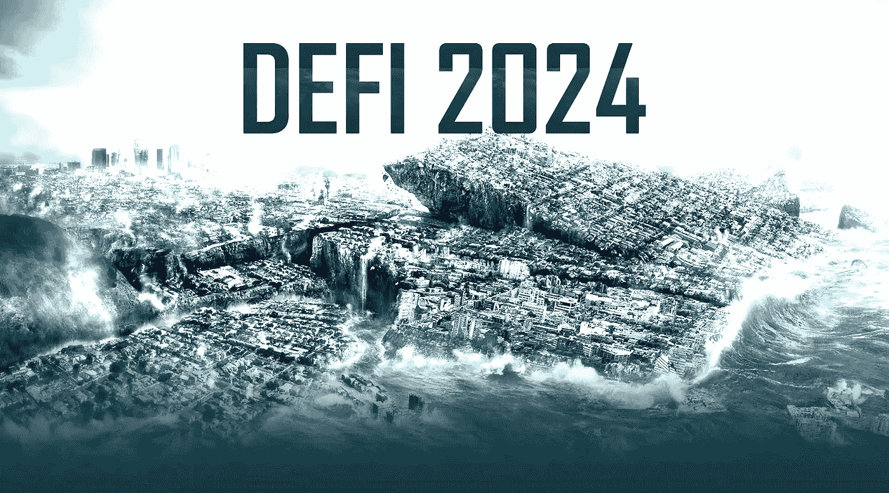

# 一场万亿美元的海啸即将淹没市场

> 原文：<https://medium.com/coinmonks/defi-a-trillion-dollar-tsunami-about-to-flood-the-markets-d71e08f1ed94?source=collection_archive---------6----------------------->

几年前，当我第一次听说 Defi 时，我承认很难想象，在一个由强大的公共或私人金融机构控制的世界里，这样的创新如何存在。

对于大多数人来说，Defi 仍然是一个相当陌生的术语，包括许多“传统”金融市场的专家，尤其是那些无法认识到区块链技术有多么具有颠覆性的人。因此，让我们深入研究一下这个时代最有前途的金融工具。

简而言之，去中心化金融(更广为人知的名称是 Defi)是一套通过应用程序提供的金融服务，不依赖于中央实体来控制它。

让我们思考一下，银行如何将提供传统金融系统基础的中央实体与基于 Defi 协议的应用程序区分开来。

银行提供一系列金融服务，如贷款、储蓄、股票投资、基金管理等。对于这些服务中的每一项，银行充当任何交易的中介。我们如此习惯于这种模式，以至于有一个实体控制我们的所有步骤似乎是很自然的，其借口是通过最好的投资为我们提供安全、舒适和谁知道的良好收入，而我们根本不用担心任何事情。

随着区块链技术的出现和加密货币市场的兴起，银行现在面临着来自 Defi 的竞争。通过 Defi，现在可以以分散的方式获得银行或保险公司等金融机构提供的所有商品和服务。软件，当然还有代码，是借贷双方之间唯一的中介。一切都围绕着智能合约。

# 什么是智能合约，它们是如何工作的？

每当我们需要借一些钱的时候，我们通常去银行问客户经理贷款。假设金额不是很高，并且你是一个值得信赖的客户。在这种情况下，可能已经有银行预先批准的信用额度，允许您通过银行应用程序自动完成所有事情。

这之所以可能，是因为当你开立银行账户时，你签署了一份合同，通常是用小字书写的，双方——你和银行——承诺履行合同中包含的协议。除了最初的合同之外，还必须签订新的合同，例如购买房产的贷款。

许多无法获得银行服务的人在需要钱的时候求助于朋友、家人和高利贷者，尽管后者是最不可取的。在这种情况下，签署的合同是口头的，对士气的惩罚可能比高昂的银行费用更具破坏性。

与上面介绍的情况不同，智能合同消除了对文档的需要、中介的存在以及双方之间的信任。你通过一个分散的平台直接交互，所有必要的关系都写在软件代码中。该守则包含所有必要的合同信息，允许任何人在双方互不了解的情况下进行交易。智能合约是 Defi 的支柱。

在一个由智能合约管理的去中心化平台上，可以交易加密货币、借出“钱”和申请贷款、交易数据、交易艺术品(数字或其他)、获得房地产融资等。这种可能性似乎是无限的，并且在最近几年呈指数增长。

# Defi 海啸

2017 年 2 月，当分散化投资平台诞生时，该领域的投资总额不超过“微不足道”的 5000 万美元，如下图所示。

Coingecko — Defi Market Cap

从 2020 年起，Defi 获得了机构和商界人士的认可和关注。一场真正的海啸淹没了 Dapps，市场被数十亿美元灌溉。来自 Coingecko 的数据表明，目前的 Defi 市场资本总额约为 1300 亿美元，这意味着在短短五年多的时间里，其增长率达到了惊人的 259，900%。

今天，越来越多的玩家正在使用 Defi 平台来分散投资，并在远未达到顶峰的浪潮中前进。这仍然是一个处于初级阶段的市场。在未来几年，数万亿美元将进一步提高这一未开发海洋的潮汐。涨潮还在后头。

# 挑战和机遇

尽管对该行业的期望很高，但对于新手，甚至是尚未涉足 Defi 汹涌大海的经验丰富的金融专业人士来说，一头扎进未知的水域可能风险太大。

在最近的一份报告中，咨询公司 Immunefi 指出，仅在 2021 年，Defi 协议的损失就超过 100 亿美元。最常见的原因是代码缺陷、诈骗和其他恶意活动。为了规避这些问题，你必须提防奇迹般的承诺，并且只依靠由专门检测欺诈的公司审计和认证的计划。

真正的 Defi 计划由 Dao——分散的自治组织管理，而其他计划只是名义上的 Defi。Dao 通过智能合约执行。与公司治理机构不同，董事会决定实体的步骤，系统用户以透明和民主的方式通过令牌投票。

名义上的赤字是一种中央机构控制治理和资金的情况。这也不例外。一旦一个实体拥有如此强大的控制权，就像传统银行一样，它可以确保以牺牲社区为代价来维护自己的利益。因此，治理系统必须同样分散和可核查。

缺乏监管是困扰 Defi 项目的另一个“问题”。但是为了满足管理标准，分散化的前提将失去其本质，因为 Defi 应用将需要符合集中实体的规则。如果社区(治理令牌持有者)投票反对监管者的利益，智能合同应该如何解决问题？乍一看，面对这种情况没有简单的答案。

我可以用一整篇文章甚至一本书来探讨 Defi 的风险，但这仍然不够:流动性损失、价格下滑、非永久性损失、集中化、安全性和可用性只是其中的一部分。同样真实的是，这些风险中有许多存在于传统金融中，这不应成为是否投资于这个新兴市场的决定因素，而恰恰相反。

芝加哥学派(Chicago School)杰出的创始经济学家弗兰克·奈特(Frank Knight)教授过不少于三位诺贝尔奖得主，他过去认为，传统方法的挑战者是企业家精神的驱动者和抓住盈利机会的人。

谁不想免除支付给传统金融体系中无数中介机构的费用和佣金呢？还是对自己的财务生活行使更多的控制权，避免中央集权机构的过度监管，同时有可能投资于将彻底改变当前经济和社会模式的新兴市场？

在接下来的几个星期里，我将更深地潜入迪菲未知海洋的黑暗水域，因为我期待着前方的海啸。我邀请你和我一起去。

## *[***推特:@GandaraMarcio***](https://twitter.com/GandaraMarcio)*

> *加入 Coinmonks [电报频道](https://t.me/coincodecap)和 [Youtube 频道](https://www.youtube.com/c/coinmonks/videos)了解加密交易和投资*

## *也阅读*

* [## 杠杆代币[多头代币]终极指南

### 杠杆化令牌是具有杠杆化风险敞口的 ERC20 令牌，不考虑保证金、要求、管理…

medium.com](/coinmonks/leveraged-token-3f5257808b22)  [## 最佳加密交易所| 2021 年十大加密货币交易所

### 编辑描述

blog.coincodecap.com](https://blog.coincodecap.com/crypto-exchange)  [## 2022 年最佳加密交换平台| CoinCodeCap

### 如果我们看看今天的场景，许多加密货币交换平台提供了广泛的功能和深度…

blog.coincodecap.com](https://blog.coincodecap.com/best-swap-platforms)  [## 10 大最佳在线赌场|赢得并赢取免费 BTC 2022 | CoinCodeCap

### 编辑描述

blog.coincodecap.com](https://blog.coincodecap.com/best-online-casinos)  [## 2021 年最佳加密借贷平台| 6 大比特币借贷平台

### 获得比特币和其他加密货币的最佳贷款利率

medium.com](/coinmonks/top-5-crypto-lending-platforms-in-2020-that-you-need-to-know-a1b675cec3fa)  [## 2021 年 6 大最佳硬件钱包|顶级加密硬件钱包[更新]

### 最好的加密货币硬件钱包是绝对必要的。我们将在 NGRAVE、Ledger Nano X 和…

medium.com](/coinmonks/the-best-cryptocurrency-hardware-wallets-of-2020-e28b1c124069)  [## 2021 年最佳免费加密交易机器人

### 2021 年币安、比特币基地、库币和其他密码交易所的最佳密码交易机器人。四进制，位间隙…

medium.com](/coinmonks/crypto-trading-bot-c2ffce8acb2a)*