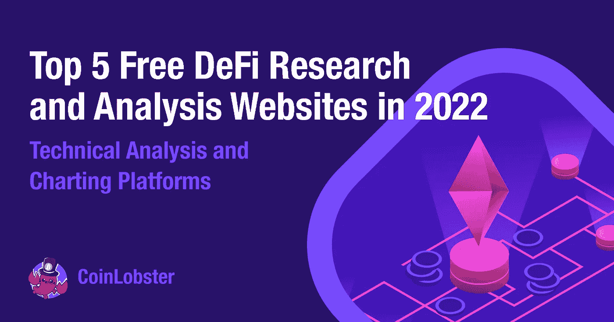
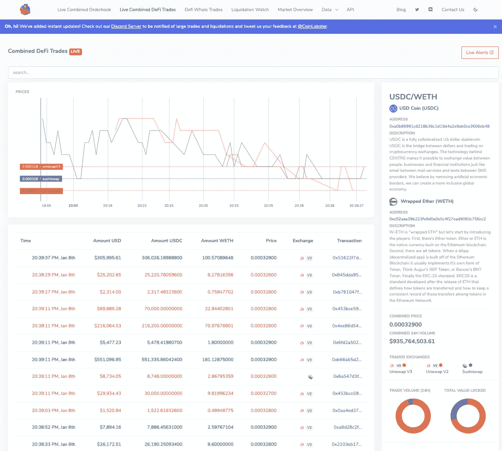
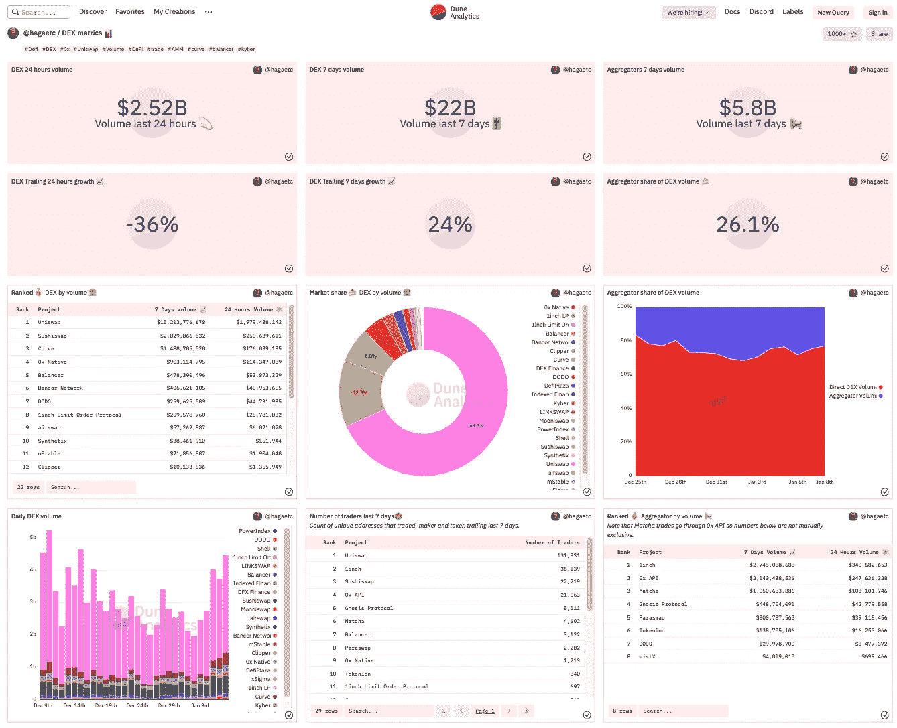
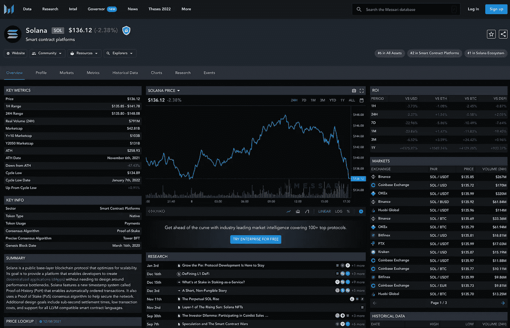
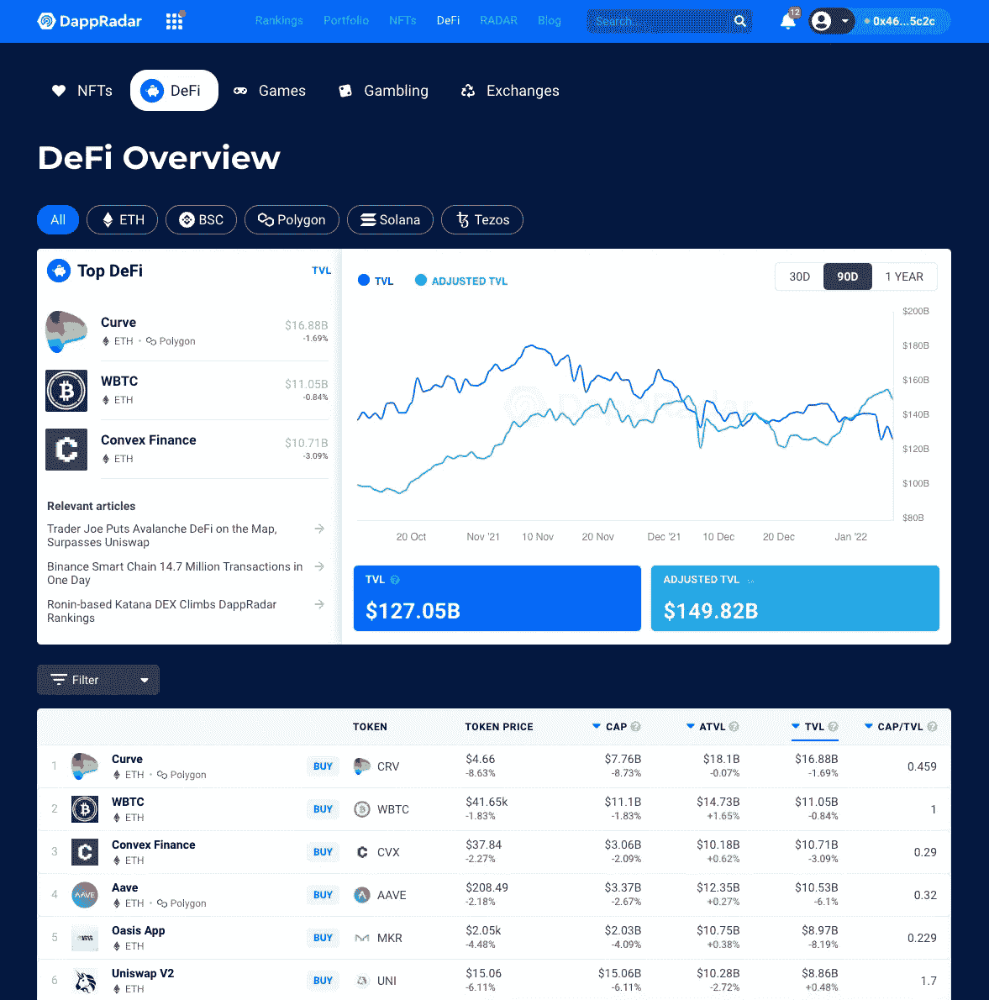
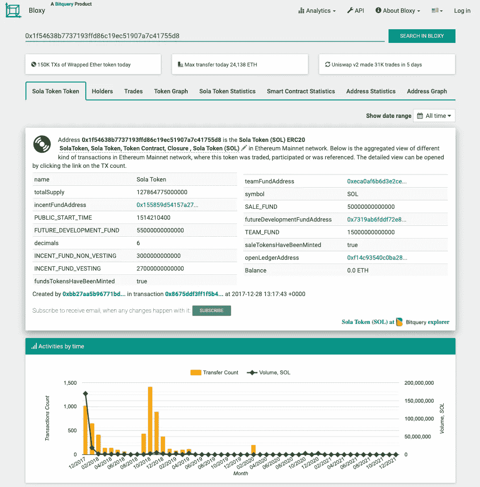

# DeFi Analytics——2022 年五大免费分散式金融网站

> 原文：<https://medium.com/coinmonks/defi-analytics-top-5-free-decentralized-finance-websites-for-crypto-research-in-2022-a422589c8650?source=collection_archive---------2----------------------->

**DeFi (D** [**去中心化金融**](https://www.coindesk.com/learn/what-is-defi/) **)** 是一组建立在区块链上的金融工具的术语。这个想法是允许任何人通过互联网进行借贷和银行业务，而不需要通过中间人。DeFi 是区块链和分散网络空间中发展最快的领域之一。

你需要知道可以帮助你利用这种趋势的工具。DeFi 工具提供了各种不同的用例，包括 DeFi 分析、交易工具、筛选工具、跟踪工具、洞察、流动性分析、投资组合跟踪、统计等等。

这里有几个顶级的免费 DeFi 网站，它们将成为你研究和学习 DeFi 的重要资源。

# **最佳免费 DeFi 研究网站**

1.  
2.  **[**沙丘分析**](https://dune.xyz/home)**
3.  **[T21 梅萨里](https://messari.io/screener/defi-coins)**
4.  **[**达普拉达**](https://dappradar.com/)**
5.  **[**Bloxy**](https://bloxy.info/)**(by**[**bit query**](https://explorer.bitquery.io/)**)****

# ****1。硬币龙虾****

**[CoinLobster](http://www.coinlobster.com/) 为临时交易者提供简单、干净、易用的实时综合 DeFi 市场数据。**

**他们只需在搜索栏中输入对，就可以提供有关 DeFi 区块链交易、地址和货币、交易量和总价值的实时分析数据。**

****优点:****

*   **完全自由**
*   **来自多个 DeFi 交换的组合数据全部在一页上**
*   **低延迟；实时查看 exchange 活动**

****缺点:****

*   **没有高级图表功能**

****还可以加入** [**CoinLobster 的不和谐频道**](https://discord.gg/y68Yaj7hWD) **查看迪菲鲸交易等免费提醒。****

****

# ****2。** **沙丘分析****

**[Dune Analytics](https://duneanalytics.com/?ref=hackernoon.com) 是一家区块链数据分析公司，为在线数据分析提供全球实时平台。这包括图表，图解，表格，一个你可以可视化数据的地方。**

**用户可以查找特定的交易或跟踪某个地址，或者选择一个时间范围，调出某个类型的所有事件、某个类型的交易发生的所有块，甚至查找 ERC20 转账。**

****优点:****

*   **用户可以创建自定义查询和模板来可视化区块链中的数据**
*   **只有以太坊、Matic、乐观和 xDai 的数据是免费的**

****缺点:****

*   **这个网站很难浏览**
*   **用户一次只能免费运行 3 个查询**

****

# ****3。** **梅萨里****

**Messari 是一个加密数据聚合器，面向希望通过数据分析更深入地了解市场的高级交易者。**

**Messari 最有用的功能，如筛选、研究和过滤工具，涵盖 100 多个指标和分类，每月收费 24.99 美元。**

****优点:****

*   **高级数据图表和分析**
*   **所有硬币的不同指标**

****缺点:****

*   **乍一看很难使用**
*   **免费用户的有限功能**

****

# ****4。** **达普拉达****

**DappRadar 被称为世界上的 dApp 商店，拥有超过 3000 个 dApp 的见解。通过该平台，可以搜索、跟踪和交易 DeFi、NFTs 和基于加密的游戏应用领域中的所有内容。**

**[行业脉搏](https://dappradar.com/industry-overview)页面提供全面的 dApp 行业概述，每 24 小时更新一次，以了解市场上通过 DappRadar 提供的智能合约、功能性 dApp 和协议的数量。**

****优点:****

*   **查看您最喜欢的 DeFi 协议的排名**
*   **擅长在 DeFi 中把握宏观趋势**
*   **完全自由**

****缺点:****

*   **交易数据量有限**

****

# ****5。** **Bloxy****

**[Bloxy](https://bloxy.info/) 报告区块链实时数据和详细的令牌统计数据。**

****优点:****

*   **显示区块链交易的有用数据**
*   **对密码研究有价值的信息**

****缺点:****

*   **视觉分析的图形和图表质量差**
*   **缓慢更新**
*   **高级 API 是付费订阅**

****

**每个加密货币投资者都有不同的策略和不同的投资组合，这是决定使用正确的 DeFi 网站时最重要的两个方面。**

**关注市场的快速变化非常重要，这就是为什么大多数经验丰富的加密货币投资者需要拥有强大的 DeFi 研究工具来提供对其资产的实时洞察。**

> **加入 Coinmonks [电报频道](https://t.me/coincodecap)和 [Youtube 频道](https://www.youtube.com/c/coinmonks/videos)了解加密交易和投资**

## **另外，阅读**

*   **[3 商业评论](/coinmonks/3commas-review-an-excellent-crypto-trading-bot-2020-1313a58bec92) | [Pionex 评论](https://blog.coincodecap.com/pionex-review-exchange-with-crypto-trading-bot) | [Coinrule 评论](/coinmonks/coinrule-review-2021-a-beginner-friendly-crypto-trading-bot-daf0504848ba)**
*   **[莱杰 vs n rave](/coinmonks/ledger-vs-ngrave-zero-7e40f0c1d694)|[莱杰 nano s vs x](/coinmonks/ledger-nano-s-vs-x-battery-hardware-price-storage-59a6663fe3b0) | [币安评论](/coinmonks/binance-review-ee10d3bf3b6e)**
*   **[Bybit Exchange 审查](/coinmonks/bybit-exchange-review-dbd570019b71) | [Bityard 审查](https://blog.coincodecap.com/bityard-reivew)**
*   **[3 commas vs crypto hopper](/coinmonks/3commas-vs-pionex-vs-cryptohopper-best-crypto-bot-6a98d2baa203)|[赚取加密利息](/coinmonks/earn-crypto-interest-b10b810fdda3)**
*   **最好的比特币[硬件钱包](/coinmonks/hardware-wallets-dfa1211730c6) | [BitBox02 回顾](/coinmonks/bitbox02-review-your-swiss-bitcoin-hardware-wallet-c36c88fff29)**
*   **[BlockFi vs 摄氏度](/coinmonks/blockfi-vs-celsius-vs-hodlnaut-8a1cc8c26630) | [Hodlnaut 审核](/coinmonks/hodlnaut-review-best-way-to-hodl-is-to-earn-interest-on-your-bitcoin-6658a8c19edf) | [KuCoin 审核](https://blog.coincodecap.com/kucoin-review)**
*   **[Bitsgap 评审](/coinmonks/bitsgap-review-a-crypto-trading-bot-that-makes-easy-money-a5d88a336df2) | [Quadency 评审](/coinmonks/quadency-review-a-crypto-trading-automation-platform-3068eaa374e1) | [Bitbns 评审](/coinmonks/bitbns-review-38256a07e161)**
*   **[加密复制交易平台](/coinmonks/top-10-crypto-copy-trading-platforms-for-beginners-d0c37c7d698c) | [Coinmama 审核](/coinmonks/coinmama-review-ace5641bde6e)**
*   **[印度的加密交易所](/coinmonks/bitcoin-exchange-in-india-7f1fe79715c9) | [比特币储蓄账户](/coinmonks/bitcoin-savings-account-e65b13f92451)**
*   **[OKEx vs KuCoin](https://blog.coincodecap.com/okex-kucoin) | [摄氏替代品](https://blog.coincodecap.com/celsius-alternatives) | [如何购买 VeChain](https://blog.coincodecap.com/buy-vechain)**
*   **[币安期货交易](https://blog.coincodecap.com/binance-futures-trading)|[3 comas vs Mudrex vs eToro](https://blog.coincodecap.com/mudrex-3commas-etoro)**
*   **[如何购买 Monero](https://blog.coincodecap.com/buy-monero) | [IDEX 评论](https://blog.coincodecap.com/idex-review) | [BitKan 交易机器人](https://blog.coincodecap.com/bitkan-trading-bot)**
*   **[CoinDCX 评论](/coinmonks/coindcx-review-8444db3621a2) | [加密保证金交易交易所](https://blog.coincodecap.com/crypto-margin-trading-exchanges)**
*   **[比诺莫评论](https://blog.coincodecap.com/binomo-review) | [斯多葛派 vs 3Commas vs TradeSanta](https://blog.coincodecap.com/stoic-vs-3commas-vs-tradesanta)**
*   **[Capital.com 评论](https://blog.coincodecap.com/capital-com-review) | [香港的加密借贷平台](https://blog.coincodecap.com/crypto-lending-hong-kong)**
*   **如何在 Uniswap 上交换加密？ | [A-Ads 审查](https://blog.coincodecap.com/a-ads-review)**
*   **[WazirX vs coin dcx vs bit bns](/coinmonks/wazirx-vs-coindcx-vs-bitbns-149f4f19a2f1)|[block fi vs coin loan vs Nexo](/coinmonks/blockfi-vs-coinloan-vs-nexo-cb624635230d)**