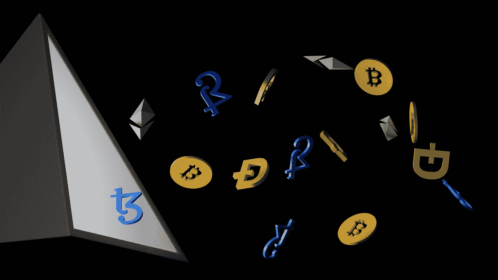

# DeFi 和稳定硬币

> 原文：<https://medium.com/coinmonks/defi-and-stable-coins-2c74ce901425?source=collection_archive---------26----------------------->

**简介**

我们大多数人都记得 2008 年，2007 年美国房地产泡沫引发的大危机，一年后蔓延到世界各地，导致世界第四大投资银行雷曼兄弟陷入 6130 亿美元的债务，美联储以廉价的流动性进行干预，这种流动性导致了通货膨胀。在那些年里，还发生了一件事，尽管没有被考虑在内。绰号“中本聪”的人发表了一份白皮书。在这份白皮书中，中本聪指出，这场金融危机是由世界各地提供流动性的政府和分配这些流动性的银行造成的。中本聪在白皮书中详细解释的加密货币旨在通过使用比特币和用 P2P(点对点)方法进行交易，使无能的政府和贪婪的银行脱钩。比特币和区块链技术是当天出现的这场革命的最初火花，它们揭示了 DeFi，即去中心化的金融，这也是本文与稳定的硬币的主题。

Photo by [Shubham Dhage](https://unsplash.com/@theshubhamdhage?utm_source=medium&utm_medium=referral) on [Unsplash](https://unsplash.com?utm_source=medium&utm_medium=referral)

**什么是 DeFi？**

2008 年危机的主要行为者是银行和无法控制银行的国家，美国金融市场的债务泡沫导致住房债券市场崩溃，压垮了所有人，特别是金字塔底层的人。由于这场债务泡沫，人们失去了工作、家园。美国的中央银行，以危机的原因，也就是以不可控制的货币扩张(债务泡沫)来干预危机，试图通过点一把火来控制火势，危机蔓延到全球。那一天，人们明白了，只要这个体系还在主要参与者的手中，这些危机就会持续下去。这些痛苦的经历揭示了分散金融。分散金融希望分散货币系统，并通过区块链技术将其转移到分散系统。它希望将控制权交给软件和它们控制的智能合约，而不是个人或政府。分散金融目前建立在四项我们可以定义为革命的技术之上，即人工智能、智能合约、分布式账本技术和区块链。

**人工智能在 DeFi 中的作用**

由于人工智能技术算法中的深度学习能力，金融系统中可能发生的问题和危机将能够在发生之前预测出来。在 2008 年危机之前，一些金融天才在危机到来之前就注意到了危机，他们只需检查抵押贷款债券类型以及抵押贷款债务的支付条款，就可以据此建立空头头寸。由于人工智能算法，DeFi 将支持它将建立的系统，并将能够事先检测风险和危机并采取行动。当这些天才在 2008 年警告系统管理员时，大门对他们关上了，因为这些债券从第一天起才开始盈利，管理员为了情绪或其他任何原因将系统牺牲给了上涨、胜利的市场。今天正在发生同样的情况，新冠肺炎危机后发生的货币扩张导致世界通货膨胀，但其他国家的中央银行行长，包括美国中央银行行长鲍威尔，照常牺牲系统，以便不扰乱每天打破记录的股票市场的趋势及其造成的债务泡沫。他们正把整个世界拖入一个将持续数年的通胀环境。算法不会像现在这样用情绪来管理系统，而是像现实中应该的那样用分析和数字来管理。

Photo by [Robb Miller](https://unsplash.com/@robbmiller?utm_source=medium&utm_medium=referral) on [Unsplash](https://unsplash.com?utm_source=medium&utm_medium=referral)

**区块链和分布式账本技术在 DeFi 中的作用**

如果我们简单明了地解释一下分布式账本技术，我们可以说它是共享和同步的分散数据库。金融市场现在最害怕的是数据控制者在不被黑客攻击的情况下操纵保存在中央数据库中的数据。2008 年，中本聪在他的比特币白皮书中介绍了区块链技术，该技术具有分布式账本提供的去中心化、节点间同步和共识特征。今天，DeFi 为我们提供了管理具有节点的分散系统的能力，以及通过这些节点的同步形成的共识的安全性。不可能从外部或内部操纵系统，因为分散化和同步化阻止了这一点。

**智能合同技术在 DeFi 中的作用**

智能合约是一种算法，最初由 Nick Szabo 提出，然后区块链技术提供的安全性被理解，价值在区块链基础设施上重新构建。智能合同是一个过程，在这个过程中，合同双方的相互需求由一个算法来管理。DeFi 中的智能合约为系统用户提供了安全性和透明性。因为在 Vitalik Buterin 宣布以太坊之后，智能合约建立在区块链的基础设施之上。Buterin 采用了区块链系统的安全性、智能合约的速度和透明度，为人类提供了一个安全、分散和透明的金融系统，DeFi 承诺在智能合约管理的系统中实现透明、安全、速度和分散。

Photo by [Shubham Dhage](https://unsplash.com/@theshubhamdhage?utm_source=medium&utm_medium=referral) on [Unsplash](https://unsplash.com?utm_source=medium&utm_medium=referral)

**金融民主化**

DeFi 的热情是一个分散的和民主管理的系统，它的愿景，因为 DeFi 的第一次出现。由于区块链和分布式分类帐技术，系统的用户将创建节点，并且由于共识机会，这些节点将民主地管理系统。这种民主从一开始就使 DeFi 脱颖而出，因为该系统的用户，我们人类，利用每一个机会操纵这一过程，由于他们的贪婪从我们这里窃取，并使该系统陷入危机，在所有这些事件之后，中央银行保持沉默，并在后来发生的危机中保持沉默。我们厌倦了只帮助那些引发危机的人。一个由软件管理的民主制度，在其中他们有权治理，给人们带来希望。然而，这种由权力下放带来的民主也有一些消极的方面，因为在危机时期，通过权力夺取多数或无法形成多数会将系统拖入无法摆脱的混乱。

**稳定币**

稳定币的出现是在加密货币的市场量增加，转为投资市场之后。随着对加密货币需求和希望的增加，人们传统的投资观念彻底改变，开始投资加密货币。在这种需求下，他将密码市场转变为一个在一段时间内拥有万亿美元交易量的市场。这一数量导致了市场的波动，因为投资所在的市场，特别是加密货币这样的新市场，不可避免地会对每一条消息做出反应，波动就会发生。这种情况扰乱了这些硬币的最初目的，因为除了交易，没有人愿意使用一个月内变化 50%的货币，但这些硬币中的一些用于智能合约，一些用于国际货币转移网络，一些用于当前法定货币中的通货膨胀。出去维持购买力。在这些问题之后，稳定的硬币被引入。这些与低波动性工具或法定货币挂钩的硬币为用户提供了使用智能合约或其他领域的机会。那些愿意的人可以用与美元挂钩的加密货币快速执行智能合约交易，或者用与黄金挂钩的硬币保护他们的购买力免受通胀影响。稳定币真正发光的地方将是 DeFi，这是本文的主要话题，因为 DeFi 承诺在未来接管世界金融体系，并使其去中心化，但这个目标目前没有储备货币。比特币或其他加密货币波动性太大，无法成为这个目标的储备货币，虽然目前大部分稳定的货币都是盯住美元的，DeFi 的主要目的是逃离美元的霸权，留下贵金属，但除非黄金或白银摆脱中央集权金融的操纵，否则是违背 DeFi 哲学的。出于这个原因，应该尽快使用 DeFi 稳定硬币的想法，并且可以在这个加密货币生态系统中使用的波动性应该揭示一种像当前法定硬币一样的货币。

**结论**

当系统堵塞时，总是会发生变化和改进。由中央系统管理的金融现在堵塞了，它不能进一步发展，问题现在已经超出了漏洞，并开始变成大漩涡，开始把我们拉进来，然而技术为我们提供了新的机会，有了这些机会，我们必须解决中央系统揭示的这些问题，并修改系统，以便系统继续发挥作用并向前发展。。虽然 DeFi 承诺了许多创新和发展，但它无法超越它们可以取代中央集权金融的梦想，但忽视 DeFi 为我们提供的这些创新将会让我们独自面对问题。这样我们就能解决我们的问题。事实上，由一种共同货币管理的世界金融，世界上的每个国家都是一个节点，这一点也不坏...

[*你可以访问链接阅读土耳其语的文章……*](https://www.actiodergi.com/_files/ugd/482c9f_43c8c6de030f4736aa6b5e58493bb340.pdf)

**参考文献**

1.  [**分权金融/ Dirk A. Zetzsche，Douglas W. Arner，Ross P. Buckley/金融监管杂志，2020，6，172–203/30 . 09 . 2020**](https://academic.oup.com/jfr/article/6/2/172/5913239)
2.  [**分权金融/阿莉雅·克拉格斯-穆特/张秀坤·哈尔茨/威廉·j·诺特登贝尔特/索克/2021 年 4 月 30 日**](https://arxiv.org/abs/2101.08778)
3.  [**《分权金融导论》/约翰尼斯·鲁德·詹森、维克多·冯·沃希特、奥姆里·罗斯/ RTU 出版社，第 150 篇，2021 年 3 月 26 日至 2021 年 4 月 26 日**](https://www.researchgate.net/publication/351405518_An_Introduction_to_Decentralized_Finance_DeFi)
4.  [**设计稳定币/益州曹、、寇、、**、】](https://papers.ssrn.com/sol3/papers.cfm?abstract_id=3856569)
5.  [**稳定币稳定吗？/ Usman W. Chohan/讨论文件系列:21 世纪笔记/ 29.03.2020**](https://papers.ssrn.com/sol3/papers.cfm?abstract_id=3326823)

> 加入 Coinmonks [电报频道](https://t.me/coincodecap)和 [Youtube 频道](https://www.youtube.com/c/coinmonks/videos)了解加密交易和投资

# 另外，阅读

*   [比诺莫评论](https://coincodecap.com/binomo-review) | [斯多葛派 vs 3Commas vs TradeSanta](https://coincodecap.com/stoic-vs-3commas-vs-tradesanta)
*   【Capital.com】|[港加密借贷平台](https://coincodecap.com/crypto-lending-hong-kong)
*   [如何在 Uniswap 上交换加密？](https://coincodecap.com/swap-crypto-on-uniswap) | [A-Ads 评论](https://coincodecap.com/a-ads-review)
*   [WazirX vs CoinDCX vs bit bns](/coinmonks/wazirx-vs-coindcx-vs-bitbns-149f4f19a2f1)|[block fi vs coin loan vs Nexo](/coinmonks/blockfi-vs-coinloan-vs-nexo-cb624635230d)
*   [本地比特币审核](/coinmonks/localbitcoins-review-6cc001c6ed56) | [加密货币储蓄账户](https://coincodecap.com/cryptocurrency-savings-accounts)
*   [什么是保证金交易](https://coincodecap.com/margin-trading) | [美元成本平均法](https://coincodecap.com/dca)
*   [支持卡审核](https://coincodecap.com/uphold-card-review) | [信任钱包 vs 元掩码](https://coincodecap.com/trust-wallet-vs-metamask)
*   [Exness 回顾](https://coincodecap.com/exness-review)|[moon xbt Vs bit get Vs Bingbon](https://coincodecap.com/bingbon-vs-bitget-vs-moonxbt)
*   [如何开始通过加密贷款赚取被动收入](https://coincodecap.com/passive-income-crypto-lending)