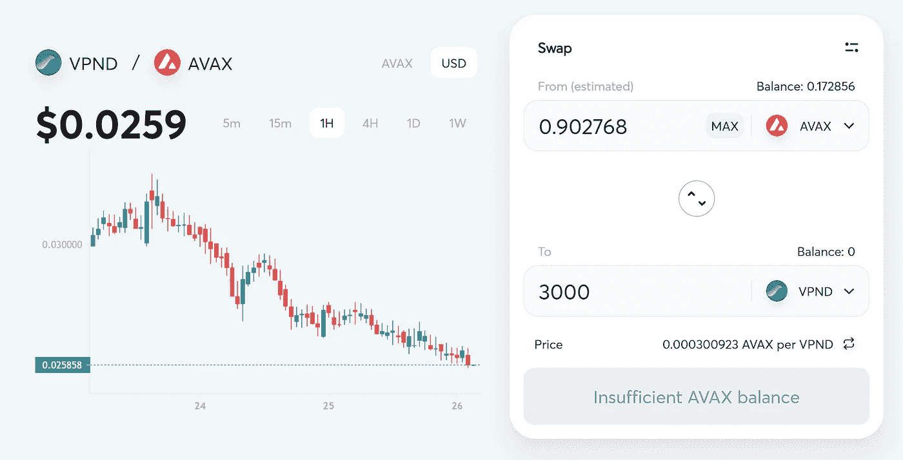
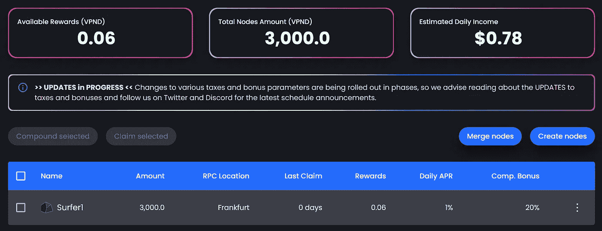
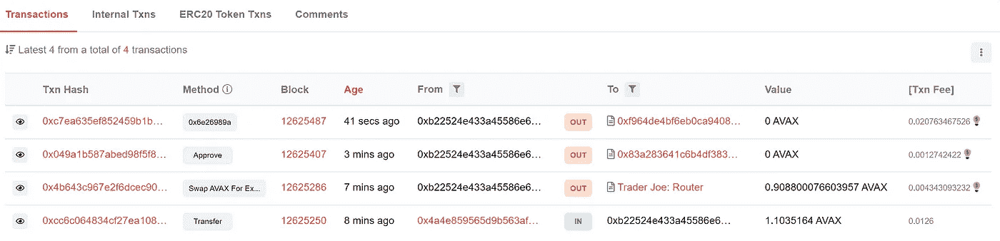
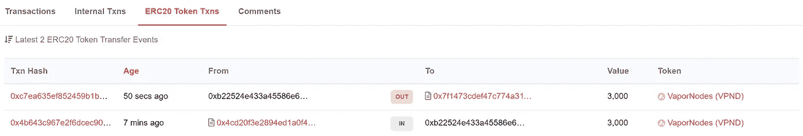
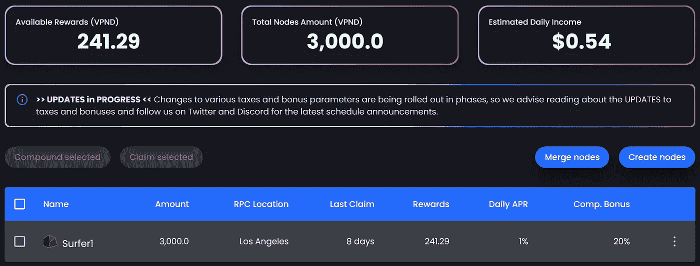
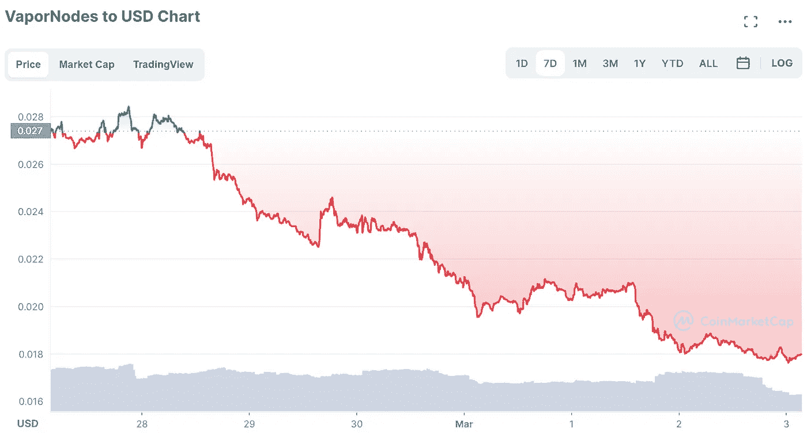

# DeFi 即服务(DaaS) —通过 3 个简单步骤创建被动收入的 VaporNode(可能)*项目

> 原文：<https://medium.com/coinmonks/defi-as-a-service-daas-creating-vapornode-for-passive-income-maybe-in-3-easy-steps-5a8116cdfc7e?source=collection_archive---------25----------------------->

为什么你不应该；而且还包括“如何做”，以防你决定继续下去。

Photo by [micheile || visual stories](https://unsplash.com/@micheile?utm_source=medium&utm_medium=referral) on [Unsplash](https://unsplash.com?utm_source=medium&utm_medium=referral)

## 先说题目中的“可能”先，那很重要。

我最初在一周前写了这篇文章，但是推迟了发表，因为我想展示这样做的好处和坏处。

***是*** —通过创建一个 VaporNode，您将获得 1%的每日投资回报(ROI)

***不***——从技术上讲，这不是你所关心的投资*的 1%回报。*

事情是这样的，*投资的衡量标准，*你我关心的是我们实际投入的美元。我们生活在物质世界中，事物(仍然)以美元定价；为了让我们的投资增长，以美元计算的投资也需要增长。那才是我们在乎的尺度！

然而，DaaS 支付你 1%的每日投资回报率，让你更富有，在他们的货币，即 VPND 令牌。这就是你在追逐承诺的 1%投资回报率时所冒的价格风险。

虽然你持有的 VPND 代币数量会以有保证的速度增长，但美元回报并没有保证，事实上还可能变成亏损(就像我代表的那样；稍后显示)如果以美元计算的 VPND 价格下跌。

随着*可能*的方式，继续阅读了解更多。

## 蒸汽节点——温和的介绍

1.  什么是 VaporNodes？

> VaporNodes 是一种数字节点协议，可让您跨多个链访问 DeFi 项目。VaporNodes 的目标是让任何人都可以访问 DeFi 去中心化金融即服务(DaaS)。
> 
> VaporNodes 是首批利用 Avalanche 网络的 DaaS 公司之一，因为它的费用低，交易时间快。

2.它是如何工作的？

> 当您创建一个数字节点时，您的一部分代币将用于建立 VaporNodes 库。社区参与和治理投票决定了国库资金的分配。

你可以在他们的[文档部分](https://docs.vapornodes.finance/project-information/introduction)了解更多信息，也可以查看他们的[当前投资](https://docs.vapornodes.finance/project-information/introduction)，奖励结构等。

*(免责声明——这不是投资建议。谈到投资，我只是一个互联网上的人。)*

## 想要创建一个 VaporNode？遵循以下三个简单的步骤:

1.  从您首选的加密交易所(我的情况是比特币基地)购买一些 AVAX，并转移到您的 Metamask 钱包中。这是因为 VaporFi 项目使用了雪崩网络——所以你需要 AVAX 来支付燃气费。
2.  根据您将要设置的节点类型，购买所需数量的 VaporNode 硬币(VPND)——您可以在 [TraderJoe](https://traderjoexyz.com/trade?outputCurrency=0x83a283641C6B4DF383BCDDf807193284C84c5342#/) 上将一些 AVAX 换成 VPND

[Trade | Trader Joe (traderjoexyz.com)](https://traderjoexyz.com/trade?outputCurrency=0x83a283641C6B4DF383BCDDf807193284C84c5342#/)

3.回到 VaporFi 应用程序，使用钱包中的 VPND 硬币创建一个节点

[VaporNodes — Nodes](https://app.vapornodes.finance/nodes)

瞧啊。就是这样。

您可以在 SnowTrace 上监控交易的每一步以及钱包中的代币。我总是检查这些交易，以了解合同执行的细微差别。

[SnowTrace](https://snowtrace.io/address/0xb22524e433a45586e6c8821d0de9af3f0737548b)

[SnowTrace](https://snowtrace.io/address/0xb22524e433a45586e6c8821d0de9af3f0737548b#tokentxns)

## 无论贫富…

虽然我一周下注 3000 VPNDs 获得了 240 VPNDs 的奖励(8%的回报率，1%的日投资回报率)，但 VPND 的价格下跌了 35%以上。让我在 VPND 世界里更富有，却在自己的世界里更贫穷。

Reward on my VaporNode after 1 week

Source: [CoinMarketCap](https://coinmarketcap.com/currencies/vapornodes/)

***你跟 DaaS 交易了吗。请在评论中告诉我进展如何。***

## 对于好奇的人，请参考:

*   [VaporNodes —关于雪崩的 DeFi 节点协议](https://vapornodes.finance/)
*   [贸易|乔(traderjoexyz.com)](https://traderjoexyz.com/trade?outputCurrency=0x83a283641C6B4DF383BCDDf807193284C84c5342#/)
*   [我在这个项目上投资了 70 美元，它每月支付我 122 美元|作者:Kiraly Octavian | coin monks | 2022 年 3 月| Medium](/coinmonks/i-invested-70-in-this-project-and-it-pays-me-122-per-month-805163696ad9)

> 加入 Coinmonks [电报频道](https://t.me/coincodecap)和 [Youtube 频道](https://www.youtube.com/c/coinmonks/videos)了解加密交易和投资

# 另外，阅读

*   最佳[区块链分析](https://bitquery.io/blog/best-blockchain-analysis-tools-and-software)工具| [赚比特币](/coinmonks/earn-bitcoin-6e8bd3c592d9)
*   [Cloudbet 赌场评论](https://coincodecap.com/cloudbet-casino-review) | [点火赌场评论](https://coincodecap.com/ignition-casino-review)
*   [加密套利](/coinmonks/crypto-arbitrage-guide-how-to-make-money-as-a-beginner-62bfe5c868f6)指南| [如何做空比特币](/coinmonks/how-to-short-bitcoin-568a2d0b4ae5)
*   [如何在加拿大购买加密货币？](https://coincodecap.com/how-to-buy-cryptocurrency-in-canada)
*   [无聊猿游艇俱乐部(BAYC)回顾](https://coincodecap.com/bored-ape-yacht-club-bayc-review) | [拜比特 vs 比特币基地](https://coincodecap.com/bybit-vs-coinbase)