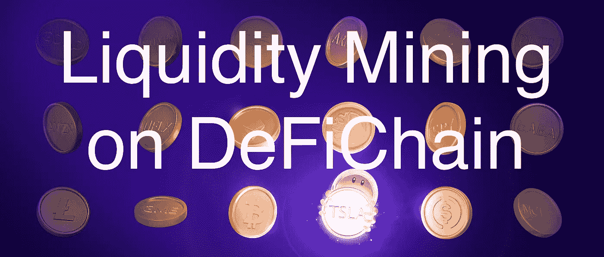
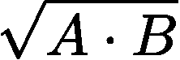

# DeFi(链)基础:流动性挖掘

> 原文：<https://medium.com/coinmonks/defi-chain-basics-liquidity-mining-ad5713c3765a?source=collection_archive---------12----------------------->



在之前的两篇帖子中，我已经解释了 DEX 的基础知识和一些关于[defi chain DEX](https://learn.block6.tech/defichain-basics-the-defichain-dex-91032fc6fd1d)的更多细节。特别是，我们已经看到，如果有更多的流动性储存在 DEX 池中，这对生态系统更好，因为这使价格更加稳定。在本帖中，我们将讨论资金池中的流动性来自哪里，以及为什么你想自己提供流动性。

# 什么是流动性挖掘？

*流动性挖掘*是分散金融(DeFi)的基本机制之一。它通过激励市场参与者提供流动性，确保流动性池包含足够的流动性。对于那些提供流动性的人来说，这也是获得加密资产回报的好方法。

任何人都可以通过向资金池中添加流动性来贡献并成为流动性提供者。当您添加流动性时，您总是需要以当前池比率添加两个池令牌。因此，增加流动性不会改变这一比率。回笼流动性也是如此。

让我们再一次考虑一个你可以交易苹果和橘子的 DEX 池，假设它包含 300 个苹果和 200 个橘子；所以苹果和橘子的比例是 3:2。为了增加这个池的流动性，你需要以相同的比例添加苹果和橙子，例如，60 个苹果和 40 个橙子。添加后，池中有 360 个苹果和 240 个橙子，你拥有池的 1/6(或 16.67%)。

## 当比率改变时会发生什么？

当资金池比率发生变化时，您的份额比率也会发生变化。例如，在一些互换之后，混合储备可能变成 288 个苹果和 300 个橙子。如果你现在想取出你的资金，你会得到 48 个苹果和 50 个橘子。所以你会比你进入水池时少吃 12 个苹果，多吃 10 个橘子。(请注意，您的金额乘积保持不变:60 40 = 2400 = 48 50)

从某种意义上说，流动性提供者总是扮演反周期买家和卖家的角色:他们买入价格下跌的代币，卖出价格上涨的代币。

## 什么是流动性令牌？

当你进入资金池时，你放弃你的投入代币，取而代之的是所谓的*流动性代币*，它证明你对资金池份额的要求。

正如我们在上面所看到的，每次互换的集合金额都会变化，但乘积总是保持不变。这一事实也反映在流动性代币上:当您在一侧添加 *A* 代币，在另一侧添加 *B* 时，您将获得



流动性代币。因此流动性代币的数量取决于投入量的*乘积*。(平方根用来调整单位和比例。)

在我们上面的例子中，你会收到大约 49 个苹果橙流动性代币(因为 60 ^ 40 的平方根是 48.99)。
如果你在 DeFiChain 的 BTC-DFI 池中加入 1 dBTC 和 10，000 DFI，你将获得 100 个 BTC-DFI 代币。

# 奖励和佣金——对流动性提供者有什么好处？

正如我们将在后面看到的，提供流动性并非没有风险。因此，流动性提供者会因为这项服务而获得回报。在 DeFiChain 上，他们获得两种不同类型的奖励:

*   *街区奖励，*在 DFI 支付:
    在 DeFiChain 区块链每出现一个新街区，就有一批新的 DFI 诞生。这个数字每 32，690 个块(大约 11 天)减少 1.658%，并通过固定分配分配给不同的原因。例如，三分之一的新 DFI 归开采区块的主节点所有，作为赌注奖励，一小部分进入社区基金，另一部分用于奖励流动性提供者。这最后一部分是块奖励的来源。
*   *佣金，*在两个代币池中支付:
    每当有人使用 DEX 池将一个代币交换到另一个代币时，就会产生输入代币 0.2%的费用，支付给流动性提供者。所以每当有人把苹果换成橘子时，这种交换的佣金就会用苹果来支付。而有人把橘子换成苹果，佣金就会以橘子支付。

然后，根据流动性提供者在资金池中的份额，在他们之间分配奖励和佣金。在上面的例子中，由于你拥有 1/6 的资金池，你将从这个资金池中获得 1/6 的奖励和佣金。

在撰写本文时，块奖励占了很大一部分(大部分时间)，但随着块奖励的持续下降和 DEX 的使用增加，这可能会在未来的某个时候发生逆转。现在这种情况已经时有发生。例如，当新的池被创建并且还没有获得块奖励时，或者当池中有巨大的移动时，佣金可能已经很可观了。

# 有什么风险？

提供流动性存在一些风险:

*   *平台风险*:这是一种伴随每一笔投资的风险。在这种情况下，它包括*bug*或 *hacks* 的风险和*项目风险*。(Crypto 和 DeFiChain 项目仍然非常年轻。整个生态系统可能会因为一些不可预见的原因而崩溃，让你的投资变得一文不值。)
*   *价格风险*:如果你加入资金池的代币失去价值，当然你的投资组合的价值也会下降。
    在最极端的情况下，如果一个代币变为零，你将失去一切:记住池的两边总是有相同的值，但是如果一个代币和这一边的值变为零，那么另一边的值也变为零。根据恒量积公式，两边量的乘积保持不变。因此，在这种极端的情况下，一方面会有大量的(几乎没有价值的)A 型令牌，另一方面会有极少量的 B 型令牌。因此，如果在我们的例子中，苹果的价格为 0，你也会失去你的橙子。
*   非永久性损失的风险:臭名昭著的非永久性损失(或 IL)是一种特定于流动性开采的风险。非永久性损失的含义如下:**当资金池比率发生变化(任何方向)时，您的资金在提供流动性后的价值将始终低于您持有时的价值。**

# 什么是无常的失去？

让我们带着 360 个苹果和 240 个橘子回到我们的游泳池。假设过了一段时间后，池比率发生了变化，现在有 300 个苹果和 288 个橙子。所以一个苹果的价格从 2/3 个橘子涨到了 0.96 个橘子。同样，桔子的价格也下降了。如果你现在决定提取你的流动资金，你将得到 1/6 的现金池:50 个苹果和 48 个橘子。(请注意，两个金额的乘积与您添加代币时的乘积相同。)所以你失去了 10 个苹果，收获了 8 个橘子。**但这对你的投资价值意味着什么呢？**

假设当你进入水池时，一个苹果的价格是 40 美分，一个橘子的价格是 60 美分。(注意两边数值都是 300 0.4 = 200 0.6 = 120。)还假设当你离开池子时，一个苹果的价格涨到了 96 美分，因此一个橘子的价格涨到了 100 美分。

所以你的资产价值从 60 0.4 + 40 0.6 = 24 + 24 = 48 增加到 50 0.96+48 1 = 48+48 = 96——增加了两倍！太棒了，对吧？但是如果你只是简单地持有你的果实而不是挖掘流动性会怎么样？那样的话，你还有 60 个苹果和 40 个橘子，总价值 60 0.96 + 40 1 = 57.6 + 40 = 97.6，那就更多了。

流动性挖掘后你的资产的实际价值与拥有它们时的价值之间的差异被称为*非永久性损失*或*转移损失。*在这种情况下，相对价格变化 44%，IL 约为 1.64%(因为 96/97.6≈0.9836 = 1–0.0164)。只要你得到的回报比这个高，一切都应该是好的。

有几件事需要注意:

*   重要的是，非永久性损失总是与值*进行比较，而不是与初始值进行比较。当价格下跌时，除了 IL，你还有价格损失。相反，我们仍然受益于池中令牌的价格上涨，但我们的收益被 IL 减少了。*
*   对于非永久性损失的高度(百分比)，只有两个代币之间的*相对*价格变化(*即*，两个金额比率的变化)有关系。在这个例子中，我们用美分来表示这两个标记，但是这纯粹是为了使这个例子更加具体，希望更容易理解。事实上，绝对价格是无关紧要的。
*   对于小的价格变化，非永久性损失可以忽略不计，但是——正如我们在上面看到的——在最极端的情况下，当一个令牌变为 0 时，它可以高达 100%。这里有一些数字可以让你感受一下短暂的损失有多大；您也可以使用[非永久性损失计算器](https://dailydefi.org/tools/impermanent-loss-calculator/)来获得您的池的准确数字:

```
Pool Shift    Impermanent Loss  
 ------------ ------------------ 
  3%           0.01%             
  5%           0.03%             
  10%          0.11%             
  20%          0.41%             
  30%          0.85%             
  50%          2.02%             
  100%         5.72%             
  200%         13.4%             
  500%         30.0%               
  1000%        44.7%
```

关于非永久性的损失还有很多要说的，但是为了简洁起见，我暂时就说到这里，以后再单独写这篇文章。

# 不平衡池怎么办？

[正如我们在之前的文章](https://learn.block6.tech/defi-chain-basics-decentralized-exchanges-c9e1b1727ea6)中看到的，一个池的比率以及池中代币的价格会随着每次互换而变化。有时，资产池比率会偏离你认为的“真实”或“正确”价格很远。在这种情况下，池变得不平衡。当然，这可能是主观的，但通常有外部来源来帮助确定“正确的”价格。

当一个令牌在至少两个不同的交易所交易时，例如，一个 DEX 和一个集中交易所，你可以比较不同的价格。

如果代币有其他类型的参考价格，情况也是如此:DeFiChain 股票代币(直到现在)只在 DeFiChain DEX 上交易(因此实际上只有一个价格，没有办法在不同的交易所套利)，但有 oracle 价格，它反映了股票代币所基于的“真实”资产的价格。

我会认为像 BTC-DFI、ETH-DFI 或 USDC-DFI 这样的资金池是平衡的，如果其代币的 DEX 价格足够接近集中交易所的价格。对于股票代币池，这更加困难，因为(至少到目前为止)它们通常比 oracle 价格溢价交易。

## 什么时候是增加或收回流动性的好时机？

当你想给一个池子增加流动性的时候，最好等一会儿池子达到平衡。否则，当水池回到平衡状态时，会有一些分流损失。然而，在提取流动性时，你不必担心这一点。在这种情况下，当池暂时失去平衡时，实际上是有益的。

在 DeFiChain 上，新资金池在创建后通常会出现极度波动，汇集的流动性仍然非常低。因此，在这种情况下增加流动性时，你需要格外小心，因为资金池是平衡的。

从我们对非永久性损失的简短讨论中可以清楚地看出，向不平衡的资金池中增加流动性将导致流动性增加。

然而，让我举一个例子来支持我的主张，即当资金池失衡时，提取流动性是一个好主意。假设你在 DeFiChain 的 GLD-DUSD 池中加入了 1 GLD 和 200 DUSD，并假设 200 DUSD 是当前 1 GLD 的“正确”价格。由于 GLD-DUSD 组合与其它一些组合相比规模较小，一笔巨额互换交易就能轻松改变这一组合。假设有人出售大量 GLD，将价格转移到仅 150 DUSD 兑换一个 GLD。如果你在那个时候取出你的流动资金，你会得到 173.21 DUSD 和 1.15 GLD。然而，由于资金池只是暂时失去平衡，它可能会很快回到 200 DUSD 的正确价格，因为人们会抓住机会低价购买 GLD。一旦价格回到 200 DUSD，你可以将额外的 0.15 GLD 兑换成 29.88 DUSD(这是在减去 0.4%的交换费后，但忽略滑点，因为与池大小相比，这个数额非常小)。因此，你将拥有 1 GLD 和 173.21 + 29.88 = 203.09 DUSD，比你最初的 200 DUSD 和 1 GLD 增加了 0.75%。不过，有一点需要提醒:我认为将此作为套利策略是没有意义的，因为它并非没有风险。(您无法确定池的移动是暂时的，而且它会移回来。毕竟，价格变化可能有一个你还不知道的根本原因。)这个例子应该证明，当*提取*流动性时，你不必担心资产负债表外的资产池，就像你在添加流动性时必须担心的一样。还要注意的是，如果你碰巧在资金池失衡时取款，在交换任何东西之前，等待资金池比率回到“正确”的价格是很重要的。

> 加入 Coinmonks [电报频道](https://t.me/coincodecap)和 [Youtube 频道](https://www.youtube.com/c/coinmonks/videos)了解加密交易和投资

# 另外，阅读

*   [Blockfi vs 比特币基地](https://coincodecap.com/blockfi-vs-coinbase) | [BitKan 点评](https://coincodecap.com/bitkan-review) | [Bexplus 点评](https://coincodecap.com/bexplus-review)
*   [南非的加密交易所](https://coincodecap.com/crypto-exchanges-in-south-africa) | [BitMEX 加密信号](https://coincodecap.com/bitmex-crypto-signals)
*   [MoonXBT 副本交易](https://coincodecap.com/moonxbt-copy-trading) | [阿联酋的加密钱包](https://coincodecap.com/crypto-wallets-in-uae)
*   [雷米塔诺审查](https://coincodecap.com/remitano-review)|[1 英寸协议指南](https://coincodecap.com/1inch)
*   [iTop VPN 审查](https://coincodecap.com/itop-vpn-review) | [曼陀罗交易所审查](https://coincodecap.com/mandala-exchange-review)
*   [40 个最佳电报频道](https://coincodecap.com/best-telegram-channels) | [喜美元评论](https://coincodecap.com/hi-dollar-review)