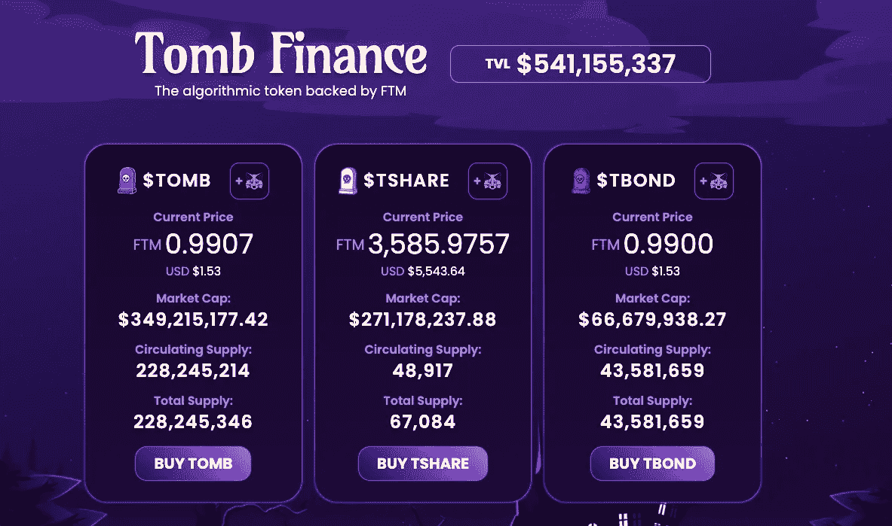

# DeFi 保守党去充分德根猿:我如何在一周内翻了一倍我的包

> 原文：<https://medium.com/coinmonks/defi-conservative-goes-full-degen-ape-how-i-doubled-my-bag-in-a-week-b8efd9129df0?source=collection_archive---------2----------------------->

在过去的七天里，我忽视了自己的建议，完全变成了一只堕落的猿。结果相当令人惊讶。

Image: PixTeller

> 堕落的不是年轻人；直到成年人已经堕落，他们才被宠坏——孟德斯鸠

# 这一切都始于比特币基地

一周前半夜醒来，再也睡不着。我启动了我的笔记本电脑，开始四处打探。我已经几个月没有使用比特币基地了，所以我决定登记入住。

令我惊讶的是，账户里大约有价值 850 美元的 [Matic](https://coinmarketcap.com/currencies/polygon/) 。我忘了我把它放在那里了。我记得我不想对它做任何事情，因为在比特币基地，它不是真正的 Matic——它只是带着紫色包装的 [ETH](https://coinmarketcap.com/currencies/ethereum/) 。

但是因为是在早上，所以费用很低。我想，‘管它呢’，把它移到了 [Gate.io](https://www.gate.io/) 。我说的“低”费用是指那笔交易“只”花了我 17 美元(唉)。

仅仅因为移动一些硬币就下跌了 2%，这不是一个好的开始。几篇文章之前，我在 Fantom 上谈论了一些[相当疯狂的 APRs](/coinmonks/make-money-in-crypto-with-1000-and-no-leverage-4b369bd4a1d9) ，特别是关于[墓](https://tomb.com/)和[3mb](https://3omb.finance/)。我的冲动是把所有的钱都投到坟墓里，在那个时候，坟墓/FTM 流动性组合的年回报率约为 75%。

我不知道我是怎么了，但我决定做个小实验。就相对风险而言，我认为坟墓是一个相当安全的赌注。有一个亿万富翁风险投资家公开支持这个项目，它已经锁定了大约 6 亿美元的总价值(TVL)。

相反，我做的是把钱分成两堆。我把 700 美元放入 3mb，剩下的放入我能在 [WhatTheFork](https://www.whatthefork.xyz/) 上找到的最大 degen 收益率。我去的德根剧是 [Ripae 财经](https://ripae.finance/)。

## Basis.io 和坟墓。金融

对于不熟悉的人来说，古墓其实是 [Basis.io](https://basis.io/) 的副本/面食版。Basis 是一家总部位于美国的公司，它因美国证券交易委员会(SEC)的监管问题而倒闭。不过它是在以太坊上推出的，所以即使联邦政府不取消它，汽油费也会取消。

基本概念是发布一个令牌，它在算法上与一个链令牌挂钩，如 ETH。这样，它的功能就像一个稳定的硬币，除了不是与菲亚特挂钩，而是与另一个密码挂钩。它通过发行股票和债券来实现这一目标。

如果基础令牌高于链令牌的值，则共享令牌发出基础令牌。因此，一个投资者下注股票代币会收到基础代币(扩大供给)，直到价格达到挂钩。一旦达到或低于 Basis/ETH 挂钩价，股份代币将停止排放。

如果价格低于挂钩，那么投资者可以购买债券代币。购买债券代币会烧掉基差代币(减少供给)，但在基差代币高于挂钩之前，债券无法赎回。基差越大，债券持有人的回报就越高。

我想这可能有点令人困惑。我发现阅读文档并不能澄清这一点。简单的答案是:Basis/ETH 应该是 1:1。如果基差高于 1:1，股票会把它拉低。如果基差低于 1:1，债券会提高基差。

坟墓也是一样。墓穴与方托姆(FTM)的比例为 1:1。如果 Tomb 的交易价格高于 FTM，TShares 就会把它拉低。如果坟墓交易低于 FTM，TBonds 会提出来。看起来是这样的:

Image: Tomb Finance

如你所见，坟墓低于 peg(每英尺 0.9907)。因此，TShares 不发射任何东西(没有 APR)。但是，现在有 TBonds 出售，一旦坟墓超过挂钩(坟墓价格> FTM)就可以赎回。

反过来，Ripae 是一个墓叉(另一个副本/面食)，图形和名称不同。不过，工作原理是一样的。这是他们的主页:

Image: Ripae Finance

在这里，pFTM(我认为)应该是 FTM 的 1:1，但它远远超过了 peg。因此，PAE(股票)正在释放一吨*的 pFTM。bFTM 是债券代币，但不能购买，因为 pFTM 高于 peg。*

## 我的 DeFi 车轮第一天就掉了

在几乎所有这些协议中，共享令牌具有较高的 APR。当我第一次使用时，PAE 的 APR 约为 3000 %, 3 share(3mb 共享)的 APR 约为 2100%。

我将 350 美元放入 30mb/FTM 流动性池，并在市场上购买了 3 只股票中的 350 美元，以在 30mb 股票池中持股。对于 Ripae，我在市场上购买了 150 美元的 pae，然后直接进入了共享池。毕竟 3000%德根 APRs，为什么不呢？

我没有看图表，我没有研究 Ripae，我没有做任何事情，除了 ape in。我创建了我的对子，买了我的股票，然后点击提交。这是市场第一次给了我当头一棒。

在我买了这 3 只股票和 PAE 后不到一天(大约 15 个小时)，它们的价值就下跌了 40%。如果我看了图表，我会发现价格在稳步下降。又不是我买的地板会降得更低。我刚刚用脚接住了落下的刀。

哎呦。

最低时，我 350 美元的 3 股价值 189 美元，我 150 美元的 PAE 价值 87 美元左右。这些股票池支付高年利率，因为这些股票有(非常)不稳定的市场敞口。这是一个赌博池，因为股票可以(3 股非常)既坦克和月球拍摄。

Image: Coinmarketcap

## 一个真正的 DeFi 德根:让它骑！

我找不到 PAE 的图表。在 Coingecko 上有一个，但是它丢失了几天的数据。不是很重要，除了是一个小素描。关键是，我在那里也做了同样的事情。

我很幸运，因为 3 股价格回升了，我在它回升的第一时间撤出了所有的 3 股。幸运的是，我将其转换为 3mb/FTM 对，并将其添加到池中。FTM 如此棒的原因之一是这些交易每笔花费了我大约 0.02-0.06 美元。太棒了。

众所周知，现在价格全面下跌。但由于年利率如此之高，我在两个美元方面仍然领先，并且在这个过程中我收到了相当多的 FTM。[双彩虹](https://www.youtube.com/watch?v=OQSNhk5ICTI)！

Ripae 的股票也有所回升，但我收到的所有 pFTM 都转换回 pae 并复利。让它骑吧，宝贝！那个 PAE 可能也是月球射击，mirite？！

## 辣妈辣妹

到上周五，3mb/FTM APR 已经下降到 900%左右。Ripae 仍然以大约 2200%的速度泵送，并且 pFTM/FTM 已经从 5:1 下降到大约 3:1。当我可以得到 2200%的时候，如果我把我所有的钱都用在 900%上，我会是什么样的堕落？

因此，上周五，我撤回了我的 3mb/FTM 流动性，转换为 pFTM/PAE 并点击提交。如果它真的盯住美元，我将面临 14%的[非永久性损失](/coinmonks/crypto-101-liquidity-pools-and-impermanent-loss-feb297ce5fba)。但我认为大约 5%的日年利率会弥补这一点。我将所有奖励复合(PAE 奖励到 PAE 池，pFTM 奖励到 pFTM/FTM)。

我大约每 10 分钟检查一次游泳池。这是超级强迫性的，非常令人焦虑。但是 FTM 正在疯狂地建设。我的贪婪指数开始触及红色区域。我想我快疯了。

## 星期天，星期天，星期天！仅限本周！

到了星期天，我控制不住自己。我开始研究 Ripae。该网站于 2022 年 1 月 22 日注册，比 Ripae 推出早 14 天。上周末，他们推出了一个 AVAX 门户网站，但仍未投入使用。TokenSniffer 的分数是 60/100。我贪婪的猿脑想，“哎呀，也许这是合法的”。

然后我离开了。

我再也受不了了。别的不说，我发现了自己风险承受能力的极限。蕾帕还在蹒跚前行，但我已经永远离开了。他们的股票池在存款后锁定资金六个时代，这是六个小时长。我取出我的 pFTM/FTM 流动性，转换成 20mb/FTM 流动性，放在那里。

在我写这篇文章时，我的 PAE 仍然被锁定。我还有 10 个小时才能完成。尽管潜伏着巨大的熊，我希望 PAE 不会进一步下跌太多。如你所见，尽管有大熊，我的现金价值还是上升了。我的初始 PAE 值约为 0.19，这也是一个相当大的收益。

Image: Ripae Finance

一旦发布，它也会达到 20mb/FTM。今天，我严肃地大声对我的侄子说，我现在只赚了 825%的年利率。三个月前，我非常兴奋能够在主播岗位上赚取 20% **APY** 。作为参考，825%的日复合年利率是 350，000%左右的 APY。

我想可能有一颗螺丝松了。

## DeFi 德根猿结果

因为这只大熊，以美元计算，我差不多扯平了。但是我从大约 425 英尺开始。如果我的计算是正确的(PAE 价格没有完全便便床)，我很确定我从这个实验中获得了 720 FTM 多一点。不完全是两倍，但总比一脚踢在小腿上好。

现在我在这里，我对坟墓/FTM 生态系统持谨慎乐观的态度。我觉得在“官方”的墓链里比在副本/意大利面里更舒服。我打算让 20mb/FTM 对再骑一会儿。我再也不会和别人一起住了。

我还认为，对于长期熊市来说，这可能是一个不错的策略。时间会证明 T1 | 2 | 3omb 实验是否成立。在《T4》最近的电视剧《古墓丽影》和《市场垃圾场》之后，我非常看好它。经历了这么多磨难，它还是很坚固的。

T2|3 看起来也很可靠，但我仍然很谨慎。他们都很好地持有钉住汇率制，尽管有大量的流动性。至少有了我的 20mb/FTM 对，我不会觉得必须每 10 秒看一次。但我还是会看。

尽管如此，我仍然让其他 APR 生成资产在其他链上工作。稳定的双面和单面让我感到舒适。我很高兴我纵容了我的德根猿。我不推荐它，但如果你尝试它，我肯定不会责备你。

有了古墓丽影，短时间(24-48 小时)和大的前期投资可能是一个快速赚钱的有趣玩法。我想这取决于你，我不是财务顾问，这绝对不是建议。不管怎样，在一天结束的时候，我必须提醒自己，我用的是“找到的”钱。如果我都不知道自己拥有它，失去它会有多糟糕，对吗？

直到下一次，安全，聪明，并确保[绑骆驼](https://www.oxfordreference.com/view/10.1093/acref/9780199539536.001.0001/acref-9780199539536-e-2318)。

> *加入 Coinmonks* [*电报频道*](https://t.me/coincodecap) *和* [*Youtube 频道*](https://www.youtube.com/c/coinmonks/videos) *了解加密交易和投资*

# 另外，阅读

*   [有哪些交易信号？](https://coincodecap.com/trading-signal) | [Bitstamp vs 比特币基地](https://coincodecap.com/bitstamp-coinbase) | [买索拉纳](https://coincodecap.com/buy-solana)
*   [ProfitFarmers 点评](https://coincodecap.com/profitfarmers-review) | [如何使用 Cornix 交易机器人](https://coincodecap.com/cornix-trading-bot)
*   [十大最佳加密货币博客](https://coincodecap.com/best-cryptocurrency-blogs) | [YouHodler 评论](https://coincodecap.com/youhodler-review)
*   [my constant Review](https://coincodecap.com/myconstant-review)|[8 款最佳摇摆交易机器人](https://coincodecap.com/best-swing-trading-bots)
*   [MXC 交易所评论](/coinmonks/mxc-exchange-review-3af0ec1cba8c) | [Pionex vs 币安](https://coincodecap.com/pionex-vs-binance) | [Pionex 套利机器人](https://coincodecap.com/pionex-arbitrage-bot)
*   [我的密码交易经验](/coinmonks/my-experience-with-crypto-copy-trading-d6feb2ce3ac5) | [比特币基地评论](/coinmonks/coinbase-review-6ef4e0f56064)
*   [CoinFLEX 评论](https://coincodecap.com/coinflex-review) | [AEX 交易所评论](https://coincodecap.com/aex-exchange-review) | [UPbit 评论](https://coincodecap.com/upbit-review)