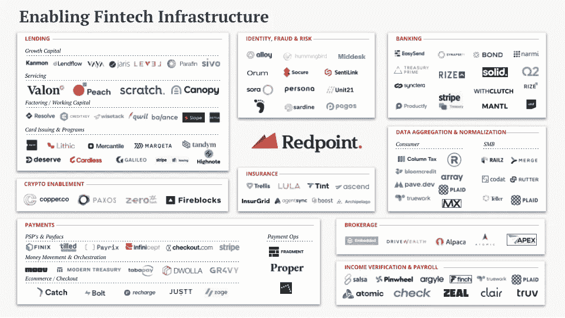
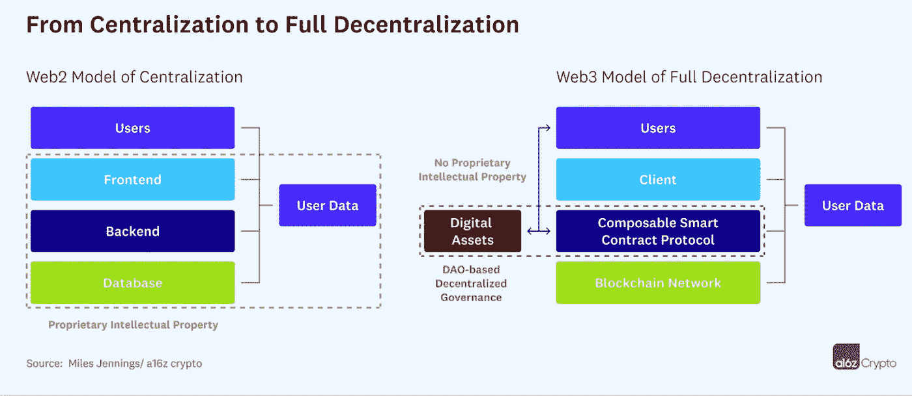
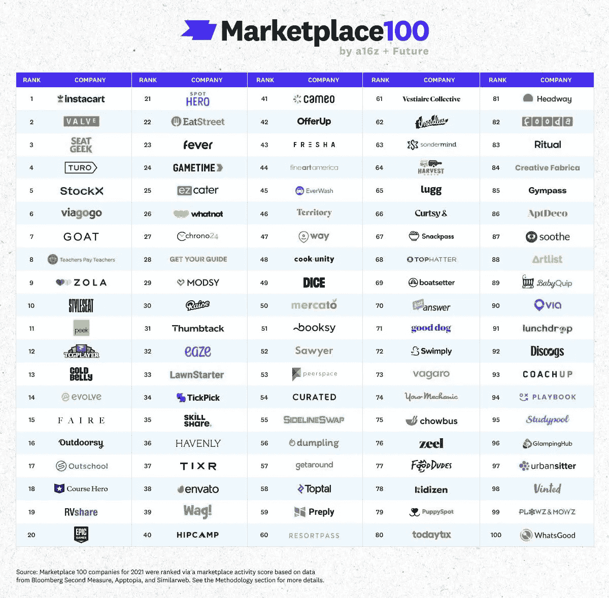
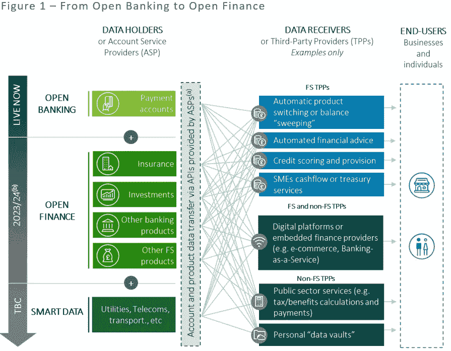
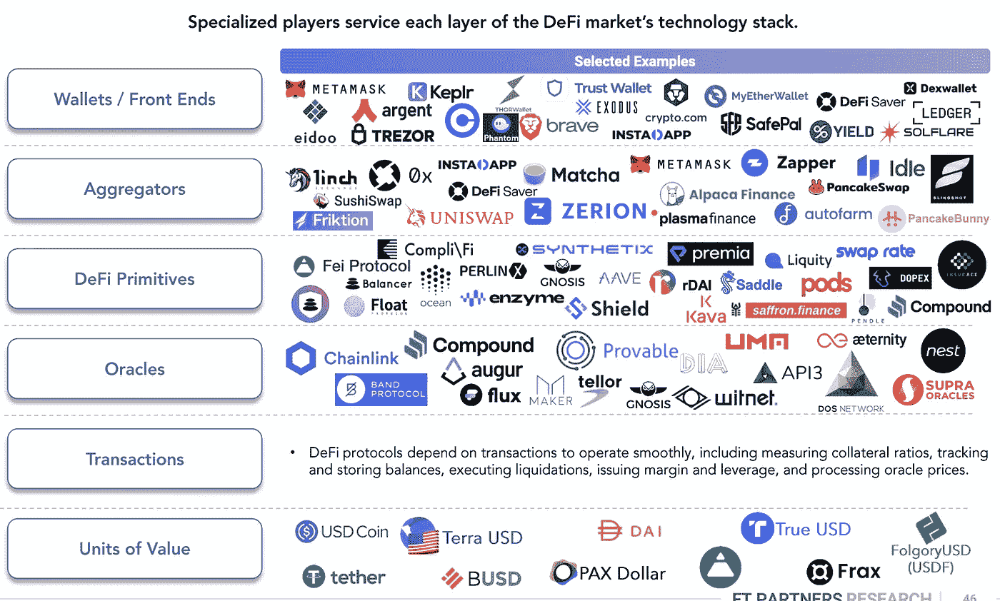

# DeFi——市场的当前状态；金融科技基础设施，或者说嵌入式金融基础设施；亚马逊和 crypto

> 原文：<https://medium.com/coinmonks/defi-current-state-of-the-market-fintech-infrastructure-or-in-other-words-embedded-finance-f8ce2c768c?source=collection_archive---------13----------------------->

# 在这个版本中:

1.  金融科技基础设施，或者说嵌入式金融基础设施
2.  完全去中心化:如何去中心化 DeFi 和其他简单的应用
3.  安德森·霍洛维茨的市场 100 强名单
4.  亚马逊和加密
5.  FIS 将与 Fireblocks 合作推出加密交易、DeFi 和赌注服务
6.  三个开放式金融用例
7.  DeFi——市场的现状
8.  MetaMask 警告用户新的苹果 iCloud 网络钓鱼骗局

# 金融科技基础设施，或者说嵌入式金融基础设施

[红点风险投资公司的普通合伙人梅德哈·阿加瓦尔](https://www.linkedin.com/in/ACoAAAMOBRMBgLzWPTWDh4Q7YCZUfJQIAMWORBA)将金融科技基础设施分为以下 9 组:

1 贷款

2 身份、欺诈和风险

3 银行业

4 加密支持

5 保险

6 数据汇总和标准化

7 次付款

8 经纪业务

9 收入核实和工资单

对我来说，这个生态系统中最有前途的服务之一是加密支持。

加密支持是指支持传统金融机构和金融科技公司向其最终客户提供合规且更加无缝的加密的公司。尽管仍处于该市场的早期阶段，但 31%的 18-29 岁人群已经拥有加密货币。这个数字只会继续增长。随着传统金融服务和加密之间的界限越来越模糊，这将成为基础设施工具包中越来越重要的一部分。

大大小小的金融科技公司总是在寻找新的工具来扩展他们的产品和服务生态系统。

尽管该领域出现了各种创新和迅猛增长，但成立一家金融科技公司仍然非常昂贵和耗时，而且一旦上线运营，同样具有挑战性。

我们正处于下一代支持性基础设施的早期阶段，这种基础设施将继续减少金融服务创新所需的时间和人员。

[出处。](https://makecents.substack.com/p/make-cents-the-universe-of-fintech?s=w)

# 完全去中心化:如何去中心化 DeFi 和其他简单的应用

全面权力下放是目前 DeFi 部门最常见的权力下放模式。如下图所示，从集中模式(如 web2)到分散模式(如 web3)的转变包括:

-将开源智能合约协议部署到分散的可编程区块链网络，以形成 web3 系统的核心基础设施层——智能合约协议为可在链上部署的后端的所有组件(即，支付、消息传递等)提供执行层。);

-以分散的方式操作“客户端”层——客户端代表离线操作的所有系统软件，并充当智能合约协议的网关(客户端的范围可以从简单的前端网站到复杂的应用程序)；

-增加数字资产分发-这可能是对贡献者和消费者的空投；给内部人员(开发商公司的员工、顾问和股东)的通知；

-将数字资产分配给明确的激励方案(如 DeFi 中的流动性挖掘)；以及成立由道控制的金库，用于任何未来的激励措施；

-启动智能合同协议和一体行动资金的一体行动治理；和

-确保用户拥有并保留他们自己的数据(目前在 web2 系统中是一个巨大的争议)。

[来源。](https://future.a16z.com/web3-decentralization-models-framework-principles-how-to/)

# 安德森·霍洛维茨的市场 100 强名单

以下是《市场 100》第三版的亮点:

-前所未有的成交量表明，早期市场一如既往地重要。19 家公司“毕业”(去年为 10 家)，原因是 5 次 IPO、3 次 SPACs 和 11 次收购。还有 37 名“新生”，比去年多 48%。

- #1 Instacart 在“赢家通吃”类别中的优势可能很难被下一代市场巨头复制——在顶部打开更多空间！

-生活购物应用 Whatnot 的同比涨幅最大，上升 73 位至第 26 位，为收藏品类别的爆发年做出了贡献。

-由于消费者适应新常态的“covid bounceback ”,票务、食品和饮料以及教育领域的新进入者最多。疫苗的推出与儿童保育和票务等类别的恢复尤其密切相关。

-不过，对某些类别来说，隔离创造了持久的习惯。特别是，游戏和购物/收藏品类别持续增长，超过了之前的 covid 前基线。

额外收获:虽然没有被列入市场 100 强名单，但 NFT 市场在 2021 年爆炸式增长。我们查看了 NFT 顶级市场的历史交易量，根据 [DappRadar](https://www.linkedin.com/company/dappradar/) 的数据， [OpenSea](https://www.linkedin.com/company/opensea-io/) 以 235 亿美元的历史交易量领先。

尽管 Instacart 继续占据榜单首位，但所有这些变化都开始暗示今年和未来市场的真实情况。下一个 Instacart、 [Airbnb](https://www.linkedin.com/company/airbnb/) 、[优步](https://www.linkedin.com/company/uber-com/)或 [Lyft](https://www.linkedin.com/company/lyft/) 从何而来？谁将成为下一代市场巨头？

虽然现在下结论还为时过早，但从 2021 年开始，有四个类别值得关注:票务和体验；购物和商业；游戏；以及不断增长的 web3 市场。

[来源。](https://future.a16z.com/marketplace-100/)

# 亚马逊和加密

亚马逊首席执行官安迪·杰西(Andy Jassy)表示，亚马逊还没有接近增加对加密货币支付的支持。

“我们可能还没有接近在我们的零售业务中加入 crypto 作为支付机制，但我相信随着时间的推移，你会看到 crypto 变得更大，”Jassy 说。

但是 Jassy 在周四接受美国消费者新闻与商业频道采访时发表了评论，他说他认为亚马逊最终可能会出售 NFTs。

Jassy 的加密评论来自最近的猜测，即亚马逊可能有一天会允许客户使用加密货币支付。

去年夏天，这家电子商务巨头表示，它正在为该平台“探索”加密货币支付。

“我们受到加密货币领域创新的启发，正在探索这在亚马逊上可能会是什么样子，”当时与 Decrypt 分享的公司声明中写道。

我们相信未来将建立在能够实现现代、快速和廉价支付的新技术之上，并希望尽快将这一未来带给亚马逊的客户。"

亚马逊的云平台子公司亚马逊网络服务(Amazon Web Services)也发布广告，招聘一名产品负责人加入其亚马逊管理的区块链。职位空缺表明对有分散金融(DeFi)经验的潜在申请人的偏好。

此外，亚马逊的广告金融科技团队去年正在寻找一名高级软件工程师，从事“财务分类账、账单和对账系统”的工作。这个特别的空缺没有明确提到加密或区块链技术，但该空缺的 URL 提到了。

杰西自己也和区块链有一段历史。

在担任亚马逊网络服务首席执行官之后，他接替杰夫·贝索斯担任亚马逊首席执行官，在那里他推出了云平台的亚马逊管理的区块链服务。

[来源。](https://decrypt.co/97843/amazon-wont-support-crypto-payments-any-time-soon-ceo-2)

# FIS 将与 Fireblocks 合作推出加密交易、DeFi 和赌注服务

随着加密行业继续吸引主流注意力，机构正在寻找接触新兴资产类别的方法。然而，在交易、托管资产以及参与交易所和大宗经纪业务时，它们经常会发生摩擦。

一个新的合作伙伴关系正在寻求改变这种状况。

今天宣布，FIS，一家市值 620 亿美元的金融科技公司，提供从支付服务到财富管理的一切服务，与总部位于纽约的基础设施公司 Fireblocks 合作，为其超过 6000 名资本市场客户提供全套加密交易和贷款服务。

FIS 资本市场部加密和数字资产主管 John Avery 表示:“在全球范围内，我们正在让我们的客户群非常容易地获得并利用 Fireblocks 平台。

从今天开始，所有 FIS 的 6000 多个资本市场客户都可以使用 Fireblocks 产品，首先是其 1000 多个合作伙伴加入其网络，允许在全球范围内 24/7/365 进行快速、安全和廉价的转账。

然而，这种合作真正让 Avery 兴奋的是 Fireblocks 在交易之外还能提供什么。毕竟，成熟的资本市场参与者现在将通过贷款和押注等持有行为赚取被动收入的方法视为该行业的赌注。" Fireblocks 为我们的高级客户提供诸如赌注、贷款和分散融资等服务."

这种合作关系只是 FIS 在加密领域的最新纠缠，表明机构和他们的客户正在认真对待这个曾经被回避的行业。本月早些时候，FIS 的支付处理部门 WorldPay 与 Circle 合作，允许商户接受 USDC，这是第二大美元计价的稳定货币，市值超过 500 亿美元。2021 年 5 月，FIS 的另一个部门与提供加密保管和交易的 [NYDIG](https://www.linkedin.com/company/nydig/) 合作，使银行能够向客户提供加密服务。

[出处。](https://bit.ly/3M7EzIF)

[https://youtu.be/VL5V16HAjYA](https://youtu.be/VL5V16HAjYA)

[比特币基地](https://www.linkedin.com/company/coinbase/)创始人兼首席执行官[布莱恩·阿姆斯壮](https://www.linkedin.com/in/ACoAAAAQRcEBnBRsZFqIzXdpc2RuX7L5wBETVow)带领我们“建立并扩大一家加密公司”，解释加密如何帮助初创公司筹集资金、获得客户并建立全球形象。

例如，代币的发行可以调整早期用户的激励并强化网络效应，有助于解决可能导致许多初创公司脱轨的“冷启动”问题。

阿姆斯特朗还概述了企业家必须警惕的加密的缺点，包括监管的不确定性。总的来说，他认为加密是早期互联网的所在。“在 5 年或 10 年内，几乎每个初创公司都会使用互联网，使用人工智能，还会在产品中使用某种形式的加密货币。”

# 三个开放式金融用例

1 —传统市场结构的变化—TPP 可能会越来越多地控制主要客户界面，并削弱客户与 ASP 的关系。多个账户管理的一站式解决方案、更好的产品比较工具、轻松切换和余额清扫解决方案都有可能侵蚀客户粘性。在缺乏明确的开放金融战略的情况下，通过不作为而不是选择，ASP 可能会沦为公用事业。

2 —对传统收入来源的压力和增加的成本—竞争加剧和客户流失可能会对公司的收入造成压力，并减少没有明确的开放式财务战略的 ASP 的交叉销售机会。ASP 和 TPP 的技术成本也会增加。ASP 必须构建、测试和维护 API——要么在内部，要么通过第三方。TPP 需要投资将他们的系统连接到 ASP 的 API，或者从外部提供商那里购买 API 连接服务。

3 —数据竞争优势—TPP 的竞争优势将会增长，因为它能够访问 ASP 持有的数据，并通过高级数据分析功能产生见解。这意味着开放金融将侵蚀传统 ASP 拥有大量客户数据集的历史优势——尽管这一优势经常未被利用。

与开放银行业务一样，开放金融将赋予消费者和中小企业授权第三方提供商(TPP)访问他们的数据并代表他们发起金融交易的权利。但是，尽管开放银行只适用于支付，开放金融将适用于所有或大多数金融服务账户，如储蓄、保险、抵押贷款和投资。开放金融是英国政府更广泛的智能数据计划的一部分，旨在实现与 TPP 的安全和内容驱动的跨部门数据共享，从通信、能源和金融开始。

英国计划通过法律强制开放金融，就像第二支付服务指令和 CMA 2017 零售银行令强制开放银行一样。账户服务提供商(ASP)或数据持有者可能需要建立并维护安全的应用编程接口(API ),以便应客户的要求与 TPP 或数据接收者共享数据。[金融行为监管局](https://www.linkedin.com/company/financial-conduct-authority/)预计 TPP 将需要监管授权才能运营。

[出处。](https://ukfinancialservicesinsights.deloitte.com/post/102hlis/open-finance-preparing-for-success)

# DeFi——市场的现状

DeFi 使用比特币和以太坊等货币背后的技术区块链，但它与众不同，因为它将用例从简单的价值转移扩展到更复杂的金融产品和解决方案，如交易、借贷和衍生品。

DeFi 协议利用区块链的分散、分布式分类帐技术来创建无需许可的透明金融应用程序。

-无需许可 DeFi 应用程序可以为世界上任何有互联网连接的人提供服务。

-透明—每个应用程序背后的软件始终是开源的，并且每个事务都是实时可审计的。

虽然仍处于早期阶段，但 DeFi 应用程序最近经历了指数级增长，总价值锁定(TVL)从 2020 年 5 月的 10 亿美元增长到 2022 年 1 月底的 770 亿美元，并在 2021 年 11 月达到 1120 亿美元的历史峰值。

- TLV 代表给定 DeFi 协议的智能合约中锁定的所有令牌的美元价值，被广泛视为整个 DeFi 生态系统的增长跟踪器。

随着最近的迅速崛起，DeFi 已经吸引了加密领域之外的几家公司的注意。

- [亚马逊](https://www.linkedin.com/company/amazon/)正在为亚马逊管理的区块链部门招聘一名产品负责人，并将 DeFi 作为主要用例。

—[摩根大通](https://www.linkedin.com/company/jpmorgan/)的 Onyx 区块链公司负责人 [Umar Farooq](https://www.linkedin.com/in/ACoAAAnn_vMBWgvy22pg2Avu4knRjuhFXIipPNc) 表示，该公司正在“密切关注 DeFi 的发展”。

[来源。](https://www.ftpartners.com/fintech-research/blockchain-economy)

# MetaMask 警告用户新的苹果 iCloud 网络钓鱼骗局

在最近的一条推文中，该公司表示，如果该应用程序启用了 iCloud 备份选项，用户加密账户(称为 MetaMask vaults)的加密密码将自动上传到苹果的云服务。

这可能会导致钓鱼帐户危及用户的 iCloud 帐户，进而危及他们的密码和任何链接的加密钱包。

此前，一名化名为“Domenic Iacovone”的 Twitter 用户分享了他存储在 MetaMask 钱包中的资金被黑客“彻底清除”的详细信息。

“接到苹果的电话，字面意思是苹果(在我的来电显示上)。因为我怀疑有欺诈行为，而且是苹果的号码，所以我把它打了回去。所以我相信了他们。他在 4 月 15 日写道:“他们要求我发送一个代码到我的手机上，两秒钟后，我的整个 MetaMask 就被删除了。”。

根据 Domenic Iacovone 的说法，他的钱包里有不可替换的令牌(NFT ),来自流行的突变猿游艇俱乐部(MAYC)收藏，包括 MAYC 28478，MAYC 8952 和 MAYC 7536。它还有价值 10 万美元的硬币和其他非金融商品。

据戴普·NFT 的创始人“蛇”说，多米尼·亚科沃尼的钱包里有多达 65 万美元。

在另一篇 Twitter 帖子中，serpent 解释了黑客攻击的细节，他说:“MetaMask 实际上在 iCloud 上保存了你的种子短语文件。骗子要求受害者的 Apple ID 重置密码。在收到 2FA 代码后，他们能够控制 Apple ID，并访问 iCloud，这使他们能够访问受害者的元掩码。”

3/ MetaMask 实际上将种子短语文件保存在 iCloud 上。骗子要求受害者的 Apple ID 重置密码。在收到 2FA 代码后，他们能够控制 Apple ID，并访问 iCloud，这使他们能够访问受害者的元掩码。

[来源。](https://decrypt.co/98078/metamask-warns-users-apple-icloud-phishing-scam)

> 加入 Coinmonks [电报频道](https://t.me/coincodecap)和 [Youtube 频道](https://www.youtube.com/c/coinmonks/videos)了解加密交易和投资

# 另外，阅读

*   [折叠 App 审核](https://coincodecap.com/fold-app-review) | [Kucoin 交易机器人](/coinmonks/kucoin-trading-bot-automate-your-trades-8cf0ca2138e0) | [Probit 审核](https://coincodecap.com/probit-review)
*   [如何匿名购买比特币](https://coincodecap.com/buy-bitcoin-anonymously) | [比特币现金钱包](https://coincodecap.com/bitcoin-cash-wallets)
*   [币安 vs FTX](https://coincodecap.com/binance-vs-ftx) | [最佳(SOL)索拉纳钱包](https://coincodecap.com/solana-wallets)
*   [比诺莫评论](https://coincodecap.com/binomo-review) | [斯多葛派 vs 3Commas vs TradeSanta](https://coincodecap.com/stoic-vs-3commas-vs-tradesanta)
*   [Capital.com 评论](https://coincodecap.com/capital-com-review) | [香港的加密借贷平台](https://coincodecap.com/crypto-lending-hong-kong)
*   [如何在 Uniswap 上交换加密？](https://coincodecap.com/swap-crypto-on-uniswap) | [A-Ads 审查](https://coincodecap.com/a-ads-review)