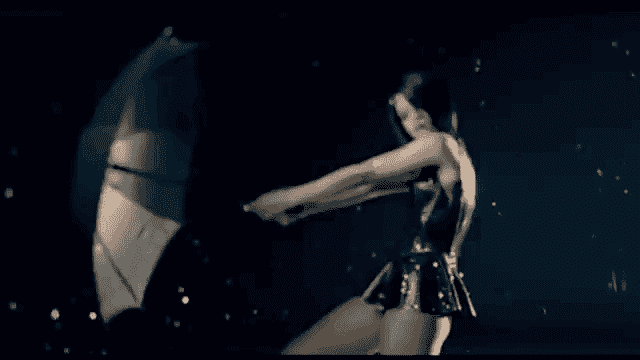
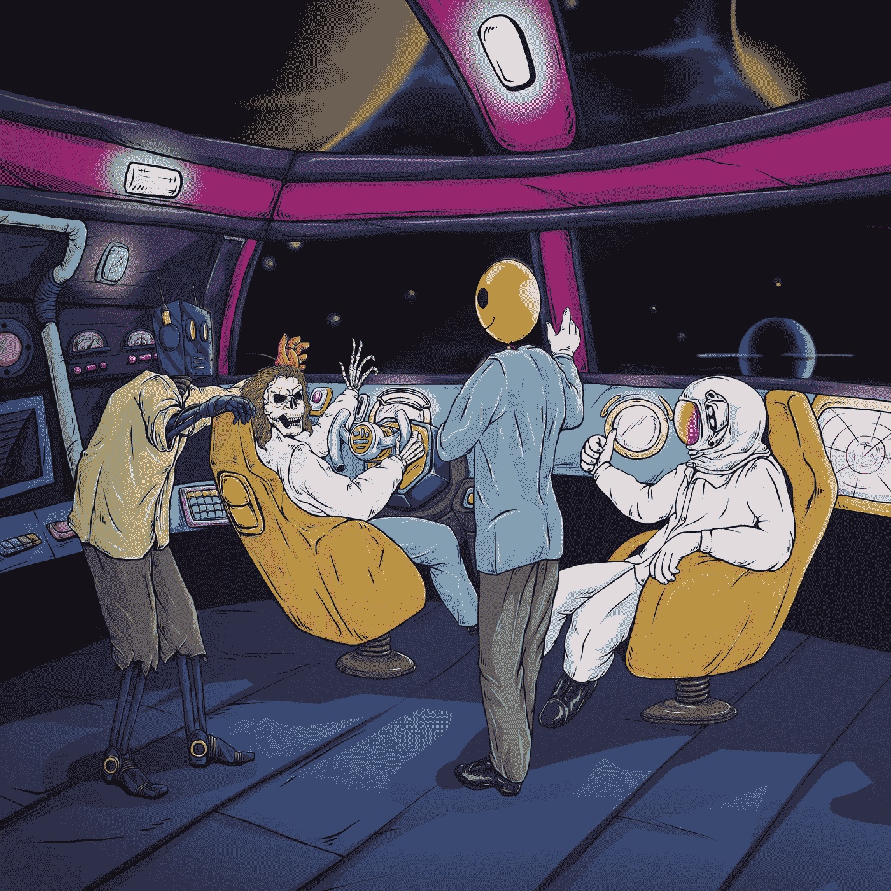

# DeFi 区—新的 Web3 Meta

> 原文：<https://medium.com/coinmonks/defi-district-the-new-web3-meta-7969dee4c128?source=collection_archive---------1----------------------->

**Gm。**你们中的一些人，尤其是我的被诅咒实验室的朋友，可能已经对 DeFi 区很熟悉了。但对于那些不了解的人来说，欢迎来到 web3/NFT 空间的最新元转变。

这里涉及的内容很多，所以我会尽力让它易于理解。讽刺的是，在我之前的[被诅咒的实验室纲要](/@irish_/cursed-labs-2-0-e4de188ad7ad)中写下了这句话，我没有忘记。不断变化的商业模式和雄心勃勃的扩展方法将使我以前的文章几乎完全过时。在短短几个月内，受诅咒实验室背后的创始人已经能够完全转向定位自己，进而定位他们的持有者，以实现长期可持续发展，并让持有者获得永远虚幻的被动收入，这在一开始就吸引了如此多的目光。

通过 IRL 房地产风险投资的方式，曾经是一个适度的 5k 集合和附属奖励，已经迅速发展成为任何区块链最雄心勃勃的项目之一。从 AirBnBs 和远大抱负，到未来十年仍有发展空间的多维业务，DeFi District 为一直存在的流行语“公用事业”赋予了新的含义。着眼于改变 NFT 空间的元，这绝对是一个值得观看的项目。

礼节到此为止，让我们变得怪异一点。

# **DeFi 区— Web3 集团**

DeFi District 是 web3 领域的一家新兴企业集团，以前以“诅咒实验室”的名义运营，与区块链的任何其他项目不同，它融合了数字和物理商业世界。最初的受诅咒实验室创始人梅塔(斯凯拉·坦斯利，罗斯科(拉法·洛萨)，和 4K(利奥*编辑*)，三人组成了现实世界的商业伙伴和企业家，他们着眼于将他们现实生活中的专业知识与一种独特的方法结合起来，以应对分散自治组织(DAO)爆炸式增长的 NFT 场景。

我不能代表所有人，我知道这违背了 web 3 的自治和去中心化精神，但我个人很感激能找到这样一个有着完全多元化团队的雄心勃勃的项目。知道我的投资去向有助于我晚上睡得好一点。透明度和公开对话是乐观的另一个原因。在一天中的任何时候，总会有人不和谐地帮助解决问题或担忧。对于新的悲观投资者来说，仅仅这一点就够了。

DeFi 区将作为被诅咒的实验室项目和所有其他项目的“母公司”。嗯，这么说吧，DeFi 区可能需要一把更大的伞。稍后会有更多的介绍。

# 团队:

Skylar (Meta) 是 DeFi District 背后的远见者、首席艺术家、前端开发人员和首席执行官。作为一个有创业背景的餐馆老板，Meta 一步步走向数字营销和咨询领域，作为一个有才华的团队建设者和项目负责人，他在 Web3 领域的声望越来越高。

*推特:*【https://twitter.com/metaknows】T4

**Rafa (Rusko)** 是一家房地产和短期租赁专业公司，拥有 5 年的从业经验和不断增长的投资组合。拉法在赌场值夜班后，发现了一些短期租赁的信息，于是全押了进去。不到三个月，他每月收入 4000 美元，并很快转为全职短期租赁，在此过程中建立了数百万美元的业务。Rafa 目前运营着几十个单元，几乎完全自动化，并提供付费咨询服务，是房地产领域的一支生力军。

点击这里查看他的房地产投资组合:https://knightandreign.com/

*在拉法的 YouTube 频道上找到一些有用的 STR(短期租赁)技巧在这里:*[*https://www . YouTube . com/channel/UC 3 stpvzwd 8 klbgwauqljgza/featured*](https://www.youtube.com/channel/UC3stPVzWd8klbGWAuQLJgZA/featured)

**利奥(4K)** 在 Skylar 工作了十多年，专长是网络和创意设计，专注于摄影、摄像以及为个人客户和耐克(Nike)和塔吉特(Target)等大品牌提供咨询。

三人组的目标是对当前的 NFT meta 进行全面改革，并作为严肃的建设者在 web3 领域建立声誉。随着多个合资企业已经开始运作，以及更多的方式，很容易理解为什么该集团已经获得了这么多的关注，在索拉纳 NFT 现场在这么短的时间内。

通过一种有机的、草根的方法来建立社区和营销，这是一种令人耳目一新的方式，我们在索拉纳空间并不常见，社区肯定开始注意到了。随着零报酬技巧或影响者营销慢慢进入越来越多的阿尔法渠道，这种热潮正在增长，而且理所当然。

# NFTs、PFPs 和…全球 Web3 统治地位？

你们中的许多人可能都熟悉被诅咒的实验室 NFT 项目，该项目利用现实世界的短期租赁套利为持有者提供附属奖励。曾经是雄心勃勃的路线图的面包和黄油已经迅速成为不断增长的馅饼中的一块。随着不断扩大规模，CL 项目的运营已经超出了最初的预期，这为许多独立的、已经投入运营的项目打开了大门，更多项目正在进行中。

由于整个 DeFi 区生态系统的增长，受诅咒的 NFT 实验室项目与最初的路线图相比发生了一些变化，现在将专注于更多的咨询/网络角色。

全栈 web3 咨询将提供给新项目，寻求在网络，营销，DOXXING 服务和项目本地令牌组学的专业化。诅咒实验室为萌芽中的 web3 项目提供全面的分析和指导，已经咨询了多个完全启动/准备就绪的项目，还有更多项目正在进行中。从新上线的项目中获得一部分薄荷收益、咨询费和版税，并迅速建立了推出新系列的成功记录，受诅咒实验室在新客户上线方面处于有利地位。

虽然短期租赁不再是诅咒实验室 NFTs 的运营功能，但它们将永远是 DeFi 区生态系统中持有者奖励的最大发射器。此外，还安装了通货紧缩机制，以便随着时间的推移减少收藏品的供应量。持有者可以选择焚烧(永久退出流通)一个诅咒实验室 NFT，以获得诅咒咨询服务或其他 DeFi 区业务的折扣。随着时间的推移，这一通缩指标将增加每个剩余的被诅咒的 NFT 实验室的价值。

根据最初的路线图，被诅咒的实验室将被标上股份，然后从各种被诅咒的实验室风险投资中获得一定份额的附属奖励。现在，实验室将扮演一个更简单的角色，成为新创建的本机令牌的主要焦点。 ***(剧透预警)***

你的诅咒实验室 NFT，除了保证白名单访问所有未来的 DeFi 区项目外，现在将被持有(从二级市场除名)以发出 DeFi 区的本地令牌，这反过来可以增加农场产量。稍后将详细介绍。

Cursed Labs — Moon Mission

当我们深入到 DeFi 区的所有企业时，将会有一个重复出现的主题，所以在我们深入到这些之前，我们将讨论一下将它们结合在一起的粘合剂。从短期房地产租赁到咨询和新系列上市，所有 DeFi 区企业都有一个共同点，披头士说得最好…

# **LUV 是你所需要的一切**

爱情和这有什么关系？

很高兴你问了。$LUV 是 DeFi 区及其所有关联企业的本地加密货币，也是亚米支付(一个 Web3 消费者对供应商生态系统，建立在亚米金融的无缝 UX 上)接受的首批数字货币之一。

亚米支付是不需要许可的，世界上任何有网络连接的商家都可以使用。

*更多关于亚米财经，及其简装论文* [*这里*](https://docs.yamipay.xyz/fundamentals/yami-litepaper) *。*

$LUV 是一种真实世界的多用途加密货币，由受诅咒实验室生态系统的相同创始人提供支持，专注于 DeFi 区的所有商业风险。通过亚米支付，餐馆、零售商店、度假租赁和基于服务的企业可以在几秒钟内建立他们的在线商店，并立即开始接受$LUV。

这就是你的诅咒实验室 NFT 发挥作用的地方。NFTs 将根据持有时间的长短获得 100 美元的 LUV，每季度空投一次.所以，对所有的钻石手工铸造者大声喊出来。你将感受到爱。

> 交易新手？尝试[加密交易机器人](/coinmonks/crypto-trading-bot-c2ffce8acb2a)或[复制交易](/coinmonks/top-10-crypto-copy-trading-platforms-for-beginners-d0c37c7d698c)

一旦你空投了$LUV，你就可以通过不同的锁定时间表来进一步增加收益，我们将在下面详细介绍。

**$LUV 供应细分:**

与任何代币一样，作为一种真正的加密货币，用例以及谨慎的代币流通方式将成为$LUV 市场可持续性的催化剂。

正如你所料，$LUV 将被 DeFi 区的各种商业企业所接受，包括在 web3 和现实世界中，为市场稳定提供了坚实的基础。在推出时有多种方式可以使用$LUV，在生态系统内合并了 Web3 和 IRL 用例，包括度假租赁、全方位服务餐厅、动画、营销和咨询服务，$LUV 将以前所未有的新货币价值推出。

一些你在索拉纳·NFT 领域不会经常看到的东西，$LUV 由真正的流动性支持，通过 DeFi 地区保护伞下的 IRL 风险投资。回购和战略注入将有助于维持市场价值和减少抛售压力。这不仅仅是另一个 SPL 代币。这是钱。

# 文 lov？

$LUV 将于 6 月 24 日举行首次私人 IDO，以$LUV 代币造币厂的方式发行。

$LUV 将以 100 个为一组出售，采用 10k 高质量 NFT 的形式，构成 100 万个 IDO 的初始供应量。每个 NFT 将被降 100 美元。

代币将在 USDC 铸造，采用分级定价体系，具体如下:

被诅咒的刀= .50 = $50 换 100 LUV
实验室持有者= .70 = $70 换 100 LUV
选择刀的= .80 = $80 换 100 LUV
公众= .90 = $90 换 100 LUV

简而言之，买家将根据各自的定价制造 LUV NFTs。例如，受诅咒的道成员将铸造价值 50 美元 USDC 的 NFT，每个代币在 IDO 后的 30 天内用于从一个安全的网站申领$LUV 奖励。预计所有索赔将最终确定并分发给持有人，完成索赔可能需要 2 周时间。

在首次 DAO 发售后，LUV 将会提供给受诅咒实验室的持有人，并作为持有人奖励每季度空投一次。然后，持有人可以在 30 天、60 天和 90 天的锁定期内，以不同的时间表出售他们的 LUV，以赚取更多的 LUV。此外，收益将根据持有者乘数而有所不同，以诅咒道令牌和舒适角落 NFT 的形式。正如你所料，这些 LUV 乘数需求很高，进入这两种令牌的成本越来越高。

*   *这些 LUV NFTS 目前还没有 IDO 后的效用，但不和谐中有一些喋喋不休的说法，这种情况以后会改变，所以即使在最初的 LUV 下降发生后，保留它们可能也是明智的。*

**快速触摸舒适角落/诅咒令牌实用程序:**

**COZY CORNER—**Cozy Corner DAO 不仅是 DeFi 区生态系统的“OG”NFT，还被授予所有未来收集和合作项目的白名单访问权限，每年可免费入住 DeFi 区度假租赁物业 3 天，并在 LUV 产量农业中发挥乘数作用，COZY CORNER DAO 获得了 100 万美元的 LUV，每个 NFT 可获得 2 万美元的 LUV。这一分配将在未来几年内逐步提供给持有者，以防止市场抛售。

随着所提供的效用和初始的$LUV 估值设定为每 1 LUV 1 美元，你可以很容易地看到舒适角落是如何被大大低估的，即使是在 150 SOL。截至目前，索拉纳价格徘徊在 35 美元左右。以 150 索尔的底价，并假设$LUV 可以简单地维持其 IDO 估值(甚至不超过它)，一个舒适角落的隐含价值在其分配过程中约为 400%，这甚至还没有提到它在 LUV 产量农业中持有的 300%的乘数价值。一个真正的长期持有，这应该没有问题提供投资回报率给投资者。如此有限的供应量(仅铸造 50 把)和一把忠实的钻石拳头舒适刀，进入已经是一个困难的命题。到目前为止，二级市场上只有两个舒适角落 NFT。

**被诅咒的令牌—** 令牌作为主要的 DAO 进入令牌，以及对合作项目白名单的独占访问权，以及对 DeFi 区所有努力的早期访问权。此外，通过新的 10k pfp 收集，每个令牌将被授予另一个 DAO 进入令牌，其中前 550 个 NFT 将授予 DeFi 区 DAO 的访问权(500 个给受诅咒令牌持有者，50 个给舒适角落持有者)。

这些 DAO 代币将作为$LUV 生态系统中有价值的筹码，售价远低于隐含的长期价值。用 4 个诅咒代币，或者 1 个诅咒代币和 1 个舒适角落 NFT，你可以通过乘数最大化你的$LUV 收益。如下表所示，诅咒令牌是 LUV 生态系统的另一个有价值的关键。在几个收益率周期内，假设$LUV 保持或超过其 IDO 估值，受诅咒的代币可以按当前市场价格支付自己。

*看看下面的产量养殖结构:*

***截至本文写作之时:***

***诅咒令牌—*** *100%乘数— 21 索尔—只列出 19 个*[*https://magiceden.io/marketplace/cursedtoken*](https://magiceden.io/marketplace/cursedtoken)

***惬意的角落 NFT—*** *300%乘数—150 索尔—只列出 2 个*[*https://magiceden.io/marketplace/cozycorners*](https://magiceden.io/marketplace/cozycorners)

# **LUV 合作伙伴——共享生态系统**

虽然$LUV 将仅在 DeFi 地区生态系统中提供，但 LUV 的微型版本将提供给更广泛的$LUV 生态系统中的合作伙伴项目。

选择项目将能够购买$LUV，反过来，提供一个细分版本，奖励持有人在其收集的路线图内的各种活动。更多信息请见下文:

例如，LUV 合作项目，如阿尔法法老和突变矿工鼠，将提供细分子硬币(分别为 aLUV/mLUV)，价值为 1 美元 LUV 的 1/1000。

这些合作伙伴项目将有一个独特的机会来奖励其持有人一种真实价值的、不断增长的加密货币，可以在项目生态系统中使用，或作为真实世界用例的货币，而不是创建另一种背后没有流动性的治理令牌。这将形成一种比你在索拉纳 NFT 空间中可能习惯的传统赌注/抽彩元更有趣的动态，并将有助于$LUV 生态系统的稳定，并随着时间的推移有助于硬币的价值。

排放$LUV 的项目持有者可以成为生态系统中唯一一个用$LUV 奖励交换 USDC 的项目。或者更好一点，把那$LUV 换成*【LUV】，然后以后再换成 USDC。这种流动性得到了 DeFi 地区业务收入以及$LUV 合作伙伴宏观生态系统的支持，后者一直计划从自己的一部分版税中注入资金，并根据需要制定回购策略。*

***$LUV** 将是首批总部位于 NFT 的加密货币之一，将在全球真实世界中使用，这要归功于与亚米金融的官方旗舰合作伙伴关系，这是一个无需许可的区块链商家/消费者供应商套件，任何人只需一个钱包地址就可以在几秒钟内设置好。*

*随着 DeFi District 的所有当前和未来风险投资反馈到$LUV 流动性，以及稳定的现实世界和数字用例，毫无疑问，令牌可以与该领域中一些更强大的本地项目令牌竞争。真正的流动性，结合扩大 DeFi 地区商业风险的积极方法，以可靠地支持持有人的回报，应该是元变化的，我完全期待更多的项目在未来几个月采取类似的策略。利用真实世界的业务来支持加密投资以降低波动性将是今年 NFT 空间的一个增长趋势，DeFi 区建立一个可行的加密货币是朝着这个方向迈出的第一大步。*

# *效用，效用，效用…*

*索拉纳空间中最新的，也许是持续时间最长的一个元是“效用”。“我的 NFT 能为我做什么？”当我们第一次登录新的 discords 时，这是一个越来越常见的问题。温兰博的日子还没有被完全遗忘，但至少我们已经开始提出正确的问题。现在我们终于朝着正确的方向前进，期望团队交付路线图，并为在 PFPs 上花费的钱提供价值，也许你可以比你想象的更快地获得蓝宝。就算只是租的，我们也不会说出去。；)*

*DeFi 区，以及$LUV，正在将“实用性”带到 NFT 空间的新高度。随着多个独立的商业企业在一个统一的令牌下运营，这种新的加密硬币将不会缺少使用案例。*

# ***迈开大步***

**

*相对而言，最初的诅咒实验室项目开始时并不起眼。该公司计划经营短期租赁业务，并向投资者发放分支机构奖励。*

*从这些不起眼的开始，该项目已经发展成为生态系统中一个独立的、成功的实体，已经有几十个单元在运行，并计划在未来进行更多的收购。*

***欢迎大步前进。***

**

*STRide 是最初 CL 项目的短期租赁分支，将作为生态系统中的独立实体运营。这是 DeFI 区及其所有企业反复出现的主题。每个企业都将作为一个单独的实体运营，同时通过流动性稳定整个$LUV 生态系统。*

*STRide 将利用租赁套利模式，对于不熟悉的人来说，这种模式是长期出租/租赁一个物业或单个单元，并在短期基础上转租该物业，在许多情况下租金为每晚数百美元。*

*这种商业模式不仅完全合法，而且可能非常有利可图，可扩展。只要产权人同意，任何人都可以操作套利模型。近年来，它越来越受欢迎，成为购买和出售房产的一种可行的替代方式。没有与房地产所有权相关的沉重的启动成本，租赁套利正成为企业家的首选房地产项目。*

*截至本文撰写之时，STRide 已有 54 个单元的组合，更多单元正在建设中，所有单元都接受$LUV 住宿。*

*除了代表持有人运行商业模式之外，STRide 还将提供全面的 VIP 套餐，向希望开始自己的 STR 业务的投资者教授该系统，在短期房地产游戏中提供全面的教育和指导。再说一次，诅咒实验室的 NFT 可以被烧毁，以获得这些服务的折扣。*

****

# *将 Web 3 带入生活:*

**

# *失真状态(DiStu)*

*Distortion Studio 是一家跨链品牌和营销机构，专注于平面设计、网页开发/设计、SEO/SEM、艺术生成、动画(2D/3D)和视频。DiStu 提供一整套营销服务，旨在为您的产品、服务或业务增添高端美感。*

*工作室充满了专门的专业创作者，他们专门从事全栈网页设计，平面设计，动画，销售和包装，有能力创造你的整个品牌从 A 到 z。*

*我们正在谈论皮克斯质量的动画。看看这里的一个例子:
[https://www.youtube.com/watch?v=lbLGSlKJ2Fg](https://www.youtube.com/watch?v=lbLGSlKJ2Fg)*

**

*DiStu 已经开始运营，目前正在为索拉纳区块链的客户提供服务，并将于稍后发布 NFT 系列，该系列采用强大的品牌和市场策略，以确保增长和公众需求。*

*对于那些比较随意的 jpg 收藏者来说，DiStu 提供了一项 NFT 动画服务，允许任何人把他们喜欢的静态图像变成现实，可以通过$LUV 购买。*

**那里有猴子吗？**

**

*Holder: Snooze*

**Boryoku 龙？**

**

*或者也许你在太阳机器人公司工作？*

**

*无论你的蓝筹偏好是什么，DiStu 都能满足你的动画需求。*

# *Shopify…但要做成 Web3*

**

*DiStu Market*

*DiStu Market 不是典型的 NFT 市场，它专注于授权商家使用 web 3 电子商务，允许他们在任何区块链上购买、销售、交易和运送他们的商品或服务。*

*商家可以上传数字服务，展示照片、视频和产品展示，还可以通过 Twitter 添加描述和标记客户。卖家和买家将有机会立即评价和审查每笔交易。经销商可以通过获得正面评级来获得认证徽章。经过验证的商家将被推荐到平台上，并被添加到“主市场”中。徽章系统将鼓励信任，让买家安心。*

# *如果我们不德根，它甚至是 Web 3 吗？*

**

*DeFi Games 以前是德根竞赛公司，是 DeFi 区最新收购的公司之一。*

*DeFi Games 将提供购买蓝筹 NFT 彩票的机会，在现场拍卖中出价，或玩游戏赢取奖品。所有这些都可以用$LUV 购买。*

**

*部分收入将回到稳定 LUV 的流动资金池，而 50%的游戏收入回到 DeFi 游戏 NFT 的持有者手中。*

*到目前为止，DeFi Games 图腾的稀有性对收入份额没有影响，但是据说团队已经计划很快以某种方式奖励更高稀有性的令牌。*

*图腾的当前底价——4 索尔*

**

# *德根零食*

**

*Degen Munchies 是一家完全运营的素食餐厅，位于加利福尼亚州奥兰治县，最近暂时关闭，进行全面翻新和接受 web3 整容。德根小吃不仅将成为 web3/crypto 爱好者的共享空间，而且正如你所料，该餐厅将接受加密支付，成为首批已经运营的餐馆之一。*

****

*即将推出的 VIP Munch Pass NFT 正在筹备中，为持有人提供食品、饮料、娱乐等折扣，稍后将公布更多优惠。*

## **正在进行的工作的潜行高峰 PFP:**

**

*团队的快速推介:*

**“德根小吃 NFT 是一个 5k 的吃赚集合，建在 Defi 区，由$LUV tokenomics 提供动力。这个项目是由 doxxed 专业餐厅老板创立的，他们正在开南加州第一家基于 web3 的餐厅、酒吧和酒廊。他们的主要关注点是为消费者开发现代方式，以支持垂死的餐馆+酒店业。**

**持有者将开始以创造性的方式支持他们当地的餐馆，并通过$LUV 获得回报。其他独特的实用工具包括所有德根小吃店的食物、甜点和酒类等商品的终身优惠券。”**

*很明显，这个系列一开始会以当地为重点，但我不排除在未来十年里看到德根小吃店在你的城镇出现的可能性。如果这个 NFT 可以被证明是一个成功的风险投资，将餐厅场景与加密货币和 web3 融合，我毫不怀疑我们会看到这个风险投资的扩张，无论是德根特许经营，还是另一个通过咨询提供的蓝图引起轰动的连锁店。随着 STRide 组合的国际租赁单位被选中，在这些度假租赁区探索德根快餐的特许经营机会是非常有意义的。长期关注这一点。*

# ***DeFi 折扣***

*最近对 Blue Pond Studios 的收购，以及随后对 DeFi Discounts 的更名，将提供一个新的低成本 10k 系列，其功能类似于 IRL 优惠券书，国际机构将通过不断增长的国际健身房、餐厅、租赁和电子商务商家网络为世界各地的持有者提供使用。*

*一个完整的失真工作室重新品牌和更多的细节正在路上。*

# ***建筑商建造***

*在过去的几个月里，DeFi 地区团队一直在低调地建设，而 Solana space 慢慢地开始引起人们的注意。DeFi District 正在从头开始构建一种加密货币，为主要系列增加效用和价值，并收购新项目来提振投资组合，同时进一步扩大和稳定整个生态系统。DeFi 团队已经证明，现实世界的业务和 web3 ventures 的合并不仅是可行的，而且对于新入职项目的稳定性是潜在必要的。这应该是这一领域未来发展的一个迹象，对于能够正确执行的项目来说，有大量的上升空间。我们已经开始看到该领域涌现出试图在类似模式下运作的项目。团队不再仅仅依赖 mint capital 在发布后构建基础设施，而是建立运营业务实体，以确保稳定、长期的收入流来支持(和资助)路线图。这个策略确保团队准备好在发布时立即构建，不管 mint 成功与否。*

*DeFi 区生态系统最容易被忽视的一个方面是，主要的 5k 集合(被诅咒的实验室)价格行为与持有者几乎完全无关。虽然大多数 pfp 团队都在努力创造新的方式来推动二级市场的炒作和需求，但出于为未来计划提供资金的纯粹必要性，DeFi 地区团队依赖于诅咒实验室 NFT 的效用来提供自己的价值，从而产生了索拉纳区块链上最被低估的 NFT 项目之一。推而广之，在任何区块链上，整个 DD 生态系统都比大多数其他 NFT 项目更能承受多变的市场条件。*

*诅咒实验室的 NFTs 底价可能会降至零，而不是购买一个希望以后转手的 pfp，根据其美元的 LUV 收益率，仍然可能比目前市场上许多过度炒作的 pfp 藏品更有价值(和流动性)。正如我们在过去几个月的索拉纳·NFT 空间中一直看到的，“效用”对投资者来说越来越重要。你不会发现许多公用事业比流动性资产更受欢迎，比如可行的加密货币。*

****免责声明:*** *这篇文章是我在尽最大努力解读路线图、公告和 AMA 团队时写的。在这篇文章和官方的团队声明之间可能有一些小的不一致，在这种情况下，我会尽快编辑和解决它们。我不为 DeFi 区或其任何子公司工作。**

****最后一个注意事项*** *:这些东西有些是会变的。Meta 以“承诺不足，交付过多”而闻名。如果上面提到的一些特性随着时间的推移会有所改进，这并不奇怪。**

**一如既往，这不是财务建议，你应该在投资任何项目之前做好自己的研究。**

*朋友们，月亮上见。*

> *加入 Coinmonks [电报频道](https://t.me/coincodecap)和 [Youtube 频道](https://www.youtube.com/c/coinmonks/videos)了解加密交易和投资*

# *另外，阅读*

*   *[CoinDCX 评论](/coinmonks/coindcx-review-8444db3621a2) | [加密保证金交易交易所](https://coincodecap.com/crypto-margin-trading-exchanges)*
*   *[红狗赌场评论](https://coincodecap.com/red-dog-casino-review) | [Swyftx 评论](https://coincodecap.com/swyftx-review) | [CoinGate 评论](https://coincodecap.com/coingate-review)*
*   *[Bookmap 评论](https://coincodecap.com/bookmap-review-2021-best-trading-software) | [美国 5 大最佳加密交易所](https://coincodecap.com/crypto-exchange-usa)*
*   *[如何在 FTX 交易所交易期货](https://coincodecap.com/ftx-futures-trading) | [OKEx vs 币安](https://coincodecap.com/okex-vs-binance)*
*   *[CoinLoan 评论](https://coincodecap.com/coinloan-review) | [YouHodler 评论](/coinmonks/youhodler-4-easy-ways-to-make-money-98969b9689f2) | [BlockFi 评论](https://coincodecap.com/blockfi-review)*