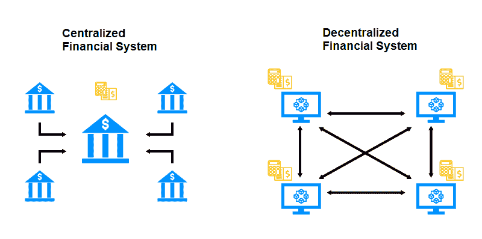
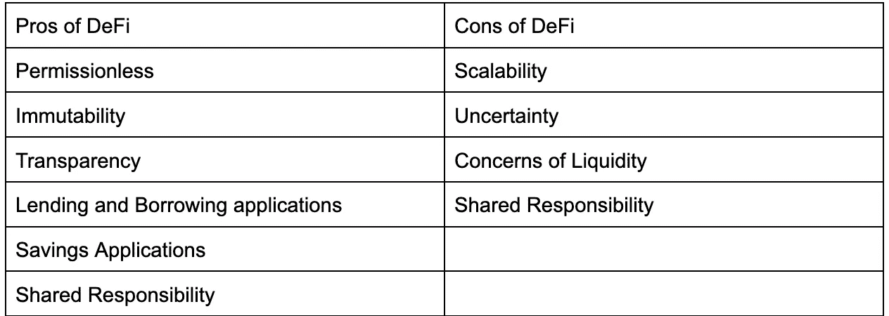
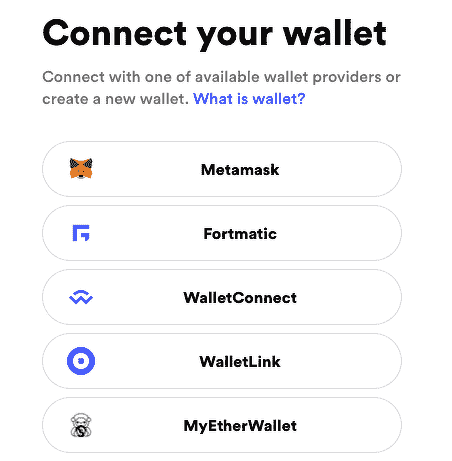
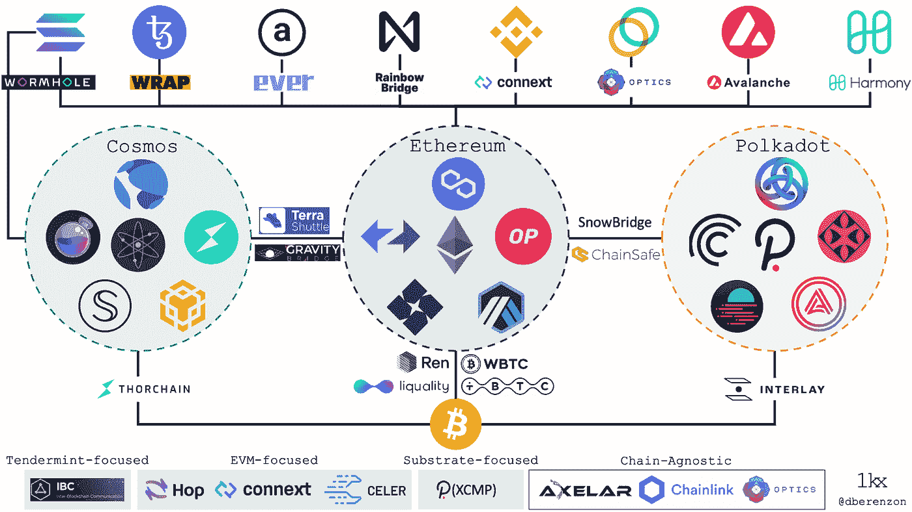
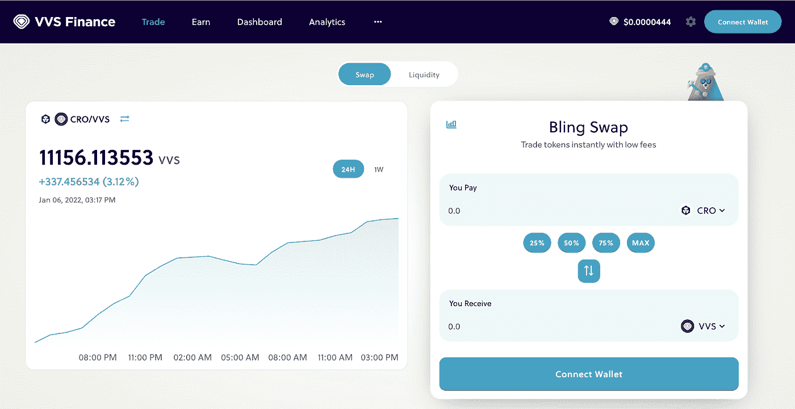
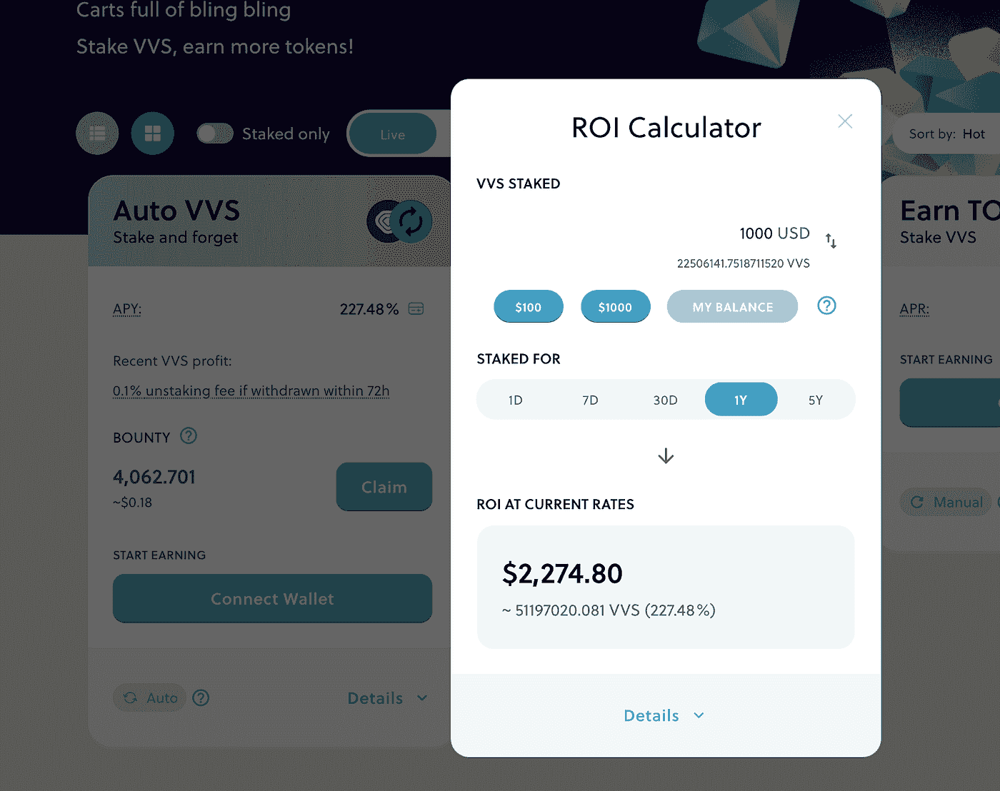

# DeFi 交换指南-101

> 原文：<https://medium.com/coinmonks/defi-exchange-guide-the-101-c0eb564bd727?source=collection_archive---------40----------------------->

## 你进入 DeFi 世界的向导

# 什么是 DeFi

De=分散的

Fi=金融

De+Fi=分散金融

中央集权金融指的是控制资金流动的中央权力机构(政府和银行)。他们可以阻止你借钱，阻止你有银行账户，他们可以印更多的钱。

去中心化金融，Defi，没有银行，取而代之的是运行的代码片段，对任何人开放。

DeFi 可以抵御审查，而且比传统的集中融资便宜得多。

分散金融建立在三个主要因素之上，

1.  密码系统
2.  区块链技术
3.  智能合同

# 定义利弊

# 钱包

钱包允许发送、接收和存储加密货币。这里是各种形式的钱包。

*   浏览器扩展
*   五金钱包
*   移动应用程序
*   网络钱包

DeFi 友好型钱包有助于管理您的数字资产，并与 DeFi 应用程序进行交互，如分散式交换或借贷协议。

DeFi 用户可能最熟悉 Metamask。

**其他钱包**

*   信任钱包。
*   币安智能连锁
*   Crypto.com DeFi 钱包

# 开始你的 DeFi degen 之旅

如果你熟悉的话，DeFi 在加密领域最常见的用例可能是分散交换或 DEX。

分散式交易所(DEX)是一个连接加密货币买家和卖家的点对点(P2P)市场。

与集中式交易所(cex)不同，分散式平台是非托管式的，这意味着用户在 DEX 平台上进行交易时，仍然控制着自己的私钥。

# 我们什么时候使用 DEX？

[图片](https://gadgets.ndtv.com/cryptocurrency/opinion/defi-decentralised-finance-exchange-dex-top-5-2645666)

许多人认为 DEX 路线是一条*【德根】*路线的原因是因为我们可以在那里找到令牌列表。

集中交易所通常会审查每一个代币，并确保它们在上市前符合当地法规。

分散的交易所可以包括任何在区块链铸造的代币。新项目可能会先在这些交易所上市，然后才能在它们的集中交易平台上市。

在密码中，许多人渴望 100 倍的收益，你赢了；这在集中交易中是找不到的。DeFi 是一个人早期进入并希望有一天，token 会看到巨大收益的地方。

当然，交易者可以尽可能早地进入项目，但这使人容易受到 dex 上各种骗局的影响。

一个常见的骗局是“拉地毯”，当价格上涨时，项目背后的团队抛售这些交易所池中用于提供流动性的代币，使其他交易无法出售。

# DeFi 和被动收入

你知道我们一直听到的“[被动收入](/@thenimblenovice/how-to-yield-farm-stake-crypto-assets-for-passive-income-2022-5a4c085423d0)”吗？这通常指的是赌注，即区块链通过一种名为“赌注证明”的共识机制，让你的持股发挥作用，以确保所有交易都得到验证和安全。作为回报，你赚取利息。

这适用于戴、、等稳定硬币以及 DOT、LUNA、SOL 等顶级硬币。但是这些不会给你疯狂的治疗。

然而，德根代币有。

一个简单的例子:

赌注溶胶可以给你 7-8%之间的 APY。赌注 VVS 给你 227.09%的 APY。明白为什么现在人们被 DeFi 吸引了吗？

太好了！

现在来说说怎么换币。

# 步骤 1:将密码从交换机发送到钱包

为了向 MetaMask wallet 接收/发送您的资产，您需要填写正确的地址。在将代币从交易所发送到您的地址之前，请确保对您的元掩码钱包地址进行四次检查。如果地址/区块链不正确，您可能会丢失代币。

当你从币安发送代币时，它会询问你是想作为 BEP20 还是 ERC20 代币发送。向您的以太坊地址发送 BEP20 代币可能会导致损失。

# 第二步:搭桥

[图片](/1kxnetwork/blockchain-bridges-5db6afac44f8)

您不能直接从交易所向 Fantom 或 Polygon 等侧链发送令牌，您需要首先将它们发送到以太坊网络(因为它们都是与以太坊区块链挂钩的侧链)。一旦收到，你可以把它们连接成多边形。官方侧链可以在 coingecko 上找到。

# 第三步:交换

人们通常会交换，因为他们不能直接购买代币(如 VVS)。

交换允许用户用一个令牌交换另一个令牌。他们只需选择他们希望交换的两个代币以及数量。在这种情况下，把 CRO 换成 VVS。

首先，你必须从交易所购买一些 CRO，并把它存入你选择的钱包。对于 Crypto.com，他们有自己的 DeFi 钱包，使整个体验非常无缝。

# 第四步:立桩

现在你已经将 VVS 收入囊中，你可以继续用它来赚取在 VVS 支付的“被动收入”。

例如，以 227.48%的 APY 投资价值 1000 美元的 VVS，一年后你会得到 2，274.80 美元。

要获利，你只需把它换回你喜欢的硬币，然后卖掉它！

听起来有点复杂，但是通过练习你会找到窍门的。

# 流动性池

最简单的 DeFi 流动性池持有智能合约中的两个代币，以形成交易对。

就说以太(ETH)和美元币(USDC)为例。ETH 的价格可以相当于 1000 USDC。流动性提供者向资金池贡献同等价值的 ETH 和 USDC，因此存入 1 ETH 的人必须拿出 1000 USDC 与之匹配。

资金池中的流动性意味着，当有人想交易 USDC 时，他们可以根据存入的资金进行交易，而不是等待对手来匹配他们的交易。

流动性提供者因其贡献而受到奖励。当他们存款时，他们会收到一个代表他们的股份的新代币，称为池代币。在本例中，池令牌将是 USDC/ETH。

使用资金池交换代币的用户所支付的交易费用份额，将根据其持股规模，自动分配给所有流动性提供者。因此，如果 USDC-联邦储蓄银行资金池的交易费用是 0.3%，流动性提供者贡献了资金池的 10%，他们有权获得所有交易总价值 0.3%的 10%。

当用户想要提取他们在流动性池中的股份时，他们可以烧掉他们的池代币并提取他们的股份。

> 加入 Coinmonks [电报频道](https://t.me/coincodecap)和 [Youtube 频道](https://www.youtube.com/c/coinmonks/videos)了解加密交易和投资

# 另外，阅读

*   [如何在 FTX 交易所交易期货](https://coincodecap.com/ftx-futures-trading) | [OKEx vs 币安](https://coincodecap.com/okex-vs-binance)
*   [CoinLoan 评论](https://coincodecap.com/coinloan-review) | [YouHodler 评论](/coinmonks/youhodler-4-easy-ways-to-make-money-98969b9689f2) | [BlockFi 评论](https://coincodecap.com/blockfi-review)
*   [XT.COM 评论](https://coincodecap.com/profittradingapp-for-binance)币安评论 |
*   [SmithBot 评论](https://coincodecap.com/smithbot-review) | [4 款最佳免费开源交易机器人](https://coincodecap.com/free-open-source-trading-bots)
*   [比特币基地僵尸程序](/coinmonks/coinbase-bots-ac6359e897f3) | [AscendEX 审查](/coinmonks/ascendex-review-53e829cf75fa) | [OKEx 交易僵尸程序](/coinmonks/okex-trading-bots-234920f61e60)