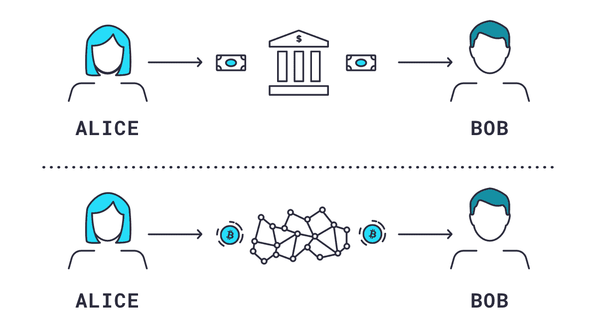
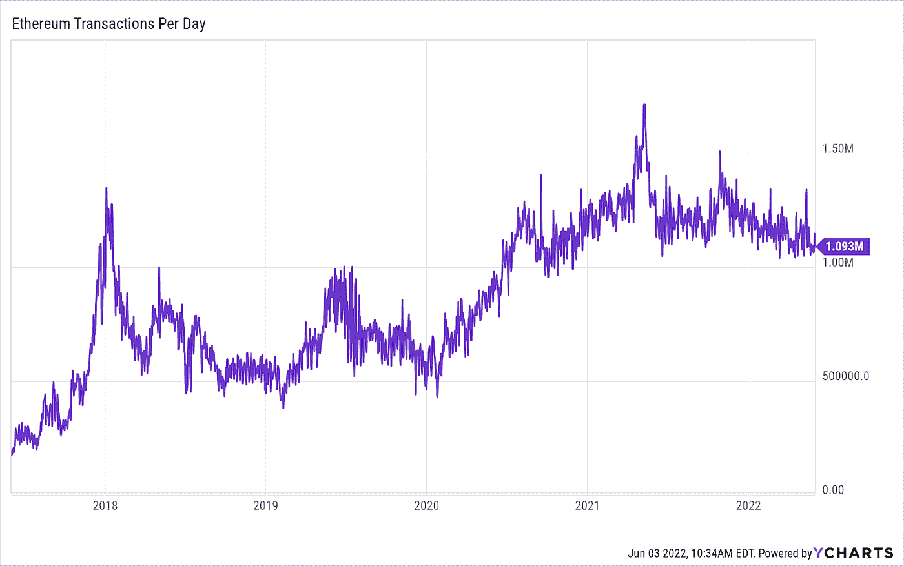
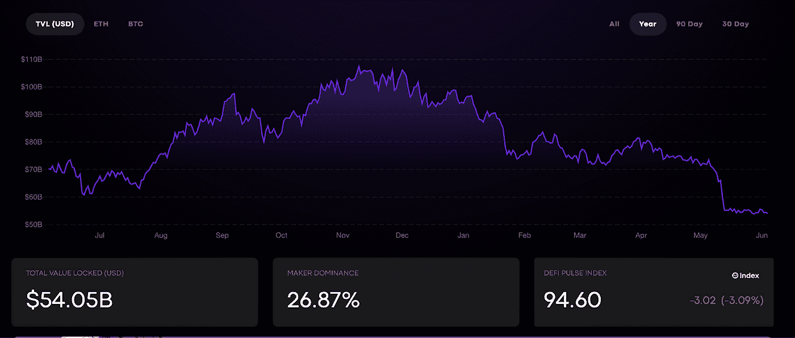

# 傻瓜的定义:理解分散金融

> 原文：<https://medium.com/coinmonks/defi-for-dummies-understanding-decentralised-finance-9ad0e79d6af6?source=collection_archive---------5----------------------->

区块链是一项颠覆性的技术，它已经开始彻底改变你做事的方式。从公司的结构，到帮助你将你的爱好货币化，再到建立一个可以让你在线交易的无信任支付系统。金融业没有被排除在外，区块链正在改变你如何花钱、如何借贷以及如何从储蓄中赚钱的游戏。

DeFi——分散金融，是区块链的几个用例之一，其目的是建立一个独立于中央银行和政府的金融系统。只需一部智能手机和互联网，你就可以拥有一个银行账户，在世界各地转账，没有任何限制。

要完全理解 DeFi，重要的是你要掌握传统金融系统是如何运作的。

在中央银行系统中，你所有的储蓄和金钱都由公司实体(银行和第三方)持有和控制，其主要目标是用你的钱赚钱。事实上，一些银行系统的设计方式是，你付钱给银行，让银行为你保管你的钱(以不同的收费和交易费的形式出现)。Investopedia 将中央金融系统描述为“充满了第三方，他们促进各方之间的资金流动，每一方都为使用他们的服务收取费用。例如，假设你用信用卡买了一加仑牛奶。费用由商家支付给[收单银行](https://www.investopedia.com/terms/a/acquirer.asp)，收单银行将卡的详细信息转发给信用卡网络。

同样在传统金融中，银行可以拒绝你开户，拒绝你贷款，即使你有抵押品，拒绝你每天可以从你的账户中提取多少。

DeFi 是这一旧系统的替代方案，它是一个分散、透明且易于访问的金融系统，可以提供公平的竞争环境。

到现在为止，你一定在想，DeFi 是什么？DeFi 的重要性是什么？我的一些读者可能想知道 DeFi 的未来是什么？在本文的后半部分，我将进一步深入细节并回答您的所有问题。

# 什么是 DeFi？

分散金融——简而言之，DeFi 没有单一的定义。

> 不同的加密货币分析师和研究人员以不同的方式定义它。在他关于 DeFi 的著名著作《去中心化金融:基于区块链和智能合约的金融市场》中，Fabian Schar 将 DeFi 定义为**“建立在以太坊区块链之上的替代金融基础设施。DeFi 使用智能合约创建协议，以更加开放、可互操作和透明的方式复制现有的金融服务。”**
> 
> 此外，根据 Krzysztof Marecki 和 Agnieszka Wo jcik-Czerniawska 发表的期刊，他们比较了集中融资和分散融资，他们说"**另一方面，DeFi 是全球性的。这是因为它是基于一个公开的区块链。世界上任何地方的任何人都可以使用它。而不管参与者的国籍或居住国。由于区块链本身是分权制的，因此不能将任何管辖权直接强加于它。”**

将这两个定义结合在一起，可以安全地将 DeFi 定义为建立在区块链上的金融产品和服务的集合，允许您在没有中央机构或第三方授权或拒绝您访问服务的情况下执行金融交易。

【Gemini.com】图片来源:T2

*上方的图示描绘了传统的金融体系(中央集权金融)，而下方的图示描绘了 DeFi。*

# DeFi 为什么重要？

想想通常的传统银行是如何运作的。DeFi 提供了一种替代方式来做银行和其他金融机构所做的事情——购买保险、快速获得贷款、加密储蓄、外汇兑换(在这种情况下，即时代币兑换)、国际汇款等等。

让我带您了解一下分散式金融的主要现实应用:

# **1。稳定的声音**

加密货币的主要用途之一是作为一种交换或价值储存手段。波动性是加密领域的常见现象，保持流动性并尽可能避免价格波动可能是一项艰巨的挑战。这就是稳定硬币发挥作用的地方。

稳定硬币保持稳定的背后概念是，它们的价值得到了另一种金融工具的支持。我们有由法定准备金支持的稳定存款，如 TUSD。我们有由其他加密货币支持的稳定硬币，例如马可道的戴。我们也有算法支持的稳定点，比如 UST。

由于稳定债券的稳定性特征，它们最受贷款人的青睐，也是投资者和交易者的价值储存手段。

# **2。分散式交易所**

交易所是促进加密货币买卖的平台。这意味着你可以轻松地将你的比特币兑换成 USDT，或者将你的索拉纳兑换成以太坊。币安、库币、比特币基地等是常见的交易所类型。然而，这些交易所也有它们的缺点，那就是它们是中央集权的:它们有一个中央集权的权威，就像传统的金融系统一样。这就是分散交易所发挥作用的地方。他们允许用户在没有第三方参与的情况下买卖和控制他们的钱。这种操作方法使得操纵加密货币的价格变得困难，减少了黑客攻击和盗窃，因为没有中央机构监管资产。

常见的 dex 有 [Uniswap](https://uniswap.org/) ， [Pancakeswap](https://pancakeswap.finance/) ， [Opensea](https://opensea.io/) 。

# **3。借贷**

想想在传统的金融机构获得贷款，你必须提交贷款申请，等待几天甚至几周，然后信贷员才会决定你是否有资格获得贷款。DeFi 通过省去中介(信贷员和银行)解决了这个问题，并缩短了获得贷款所需的等待时间。

像 [Compound、](https://compound.finance/) [Aave、](https://app.aave.com/) [Solend、](https://solend.fi/) [Oasis Borrow](https://oasis.app/borrow?lang=en) 这样的 DeFi 协议允许你在借出加密货币时赚取固定利息。此外，您只需点击几个按钮，就可以轻松地以固定且优惠的利率用您的数字货币借款。

# **4。分散保险**

几乎无法想象传统金融提供的任何服务是 DeFi 无法提供的。分散保险的工作方式类似于传统保险的工作方式。这是一种确保你在加密空间中不可预见的情况的方法。你可以防止钱包被盗、外汇被盗、硬币稳定性失效、智能合约失效等。

就像在传统金融中一样，你向 DeFi 保险公司支付一笔保费，以防范任何不可预见的风险。但与传统金融不同，你在这里支付的保费被锁定在保险提供商(保险公司)提供的资金池中。 [Nexus Mutual](https://nexusmutual.io/) 、 [Bridge Mutual](https://bridgemutual.io/) 和 [Insure DeFi](https://insured.finance/) 都是保险提供商的例子。

# **5。高产农业**

高产农业是 DeFi 的一个有趣的使用案例，因为它可以给你的投资组合带来提升。这种方法是密码持有者用来最大化他们的回报。把它想象成你在你的储蓄账户上获得了回报。像 Curve Finance 这样的收益农业平台，Aave 通过在一定时期内持有其他代币来奖励你密码。

让我解释一下它是如何工作的

如果你是某种代币的长期持有者，例如你计划持有 100 单位的索拉纳代币 1 年或更长时间。如果索拉纳的市场价值增加，除了获得可观的增值外，如果你将 100 单位的索拉纳代币投入流动性池，而不是放在普通的钱包里，你还可以获得额外的利润。

您将获得的奖励由智能合约根据流动性提供者自动计算。

# DeFi 的缺点

我认为谈论 DeFi 的优势而忽略用户在使用 DeFi 产品时必须注意的风险是不公平的。DeFi 作为一个新兴领域有其缺点，其中一些可以忽略不计，可以随着生态系统的发展而得到解决。尽管如此，值得一提的是以下缺点:

# **1。有限的可扩展性**

**数据来源:YCharts**

DeFi 智能合约大多建立在以太坊区块链上，一般认为这个区块链所遭受的限制将直接对 DeFi 生态系统产生影响。以太坊区块链经历的主要挫折之一是有限的可扩展性。从上面的图表中，您可以看到以太坊区块链每天处理的交易数量在 1，000，000 到 1，500，000 之间，以秒为单位，每秒钟处理 13 到 17 笔交易。

DeFi 仍处于早期阶段，随着生态系统采用率的增加，交易数量将每天增加。这意味着每个用户将不得不竞争区块链上的有限空间，这可能导致堵塞并导致交易处理时间的延迟。

# **2。每笔交易更高的汽油费**

从上述第一点来看，以太坊区块链上用户的增加意味着需要处理的交易数量的增加。众所周知，你必须在区块链支付天然气费(交易费)，这意味着你可能需要支付更高的费用来鼓励矿工。交易的优先级将由燃气费的金额决定，费用较低的交易将被延迟，而费用较高的交易将被快速处理。

# **3。大多数 DeFi 项目提供低流动性**

流动性是将一种资产转换成另一种资产或债券的容易程度。高流动性有助于稳定资产价格，因为你可以随时交易。

**数据来源:DeFi Pulse**

但由于 DeFi 生态系统的早期阶段，大多数项目的流动性很低，很难将一种令牌转换为另一种令牌。有时这需要你增加汽油费。

当我写这篇文章时，DeFi 锁定的总价值是 540.5 亿美元，与传统金融的市值相比非常低。

# **4。DeFi 对用户不友好**

事实是，如果你不是一个精通密码的人，无缝地使用 defi 产品可能会很困难。有时你可能需要一个密码原生者牵着你的手，带你通过一个 DeFi 平台。这种体验可能很难吸引大量用户来 DeFi。

然而，如果 DeFi products 进行更多的 UX 研究，以了解用户的投诉，这个问题可以很容易地解决。此外，如果产品的使用条款是用简单的英语写的，而不是大多数人使用的技术术语，这将会有很大帮助。

# **5。匿名也有不好的一面**

匿名一直是 DeFi 布道者在推广生态系统时使用的独特功能之一。然而，由于这是一个非常酷的功能，我们不能忽视的事实是，这可能会被欺诈者利用。

根据 [Elliptic、](https://www.elliptic.co/)2021 年的一份报告，“由于盗窃和欺诈，DeFi 用户和投资者遭受了超过 120 亿美元的损失。这些损失正在加速，2021 年迄今为止的损失总额为 105 亿美元，高于 2020 年的 15 亿美元。KYC 的缺乏使得很难调查利用这一特征来犯罪的罪犯。

# DeFi 还有未来吗？

除了以太坊区块链，2021 年见证了其他区块链的大规模采用，如 Polygon，Solana，Avalanche 和币安智能链，准备使 DeFi 交易更便宜，更快，更安全。

总而言之，我认为 DeFi 的未来会很有趣，因为它在过去的两年里获得了广泛的应用。DeFi 生态系统正在成长，许多新项目正在涌现，以解决 DeFi 面临的主要挑战，即可扩展性和安全性。

> 加入 Coinmonks [电报频道](https://t.me/coincodecap)和 [Youtube 频道](https://www.youtube.com/c/coinmonks/videos)了解加密交易和投资

# 另外，阅读

*   [火币交易机器人](https://coincodecap.com/huobi-trading-bot) | [如何购买 ADA](https://coincodecap.com/buy-ada-cardano) | [Geco？一次回顾](https://coincodecap.com/geco-one-review)
*   [加密副本交易平台](/coinmonks/top-10-crypto-copy-trading-platforms-for-beginners-d0c37c7d698c) | [五大 BlockFi 替代方案](https://coincodecap.com/blockfi-alternatives)
*   [CoinLoan 审核](https://coincodecap.com/coinloan-review)|[Crypto.com 审核](/coinmonks/crypto-com-review-f143dca1f74c) | [火币保证金交易](/coinmonks/huobi-margin-trading-b3b06cdc1519)
*   [Bybit vs 币安](https://coincodecap.com/bybit-binance-moonxbt)|[stealth x 回顾](/coinmonks/stealthex-review-396c67309988) | [Probit 回顾](https://coincodecap.com/probit-review)
*   [顶级付费加密货币和区块链课程](https://coincodecap.com/blockchain-courses)