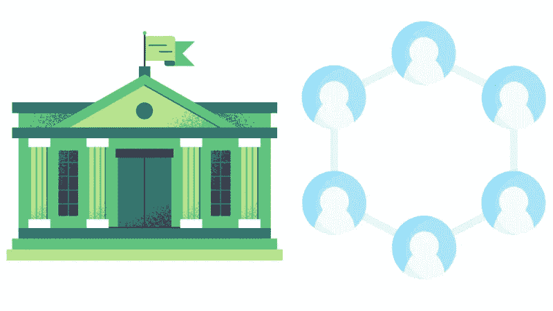
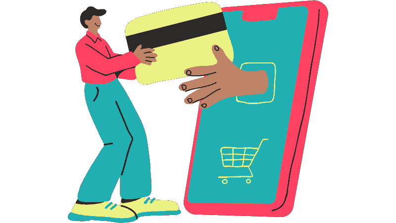
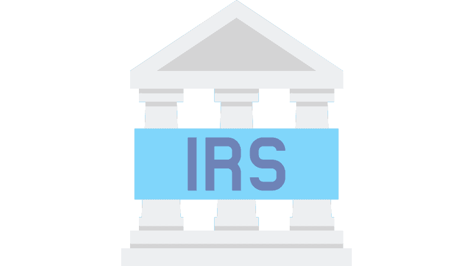
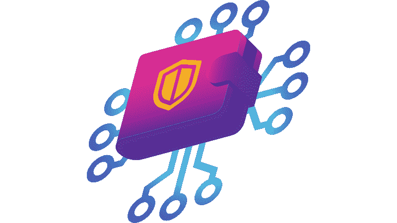

# 🧑‍💼#为 NORMIES🧑‍而战💼

> 原文：<https://medium.com/coinmonks/defi-for-normies-3f208bf118d9?source=collection_archive---------35----------------------->

# [#CEX](https://twitter.com/search?q=%23CEX) 🏦vs[#德克斯](https://twitter.com/search?q=%23DEX)💻

交换是 [#crypto](https://twitter.com/search?q=%23crypto) 中最重要的协议之一，因为它们是人们获取加密货币的途径。下面是一个初学者指南，介绍 CEXs 和 DEXs 之间的区别。

什么是 CEX？集中交易。与证券交易所非常相似，CEX 是金融资产的市场。在这种情况下，特别是加密货币。它是第三方，有助于订单匹配和资产存储。

所以，想象一下它就像亚马逊一样…但是对于 cryptos。大多数交易所都有“订单簿”,这意味着每个买家都有一个卖家，反之亦然。这也像亚马逊。当你去 CEX 的时候，你可以从卖密码的人那里买到密码，或者卖给买密码的人。

cex 与亚马逊的另一个相似之处在于，它们让购买变得超级容易。就像你可以用信用卡在线购买产品的“立即购买”按钮一样，大多数 cex 都有一个“法定入口”，这意味着他们可以用信用卡(有时是 Paypal)支付 crypto。

然而，一旦你购买了你的密码，不像在亚马逊上，没有任何东西会寄给你。你的密码在交易所里。这是因为交易所是在托管框架下运作的。也就是说，在你发出密码之前，他们会保管你的令牌。

这可能是有利的，因为这意味着你不必切换区块链或…做任何事。这就是为什么 cex 如此受欢迎。因为初学者使用起来很容易。他们可以直接去 CEX，用他们的签证买一些代币，然后就可以收工了。

这些就是 CEXs 的好处。然而，也有一些严重的不利因素。首先，因为他们保管你的代币，而且因为他们受到严格监管，你的交易很可能会被报告给税务机关。

有些人认为这是一件坏事，其他人不介意。但是，另一个每个人都认为不好的缺点是。由于 CEX 保管着你的代币，在极端情况下(无论 CEX 如何定义)，他们可以冻结你的资产！

好吧，让我们回顾一下。集中式交易所使得通过法定入口购买加密货币变得简单。它们也不需要您将它们移动到任何地方或更改任何设置，不管令牌在哪个链上。所以很新手友好。

集中式交易所也受到高度监管，大多数交易所会向税务机关报告你的交易。他们保管你的代币，并且像银行一样，有能力冻结你的资产。对你的钱进行集中管理。

好吧，那么什么是 DEX？分散式交易所与 cex 有一些相似之处，但也有许多不同之处。dex 也是金融资产的市场。但是，大多数不使用订单簿操作…

dex 使用所谓的自动做市商(AMM)。这使得完成订单的过程自动化，因此不需要每个卖家都有一个买家，反之亦然。这都是智能合约处理的。

基本上，这些钱被放在一个“流动性池”里，所以每当有人想买或卖代币时，他们只需从这个池中取出资金。这里打个比方吧…

想象这是万圣节。有一大碗南瓜灯糖果。里面有两种糖果:迷你士力架棒和酸补丁儿童。碗后面站着一个保安(或者一个穿着保安服装的小孩…因为…今天是万圣节)。

现在，任何想要士力架的人都可以从那个碗里得到一个，只要他们有一个酸补丁小孩来交换它。如果他们有一盒牛奶，他们必须去街对面的碗那里。这家只收酸辣酱小孩。

同样，如果有士力架可以交易，任何人都可以拥有酸补丁儿童。那个看起来像保安的孩子就是促成这笔交易的人。你递给他一颗糖，他把另一颗还给你。

在这个比喻中，糖果碗是 AMM，保安小子是聪明的合同。这就是指令在 DEX 上的作用。尽管如此，CEXs 和 dex 之间还有一些其他的关键区别。

dex 没有监护权。这意味着他们不会保管你的代币。您必须使用 DeFi 钱包(如 Metamask)连接到 DEX，您的令牌会自动从钱包中取出或存入钱包。DEX 没有扣留他们。

这有几个原因。首先，这意味着 DEX 不能冻结你的资金。DEX 一开始就没有你的资金。此外，因为 DEX 实际上只是一个智能合约，它不持有你的资金，所以 DEX 不向税务机关报告任何交易。

DEX 以这种方式去中心化。它不能控制你的资金。只有你知道。然而，这也有一些缺点。

很少有，如果有的话，德克斯有一个菲亚特坡道。它们受到的监管较少，因此无法与银行和信用卡公司合作来实现这一目标。这意味着你只能在有密码的 DEX 上交易。

还有，有一个学习曲线。由于您全权保管您的代币，因此您有责任确保您的 DeFi 钱包连接到正确的网络。也就是说，你必须在正确的区块链上(你不能在币安连锁店买到)。

而且，因为您完全保管您的代币，所以由您来保证它们的安全。也就是说，如果你允许你的私人密钥(想象一下这些就像你的网上银行密码)被泄露，那就没什么办法了。

因此，概括来说，DEX 是一个使用智能合约和自动化做市商来促进交易的密码市场。dex 也不会保管您的代币，让您全权负责，因此不会向税务机关报告。

dex 使用起来可能有点复杂，因为你不能使用信用卡或 fiat payments 在分散式交易所进行交易。您还必须了解不同的区块链，因为您必须连接到适当的网络才能使用 DEX。

由于 CEXs 和 DEXs 之间的这些差异，几乎所有在 crypto 中活跃的人和拥有几个 alt 标记的人都使用这两者。cex 允许我们用菲亚特购买稳定的股票或蓝筹股，并允许我们将收益(当我们有收益时)转移到菲亚特。

dex 允许我们购买在 CEXs 上还不可用的替代币，因此可以参与多个区块链的分散金融的蓬勃发展的生态系统。CEX 是银行，德克斯是糖果碗。

现在是我的*PRO 使用 cex 和 dex 的技巧。我喜欢参与许多链上的许多协议，所以我通常会从支持撤回到我想要使用的链的 CEX 开始。比如说…

我会在 [@BinanceUS](https://twitter.com/BinanceUS) 上买 [$FTM](https://twitter.com/search?q=%24FTM) ，因为我可以撤回到 [#fantom](https://twitter.com/search?q=%23fantom) 连锁店。我会在 [@coinbase](https://twitter.com/coinbase) 上买 [$AVAX](https://twitter.com/search?q=%24AVAX) ，因为我可以撤回到 [#avalanche](https://twitter.com/search?q=%23avalanche) C 链。我会在 [@cryptocom](https://twitter.com/cryptocom) 上买 [$MATIC](https://twitter.com/search?q=%24MATIC) ，因为我可以把它撤回到 [#polygon](https://twitter.com/search?q=%23polygon) 。

然后，当我在我想要使用的链上有了我想要的本地加密时，dex 帮助我与我喜欢的协议进行交互。例如，在 [#fantom](https://twitter.com/search?q=%23fantom) 上我会使用 [@SpookySwap](https://twitter.com/SpookySwap) 在 [#avalanche](https://twitter.com/search?q=%23avalanche) 上我会使用 [@traderjoe_xyz](https://twitter.com/traderjoe_xyz) 或者在 [#polygon](https://twitter.com/search?q=%23polygon) 上我会使用 [@QuickswapDEX](https://twitter.com/QuickswapDEX)

我希望这有助于消除正常人和非正常人的 CEXs 和 DEXs 之间的区别。对于任何看到这个的秘密原住民，请随意与你的普通朋友和家人分享，以帮助他们更好地了解你的世界。别忘了喜欢，关注，分享。

> 加入 Coinmonks [电报频道](https://t.me/coincodecap)和 [Youtube 频道](https://www.youtube.com/c/coinmonks/videos)了解加密交易和投资

# 另外，阅读

*   [密码本交易平台](/coinmonks/top-10-crypto-copy-trading-platforms-for-beginners-d0c37c7d698c) | [Coinmama 审核](/coinmonks/coinmama-review-ace5641bde6e)
*   [印度的加密交易所](/coinmonks/bitcoin-exchange-in-india-7f1fe79715c9) | [比特币储蓄账户](/coinmonks/bitcoin-savings-account-e65b13f92451)
*   [OKEx vs KuCoin](https://coincodecap.com/okex-kucoin) | [摄氏替代品](https://coincodecap.com/celsius-alternatives) | [如何购买 VeChain](https://coincodecap.com/buy-vechain)
*   [币安期货交易](https://coincodecap.com/binance-futures-trading)|[3 commas vs Mudrex vs eToro](https://coincodecap.com/mudrex-3commas-etoro)
*   [如何购买 Monero](https://coincodecap.com/buy-monero) | [IDEX 评论](https://coincodecap.com/idex-review) | [BitKan 交易机器人](https://coincodecap.com/bitkan-trading-bot)
*   [CoinDCX 评论](/coinmonks/coindcx-review-8444db3621a2) | [加密保证金交易交易所](https://coincodecap.com/crypto-margin-trading-exchanges)