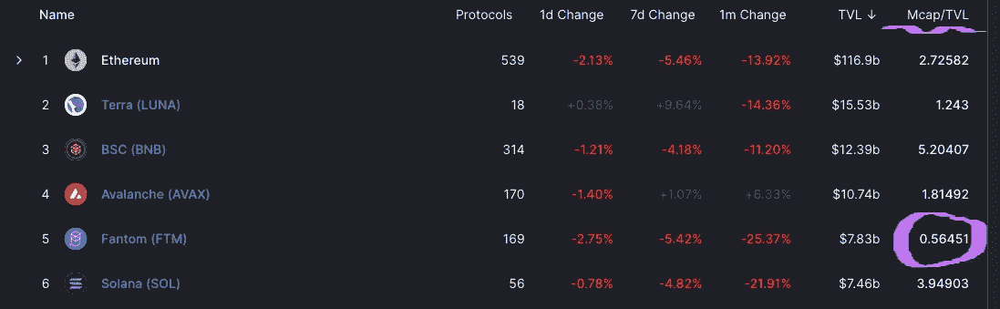
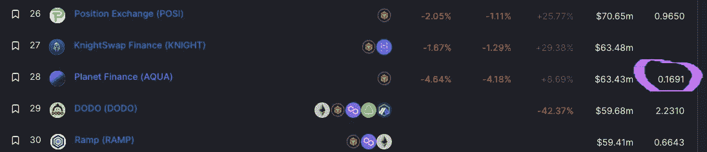

# DeFi 宝石:行星金融

> 原文：<https://medium.com/coinmonks/defi-gems-planet-finance-7c6a81649cbe?source=collection_archive---------7----------------------->

AVAX 和 Fantom 引起了 DeFi 的轰动，但 BSC 上的一个新项目正在悄悄进行一些非常深刻的 DeFi 创新。

Image: PixTeller

> 进步的艺术是在变化中保持秩序，在秩序中保持变化——阿尔弗雷德·诺斯·怀特海

# DeFi 是高风险的，但不一定如此

首先，我是 [AQUA](https://coinmarketcap.com/currencies/planet-finance/) 的实益持有人，这是[星球金融](https://planetfinance.io/)的治理令牌。他们不给我报酬，除了持股和下注之外，我与他们没有任何关系。尽管如此，我并不建议你买入。我已经跟踪这个项目几个月了，我认为它值得一谈。

如果你刚刚接触分散金融(DeFi)，这个领域可能会非常混乱。有遗留金融经验的人会认识一些术语。年利率(APR)和复合年利率(APY)对于 DeFi 和 legacy finance 都是常见的。但是它们产生的方式是不同的。

## 等等，银行以前付给我们存款？！

过去，如果你把钱存入储蓄账户，银行会付钱给你。基本思路是:你借给银行钱，他们把你的钱借给别人，把利息的一部分利润还给你。

银行向借款人收取的利率与美联储(美联储)向银行收取的利率挂钩。在一个健康的经济体中，这一比率通常在 4-5%左右。这略高于 T4 设定的 2-3%的目标通胀率。

今天的利率是 0.25%。就金融“健康”而言，我们的经济基本上离心脏病发作只差一个巨无霸了。换句话说，你不会希望美国经济在短期内铲掉车道上的积雪。

随着消费者物价指数(CPI)通胀率达到 8%左右(实际通胀率比这高得多)，仅仅是把钱存在银行里，你就损失了相当多的钱。因为联邦利率如此之低，你的储蓄只能赚取 0.25%的零头。如果你想知道，这并不好。

## 货币市场

银行业的一大创新是货币市场基金的创立。这些资金使得零售银行客户能够从商业票据市场获得利息支付。总而言之，商业票据是大公司之间的短期贷款。

对公司的好处是容易获得资金支付短期债务，如工资。对贷方(如银行)的好处是贷款的高百分比利率回报。例如，如果银行向零售客户贷款，他们可能收取 7%的利息，但如果他们向机构提供商业票据，他们可以收取 10%的利息。

因此，零售客户可以走进一家银行，从他们的储蓄账户中获得 3-5%的利息，或者他们可以购买货币市场基金，获得 7-8%的利息。在 2008 年金融危机之前，这种方式一直运行得很好，当整个事情开始[崩溃](/coinmonks/the-rise-and-fall-of-financial-empires-8e4bc3d7d5f8)时。

但在那之前，对于散户投资者来说，货币市场是增加利息收入的一种相对安全的方式。我认为银行家迟早会找到解决商业票据领域问题的方法。这是另一天的话题，因为我们在这里谈论 DeFi。

## 用 DeFi 赚取利息

DeFi 领域的利息支付略有不同。美国金融市场规模庞大，拥有大量的[流动性](/coinmonks/crypto-101-liquidity-pools-and-impermanent-loss-feb297ce5fba)。流动性是任何交易系统的生命线。如果资产缺乏流动性，有效交易几乎不可能。

如果你正在考虑投资加密，或者已经投资了，我强烈推荐你阅读[这篇文章](/coinmonks/crypto-101-liquidity-pools-and-impermanent-loss-feb297ce5fba)。如果没有这种基本的理解，几乎不可能评估您可能考虑的加密投资的风险。在你开始投资 DeFi 之前，这要重要 1000 倍。

通过 DeFi，投资者通常从提供流动性中获得利息。本质上，你把你的资产“锁定”在一个交易池中，你从这个池中获得一定比例的交易费。利率(APR)是基于交易费用的百分比有多大。

如果你提供流动性的资产非常稳定且流动性高，费用会很低，通常低于 10%。但是如果资产不稳定和/或流动性低，APR 可能非常高，比如 2000–3000%。一般来说，资产的流动性越差或越不稳定，年利率就越高，风险也就越高。

我将在以后的文章中写更多关于 DeFi 的内容。作为介绍，你可以看看这篇文章。在这篇文章中，我将向您介绍一些真正有趣的项目，这些项目(目前)正在产生一些令人印象深刻的 apr。

## 星球金融

现在，绝大多数的 DeFi 机会都在雪崩( [AVAX](https://coinmarketcap.com/currencies/avalanche/) 和 Fantom ( [FTM](https://coinmarketcap.com/currencies/fantom/) )区块链。我将在这里花点时间强调一下 ***所有的*** 区块链协议都是实验性的。同样， ***所有*** DeFi 项目都是建立在那些实验性区块链之上的实验。

这些都不是确定的科学。这些 DeFi 协议和区块链实验看起来是稳定的，并且(大部分)像预期的那样运行。这绝对不意味着 ***而不是*** 它们将保持稳定并按预期运行。换句话说，你必须非常小心。

从某种意义上说，DeFi space 与其说是*投资*，不如说是*赌博*。我坚信胜算比拉斯维加斯的赌桌要大得多。但他们还是有胜算。你可能，而且很可能会失去你投入的每一分钱。相应地参与。

这也是我觉得行星金融最吸引人的地方之一。如我所说，我从去年夏天就开始关注这个项目。从 Discord 和 Telegram 中我可以看出，开发团队积极性很高，技术娴熟，关注社区，积极参与。他们也(有可能)为 DeFi 领域提供一些非常惊人的创新。

## 合法的沉睡巨人？

就在我们说话的时候，有很多对 DeFi 有影响的人在谈论 Fantom (FTM)。这有一个很好的理由——大量资金正在流入。我见过使用的一个指标是市值(Mcap)与锁定总价值(TVL)的比率。我认为这个*可能*是一个生态系统价值的好指标。不幸的是，这也是我们目前仅有的几个指标之一。

粗略的理论是，TVL 应该反映在本地令牌的价格(基于市值)中。以下是区块链前五名的比例:

Image: DeFi Llama

我不相信有人知道什么是“好的”Mcap/TVL 比率。从上图可以明显看出，Fantom 的比例比其他人低得多。根据理论，FTM 的值应该上升到更接近匹配区块链的比率，像 Terra 或 Avalanche。

我认为这个理论有可取之处，但我也有疑问。如果我们认为这是真的，那么 FTM 的 0.5 Mcap/TVL 是一个看涨信号。如果这是真的，那么这对行星金融意味着什么？

Image: DeFi Llama

同样，我不相信这是一个可靠的信号。但如果是的话，这可能会指向行星金融中隐藏的宝石。虽然这不是一个很好的比较，因为 Planet Finance AQUA 的 TVL(6340 万美元)比 Fantom(78 亿美元)低得多。很难说它会如何发展，但它确实吸引了我的眼球。

## V2 星球金融公司

就像现在这样，你可以在 Planet Finance 上获得令人难以置信的收益率，比如单次下注的煎饼互换蛋糕(84%)、公用事业 Gamma token (50%)和可观的马厩利率(BUSD 15%、USDC 10%和 UST 7.5%)。它们肯定是 BSC 的稳定回报。

也有很好的稳定组合回报，比如 USDC/UST 和 USDC/BUSD，对规避风险的人(比如我)来说，各有 10%的回报。此外，你可以接触到 DOT，ETH，ADA，LINK，XRP，以及相当多的 apr 高达 150%的其他对。

对我来说，另一个令人兴奋的前景是创建加密货币市场。这对我很有吸引力，因为我倾向于规避风险。正如我之前提到的，传统金融中的货币市场是高收益、低风险的资产。

有了 Planet Finance 上提出的借贷协议，再加上一个相当健壮的交换路由器，跨链兼容性(例如[虫洞 Terra](https://www.coindesk.com/tech/2021/10/20/wormhole-adds-ui-support-for-terra-in-bid-to-simplify-cross-chain-operability/) 等等…？)和(到目前为止)可靠的路线图功能部署，我觉得我找到了一些很像那些货币市场的东西。简而言之，我认为这里有很多未被认可的价值。

实际上发生的事情比我概述的要多。我可以继续，但我不会。就像我开始说的，我是受益持有人。我绝对不是建议你去参加这个项目。如果你想知道的话，我不认为这是一部幻想剧。这是一个严格的通货紧缩长霍德勒与体面的麻烦利息。

我能说的是，到目前为止我所看到的鼓励我投入我辛苦赚来的美元。Telegram 组非常尊重我，开发团队给我灌输了很多信心，我认为他们正在做一些新奇有趣的事情。

我知道我在这里有点浪费。我会拥有它。我喜欢这些家伙(和女孩)，并支持他们的成功。我也知道这个协议让我在一些我从来不担心的事情上获得了不错的回报。当然，我不是财务顾问，这不是建议，绝对是 [DYOR](/coinmonks/crypto-investing-how-to-dyor-1e6dabdb1de9) 在你采取行动之前。

作为结束语，这可能是最令人兴奋的部分，因为 Planet Finance 给了我第四条赚取收益的渠道。我进了 AVAX 和 Terra，我是 FTM 上的德根猿，现在是通过星球金融上的 BSC。要点是:根据 Mcap，我的收益风险分布在区块链前五名中的四个。如果没有别的，我这样睡得更好。

直到下一次，安全，聪明，并确保[绑骆驼](https://www.oxfordreference.com/view/10.1093/acref/9780199539536.001.0001/acref-9780199539536-e-2318)。

> 加入 Coinmonks [电报频道](https://t.me/coincodecap)和 [Youtube 频道](https://www.youtube.com/c/coinmonks/videos)了解加密交易和投资

## 也阅读

 [## 杠杆代币[多头代币]终极指南

### 杠杆化令牌是具有杠杆化风险敞口的 ERC20 令牌，不考虑保证金、要求、管理…

medium.com](/coinmonks/leveraged-token-3f5257808b22)  [## 最佳加密交易所| 2022 年十大加密货币交易所| CoinCodeCap

### 哪一个是最好的加密交换？在本文中，我们将根据多种加密货币列出 10 大加密货币交易所

coincodecap.com](https://coincodecap.com/crypto-exchange)  [## 2022 年最佳加密交换平台| CoinCodeCap

### 随着时间的推移，我们大多数人将转向 dex 以获得更好的安全性和隐私。因此。在这里，我们将讨论…

coincodecap.com](https://coincodecap.com/best-swap-platforms)  [## 2022 年最佳加密和比特币赌场(美国批准，存款奖励)

### 接收、支付和赚取加密货币| |有各种各样的最佳在线赌场可供选择，有可能…

coincodecap.com](https://coincodecap.com/best-online-casinos)  [## 2021 年最佳加密借贷平台| 6 大比特币借贷平台

### 获得比特币和其他加密货币的最佳贷款利率

medium.com](/coinmonks/top-5-crypto-lending-platforms-in-2020-that-you-need-to-know-a1b675cec3fa)  [## 2021 年 6 大最佳硬件钱包|顶级加密硬件钱包[更新]

### 最好的加密货币硬件钱包是绝对必要的。我们将在 NGRAVE、Ledger Nano X 和…

medium.com](/coinmonks/the-best-cryptocurrency-hardware-wallets-of-2020-e28b1c124069)  [## 加密交易机器人——19 款最佳免费加密交易机器人

### 2022 年币安、比特币基地、库币和其他密码交易所的最佳密码交易机器人。四进制，位间隙…

medium.com](/coinmonks/crypto-trading-bot-c2ffce8acb2a)  [## 最佳 4 个加密交易信号电报通道

### 这是乏味的找到正确的加密交易信号提供商。因此，在本文中，我们将讨论最好的…

medium.com](/coinmonks/best-crypto-signals-telegram-5785cdbc4b2b)