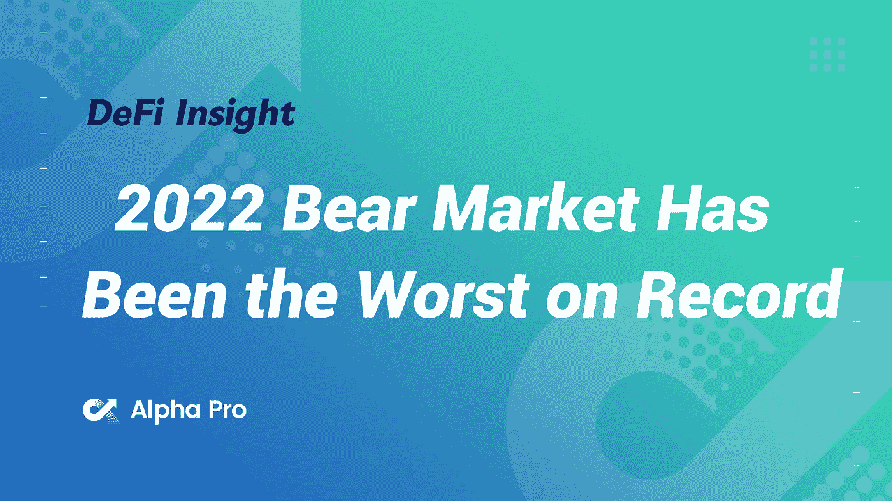
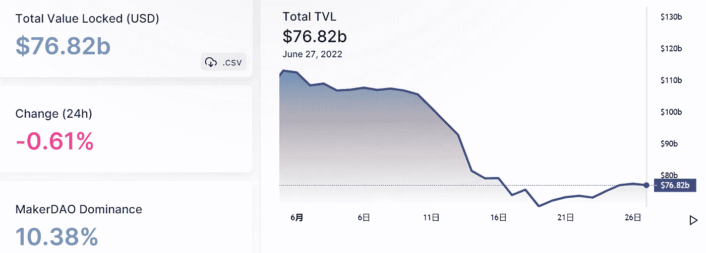
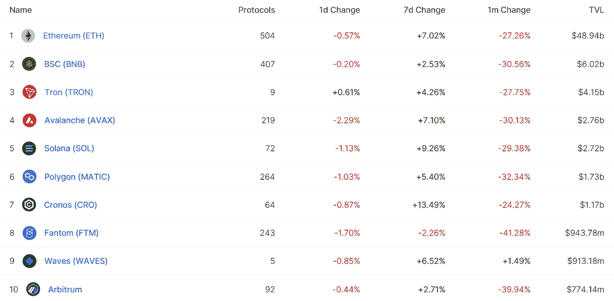
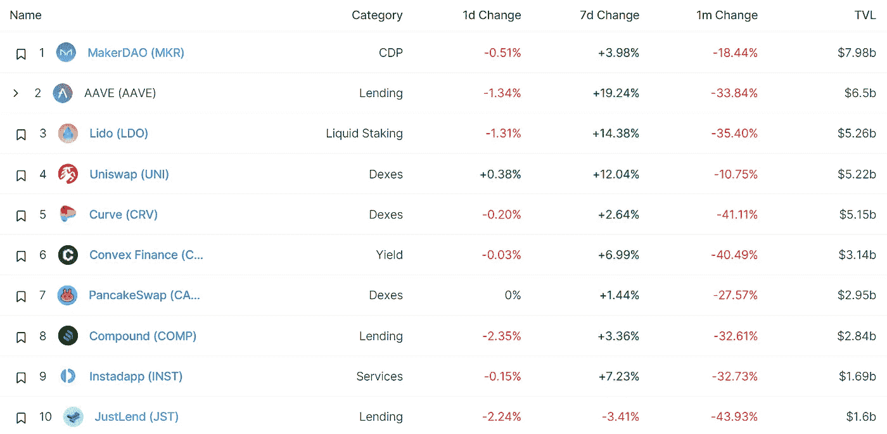
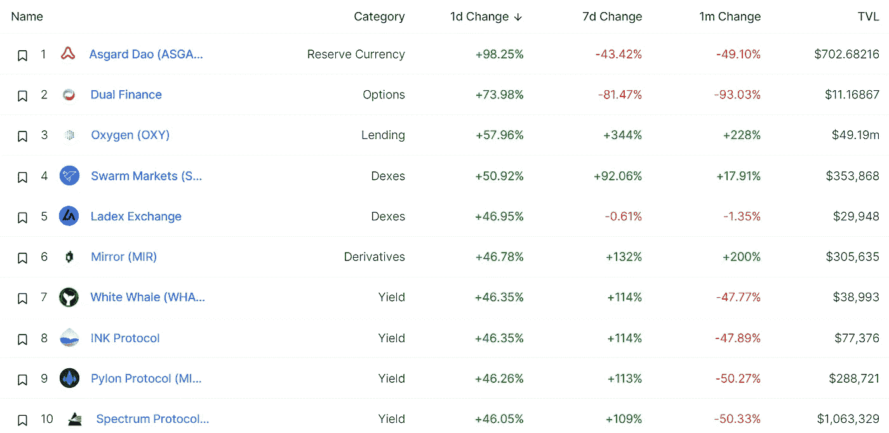
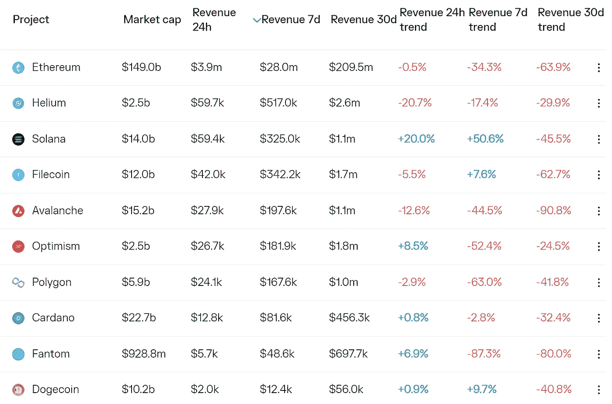
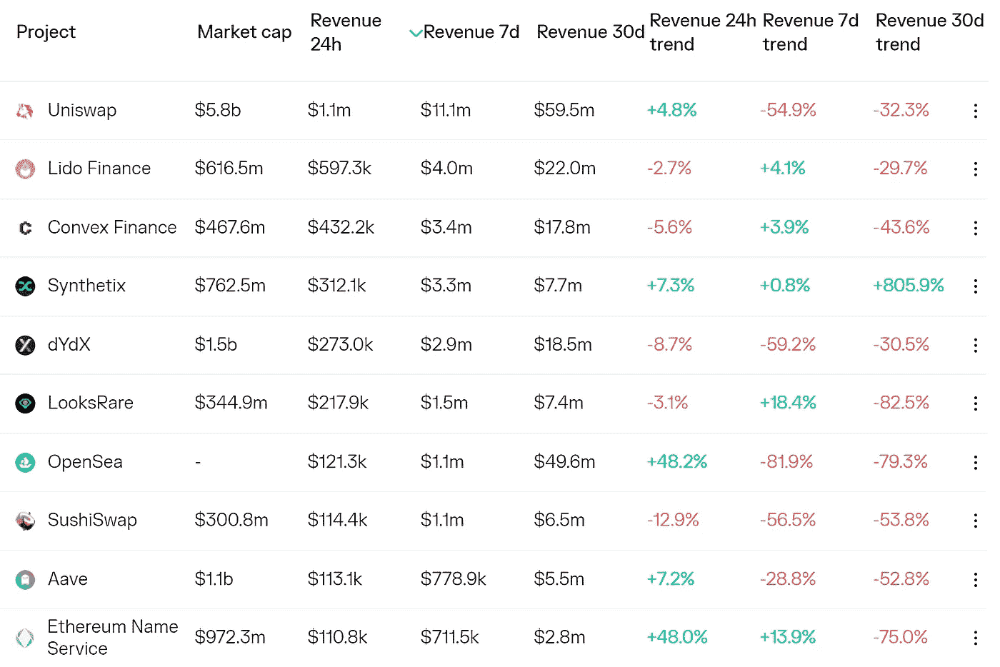
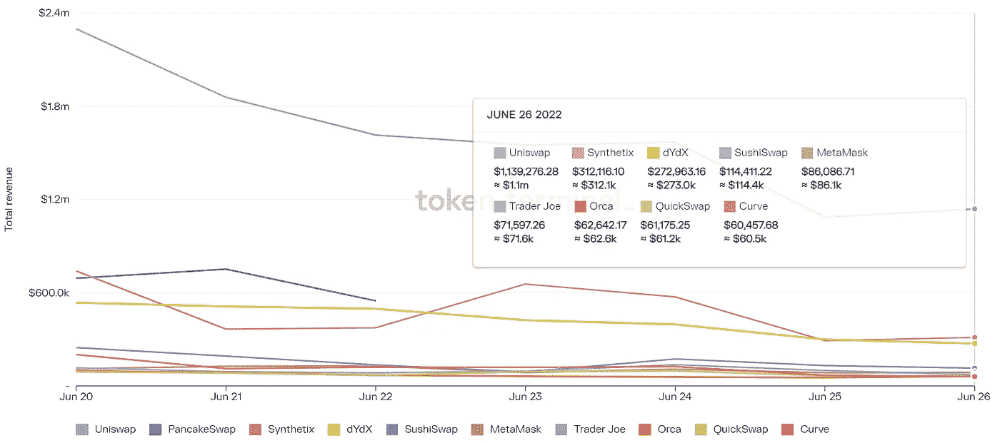
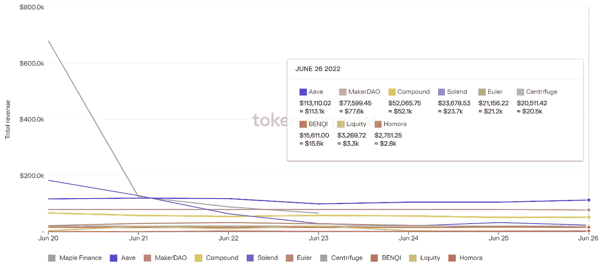

# DeFi Insight | 2022 年熊市是有史以来最糟糕的一次

> 原文：<https://medium.com/coinmonks/defi-insight-2022-bear-market-has-been-the-worst-on-record-a4914f712e8e?source=collection_archive---------26----------------------->

2022 年 6 月 27 日

*今日 DeFi 数据&由 DeFi Insight 为您带来的新闻*

> *"* 今年迄今，2022 年是资产价格面临历史性挑战的一年，股票、债券和数字资产都在不断收紧的货币条件下挣扎。经济中的通货膨胀和收紧流动性的力量给过度杠杆化的加密生态系统带来了极大的压力。最近的痛苦很大程度上源于高杠杆资金，加上在链内和链外场所对即将到期的抵押品进行再抵押。*“@*[*来源*](https://insights.glassnode.com/2022-bear-of-historic-proportions/)

# 最新消息

## 贷款

据报道，Celsius Network 的首席执行官亚历克斯·马辛斯基正在逃亡

霍德瑙特可能有大量未披露的来自地球崩塌的损失

**/**假新闻剖析:对 [Nexo](https://nexo.io/blog/the-anatomy-of-fake-news-the-latest-attack-on-nexo) 的最新攻击

## 外汇

印度交易所准备迎接一个艰难的寒冬

**[币安](https://bitcoinist.com/binance-platform-institutional-and-vip-investors/)推出机构及贵宾投资者平台**

## **市场**

**乙醚在 200 周均线附近找到支撑**

**Crypto 正在崩溃，但是它背后的技术可以拯救奢侈品牌数十亿美元**

****密码市场[一周内恢复 11%的资本化](https://cryptoslate.com/crypto-market-regains-11-capitalization-in-a-week/)****

## ****稳定币****

****“匿名者”想要将[跆拳道](https://usethebitcoin.com/anonymous-wants-to-bring-do-kwon-to-justice/?utm_source=rss&utm_medium=rss&utm_campaign=anonymous-wants-to-bring-do-kwon-to-justice?utm_source=blockworks-research)绳之以法****

******[ANZ 的稳定币](https://cointelegraph.com/news/anz-s-stablecoin-used-to-buy-tokenized-carbon-credits)用于购买象征性的碳信用额******

## ******桥梁******

******发现价值 1 亿美元的 Altcoin 黑客后，和谐提供 100 万美元的赏金******

## ******支付******

******随着行业的崩溃，澳大利亚的一家加密公司解雇了 100 名员工******

## ******|令牌******

******弗洛基发射 Token 到平流层庆祝周年纪念******

## ******采矿******

******采矿禁令激起了伊朗秘密组织的负面反应******

## ******政策与法规******

********[SEC 主席](https://news.bitcoin.com/sec-chair-gensler-proposes-one-rule-book-crypto-regulation/) Gensler 提出“一个规则手册”加密规则********

## ******NFT******

******创始人的一封信******

********[matrix export](https://www.prnewswire.com/news-releases/matrixports-cactus-custody-launches-institutional-custody-service-for-non-fungible-tokens-nfts-301574889.html)的 Cactus 托管推出不可替代代币的机构托管服务********

## ******基金******

******高盛称将筹集 2B 美元购买摄氏资产:报道******

********[bit liberte](https://www.devdiscourse.com/article/business/2081195-bitliberte-indias-first-web3-startup-to-raise-usd-176-million-to-establish-a-fashionfi-ecosystem-for-nfts-and-dao)，印度首家 Web3 创业公司，融资 176 万美元，为 NFTs 和 DAO 建立 FashionFi 生态系统********

## ******观点******

******迈克·诺沃格拉茨谈他的重大加密错误和比特币的未来******

# ******数据和分析******

## ******锁定的总价值(TVL)******

******目前全网 DeFi 总锁定量为 768.2 亿美元，24 小时下降 0.61%。******

************

## ******TVL 评出的十大连锁酒店******

************

## ******|最新 TVL 十大项目******

************

## ******|过去 24 小时内 TVL 增长的前 10 个项目******

************

## ******协议收入******

## ******|累计总收入最高的项目(24H)_ 区块链(L1)******

************

## ******|累计总收入最高的项目(24H) _Dapps (L2)******

************

## ******|前 10 大交易所的每日收入******

************

## ******|十大贷款协议的每日收入******

************

# ******深潜******

********[**增长减速**](https://bitcoinmagazine.com/markets/growth-deceleration-and-the-dollar-wrecking-ball) **和美元筛糠球**********

**** [## 增长减速和美元毁灭球

### 以下节选自比特币杂志 Pro 的最近一期，比特币杂志的高级市场时事通讯…

bitcoinmagazine.com](https://bitcoinmagazine.com/markets/growth-deceleration-and-the-dollar-wrecking-ball) 

**不透明的平台和盘根错节的协议构成** [**大风险**](https://www.coindesk.com/markets/2022/06/26/opaque-platforms-and-intertwined-protocols-pose-big-risk-to-crypto/) **对密码**

 [## 不透明的平台和错综复杂的协议给加密带来了巨大的风险

### 乔治·卡鲁迪斯是 CoinDesk Research 的研究分析师。我们仍然处于艰难时期。当然，我的文章最后…

www.coindesk.com](https://www.coindesk.com/markets/2022/06/26/opaque-platforms-and-intertwined-protocols-pose-big-risk-to-crypto/) 

**为什么要在密码监管上** [**看涨**](https://www.bsc.news/post/why-should-you-be-bullish-on-crypto-regulation) **？**

 [## 你为什么应该看好加密监管？

### 一个善意且明智的加密政策只会对这个行业有好处。查看我们的每日更新…

www.bsc.news](https://www.bsc.news/post/why-should-you-be-bullish-on-crypto-regulation) 

# 报告

**[**清算分配**](https://messari.io/article/liquidation-distributions-the-hidden-details-of-debt) **:债务隐藏明细** _messari**

> **尽管 5 月份的债务利用率创下历史新低，但债务清算压力加速了 2022 年 6 月的价格下跌
> 债务集中在几个钱包中被证明比整体债务利用率更有影响
> 清算分布可以显示债务集中在哪里，哪些资产最有可能受到波动性的影响
> 目前，有三个主要的清算级别，大约为 550 美元、650 美元和 850 美元 ETH 价格
> 摄氏是 550 美元 ETH 清算点的主要贷款，主要由 stETH 抵押**

****一看** [**NFT**](https://www.theblockresearch.com/a-look-at-nft-royalty-revenues-154098) **版税收入** _theblockresearch**

****[**熊市困境**](https://members.delphidigital.io/reports/bear-market-woes-when-is-enough-enough) **:什么时候够了，够了？**_ 德尔福数码****

******关于:******

****DeFi Insight 是顶级 DeFi 和加密新闻和更新的来源。****

******https://twitter.com/AlphaPro_io**❤[t27】](https://twitter.com/AlphaPro_io)****

******❤RSS:**[**https://medium.com/feed/@alphapro.project**](https://medium.com/feed/@alphapro.project)****

****提供的信息应被视为发展新闻，而不是投资建议。****

> *****加入 Coinmonks* [*电报频道*](https://t.me/coincodecap) *和* [*Youtube 频道*](https://www.youtube.com/c/coinmonks/videos) *获取每日* [*加密新闻*](http://coincodecap.com/)****

# ****另外，阅读****

*   ****[复制交易](/coinmonks/top-10-crypto-copy-trading-platforms-for-beginners-d0c37c7d698c) | [加密税务软件](/coinmonks/crypto-tax-software-ed4b4810e338)****
*   ****[网格交易](https://coincodecap.com/grid-trading) | [加密硬件钱包](/coinmonks/the-best-cryptocurrency-hardware-wallets-of-2020-e28b1c124069)****
*   ****[密码电报信号](http://top%204%20telegram%20channels%20for%20crypto%20traders/) | [密码交易机器人](/coinmonks/crypto-trading-bot-c2ffce8acb2a)****
*   ****[最佳加密交易所](/coinmonks/crypto-exchange-dd2f9d6f3769) | [印度最佳加密交易所](/coinmonks/bitcoin-exchange-in-india-7f1fe79715c9)****
*   ****[面向开发人员的最佳加密 API](/coinmonks/best-crypto-apis-for-developers-5efe3a597a9f)********