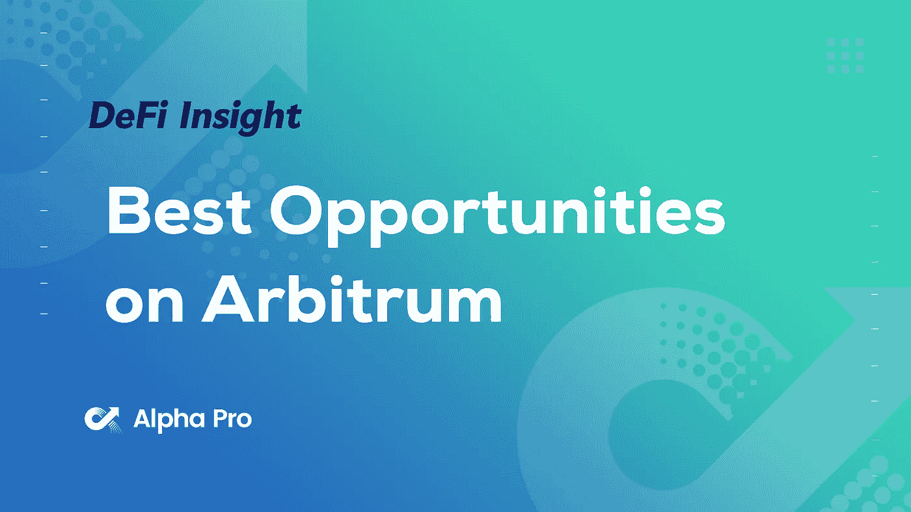
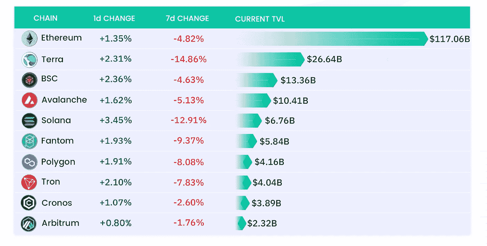
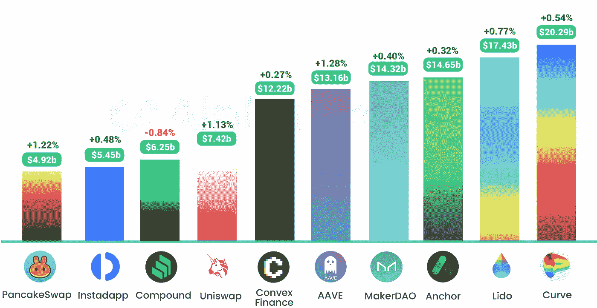
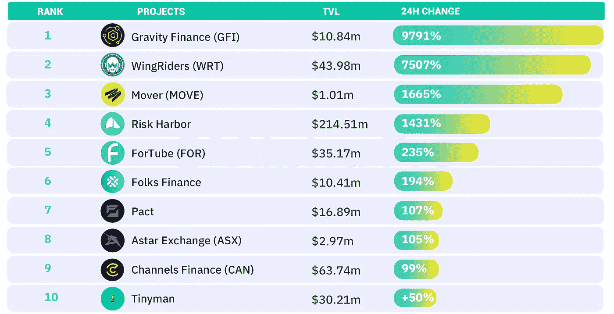
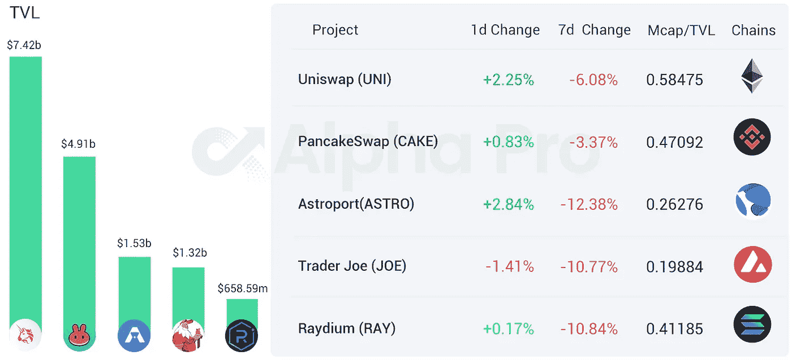
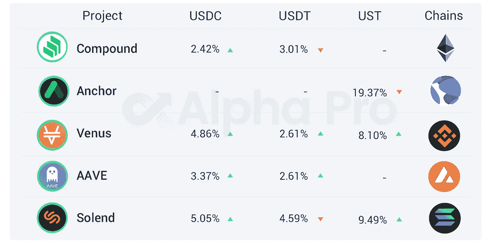

# DeFi Insight | Arbitrum 上的 5 个机会

> 原文：<https://medium.com/coinmonks/defi-insight-5-opportunities-on-arbitrum-right-now-c2ddbfc49cf6?source=collection_archive---------11----------------------->

## 2022 年 4 月 13 日

*今日 DeFi 数据&由 DeFi Insight 为您带来的新闻。*

> Arbitrum One 目前是以太坊最受欢迎的第 2 层扩展解决方案，提供了一系列 L2 冒险和最佳流动性——至少目前如此。现在，所有第 2 层锁定的价值超过 60 亿美元，而 Arbitrum 代表了其中的 40 多亿美元—超过 60%的市场份额！无银行的这个策略涵盖了你今天可以考虑尝试的一些最热门的仲裁机会！[**来源**](https://newsletter.banklesshq.com/p/5-opportunities-on-arbitrum-right?utm_source=%2Finbox&utm_medium=reader2&s=r)

# 最新消息

## 贷款

**美国用户的重要[摄氏度](https://blog.celsius.network/important-celsius-update-to-our-us-clients-6df471420cc7)更新**

****海浪贷平台[威瑞金融](https://forum.vires.finance/t/change-usdn-and-usdc-collateral-factors-to-80-and-change-liquidatedebtamount-to-1/409)计划将 USDN 和 USDC 抵押系数降至 80%，清算比例设定为 1%****

## ****罪犯****

******[永久协议 V2](https://dune.xyz/yenwen/perpetual-protocol_2) 截然不同的交易者突破一万******

## ******甲骨文******

********[之字形](https://twitter.com/ZigZagExchange/status/1513956458978807816?s=20&t=Yc8o1_4u7bAG_ky8c4_2ow)开源首个 StarkNet oracle 项目代码，并计划招募项目进行测试********

## ******存储******

********[Metis](https://metisdao.medium.com/decentralized-storage-goes-live-da876dc6eb70)集成了分散存储层，将大幅降低交易费用和区块确认时间********

## ******交叉链******

********跨链基础设施[路由器协议](https://twitter.com/routerprotocol/status/1513925561072070660)集成 Arbitrum 网络，支持跨链转账和资金交易********

## ******支付******

********交付应用 Rappi 在墨西哥启动试点项目[接受加密支付](https://news.bitcoin.com/delivery-app-rappi-launches-pilot-project-to-accept-crypto-payments-in-mexico/)********

## ******|令牌******

********web 3 密钥管理网络 [Torus](/toruslabs/introducing-the-auth-network-b8fab1b5e1f6) 更名为 AUTH 网络，将推出新的令牌 Auth********

********四大[之一 2 层下个月可能发行](https://twitter.com/JackNiewold/status/1513977411293126661?s=20&t=LpHqus5xhKw_G9KKqinPMQ)代币********

## ******地址******

********、**南森:前 10 大主流网络 7 天总活跃地址约 822 万，较上周[大幅下降](https://twitter.com/nansen_ai/status/1513515062287540225)******

## ****TVL****

******二层 Q1 [TVL 上涨 26.6%](https://www.oklink.com/academy/zh/hot-oklink-quarterly-insights-q1) ，呈现逆势上涨态势******

## ******空投******

********[ENS 空投](https://twitter.com/futurealisha/status/1513806091427237889?s=20&t=tFfQlhuVZtP1nzb6ZvRxyg)代币只剩 3 周申领********

******分散衍生品协议 [ApeX](https://twitter.com/OfficialApeXdex/status/1513865390421512196) 展开第一轮空投******

******AdaSwap 的 NFT 市场 ADANFT 将向 ASW 持有者发放 NFT 空投物资******

## ******政策与法规******

********[韩国](https://www.newspim.com/news/view/20220413000785)计划将虚拟资产委员会扩大为数字资产委员会********

******伊朗计划发射自己的 CBDC******

******巴西中央银行行长宣布，真实数字将于今年晚些时候推出，并将像比特币一样拥有最大供应量******

## ******NFT******

********[血清](https://twitter.com/projectserum)将在索拉纳 NFT 平台 Burnt Finance 上出售血清冲浪者系列 NFT********

******前宇航员[斯科特·凯利](https://www.space.com/astronaut-scott-kelly-nft-space-artwork-ukraine)发射首个 NFT，筹集 50 万美元支持乌克兰******

********[NBA xf](https://twitter.com/NBA/status/1514001906762407942)T 官方推特账号和 Discord 账号已经开通********

********NFT 世界第二届[收藏造币厂](https://twitter.com/nftworldsNFT/status/1514075254775160832?s=20&t=Yc8o1_4u7bAG_ky8c4_2ow)********

********日本通信巨头 LINE 旗下的 [NFT 市场](https://prtimes.jp/main/html/rd/p/000003734.000001594.html)LINE NFT 已经上线********

********[索尼](https://www.neweconomy.jp/posts/213395)网络通信公司在新加坡建立 NFT 业务********

********中国相互金融等三大金融协会:坚决遏制 [NFT 金融化、证券化倾向](https://www.china-cba.net/Index/show/catid/14/id/40730.html)********

********音乐 NFT 平台[声音街](https://docs.google.com/forms/d/e/1FAIpQLSdHYrCPAbDKatKFYwV2C6HfxHMdU7QjeNercbqwZKKFKyVxoA/viewform)推出系列活动，邀请 kol 和社群加入********

********NFT 环球韦布的 24 小时交易额[达到 201 万美元，](https://nftgo.io/collection/worldwide-webb-land/overview)同比增长 2727.23%********

## ******基金******

******从贾斯汀比伯、玛丽亚·莎拉波娃和其他人那里筹集了 8700 万美元******

********加密投资组合[经理 CoinStats](https://cryptopotato.com/crypto-portfolio-manager-coinstats-fetches-3-2m-on-fresh-funding-round/) 在新一轮融资中获得 320 万美元********

********[潘迪拉资本](https://www.coindesk.com/business/2022/04/12/pantera-capital-set-to-close-13b-blockchain-fund-with-follow-up-vehicle-already-in-the-works/)准备关闭 13 亿美元的区块链基金********

********[币安](https://www.theblockcrypto.com/linked/141754/binance-announces-100-million-euro-investment-in-france?utm_source=twitter&utm_medium=social)宣布在法投资 1 亿欧元********

# ******数据和分析******

## ******TVL 增长排名前 10 的连锁店******

************

## ******最新 TVL 十大项目******

************

## ******过去 24 小时 TVL 变化的前 10 个项目******

************

## ******德克斯 TVL 排名******

******指数中涨幅最大的是 [Astroport](https://defillama.com/protocol/astroport) ，上涨 2.84 **%********

********

## ****APY DeFi 贷款公司****

*****USDC:最高贷款利率:**[*索伦德*](https://solend.fi/dashboard)*5.05% APY******

******USDT:最高贷款利率:* [*索伦德*](https://solend.fi/dashboard)*4.59% APY******

**********

# *****深潜*****

*******【零】银行如何赚钱*******

******* [## 银行(零)如何赚钱

### 零银行的核心是接受存款和发放贷款。它们是受监管的机构，这意味着它们受到监控…

defieducation.substack.com](https://defieducation.substack.com/p/how-banks-zeros-make-money?utm_source=%2Finbox&utm_medium=reader2&s=r) 

**USDN 惨败聚焦经济** [**风险在 DeFi**](https://thedefiant.io/the-usdn-fiasco-spotlights-economic-risk-in-defi/)

 [## USDN 的惨败凸显了 DeFi - The Defiant 的经济风险

### 一段时间以来，DeFi 中的黑客风险一直是 crypto 中经验丰富的参与者的普遍风险。虽然聪明…

thedefiant.io](https://thedefiant.io/the-usdn-fiasco-spotlights-economic-risk-in-defi/) 

# 报告

**[**雪崩**](https://messari.io/article/state-of-avalanche-q1-2022)**Q1 2022**_ messari . io**

> **Q1 2022 包括网络使用、财务表现和网络基础设施的持续增长和稳定。**
> 
> **季度增长可归因于雪崩拉什、暴雪生态系统基金、以太坊虚拟机(EVM)子网开发的持续部署，以及多元宇宙子网激励计划和文化催化剂基金的引入。**
> 
> **随着杏树的进一步发布和子网的推出，平均交易费用将继续保持稳定并呈下降趋势。**
> 
> **在 Q1 的几项关键指标上，Avalanche 显示出了与顶级 EVM 兼容连锁店相比抢占市场份额的迹象。**
> 
> **随着浏览器扩展和移动钱包的推出，用户体验有望得到改善，这两款产品将于 Q2 发布。**
> 
> **随着子网的不断发展，浏览器扩展和移动钱包的推出将实现子网之间的本地桥接。**

****【Q1 22】区块链**[私人资助](https://www.theblockresearch.com/q1-22-blockchain-private-funding-and-ma-recap-141539) **和 M &一个回顾** _theblockresearch.com**

****数据层缩放和** [**“零层**](https://www.theblockresearch.com/scaling-at-the-data-layer-and-layer-zero-139250)**”_**theblockresearch.com**

********新 Dapps 报道:** [**街机之地**](https://dappradar.com/blog/new-dapps-report-arcade-land-an-nft-island-where-everyone-is-invited) **—一个邀请所有人的 NFT 岛 _**dappradar.com******

****一场 **回合:******

****DeFi Insight 是顶级 DeFi 和加密新闻和更新的来源。****

******https://twitter.com/AlphaPro_io 推特:******

********❤RSS:**[**https://medium.com/feed/@alphapro.project**](https://medium.com/feed/@alphapro.project)******

****提供的信息应被视为发展新闻，而不是投资建议。****

> *****加入 Coinmonks* [*电报频道*](https://t.me/coincodecap) *和* [*Youtube 频道*](https://www.youtube.com/c/coinmonks/videos) *了解加密交易和投资*****

# ****另外，阅读****

*   ****[Bookmap 点评](https://coincodecap.com/bookmap-review-2021-best-trading-software) | [美国 5 大最佳加密交易所](https://coincodecap.com/crypto-exchange-usa)****
*   ****最佳加密[硬件钱包](/coinmonks/hardware-wallets-dfa1211730c6) | [Bitbns 评论](/coinmonks/bitbns-review-38256a07e161)****
*   ****[新加坡十大最佳密码交易所](https://coincodecap.com/crypto-exchange-in-singapore) | [收购 AXS](https://coincodecap.com/buy-axs-token)****
*   ****[红狗赌场评论](https://coincodecap.com/red-dog-casino-review) | [Swyftx 评论](https://coincodecap.com/swyftx-review) | [CoinGate 评论](https://coincodecap.com/coingate-review)****
*   ****[投资印度的最佳加密软件](https://coincodecap.com/best-crypto-to-invest-in-india-in-2021)|[WazirX P2P](https://coincodecap.com/wazirx-p2p)|[Hi Dollar Review](https://coincodecap.com/hi-dollar-review)***********