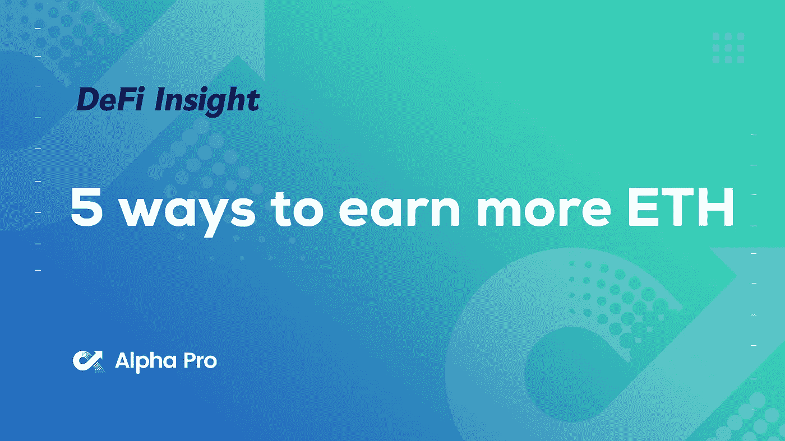

# DeFi Insight | 5 种赚取更多 ETH 的方法；保护您和您的资金的清单；CRV 战争摘要

> 原文：<https://medium.com/coinmonks/defi-insight-5-ways-to-earn-more-eth-checklist-to-protect-you-and-your-funds-crv-wars-summary-195106af0367?source=collection_archive---------31----------------------->

## 2022 年 3 月 17 日

*今日 DeFi 数据&由 DeFi Insight 为您带来的新闻。*

**宏观趋势:**俄乌冲突[让 crypto 比菲亚特更安全](https://www.afr.com/wealth/personal-finance/ato-flags-cryptocurrency-crackdown-amid-evasion-concerns-20220315-p5a4t2)？

**TVL 动向:**目前整个网络上 [DeFi](https://defillama.com/) 的总锁定量为 2050 亿美元，24 小时增长 2.80%

**Stablecoin:** Terra 创始人谈[‘100 亿美元储备’](https://cointelegraph.com/news/we-re-already-buying-terra-founder-plans-to-obtain-10b-btc-for-reserves)计划:我们已经在购买比特币

# 最新消息

## 定义

**以太坊联合创始人:索拉纳需要找到一种** [**更可持续的**](https://beincrypto.com/ethereum-co-founder-calls-solana-unsustainable/) **商业模式**

ATO 在对逃税的担忧中标志着对加密货币的打击

## 协议

锚定协议现在在雪崩上直播

Aave V3:跨 6 个网络在 mainnet 上直播

Astar Network TVL 超过[8 亿美元](https://twitter.com/AstarNetwork/status/1504342712002043905)

向开发者发放价值 7.94 亿美元的代币；重温宇迦实验室的重要一年

多链设立[安全基金](/multichainorg/multichain-security-fund-f7016aabf7ac)

多边形节点需要在 3 月 18 日前进行[海姆达尔 v0.2.8](https://forum.polygon.technology/t/heimdall-v0-2-8-includes-hardfork/2675) 紧急升级

宇宙中心 Theta 测试网令牌收藏品

与[清创+1 英寸网络](https://blog.debridge.finance/any-arbitrary-cross-chain-swaps-with-debridge-1inch-network-862212087d6a)的任意交叉链交换

介绍[our tube](https://twitter.com/SuhailKakar/status/1504008605028257792)——它是 YouTube，但是分散了

Exodus 股票现已在[证券市场上市](https://securitize.io/press-releases/exodus-begins-trading-on-securitize-markets)

## 贷款

大宗投资者提供 DeFi 固定利率[投资产品](https://cointelegraph.com/news/aussie-fintech-to-offer-mainstream-direct-access-to-defi-with-a-fixed-rate)

## 指标

Findora 宣布为[仙境互换](https://www.prnewswire.com/news-releases/findora-launches-3m-liquidity-program-for-fairyswap-301504520.html)提供 300 万美元的流动性计划

KuCoin Labs 对 KCC DEX 项目进行战略押注 [MojitoSwap](https://www.businesswire.com/news/home/20220307005381/en/%C2%A0KuCoin-Labs-Strategically-Invests-in-MojitoSwap-to-Accelerate-the-Development-of-KCCs-Decentralized-Ecosystem)

## |警报

在 [Elona](https://twitter.com/CertiKAlert/status/1504302602661642241) 交易池中检测到地毯拉伸

# 数据和分析

## TVL 和 ATH 排名前六的连锁酒店对比

## 最新 TVL 十大项目

## 过去 24 小时 TVL 变化的前 10 个项目

## 德克斯 TVL 排名

指数中涨幅最大的是 Raydium，上涨了 2.8%

## APY DeFi 贷款公司

*USDC:最高贷款人:索伦德，利率为 3.95% APY*

*USDT:最高贷款人:索伦德，利率为 4.70% APY*

# 深潜

**[**能源取消**](https://cryptohayes.medium.com/energy-cancelled-e9f9e53a50cd) **@** [阿瑟·海斯](https://cryptohayes.medium.com/)**

** [## 能量取消

### (下面表达的任何观点都是作者的个人观点，不应构成制定……

cryptohayes.medium.com](https://cryptohayes.medium.com/energy-cancelled-e9f9e53a50cd) 

**[**赚更多 ETH**](https://newsletter.banklesshq.com/p/5-ways-to-earn-more-eth?s=r) 的 5 种方法**

** [## 赚取更多 ETH 的 5 种方法

### 亲爱的无银行国家，昨天，我们告诉你不要在合并时睡觉。这将是…最大的事件之一

newsletter.banklesshq.com](https://newsletter.banklesshq.com/p/5-ways-to-earn-more-eth?s=r) 

**[**十大密码戒律**](https://defieducation.substack.com/p/the-ten-crypto-commandments?s=r)**

** [## 十大密码戒律

### 切达干酪品种嫉妒不要向人展示你的秘密资产和收益(IRL)。最后会发生什么…

defieducation.substack.com](https://defieducation.substack.com/p/the-ten-crypto-commandments?s=r) 

**[**$ CRV 战争概要**](https://twitter.com/Momentum_6/status/1504172381933170690) **正在 DeFi****

****核对表** [**保护您和您的资金**](https://twitter.com/thedefiedge/status/1504127620157358081)**** 

# ****报告****

******银行和金融服务中的区块链**[**2022 年全球市场报告**](https://twitter.com/Momentum_6/status/1504172381933170690)****

> ****银行和金融服务市场的全球区块链预计将以 61.9%的复合年增长率(CAGR)从 2021 年的 11.7 亿美元增长到 2022 年的 18.9 亿美元。这一增长主要是由于公司在从新冠肺炎影响中恢复的同时恢复了业务并适应了新常态，这种影响早先导致了限制性遏制措施，涉及社会距离、远程工作和导致业务挑战的商业活动的关闭。在 CAGR 为 60%的情况下，该市场预计将在 2026 年达到 123.9 亿美元。****

****一场一场**的较量:******

****DeFi Insight 是顶级 DeFi 和加密新闻和更新的来源。****

******推特:**[**https://twitter.com/AlphaPro_io**](https://twitter.com/AlphaPro_io)****

******RSS:**https://medium.com/feed/@alphapro.project[T42](https://medium.com/feed/@alphapro.project)****

****提供的信息应被视为发展新闻，而不是投资建议。****

> ****加入 Coinmonks [电报频道](https://t.me/coincodecap)和 [Youtube 频道](https://www.youtube.com/c/coinmonks/videos)了解加密交易和投资****

# ****另外，阅读****

*   ****[Cloudbet 赌场评论](https://coincodecap.com/cloudbet-casino-review) | [点火赌场评论](https://coincodecap.com/ignition-casino-review)****
*   ****[币安费](/coinmonks/binance-fees-8588ec17965) | [Botcrypto 评论](/coinmonks/botcrypto-review-2021-build-your-own-trading-bot-coincodecap-6b8332d736c7) | [Hotbit 评论](/coinmonks/hotbit-review-cd5bec41dafb)****
*   ****[my constant Review](https://coincodecap.com/myconstant-review)|[8 款最佳摇摆交易机器人](https://coincodecap.com/best-swing-trading-bots)****
*   ****[我的加密副本交易经历](/coinmonks/my-experience-with-crypto-copy-trading-d6feb2ce3ac5) | [AAX 交易所评论](/coinmonks/aax-exchange-review-2021-67c5ea09330c)********