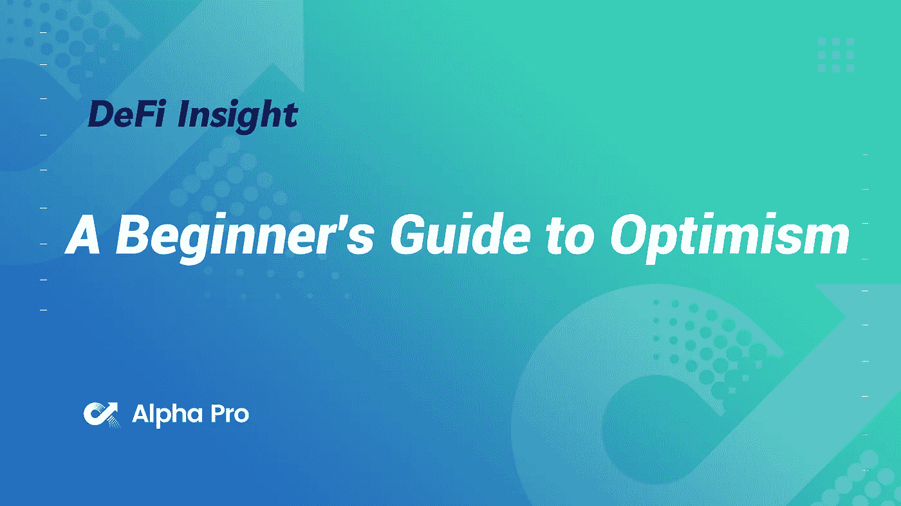
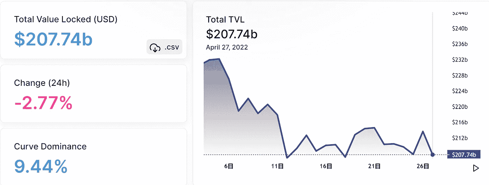
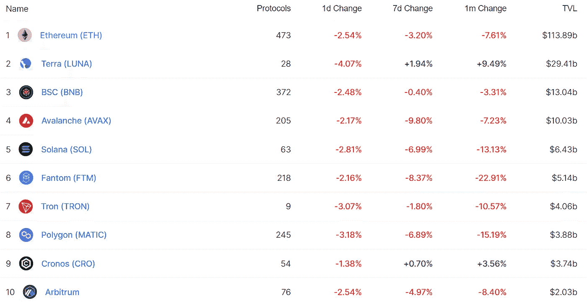
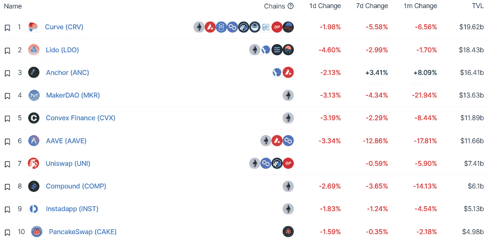
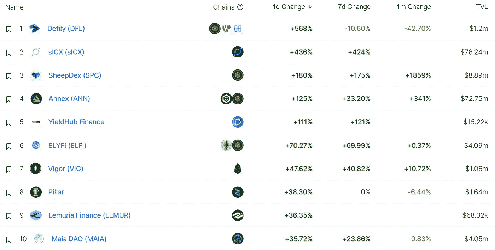
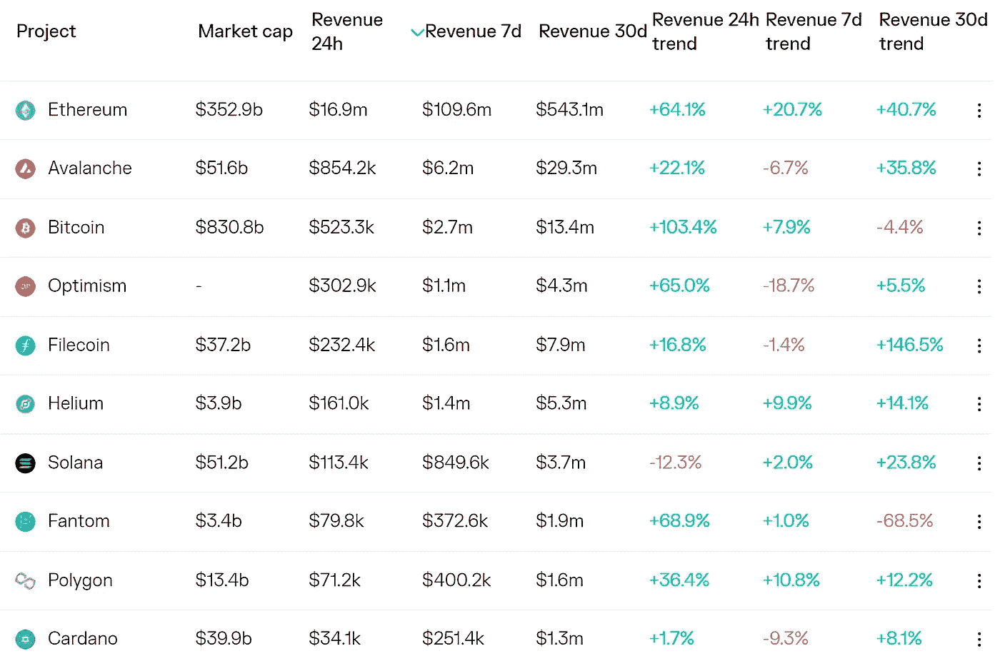
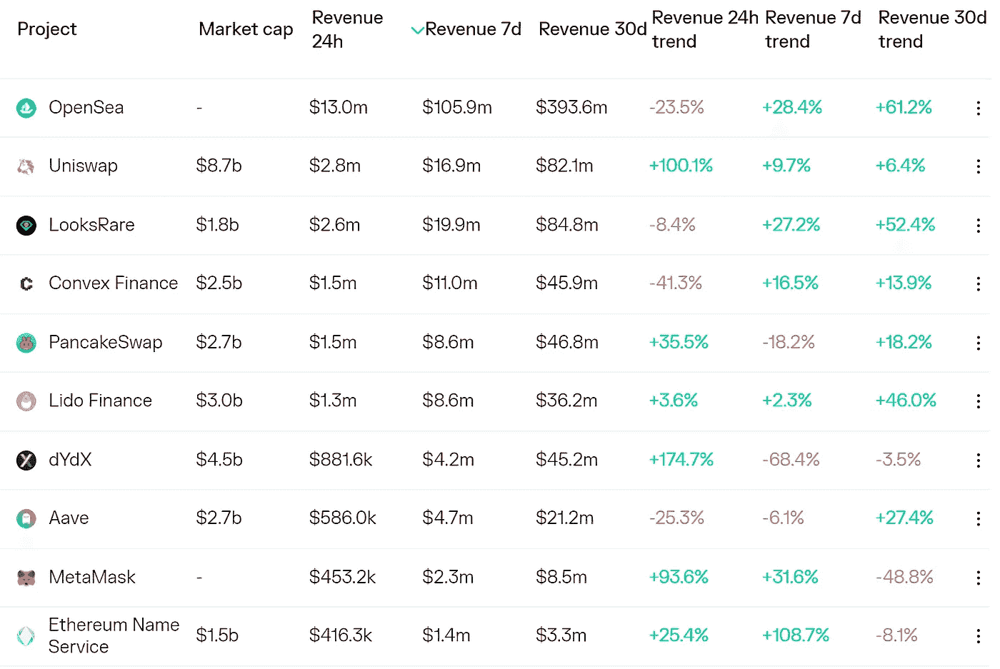
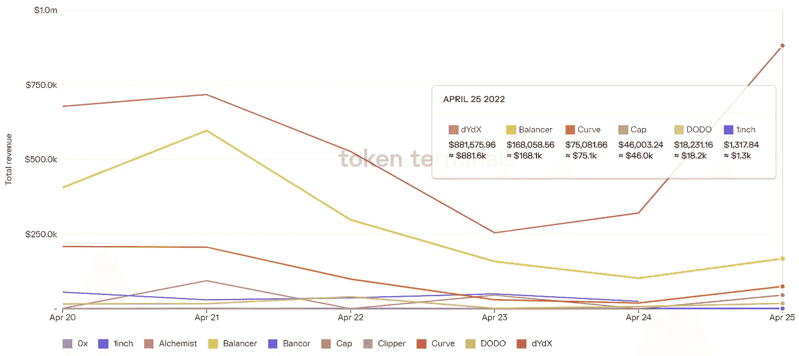
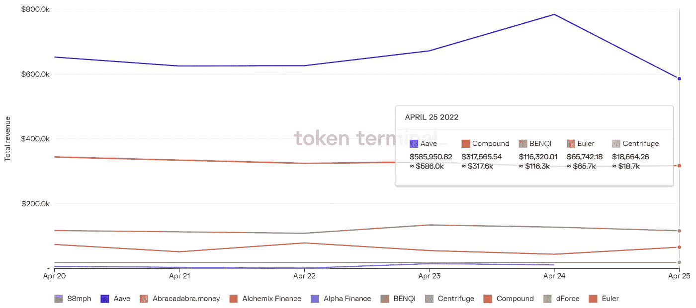

# 乐观初学者指南

> 原文：<https://medium.com/coinmonks/defi-insight-a-beginners-guide-to-optimism-eb284fac5d8f?source=collection_archive---------17----------------------->

2022 年 4 月 27 日

*今日 DeFi 数据&由 DeFi Insight 为您带来的新闻。*

> “目前，乐观是一个充满活力的生态系统，总锁定价值接近 7 亿美元，部署了 108 个 dapps。
> 
> 乐观主义就像鱼和熊掌兼得:便宜、快速的交易，同时保持基础以太坊链的主要安全保证。
> 
> 真是两全其美。以太坊是通过累积来扩展的。
> 
> 随着其象征性推出的消息传出，乐观情绪将会爆发。
> 
> 如果你从未听说过乐观主义，现在还不算太晚。事实上，正如我们在今天的节目中从乐观小组了解到的，未来将会有许多乐观空投！ [***来源***](https://newsletter.banklesshq.com/p/a-beginners-guide-to-optimism?s=r)

# 最新消息

## 贷款

**、**无担保贷款协议[柜员](/teller-finance/welcome-home-usdc-homes-on-teller-brings-crypto-mortgages-to-texas-homebuyers-32f8dac87284)完成首笔加密无担保抵押贷款

**[主播](https://mirrortracker.info/anchor)每天的净支出约为 490 万美元，预计 2.4 亿美元的储备可满足 50 天的需求**

****Lending protocol true fi[为 Blockchain.com 推出](https://blog.trusttoken.com/truefi-launches-100m-blockchain-com-lending-portfolio-77c58ad0fa26)单一借款人池，提供高达 1 亿美元的流动性****

## ****稳定币****

******比特币基地将在以太网上增加对 [BUSD](https://twitter.com/CoinbaseAssets/status/1519026601266225152) 的支持******

## ******桥梁******

********[金钱](https://www.nansen.ai/research/money-under-the-bridge)桥下********

## ******钱包******

********[meta mask](https://consensys.net/blog/metamask/metamask-partners-with-moonpay-for-easy-crypto-purchases/)与 MoonPay 合作，轻松购买密码********

******艾娃实验室总裁吴炯:钱包像丝绸一样光滑******

## ******空投******

********乐观官方[宣布](https://twitter.com/optimismPBC/status/1519001623103774721)原生令牌 OP，并已开启 OP 空投查询页面********

## ******|警报******

********区块链黑客[在 Q1 2022 年盗取](https://bitcoinist.com/new-report-blockchain-hackers-stole-1-3-billion-in-q1-2022/)13 亿美元********

## ******政策与法规******

********美国参议院确认莱尔·布雷纳德为[美联储副主席](https://cointelegraph.com/news/us-senate-confirms-lael-brainard-as-fed-vice-chair)********

********/**加密税务计算器 ko only[将](https://cointelegraph.com/news/crypto-tax-calculator-koinly-integrates-terra-into-its-platform) Terra 集成到其平台中******

## ****NFT****

******Genie 创始人:Genie 已经[完成](https://twitter.com/Scott_eth/status/1519021671881097216?s=20&t=2LVFbQThKu4OII_B1QQRCQ)比特币基地 NFT 智能合约的整合******

********迪卡侬为街头足球迷推出 [NFT 运动鞋](https://nftevening.com/decathlon-launches-nft-sneakers-for-street-football-fans/)********

********以太坊主题纪录片《以太坊:无限花园》[纪念](https://twitter.com/pplpleasr1/status/1519062405606780930?s=20&t=hxPCxiz0Hw0RGoOtl2i7Ww)NFTs 转新合约********

******NFL 选秀去 NFT:足球联盟在 Polygon 上发布新的收藏******

******BAYC 的一位联合创始人正在研究如何为 Meebits NFT 系列提供动力******

********、**[Meebits](https://nftgo.io/collection/meebits/overview)系列 NFT 24 小时交易额超过 1900 万美元，地板价达到 7.29 ETH******

******乔氏即将推出的 NFT 市场[Joe pges](https://traderjoe-xyz.medium.com/joepegs-marketplace-what-to-expect-58e702608b4f)，包括 NFT 发射台******

********《镜报》网站疑似被[攻击](https://mirror.xyz/)，CTO 回应称与新增加的打造 NFT 功能的乐观公告有关********

## ******基金******

********[CXIP](https://www.coindesk.com/business/2022/04/26/cxip-labs-taps-celebrity-investments-in-65m-round-for-nft-development-suite/)Labs 为 NFT 开发套件获得 650 万美元的名人投资********

********来自 a16z、Solana 等公司的创始人[支持](https://www.theblockcrypto.com/post/143448/founders-from-a16z-solana-and-more-back-new-billion-dollar-crypto-fund)新的十亿美元加密基金********

********近生态 DEX 补品完成 500 万美元[融资](https://twitter.com/tonicdex/status/1518954457962356736)，由电资本和动资本领投********

********,**[Fireblocks](https://www.theblockcrypto.com/post/143526/fireblocks-terra-defi-institutional-demand)增加了对 Terra 的支持，因为它看到了“破纪录”的机构需求******

******去中心化[外汇](https://www.coindesk.com/business/2022/04/26/decentralized-forex-is-coming-to-terra-vertex-protocol-raises-85m/)即将来到 Terra: Vertex Protocol 募集 850 万美元******

********比特币基地·NFT 合伙人 [0x 实验室](https://www.forbes.com/sites/ninabambysheva/2022/04/26/coinbase-nft-partner-0x-labs-raises-70-million-from-greylock-partners-jump-crypto-and-jared-leto/?sh=2b6befe9258f)从格雷洛克合伙人公司、Jump Crypto 公司和杰瑞德·莱托公司筹集了 7000 万美元********

# ******数据和分析******

## ******锁定的总价值(TVL)******

******目前全网 DeFi 总锁定量为 2077.4 亿美元，24 小时下降 2.77%。******

************

## ******TVL 评出的十大连锁酒店******

************

## ******|最新 TVL 十大项目******

************

## ******|过去 24 小时内 TVL 增长的前 10 个项目******

************

## ******协议收入******

## ******|累计总收入最高的项目(24H)_ 区块链(L1)******

************

## ******|累计总收入最高的项目(24H) _Dapps(L2)******

************

## ******|前 10 大交易所的每日收入******

************

## ******|十大贷款协议的每日收入******

************

# ******深潜******

********以太坊** [**切换**](https://coinshares.com/research/compromises-and-benefits-ethereum-proof-of-stake-network) **为股权证明网络**的妥协与好处******

**** [## 以太坊转换到利益攸关网络的折衷和优势

### 在 2015 年推出之前，以太坊开发人员已经明确表示要取代其工作证明(PoW)…

coinshares.com](https://coinshares.com/research/compromises-and-benefits-ethereum-proof-of-stake-network) 

**[**产量农业**](https://defieducation.substack.com/p/yield-farming-model-v10?utm_source=%2Fprofile%2F39850567-defi-education&utm_medium=reader2&s=r) **型号 v1.0****

** [## 高产农业模式 1.0 版

### 提供流动性不是简单的被动收入策略。这是一项投资，就像任何投资一样，您需要…

defieducation.substack.com](https://defieducation.substack.com/p/yield-farming-model-v10?utm_source=%2Fprofile%2F39850567-defi-education&utm_medium=reader2&s=r)** 

# **报告**

****Crypto Makret**[**季度报告**](https://tokeninsight.com/en/report/2929) **2022Q1 作者:coingeko**_ token insight**

> **这是怎样的一个季度啊！2022 年，加密市场开局不利，但在一个季度内成功抵御了高通胀、俄罗斯入侵乌克兰和美联储加息。在过去的几周里，该股反弹，收盘时几乎回到了年初的水平，总市值为 2.2 万亿美元。这些走势反映了 TradFi 市场的走势，因为成长股和科技股在遭受重大损失后出现反弹。所有主要的加密货币都与整体加密市场保持同步，只有少数例外——LUNA 等，FTT 和 WAVES 在本季度逆势收于绿色。更多真知灼见尽在报告全文！**

****[**生**](https://messari.io/article/the-health-of-dao-treasuries?utm_source=twitter_messaricrypto&utm_medium=organic_social&utm_campaign=health_of_dao_treasuries) **道府库**_ 梅萨里****

******[**重视**](https://members.delphidigital.io/reports/valuing-layer-1s-memes-money-or-more) **层 1s——迷因、金钱，还是更多？**_ 德尔福数码******

******[**解耦**](https://messari.io/article/the-de-coupling-thesis) **论文** _messari******

******寒武纪** [**爆发**](https://coinmetrics.io/insights/original-research/) **稳定期** _coinmetrics****

******关于:******

****DeFi Insight 是顶级 DeFi 和加密新闻和更新的来源。****

******https://twitter.com/AlphaPro_io**❤[t55】](https://twitter.com/AlphaPro_io)****

******❤RSS:**[**https://medium.com/feed/@alphapro.project**](https://medium.com/feed/@alphapro.project)****

****提供的信息应被视为发展新闻，而不是投资建议。****

> ****加入 Coinmonks [电报频道](https://t.me/coincodecap)和 [Youtube 频道](https://www.youtube.com/c/coinmonks/videos)了解加密交易和投资****

# ****另外，阅读****

*   ****[3 商业评论](/coinmonks/3commas-review-an-excellent-crypto-trading-bot-2020-1313a58bec92) | [Pionex 评论](https://coincodecap.com/pionex-review-exchange-with-crypto-trading-bot) | [Coinrule 评论](/coinmonks/coinrule-review-2021-a-beginner-friendly-crypto-trading-bot-daf0504848ba)****
*   ****[莱杰 vs Ngrave](/coinmonks/ledger-vs-ngrave-zero-7e40f0c1d694) | [莱杰 nano s vs x](/coinmonks/ledger-nano-s-vs-x-battery-hardware-price-storage-59a6663fe3b0) | [币安评论](/coinmonks/binance-review-ee10d3bf3b6e)****
*   ****[Bybit Exchange 审查](/coinmonks/bybit-exchange-review-dbd570019b71) | [Bityard 审查](https://coincodecap.com/bityard-reivew) | [Jet-Bot 审查](https://coincodecap.com/jet-bot-review)****
*   ****[3 commas vs crypto hopper](/coinmonks/3commas-vs-pionex-vs-cryptohopper-best-crypto-bot-6a98d2baa203)|[赚取加密利息](/coinmonks/earn-crypto-interest-b10b810fdda3)****
*   ****最好的比特币[硬件钱包](/coinmonks/hardware-wallets-dfa1211730c6) | [BitBox02 回顾](/coinmonks/bitbox02-review-your-swiss-bitcoin-hardware-wallet-c36c88fff29)********