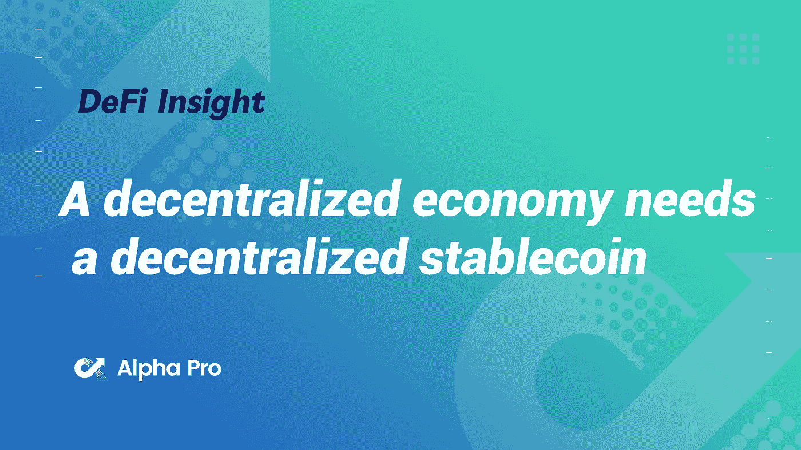
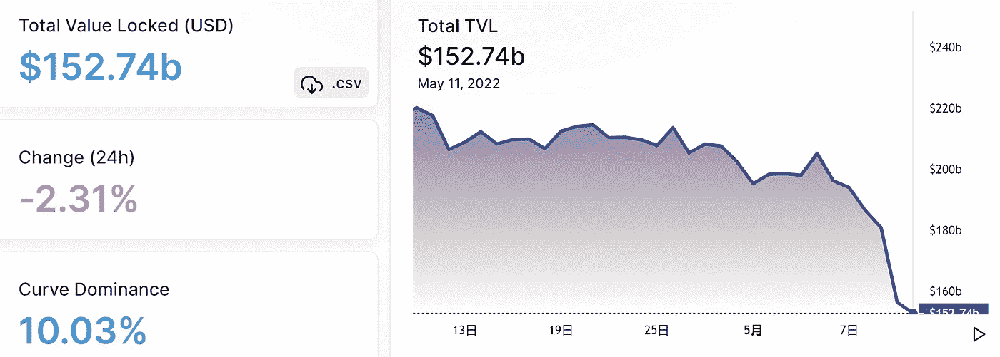
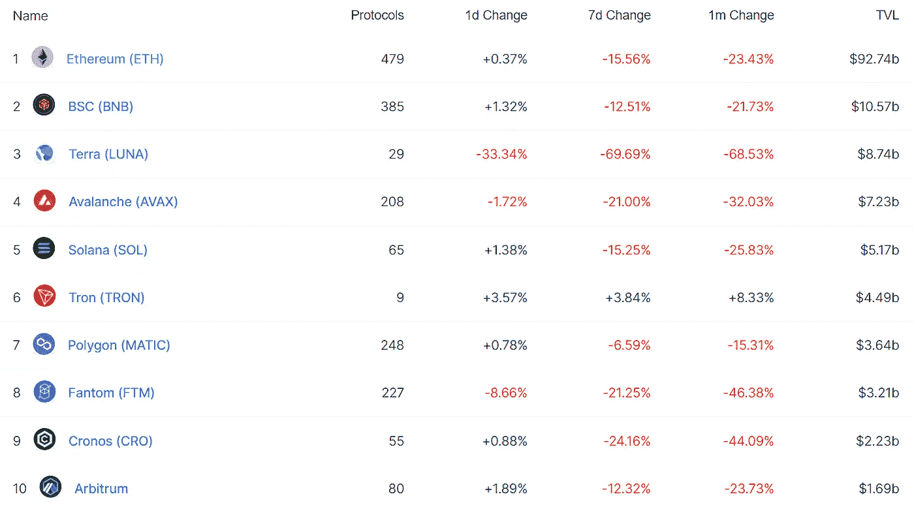
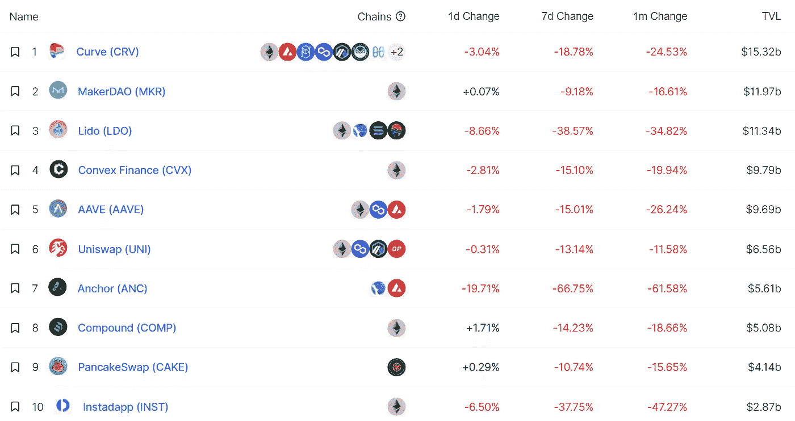
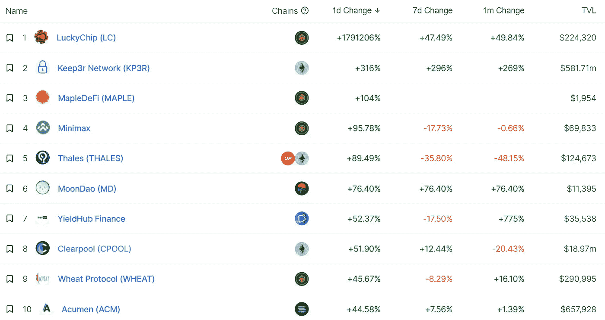
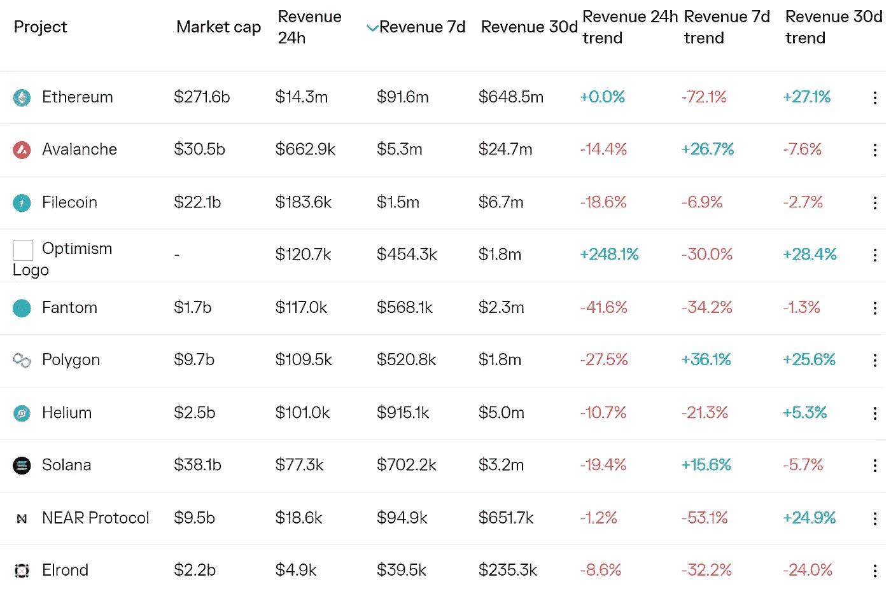
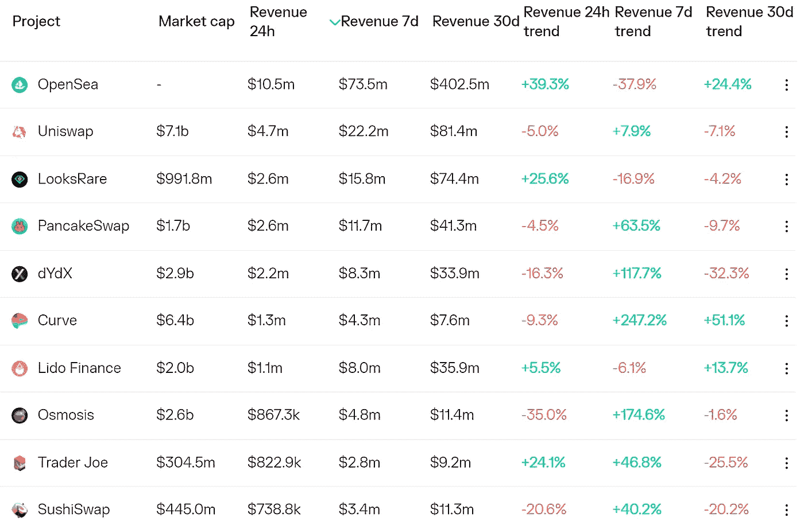
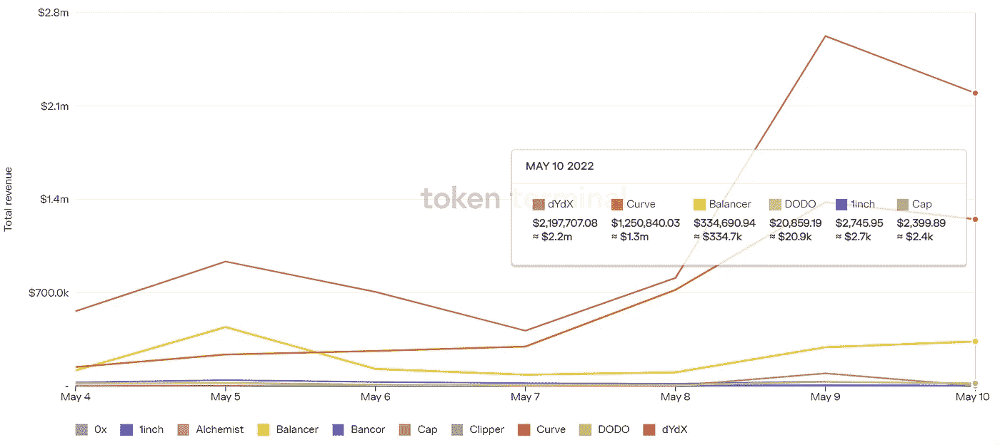
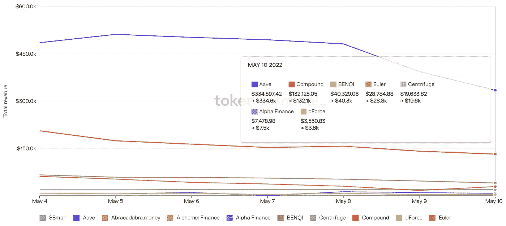

# 分散的经济需要分散的稳定货币

> 原文：<https://medium.com/coinmonks/defi-insight-a-decentralized-economy-needs-a-decentralized-stablecoin-9af8e95a389f?source=collection_archive---------45----------------------->

2022 年 5 月 11 日

*今日 DeFi 数据&由 DeFi Insight 为您带来的新闻。*

> *我们需要一个分散的稳定的货币。菲亚特支持的马厩受到法律查封和捕获。分散的经济需要分散的稳定货币，它的储备不能被冻结或没收。*“@*[el33 x4 或者](https://twitter.com/el33th4xor/status/1523968918934728709)*

# *最新消息*

## *贷款*

***,**[TrueFi](https://invezz.com/news/2022/05/09/truefi-launches-a-debt-financing-portfolio-independently-managed-by-cauris-finance/)推出由 Cauris Finance 独立管理的债务融资组合*

## *外汇*

***[比特币基地](https://s27.q4cdn.com/397450999/files/doc_financials/2022/q1/Coinbase-Q122-Shareholder-Letter.pdf) Q122 股东信***

## ***稳定币***

***被黑的 stable coin Beanstalk 寻求借 7700 万美元重振旗鼓***

***Terra 创始人[跆拳道](https://twitter.com/stablekwon/status/1524164780189126657):越来越近了…保持强壮***

## ***桥梁***

*****乐观推出小型以太桥工具[曲速](https://twitter.com/optimismPBC/status/1524126017790611456?s=20&t=4kVfirJBhqF6dJ_S-4DVqw)*****

## *****衍生产品*****

*******[dYdX iOS App](https://twitter.com/dYdX/status/1524053110582243328?s=20&t=9jE_cILOUdsd0Sh_gtnEFA)已经上线，主要面向美国以外的用户*******

## *******支付*******

*********[Polygon](https://ph.news.yahoo.com/polygon-among-9-3m-investment-140001837.html?guccounter=1&guce_referrer=aHR0cHM6Ly9jbi5iaW5nLmNvbS8&guce_referrer_sig=AQAAAC7nfKIs-NjNBajGk-xfiMdPQ7TLGw1JlebOuN8XU-WTLVcfKk74gXMOFQLvIqpVBcoMG_gMocD1gQjJZKNTJlupIILcKJDrN7LDVBda_tS)投资 930 万美元购买纸张，通过电子邮件帮助 NFT 买家上船*********

## *******空投*******

*******激励空投农民搜索*******

## *******鲸鱼*******

*********[PeckShieldAlert](https://twitter.com/PeckShieldAlert/status/1524205048166723585):@ justinsuntron 从阿夫到币安转账约 1 亿美元 USDT*********

## *******政策与法规*******

*********欧盟计划试点 [DeFi 监督](https://blockworks.co/european-union-plans-pilot-project-on-defi-supervision-this-year/)*********

## *******NFT*******

*********[琥珀集团](https://www.prnewswire.com/news-releases/amber-group-announces-q3-2022-launch-of-openverse-the-gateway-into-the-metaverse-301544643.html)宣布 2022 年第三季度推出 Openverse，这是进入元宇宙的门户*********

*********/**步骤[的记号组学](https://stepnofficial.medium.com/tokeonomics-at-stepn-ee08604e82f1)*******

*******/**insta gram[上的 NFTs](https://twitter.com/mosseri/status/1523655590672695296)*****

*******[看点](https://docs.looksrare.org/blog/the-second-looks-emission-reduction-everything-you-need-to-know)第二看点减排:你需要知道的一切*******

*******作为 93:20 周年庆典的一部分，城市和彪马宣布首次合作 NFT 下降*******

*********[志那都红豆创始人](https://twitter.com/ZAGABOND/status/1524189056225013761):将过去 3 个项目合同的全部控制权移交给项目社区*********

## *******基金*******

*******斯坦霍普金融集团筹集 1000 万美元的系列融资*******

*********据报道，Republic 的风险部门为专注于加密的基金筹集了7 亿美元*********

*********[chain analysis](https://www.theinformation.com/articles/chainalysis-valued-at-8-6-billion-in-gic-led-investment)价值 86 亿美元的 GIC 牵头投资*********

# *******数据和分析*******

## *******锁定的总价值(TVL)*******

*******目前全网 DeFi 总锁定量为 1527.4 亿美元，24 小时下降 2.31%。*******

**************

## *******TVL 评出的十大连锁酒店*******

**************

## *******|最新 TVL 十大项目*******

**************

## *******|过去 24 小时内 TVL 增长的前 10 个项目*******

**************

## *******协议收入*******

## *******|累计总收入最高的项目(24H)_ 区块链(L1)*******

**************

## *******|累计总收入最高的项目(24H) _Dapps (L2)*******

**************

## *******|前 10 大交易所的每日收入*******

**************

## *******|十大贷款协议的每日收入*******

**************

# *******深潜*******

*********[**审判**](https://research.thetie.io/trial-of-the-lunatics-the-story-of-anchor-ust-and-luna/) **疯子们:主播、UST、露娜的故事***********

***** [## 疯子的审判:锚、UST 和露娜的故事-领带研究

### 你可能已经注意到了，市场上的事情最近很不稳定。昨天的疯狂，一语双关，是…

研究. thetie.io](https://research.thetie.io/trial-of-the-lunatics-the-story-of-anchor-ust-and-luna/) 

**UST**[**圆桌**](https://messari.io/article/ust-roundtable)

 [## 比特币和加密价格，新闻，图表和研究

### 编辑描述

梅萨里·io](https://messari.io/article/ust-roundtable) 

**[**流动性理论**](https://twitter.com/ABBBBBB_NFT/status/1522563608504246273) **在 NFTs********* 

# *****报告*****

*******[**4 月**](https://crypto.com/research/april-monthly-institutional-report-alpha-navigator-quest-for-alpha/) **月度机构报告** _crypto*******

> *****2022 年 4 月，大宗商品是表现最好的资产类别，回报率为 5.56%，而 BTC 和 ETH 分别下跌了 18.67%和 17.19%。实物资产表现喜忧参半，由于收益率上升，固定收益全面下降。BTC 和联邦理工学院与股票的相关性仍然很高。*****
> 
> *****我们引入了基于价值、势头、增长和风险的风格因素筛选。主题篮子包括在当前市场下跌期间表现优异的令牌；以及 GameFi 和 NFT 类别的篮子。我们的市场中性对交易突出了 BTC 对 ETH，BTC 对 DOT，LUNA 对 NEAR，SOL 对 AVAX。*****

*******新** [**Dapps 报道**](https://dappradar.com/blog/new-dapps-report-okay-bears-bulls-in-a-bear-market) **:好的熊市——熊市中的多头** _dappradar*****

*******[**以太坊**](https://dune.com/agaperste/The-State-of-Ethereum-Network) **网络季报**_ 沙丘*******

*******关于:*******

*****DeFi Insight 是顶级 DeFi 和加密新闻和更新的来源。*****

*******https://twitter.com/AlphaPro_io 推特:*******

*********https://medium.com/feed/@alphapro.project**RSS:*******

*******提供的信息应被视为发展新闻，而不是投资建议。*******