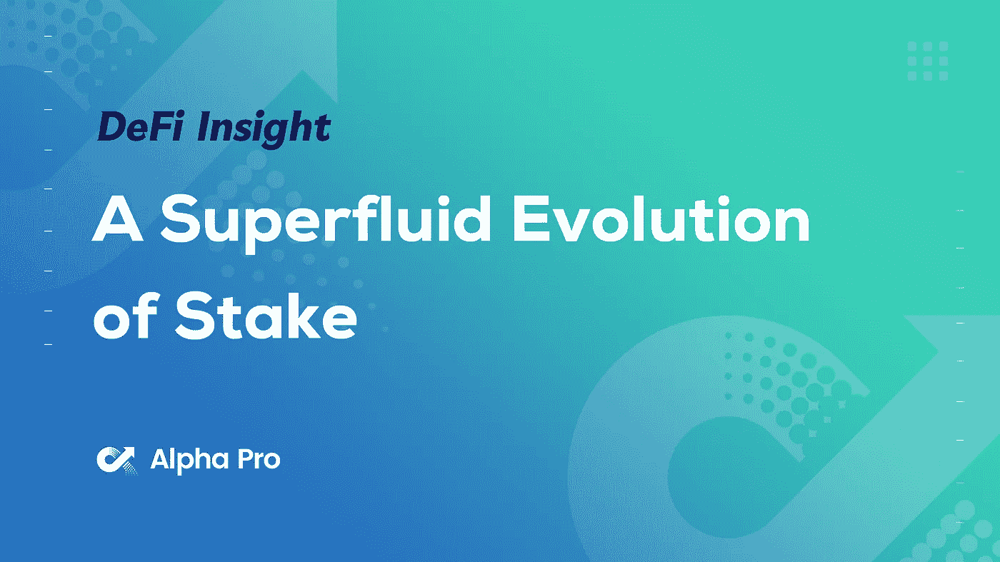
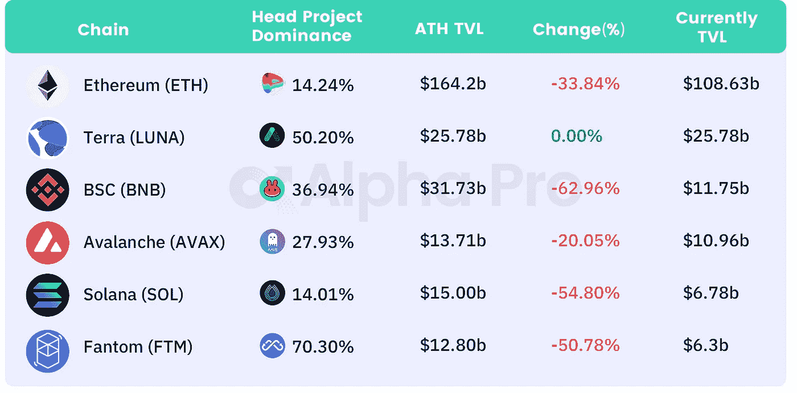
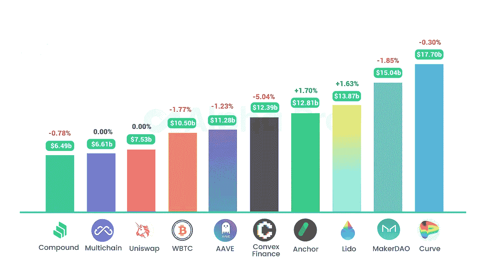
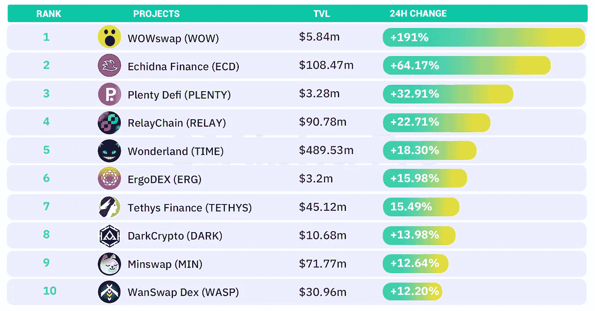
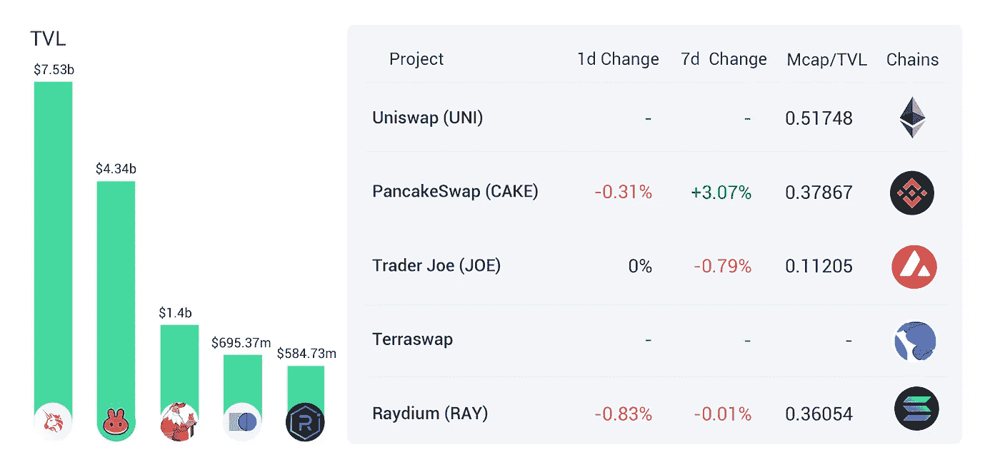
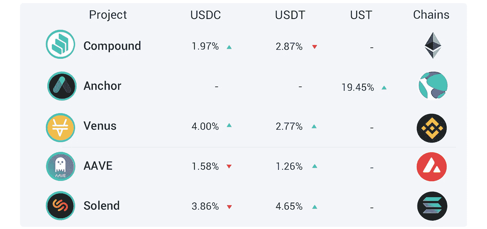
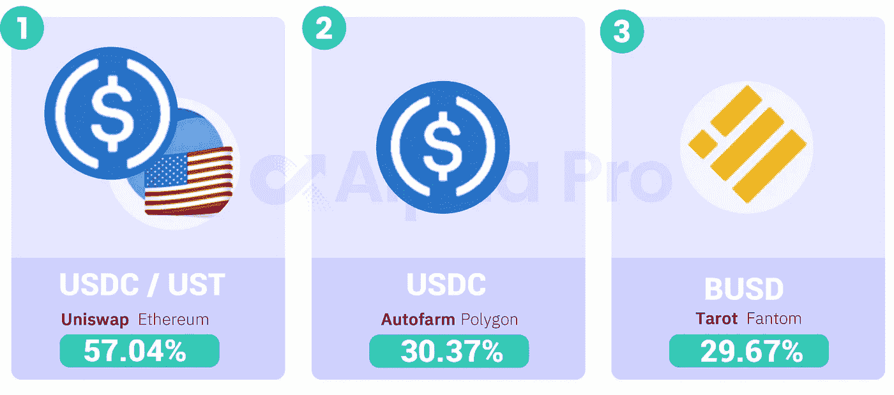

# DeFi Insight | Stake 的超流演化；Terra 创始人和 crypto KOL 在 LUNA price 上下了百万美元的赌注

> 原文：<https://medium.com/coinmonks/defi-insight-a-superfluid-evolution-of-stake-terra-founder-and-crypto-kol-make-million-dollar-c0eba40f0f91?source=collection_archive---------20----------------------->

## 2022 年 3 月 14 日

*今日 DeFi 数据&由 DeFi Insight 为您带来的新闻。*

**宏观趋势:**美国参议员科里·布克:如果[监管得当](https://news.bitcoin.com/us-senator-cryptocurrency-bring-growth-to-american-economy-properly-regulated/)，加密可以给美国经济带来增长

**TVL 动向:**目前全网 [DeFi](https://defillama.com/) 总锁定量为 1980 亿美元，24 小时增长 0.45%

**稳定币:** [USDC](https://usdc.cool/) 雪崩链上的发行超过 4 亿美元，创历史新高

# 最新消息

## 定义

随着欧盟议会准备虚拟货币投票，限制工作证明加密回到桌面上

卢加诺的目标是[区块链技术](https://www.greaterzuricharea.com/en/news/lugano-targets-pioneering-role-blockchain-technology-europe?utm_campaign=Oktopost-News&utm_content=Oktopost-Twitter&utm_medium=social&utm_source=Twitter)在欧洲的先锋角色

## 协议

*[uni swap V3](https://snapshot.org/#/uniswap/proposal/0x4fdc5d5c87669d3c99072541e1c775f8dee9b906241b2ce22203737b608c8e55)将被部署到 Celo

Waves Protocol 的 TVL 超过 23 亿美元

将 G-UNI 作为独立于意式冰淇淋的 DAO 发布，并将其更名为 [Arrakis Finance](https://forum.gelato.network/t/release-g-uni-as-separate-dao-from-gelato-rebrand-it-as-arrakis-finance/364)

## 指标

Animoca 在种子阶段支持基于 Cardano 的加密交换

## 贷款

动态[锚](https://forum.anchorprotocol.com/t/dynamic-anchor-earn-rate/3042)收益率

## 打桩

10M 乙醚现在锁定在 [Eth 2.0 打桩合同](https://www.coindesk.com/tech/2022/03/11/10m-ether-now-locked-on-eth-20-staking-contract/)

## 空投

CRE [DEXdrop](https://crescentnetwork.medium.com/cre-dexdrop-breakdown-472ba6f22f2b) 故障

新月将为[原子能桩](https://www.lockmeta.com/news/crescent-the-cosmos-ecological-defi-project-will-launch-airdrops-for-atom-stakers/)开启空投

## |警报

墓叉手表:地毯码存在于[啤酒金融](https://twitter.com/TombForkWatch/status/1503199853391667200)，存款利率可以设置为 100%

## | KOL

Terra 创始人和 crypto KOL 在 [LUNA price](https://twitter.com/stablekwon/status/1503264558160375810?s=20&t=KQrOWZxkoLzrWPwJPsggXQ) 上下了百万美元的赌注

# 数据和分析

## TVL 和 ATH 排名前六的连锁酒店对比

## 最新 TVL 十大项目

## 过去 24 小时 TVL 变化的前 10 个项目

## 德克斯 TVL 排名

*DEX 跌幅最大的是*[*Raydium*](https://defillama.com/protocol/raydium)*，损失了 0.83%*

## APY DeFi 贷款公司

*USDC:最高贷款人:利率为 4.00%的金星 APY*

*USDT:最高贷款人:索伦德，利率为 4.65% APY*

## 稳定的 APY

# 深潜

**[**DeFi 安全**](https://defieducation.substack.com/p/defi-security-best-practices-security?s=r) **:最佳实践+安全 Q & A****

** [## DeFi 安全:最佳实践+安全问答

### 今天，我们讨论一个流行的问题:如何在不成为技术奇才的情况下掌握安全基础知识。我们会…

defieducation.substack.com](https://defieducation.substack.com/p/defi-security-best-practices-security?s=r) 

**第一次** [**暗战**](https://www.coindesk.com/layer2/2022/03/12/the-first-crypto-war-may-lead-to-lasting-peace/) **可能导致持久和平**

 [## 第一次秘密战争可能会带来持久的和平

### Paul H. Jossey 是《竞争企业》杂志的兼职研究员。他也是众筹律师网站的创始人

www.coindesk.com](https://www.coindesk.com/layer2/2022/03/12/the-first-crypto-war-may-lead-to-lasting-peace/) 

# 报告

**[**桩子**](https://messari.io/article/the-superfluid-evolution-of-stake) **的超流演化——梅萨里****

> **PoS 系统最臭名昭著的副产品之一是网络资产的非流动性。广义地说，PoS 系统有两个子系统:经济和安全(赌注)要素。在经济中，本地资产表现为用于转移或创造新价值的资源。在赌注子系统中，本地资产表示对网络规则的承诺。赌注子系统实际上并不像经济子系统那样消耗或转换本地资产，除非它需要惩罚一个坏人。结果，锁定在赌注过程中的边际资源剥夺了经济的流动资本。**

****沙俄战争与西方如何应对** [**冲击 Crypto**](https://thedefiant.io/special-report-how-russias-war-on-ukraine-and-the-wests-response-is-roiling-crypto/)**—DappRadar****

> **在这份报告中，我们揭示了宏观经济力量的作用，并分析了随着战争的继续，基于区块链的解决方案将如何发挥重要作用。**

**一场回合:**

**DeFi Insight 是顶级 DeFi 和加密新闻和更新的来源。**

**提供的信息应被视为发展新闻，而不是投资建议。**

> **加入 Coinmonks [电报频道](https://t.me/coincodecap)和 [Youtube 频道](https://www.youtube.com/c/coinmonks/videos)了解加密交易和投资**

# **另外，阅读**

*   **[有哪些交易信号？](https://coincodecap.com/trading-signal) | [Bitstamp vs 比特币基地](https://coincodecap.com/bitstamp-coinbase) | [买索拉纳](https://coincodecap.com/buy-solana)**
*   **[ProfitFarmers 回顾](https://coincodecap.com/profitfarmers-review) | [如何使用 Cornix Trading Bot](https://coincodecap.com/cornix-trading-bot)**
*   **[十大最佳加密货币博客](https://coincodecap.com/best-cryptocurrency-blogs) | [YouHodler 评论](https://coincodecap.com/youhodler-review)**
*   **[my constant Review](https://coincodecap.com/myconstant-review)|[8 款最佳摇摆交易机器人](https://coincodecap.com/best-swing-trading-bots)**
*   **[MXC 交易所评论](/coinmonks/mxc-exchange-review-3af0ec1cba8c) | [Pionex vs 币安](https://coincodecap.com/pionex-vs-binance) | [Pionex 套利机器人](https://coincodecap.com/pionex-arbitrage-bot)****