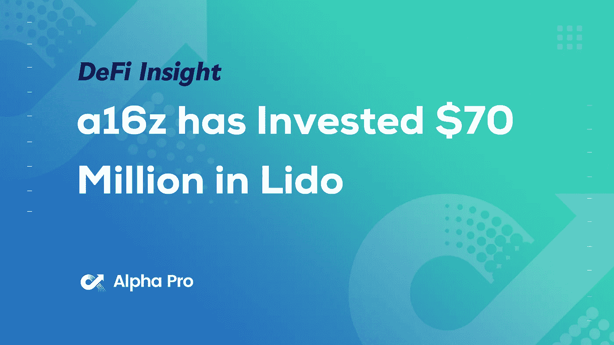
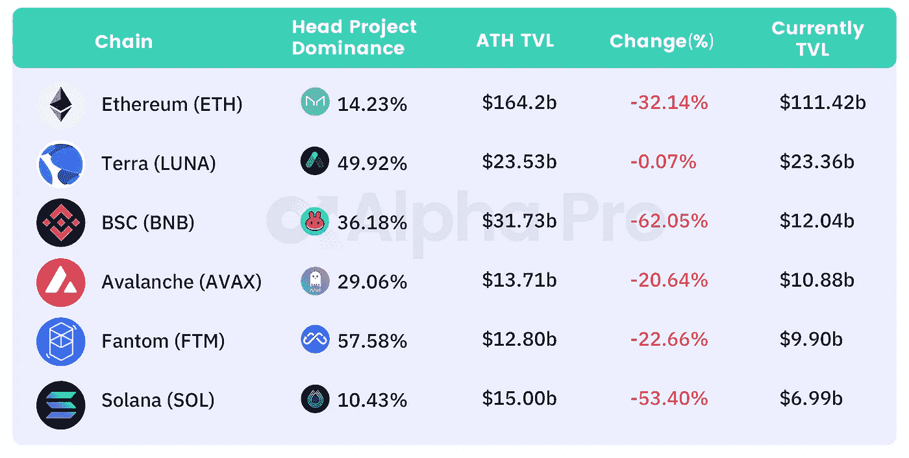
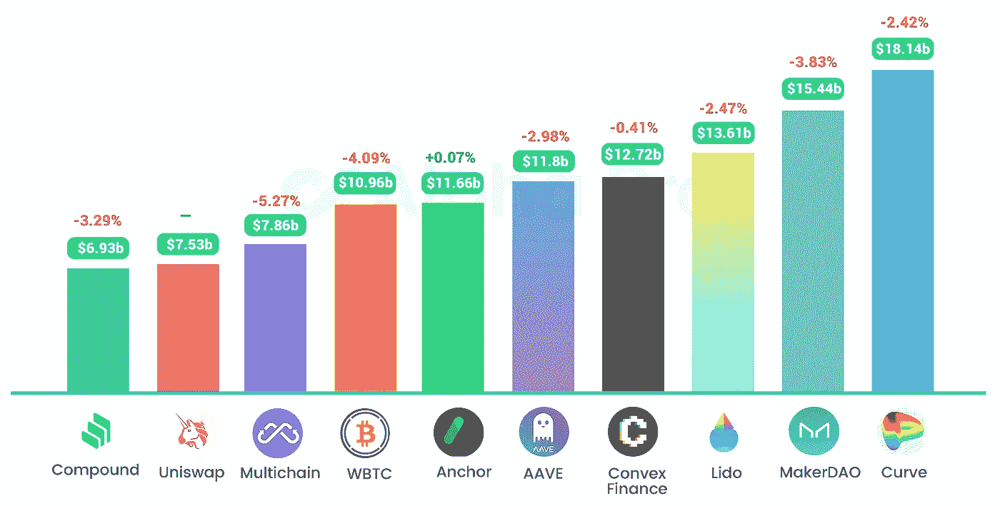
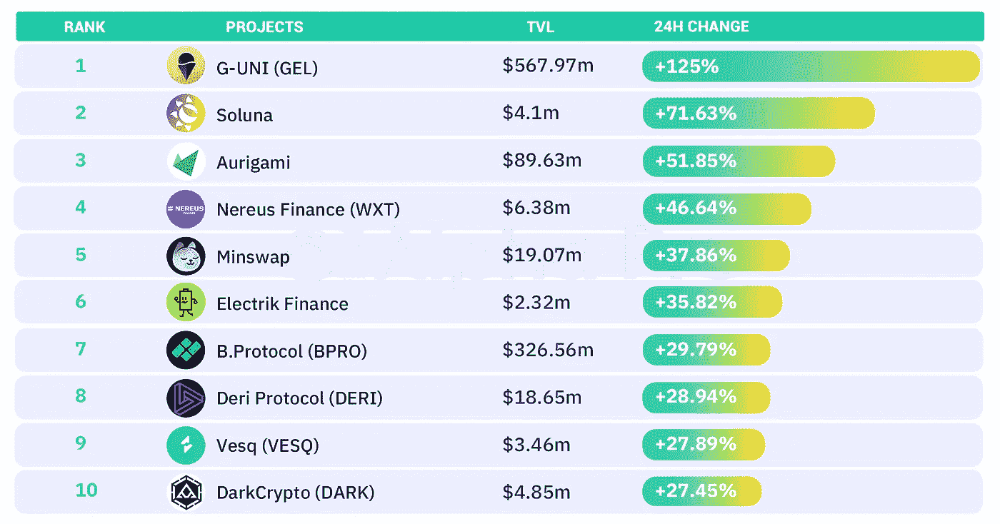
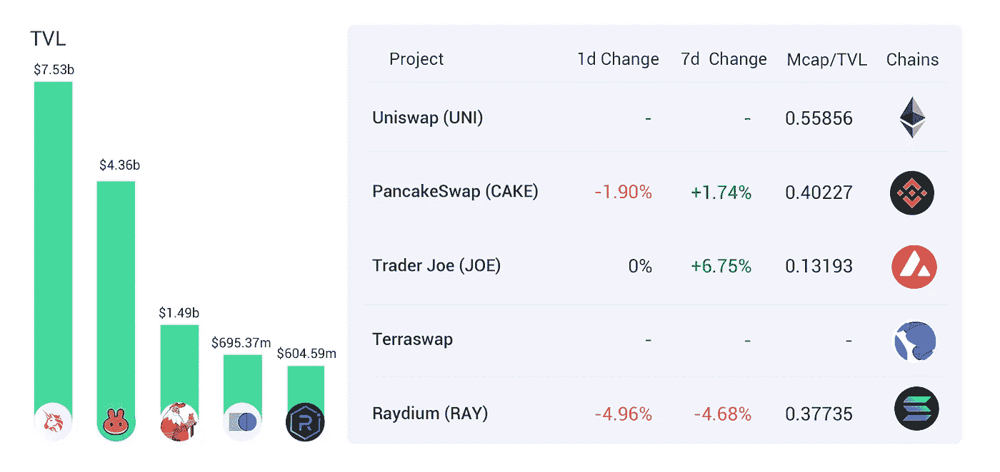
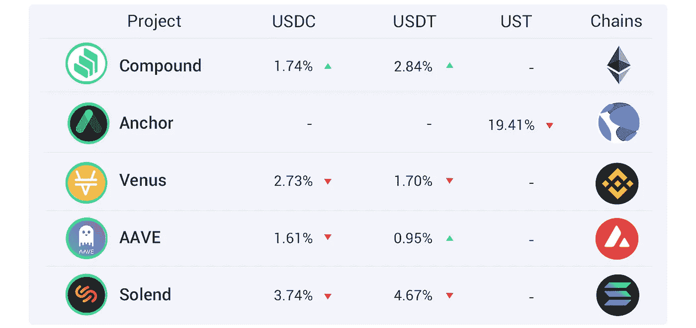
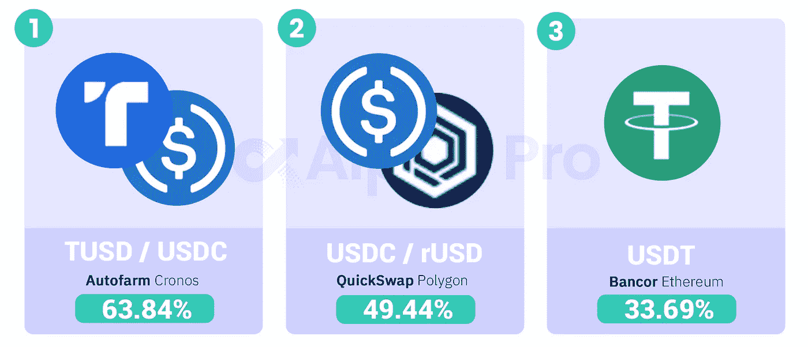

# DeFi Insight | a16z 已向丽都投资 7000 万美元；Terra Protocol 将是 BTC 最大的持有者之一

> 原文：<https://medium.com/coinmonks/defi-insight-a16z-has-invested-70-million-in-lido-terra-protocol-will-be-one-of-the-largest-9a9bc5ee7bb0?source=collection_archive---------16----------------------->

## 2022 年 3 月 4 日

*今日 DeFi 数据&由 DeFi Insight 为您带来的新闻。*

**宏观趋势:**比特币基地 CEO: [比特币基地](https://twitter.com/brian_armstrong/status/1499621509651787782)遵守制裁法律，但不会禁止所有俄罗斯用户

**TVL 动向:**目前全网 [DeFi](https://defillama.com/) 总锁定量为 2030 亿美元，24 小时内下降 3.31%

**Stablecoin:** Angle Labs 推出 euro [stablecoin 协议](https://www.globenewswire.com/news-release/2022/03/04/2396838/0/en/EUR-Based-Stablecoin-Protocol-Over-Collateralized-Minting-Procedure-Launched.html)

# 最新消息

## 定义

新兴市场中 75%的投资者[想要更多的密码](https://cointelegraph.com/news/75-of-investors-in-emerging-markets-want-more-crypto-survey)

Terra 联合创始人:Terra Protocol 将成为 BTC 的[最大股东之一](https://www.cryptoglobe.com/latest/2022/03/terra-luna-founder-the-terra-protocol-will-be-one-of-the-largest-holders-of-btc/)

马来西亚副部长[否认加密货币](https://finbold.com/malaysian-deputy-minister-dismisses-cryptocurrencies-as-they-dont-exhibit-characteristics-of-money/)，因为它们没有“展示货币的特征”

## 协议

DeFi 安全提供商[夏洛克](https://www.theblockcrypto.com/post/136200/defi-security-provider-sherlock-aims-to-raise-100-million-in-token-round)筹集 1 亿美元

筹集了 5000 万美元

DeFi 协议[稳定的 sTVL](https://defillama.com/protocol/solidly) 已经下降到 15.8 亿美元

1inch 增加了一个 [P2P 功能](https://blog.1inch.io/1inch-adds-a-p2p-feature-dec37e68a1f7)

FTX 集成 [Bonfida 的旗舰服务](https://cointelegraph.com/news/ftx-integrate-bonfida-s-flagship-service-to-enable-domain-withdrawal-function)以启用域名撤销功能

ApeX 协议结束由顶级战略投资者和[锚定投资者](https://cointelegraph.com/press-releases/apex-protocol-closes-seed-round-led-by-top-strategic-and-anchor-investors)领导的种子轮投资

## 互换

*[SushiSwap](https://twitter.com/SushiSwap/status/1499354049853935617)与 OpenMEV、Manifold Finance 合作

## 打桩

a16z 向[丽都](https://a16z.com/2022/03/03/investing-in-lido/)投资了 7000 万美元

## 基金

新的加密风险资本基金仅投资于靠近的[并致力于专业化](https://blockworks.co/new-crypto-venture-capital-fund-investing-only-in-near-in-nod-to-specialization/)

# 数据和分析

## TVL 和 ATH 排名前六的连锁酒店对比

## 最新 TVL 十大项目

## 过去 24 小时 TVL 变化的前 10 个项目

## 德克斯 TVL 排名

*DEX 跌幅最大的是*[*Raydium*](https://defillama.com/protocol/raydium)*，损失了 4.96%*

## APY DeFi 贷款公司

*USDC:最高贷款人:索伦德，利率为 3.74% APY*

*USDT:最高贷款人:索伦德，利率为 4.67% APY*

## 稳定的 APY

# 深潜

不学扎实如何阅读[智能合约](https://bowtiedisland.com/how-to-read-smart-contracts-without-learning-solidity/)

**DeFi 将如何颠覆[法律界](https://defieducation.substack.com/p/how-defi-will-disrupt-the-legal-profession?s=r)**

**Defi Dives:什么是[镜头协议](/new-finance-vc/defi-dives-what-is-lens-protocol-b4af7a9cf7b8)**

**一个 **值得信赖的资源，为一切事物定义****

> **一场回合:**
> 
> **DeFi Insight 是顶级 DeFi 和加密新闻和更新的来源。**
> 
> **提供的信息应被视为发展新闻，而不是投资建议。**

> **加入 Coinmonks [电报频道](https://t.me/coincodecap)和 [Youtube 频道](https://www.youtube.com/c/coinmonks/videos)了解加密交易和投资**

# **另外，阅读**

*   **[Koinly 回顾](https://coincodecap.com/koinly-review) | [Binaryx 回顾](https://coincodecap.com/binaryx-review) | [Hodlnaut vs CakeDefi](https://coincodecap.com/hodlnaut-vs-cakedefi-vs-celsius)**
*   **[MoonXBT vs Bybit vs 币安](https://coincodecap.com/bybit-binance-moonxbt) | [硬件钱包](/coinmonks/hardware-wallets-dfa1211730c6)**
*   **[火币交易机器人](https://coincodecap.com/huobi-trading-bot) | [如何购买 ADA](https://coincodecap.com/buy-ada-cardano) | [Geco。一次审查](https://coincodecap.com/geco-one-review)**
*   **[币安 vs 比特邮票](https://coincodecap.com/binance-vs-bitstamp) | [比特熊猫 vs 比特币基地 vs Coinsbit](https://coincodecap.com/bitpanda-coinbase-coinsbit)**
*   **[如何购买 Ripple (XRP)](https://coincodecap.com/buy-ripple-india) | [非洲最好的加密交易所](https://coincodecap.com/crypto-exchange-africa)**
*   **[非洲最佳加密交易所](https://coincodecap.com/crypto-exchange-africa) | [晤交易所评论](https://coincodecap.com/hoo-exchange-review)**
*   **[eToro vs robin hood](https://coincodecap.com/etoro-robinhood)|[MoonXBT vs by bit vs Bityard](https://coincodecap.com/bybit-bityard-moonxbt)**