# DeFi Insight |Aave 的蝾螈部门推出‘爱歌’；六个长期加密预测

> 原文：<https://medium.com/coinmonks/defi-insight-aaves-newt-division-launches-aika-six-long-term-crypto-predictions-5627eb33e161?source=collection_archive---------22----------------------->

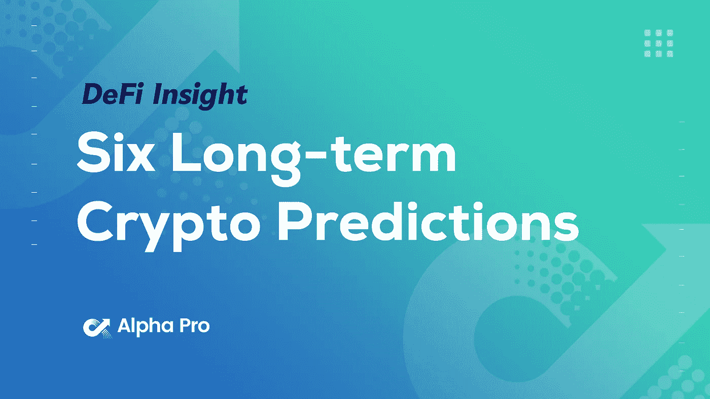

## 2022 年 2 月 25 日

*今日 DeFi 数据&由 DeFi Insight 为您带来的新闻。*

**宏观趋势:** [CryptoQuant CEO](https://cointelegraph.com/news/digital-gold-narrative-valid-as-long-as-microstrategy-holds-bitcoin-says-exec) :只要 MicroStrategy 持有比特币，数字黄金叙事就依然有效

**TVL 走势:**价值锁定德菲受到打击， [TVL 在 24 小时内下跌 1.21%](https://defillama.com/)

**德指动态:**德指涨幅最大的是[操盘手](https://defillama.com/protocol/trader-joe)，上涨 10.08 **%**

稳定:USDC 的发行额超过 530 亿美元

# 最新消息

## 定义

比特币基地公司第四季度净收入创下 25 亿美元的历史新高

汤加将[比特币](https://cointelegraph.com/news/tonga-s-timeline-for-bitcoin-as-legal-tender-and-btc-mining-with-volcanoes)作为法定货币以及 BTC 火山采矿的时间表

1inch Network 联合创始人:[以太坊](https://cointelegraph.com/news/bitcoin-makes-no-sense-for-blockchain-developers-says-1inch-network-co-founder)一旦可扩展性问题得到解决，就可能取代比特币

## 借出

RociFi 宣布 3 月 2 日在 Kovan testnet 上发布

## 互换

数据:[以太鲸](https://www.whalestats.com/)在过去的一周已经拖走了大量的 SRM、FTT 和 MATIC

[血清](https://twitter.com/SBF_FTX/status/1497039549452922880)今天的交易量接近 10 亿美元

## 协议

Andre Cronje 的新项目[总锁定金额为 10.4 亿美元](https://defillama.com/protocol/solidly)

*[Aave](https://mirror.xyz/wearenewt.eth/iJ0xT3TxyKl1aLU6VkO2IRTz6MZQUL6wtvizS7J-tqg)的纽特部门推出“爱歌”，一个时间符号化项目

[[hash flow](https://blog.hashflow.com/hashflow-is-now-live-on-avalanche-87730d7640d6)现在正在雪崩上直播

SupraOracles 与 DeFi 投资平台合作[单一金融](https://supraoracles.com/news/supraoracles-collaborates-with-single-finance-the-first-capital-protected-yield-earning-platform/)

Plena 集成了[图形](https://blogs.plena.finance/plena-integrates-the-graph-protocol-hosted-service-9f162ddddcc4)协议托管服务

# 数据和分析

## 锁定的总价值(TVL)

## TVL 的六大连锁品牌

*哪些*链/协议*目前在其智能合同中存放了最多的资产？*

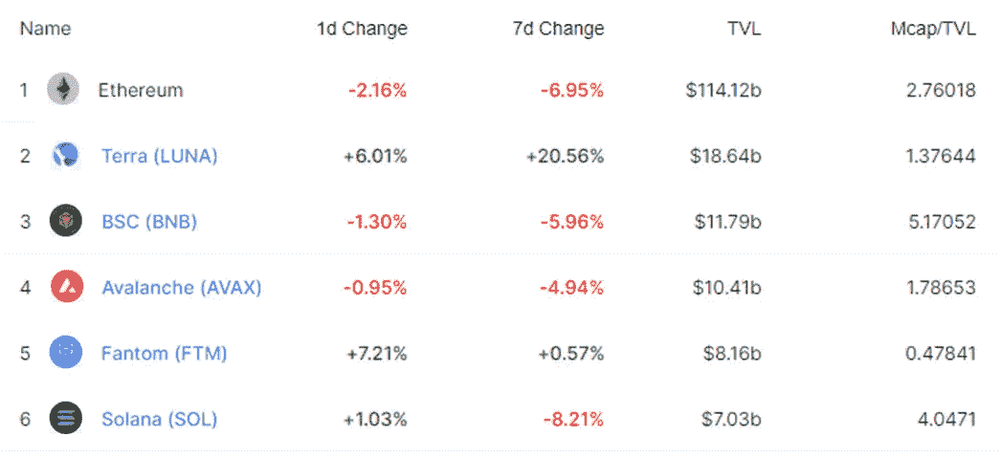

> **#以太坊**TVL 五大协议

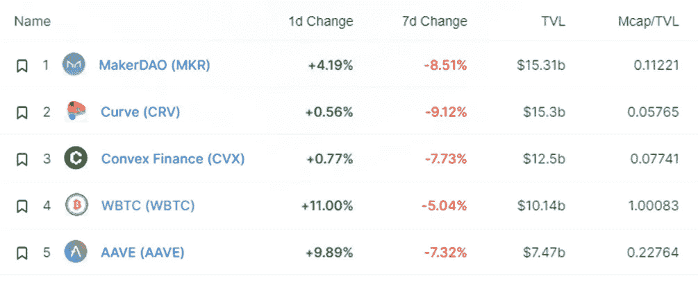

> TVL 的五大协议

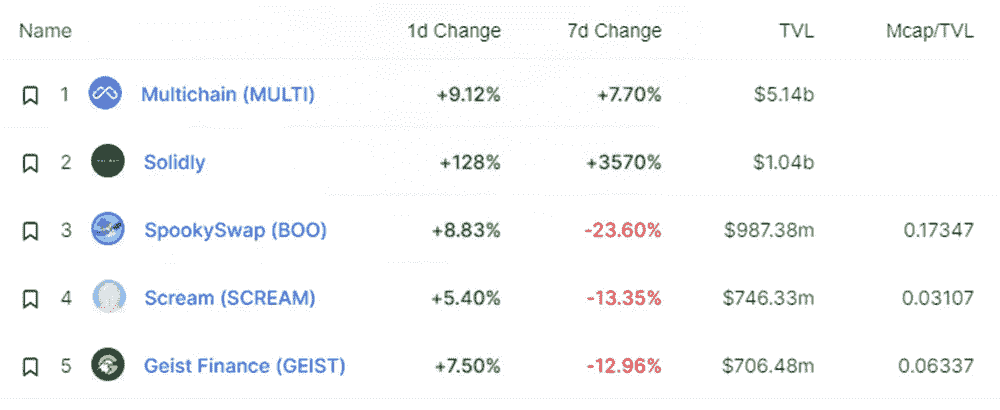

> TVL 的五大协议

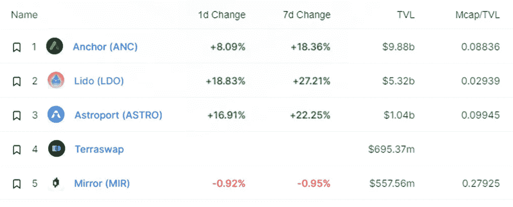

> **# BNB**TVL 的五大协议

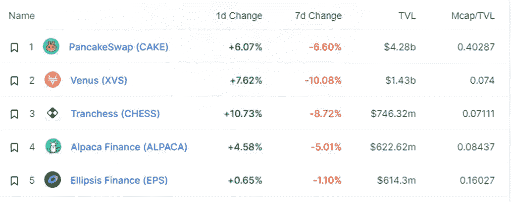

> **#雪崩**TVL 五大协议

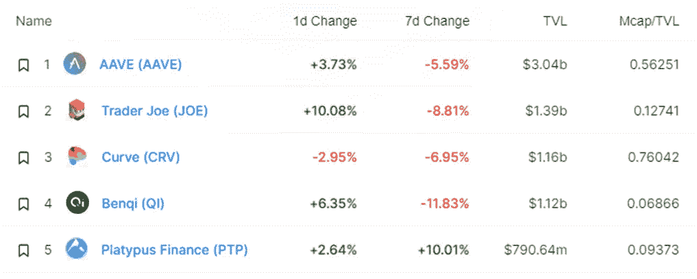

> TVL 的五大协议

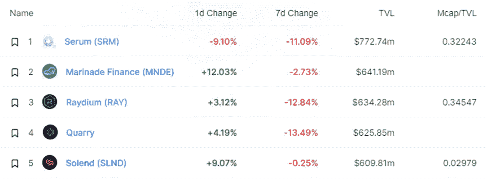

## 德克斯 TVL 排名

指数中涨幅最大的是[操盘手](https://defillama.com/protocol/trader-joe)，上涨 10.08 **%**

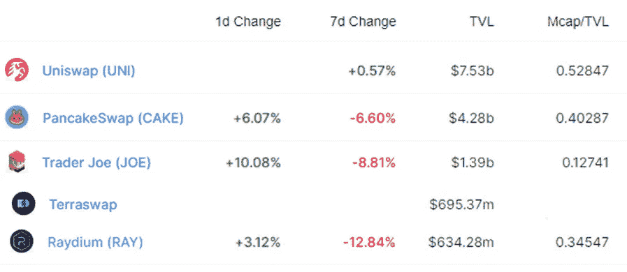

## APY DeFi 贷款公司

*USDC:最高贷款人:金星&索伦达 326% APY*

*USDT:最高贷款人:索伦德，利率为 4.23% APY*

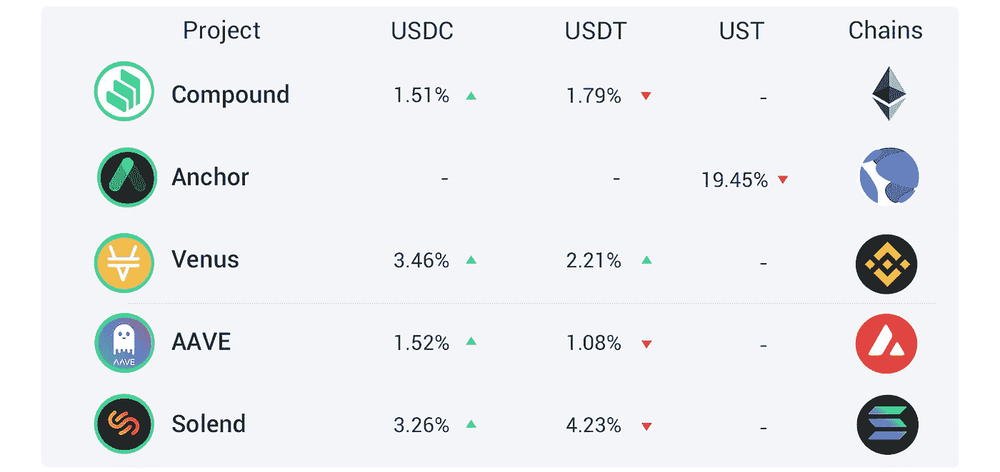

## 稳定的 APY

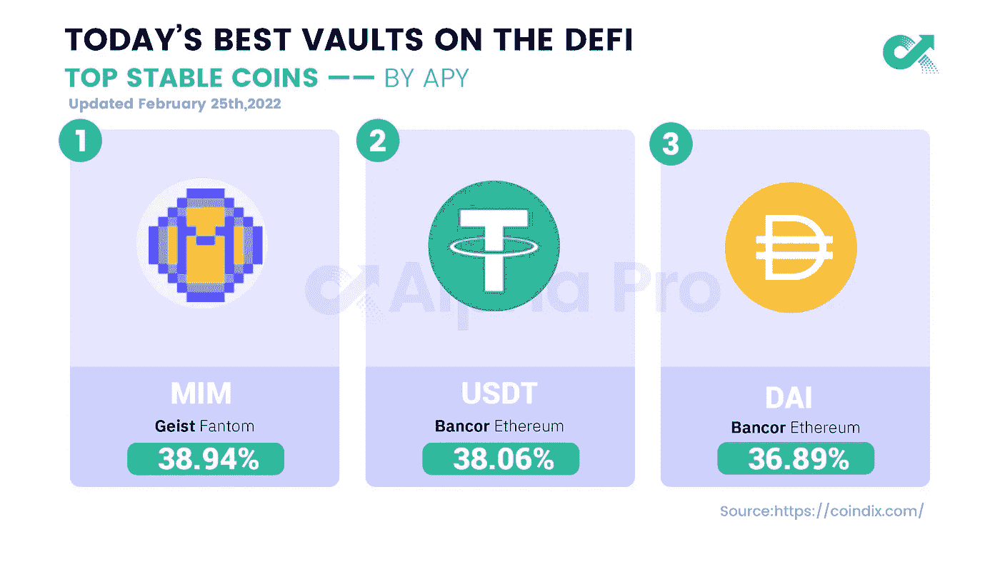

# 深潜

六个长期[加密预测](https://fbifemboy.substack.com/p/six-long-term-crypto-predictions?utm_source=url)

 [## 六个长期加密预测

### 做预测总是很有趣的。但是在拖延编辑一个长的…

fbifemboy.substack.com](https://fbifemboy.substack.com/p/six-long-term-crypto-predictions?utm_source=url) 

蝴蝶战争——曲线战争[的另一个转折](https://richmorecapital.substack.com/p/the-butterfly-wars-another-twist?utm_source=url)

 [## 蝴蝶战争——曲线战争的另一个转折

### 欢迎下次光临！今天，我们将深入探讨下 4D 象棋的有趣协议。这可能会让大脑…

richmorecapital.substack.com](https://richmorecapital.substack.com/p/the-butterfly-wars-another-twist?utm_source=url) 

在 Web3 中走向市场:[新的思维模式、策略、指标](https://future.a16z.com/go-to-market-in-web3/?utm_medium=email&utm_source=newsletter&mkt_tok=MzgyLUpaQi03OTgAAAGCy8AmiqwH4rEAKhPcJyeHrFi-JVKbhB50xsEOhjMKdeJNncB3uNhK8Gs0t-7KeRbf0QYGdbtUtzyd3SU5eLI2sQiUVm1uFVigsrlzQaNezgM)

*[奥林巴斯(II)](https://dirtroads.substack.com/p/-33-olympus-ii-a-coming-of-age-story?token=eyJ1c2VyX2lkIjo1MjEwMzcwLCJwb3N0X2lkIjo0OTE2ODE5MywiXyI6IkoyQU5hIiwiaWF0IjoxNjQ1NzQ0NzUxLCJleHAiOjE2NDU3NDgzNTEsImlzcyI6InB1Yi0zOTU3MTIiLCJzdWIiOiJwb3N0LXJlYWN0aW9uIn0.6cxa5Gn39SwmkOEHCAhaFIdVPD9LpGyZM_oSKF2S2aw&utm_source=url) ，一个成长的故事

*[绿荫协议](https://rainandcoffee.substack.com/p/shade-protocol-thesis?token=eyJ1c2VyX2lkIjo1MjEwMzcwLCJwb3N0X2lkIjo0OTIzMDYxMCwiXyI6IkoyQU5hIiwiaWF0IjoxNjQ1NzQ1MDExLCJleHAiOjE2NDU3NDg2MTEsImlzcyI6InB1Yi02ODg2OTIiLCJzdWIiOiJwb3N0LXJlYWN0aW9uIn0.7a6PrIrN_zzYbnrtEiBYPgq3mRhVi6EDuLbYHflaM7c&utm_source=url)论文

一个 **值得信赖的资源，为所有的事情做准备**

> 一场回合:
> 
> 分散金融(DeFi)指的是从传统的中央金融系统向区块链促成的点对点金融系统的转变。
> 
> DeFi Insight 是顶级 DeFi 和加密新闻和更新的来源。
> 
> 提供的信息应被视为发展新闻，而不是投资建议。

> 加入 Coinmonks [电报频道](https://t.me/coincodecap)和 [Youtube 频道](https://www.youtube.com/c/coinmonks/videos)了解加密交易和投资

# 另外，阅读

*   [币安期货交易](https://coincodecap.com/binance-futures-trading)|[3 comas vs Mudrex vs eToro](https://coincodecap.com/mudrex-3commas-etoro)
*   [如何购买 Monero](https://coincodecap.com/buy-monero) | [IDEX 评论](https://coincodecap.com/idex-review) | [BitKan 交易机器人](https://coincodecap.com/bitkan-trading-bot)
*   [CoinDCX 评论](/coinmonks/coindcx-review-8444db3621a2) | [加密保证金交易交易所](https://coincodecap.com/crypto-margin-trading-exchanges)
*   [红狗赌场评论](https://coincodecap.com/red-dog-casino-review) | [Swyftx 评论](https://coincodecap.com/swyftx-review) | [CoinGate 评论](https://coincodecap.com/coingate-review)
*   [Bookmap 点评](https://coincodecap.com/bookmap-review-2021-best-trading-software) | [美国 5 大最佳加密交易所](https://coincodecap.com/crypto-exchange-usa)
*   [如何在 FTX 交易所交易期货](https://coincodecap.com/ftx-futures-trading) | [OKEx vs 币安](https://coincodecap.com/okex-vs-binance)
*   [CoinLoan 评论](https://coincodecap.com/coinloan-review) | [YouHodler 评论](/coinmonks/youhodler-4-easy-ways-to-make-money-98969b9689f2) | [BlockFi 评论](https://coincodecap.com/blockfi-review)