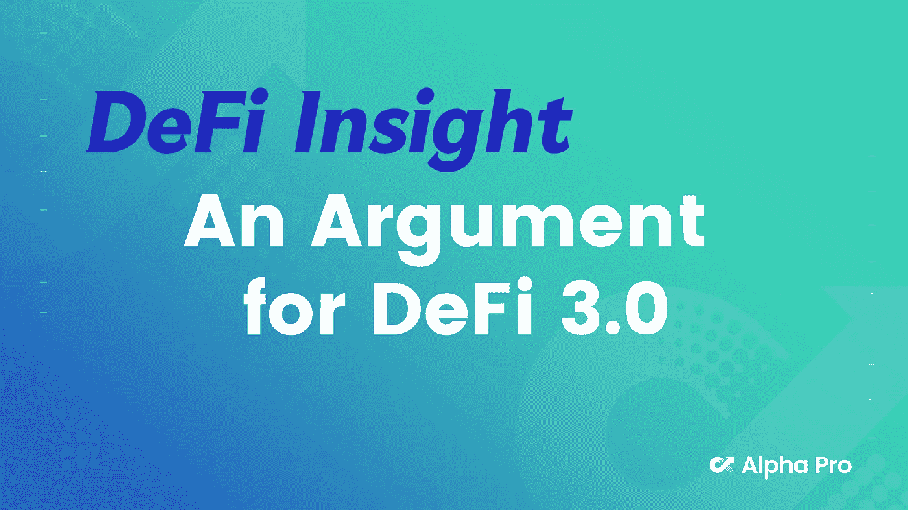
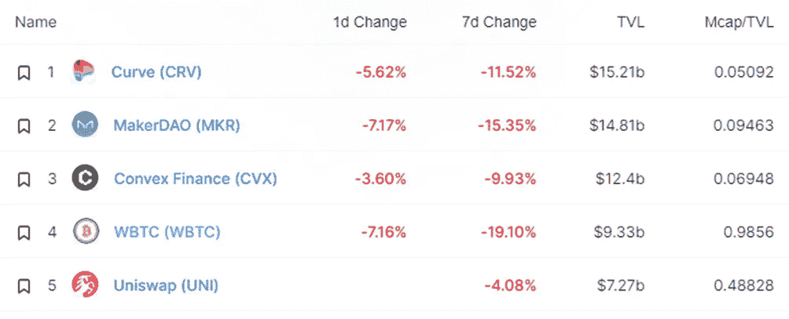
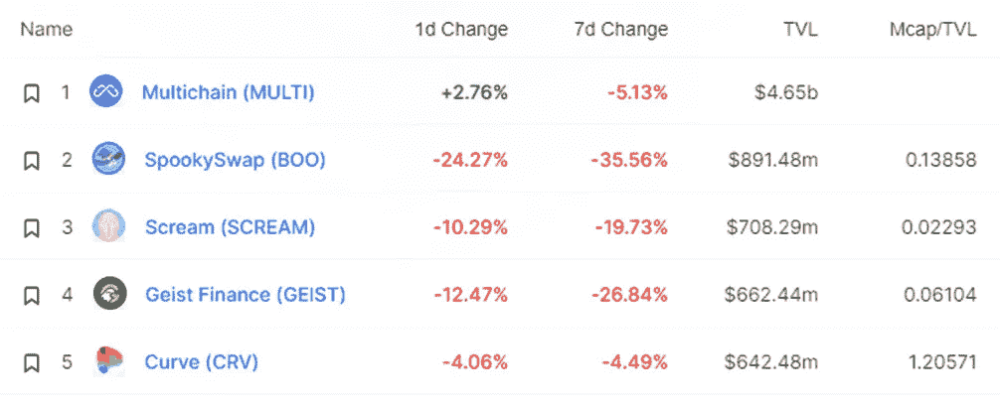
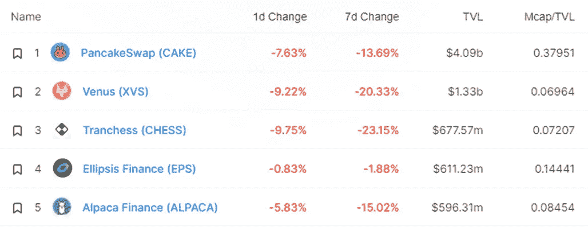
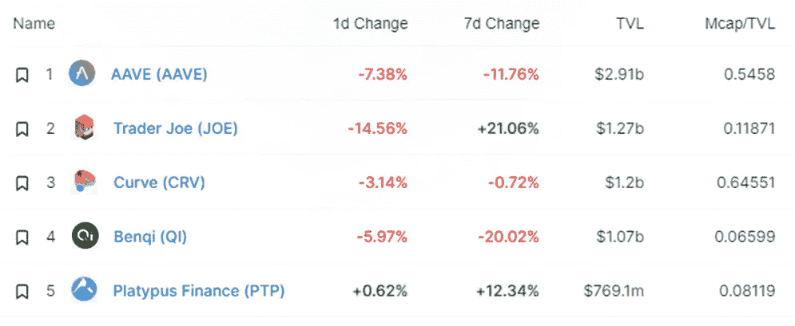
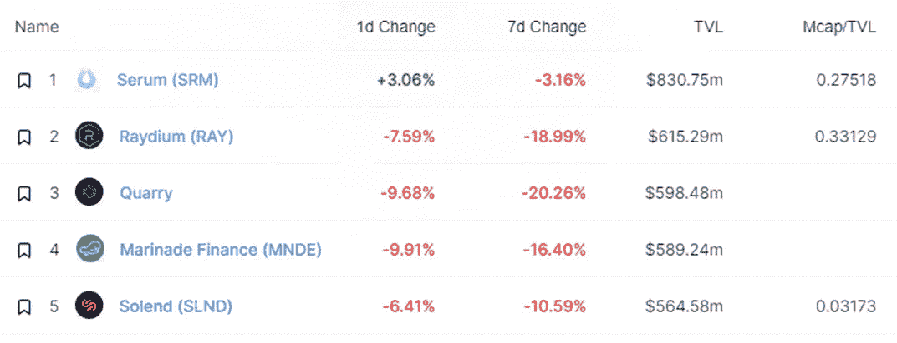
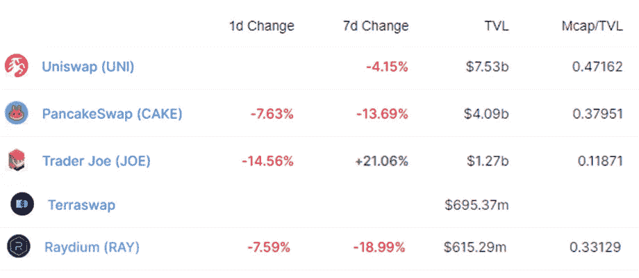
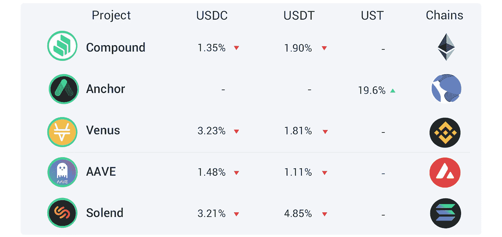

# DeFi Insight |为 DeFi 3.0 辩护；Arca 发布旨在提高 ANC 效用的社区提案

> 原文：<https://medium.com/coinmonks/defi-insight-an-argument-for-defi-3-0-af422d557f95?source=collection_archive---------26----------------------->

## 2022 年 2 月 24 日

*今日 DeFi 数据&由 DeFi Insight 为您带来的新闻。*

**宏观趋势:** SBF:对[密码、](https://twitter.com/SBF_FTX/status/1496745220536352768)乌克兰、股票的一些想法

**TVL 走势:**价值锁定德菲受到打击， [TVL 在 24 小时内下跌 5.88%](https://defillama.com/)

**DEX 动态:***DEX 跌幅最大的是* [乔氏](https://defillama.com/protocol/trader-joe) *，跌了 14.56%*

**Stablecoin:** Circle 为 [USDC 交易](https://www.circle.com/blog/meet-the-new-circle-account)开通商业账户

# 最新消息

## 定义

DeFi。[我们今天在哪里](https://twitter.com/seanlippel/status/1496479840479944704?s=21)，我们将何去何从

> 嵌入式 DeFi 主题——DeFi 不会消失，事实上，它更有可能“嵌入”到您未来使用的所有加密中。

摩根士丹利称比特币无法逃脱能源需求

## |新

*[摇摆网](https://twitter.com/wagglenetwork/status/1496707067796914177) :$DEFI 销售阶段将于世界协调时今天 14:00 开始！

在 [zkSync 2.0](/increment-newsletter/building-the-increment-protocol-on-zksync-2-0-8a9c87862707) 上建立增量协议

## 借出

DeFi lending protocol[Teller](/teller-finance/teller-secures-a-strategic-funding-round-from-major-partners-to-decentralize-unsecured-lending-15e654885626)完成由区块链资本牵头的 685 万美元战略融资

## 互换

Raydium 在新的 [USDC-USDT 稳定曲线](https://twitter.com/RaydiumProtocol/status/1496712012885536771)上宣布射线奖励

## 协议

Andre Cronje 的新项目牢牢锁定了[3.47 亿美元](https://solidly.dev/home)

渴望金融在 Arbitrum 上线

Arca 发布机构群体提案，旨在[提高 ANC 的效用](https://forum.anchorprotocol.com/t/arca-tokenomics-proposal/2909)

索拉纳钱包[斜坡金融](https://www.coindesk.com/business/2022/02/23/solana-wallet-slope-finance-raises-8m/)筹集 800 万美元

DeFi 保证金协议 [Marginfi](https://www.marginfi.com/) 完成 300 万美元融资

DeSyn Protocol 已完成两轮融资，金额超过 500 万美元

*[Ren Labs](https://www.coindesk.com/business/2022/02/23/ren-labs-raises-75m-for-catalog-cross-chain-exchange/)为“目录”跨链交换筹集了 750 万美元

莱拉与霍普在[乐观主义](https://blog.lyra.finance/lyra-hop/)上融合

*[Acar dex](https://ambcrypto.com/acardex-set-to-be-one-of-the-biggest-defi-platform-on-cardano-with-a-dex-and-nft-marketplace/?utm_source=dlvr.it&utm_medium=twitter)将成为卡尔达诺最大的 DeFi 平台之一，拥有 DEX 和 NFT 市场

# 数据和分析

## 锁定的总价值(TVL)

## TVL 的六大连锁品牌

*哪些*链/协议*当前将最多的资产存放在它们的智能合同中？*

> TVL 的五大协议

> TVL 的五大协议

> TVL 的五大协议

> **# BNB**TVL 五大协议

> TVL 的五大协议

> TVL 的五大礼仪

## 德克斯 TVL 排名

*DEX 跌幅最大的是* [乔氏](https://defillama.com/protocol/trader-joe) *，跌了 14.56%*

## APY DeFi 贷款公司

*USDC:最高贷款人:金星&索伦，利率 3.21% APY*

*USDT:最高贷款人:索伦德，利率为 4.85% APY*

# 深潜

💹[定义 3.0](https://theknower.substack.com/p/an-argument-for-defi-30?utm_source=url) 的一个参数

 [## DeFi 3.0 的论据

### 在我开始之前，我想感谢@LordBogdanoff 提出了这个概念&感谢@0xSami_ 充实了他的…

theknower.substack.com](https://theknower.substack.com/p/an-argument-for-defi-30?utm_source=url) 

💹关于[加密投资组合跟踪器的国情咨文](https://mirror.xyz/jasminexu.eth/zHQ5VHsBcR1591nEuJ_PPILg4J2kRlzT7lKPLF8Jh-Y)

 [## 加密投资组合追踪器联盟

### 任何一个钻研 web3 的用户都会很快意识到，跟踪每一件事真的很难。有一些…

镜像. xyz](https://mirror.xyz/jasminexu.eth/zHQ5VHsBcR1591nEuJ_PPILg4J2kRlzT7lKPLF8Jh-Y) 

💹ETHDenver 回顾:2022 年[让你赚钱的 10 种行为](https://swissdefi.substack.com/p/ethdenver-recap-10-behaviors-that?utm_source=url)

 [## ETHDenver 回顾:2022 年让你赚钱的 10 种行为

### 我在 ETHDenver 呆了几天。活动结束后会有很多活动。我正试图更进一步…

swissdefi.substack.com](https://swissdefi.substack.com/p/ethdenver-recap-10-behaviors-that?utm_source=url) 

💹[金雀金融](https://messari.io/article/goldfinch-finance-let-s-get-real)——现实点吧

 [## 金翅雀金融-让我们现实一点

### 到目前为止，加密贷款受到了两个主要的限制。首先，借款人池是有限的，主要包括…

梅萨里岛](https://messari.io/article/goldfinch-finance-let-s-get-real) 

一个 **值得信赖的资源，为所有的事情做准备**

> 一场回合:
> 
> 分散金融(DeFi)指的是从传统的中央金融系统向区块链促成的点对点金融系统的转变。
> 
> DeFi Insight 是顶级 DeFi 和加密新闻和更新的来源。
> 
> 提供的信息应被视为发展新闻，而不是投资建议。

> *加入 Coinmonks* [*电报频道*](https://t.me/coincodecap) *和* [*Youtube 频道*](https://www.youtube.com/c/coinmonks/videos) *了解加密交易和投资*

# 另外，阅读

*   [Bookmap 评论](https://coincodecap.com/bookmap-review-2021-best-trading-software) | [美国 5 大最佳加密交易所](https://coincodecap.com/crypto-exchange-usa)
*   最佳加密[硬件钱包](/coinmonks/hardware-wallets-dfa1211730c6) | [Bitbns 评论](/coinmonks/bitbns-review-38256a07e161)
*   [新加坡十大最佳加密交易所](https://coincodecap.com/crypto-exchange-in-singapore) | [购买 AXS](https://coincodecap.com/buy-axs-token)
*   [红狗赌场评论](https://coincodecap.com/red-dog-casino-review) | [Swyftx 评论](https://coincodecap.com/swyftx-review) | [CoinGate 评论](https://coincodecap.com/coingate-review)
*   [投资印度的最佳密码](https://coincodecap.com/best-crypto-to-invest-in-india-in-2021)|[WazirX P2P](https://coincodecap.com/wazirx-p2p)|[Hi Dollar Review](https://coincodecap.com/hi-dollar-review)
*   [加拿大最佳加密交易机器人](https://coincodecap.com/5-best-crypto-trading-bots-in-canada) | [KuCoin 评论](https://coincodecap.com/kucoin-review)
*   [火币加密交易信号](https://coincodecap.com/huobi-crypto-trading-signals) | [HitBTC 审核](/coinmonks/hitbtc-review-c5143c5d53c2)