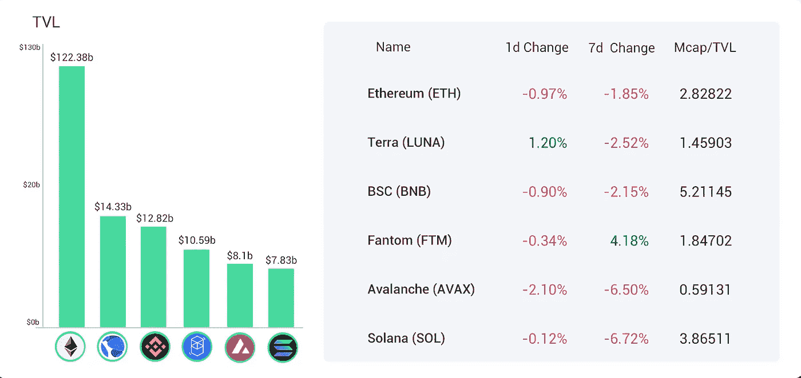
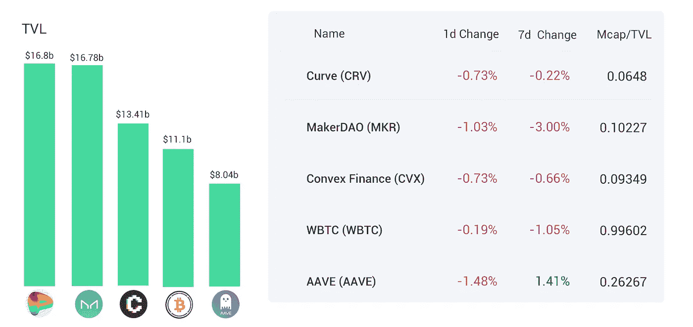
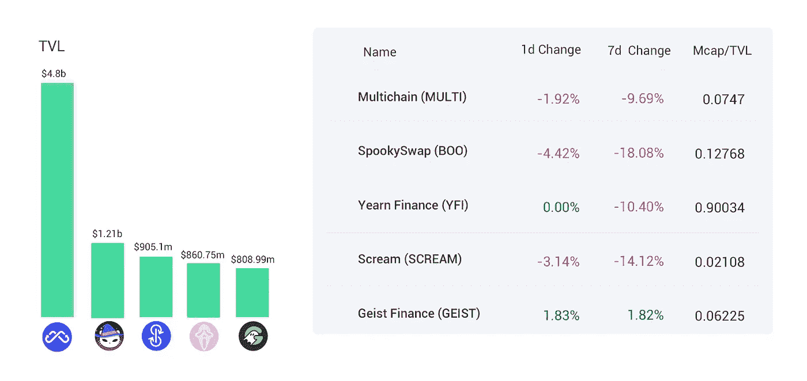
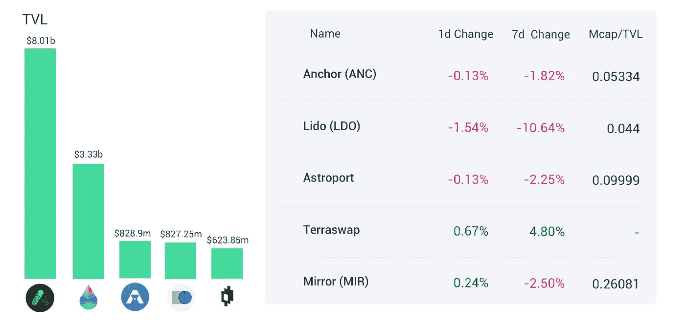
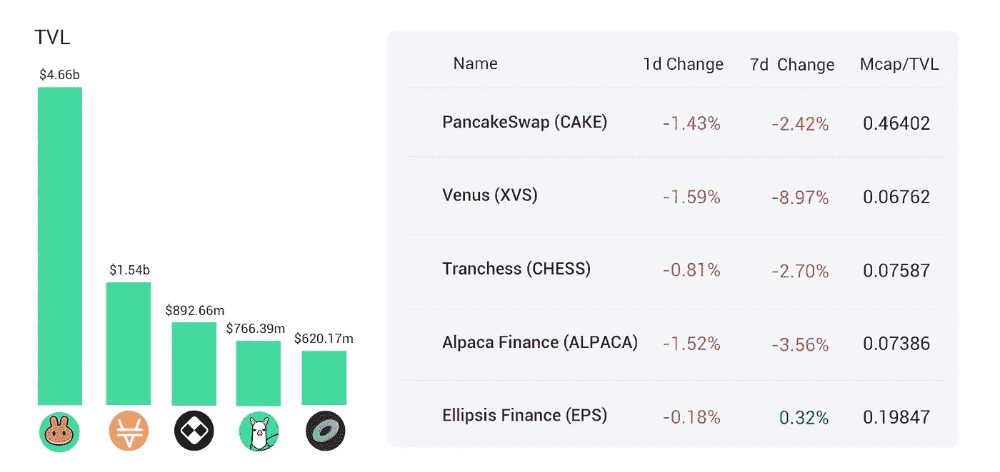
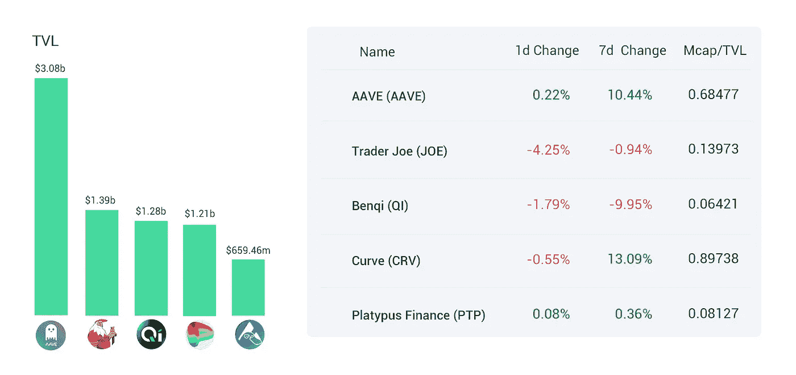
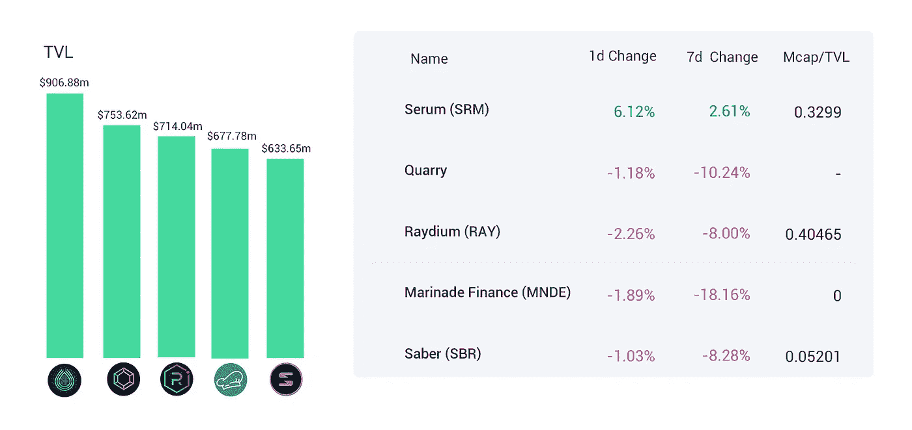
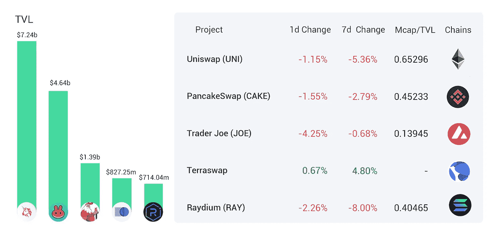
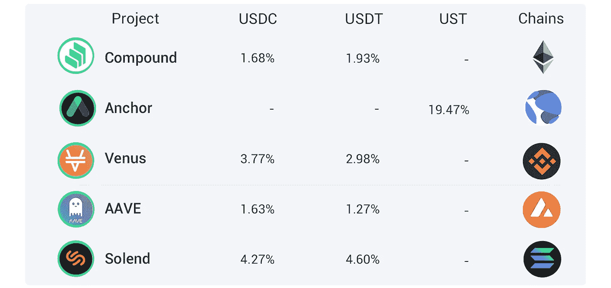

# DeFi Insight | Andre Cronje 介绍 Levzu 波尔卡多特本周解锁 364.75 万点

> 原文：<https://medium.com/coinmonks/defi-insight-andre-cronje-introduces-levzu-polkadot-to-unlock-3-6475-million-dot-this-week-f856d160a471?source=collection_archive---------20----------------------->

## 2022 年 2 月 14 日

*今日 DeFi 数据&由 DeFi Insight 为您带来的新闻。*

**宏观趋势:**赌注的三位数回报提供了一个[秘密的冬天](https://finance.yahoo.com/news/triple-digit-rewards-staking-offer-030000935.html)喘息的机会

**TVL 走势:**价值锁定德菲受到打击， [TVL 在 24 小时内下跌 1.02%](https://defillama.com/)

**DEX 动态:***DEX 跌幅最大的是* [乔氏](https://defillama.com/protocol/trader-joe) *，跌了 4.25%*

**stable coin:**IMF:[Crypto](https://news.bitcoin.com/imf-crypto-no-match-for-well-designed-central-bank-digital-currencies/)不是精心设计的央行数字货币的对手

# 最新消息

**在扎实的基础上，上链杠杆现货永续合约产品**[**Levzu**](https://twitter.com/AndreCronjeTech/status/1492759585823801344)**可以推出**

> 基于 Solidly，链上杠杆现货永续合约产品 Levzu can 推出
> YFI 创始人 Andre Cronje (AC)表示，Fantom 推出 Solidly 后，又推出了两款新产品。一个是链上杠杆现货永续合约 Levzu:可以创建任何长/短组合；为任何资产支付保证金；杠杆高达 49 倍；动态实时融资利率。

## 定义

赌注的三位数奖励提供了一个[隐秘的冬天](https://finance.yahoo.com/news/triple-digit-rewards-staking-offer-030000935.html)喘息的机会

瑞士最大的银行瑞银集团预计[美国加密立法需要时间](https://news.bitcoin.com/switzerlands-largest-bank-ubs-expects-us-crypto-legislation-take-time/)

*[Tether CTO](https://twitter.com/paoloardoino/status/1492855917599154176):Tether 和 Bitfinex 最近投资了比特币采矿，并将多样性作为优先事项

超级碗加密广告后，比特币基地的交通受到冲击

## 借出

*[平衡器](https://www.theblockbeats.info/flash/67137)加入维斯塔金融激励计划

## 互换

本周解锁 364.75 万点

一只 [BNB 鲸鱼](https://twitter.com/WhaleStatsBSC/status/1492953102902829058)买了 139，929，254，883 美元的锡伯(4，232，859 美元)

马斯克暗示星联接受 Dogecoin

以太坊费用降至 4 个月低点，比 1 月份下降 71%

*[内射协议(INJ)](https://cointelegraph.com/news/injective-protocol-inj-rallies-100-after-launching-cross-chain-support-for-cosmos) 在启动对 Cosmos 的跨链支持后获得 100%以上的支持

Raydium 发射[种子 USDC](https://twitter.com/RaydiumProtocol/status/1492803509925793792) 聚变池

## 稳定币

IMF: [Crypto](https://news.bitcoin.com/imf-crypto-no-match-for-well-designed-central-bank-digital-currencies/) 不是精心设计的央行数字货币的对手

欧盟委员会将于 3 月启动[数字欧元磋商](https://news.bitcoin.com/european-commission-to-launch-digital-euro-consultations-in-march-propose-bill-early-next-year/)，明年初提出法案

*[Tether](https://www.coindesk.com/markets/2022/02/11/tether-blacklists-ethereum-address-linked-to-multichain-hack/)将链接到多链黑客的以太坊地址列入黑名单

## 协议

基于坚实的基础，在链杠杆现货永续合约产品 [Levzu](https://twitter.com/AndreCronjeTech/status/1492759585823801344) 可以推出

pech shield:[Titano Finance](https://twitter.com/PeckShieldAlert/status/1493119883927719941)被黑了 4828.7 BNB

# 数据和分析

## 锁定的总价值(TVL)

## TVL 的六大连锁品牌

*哪些*链/协议*当前将最多的资产存放在它们的智能合同中？*

Top 6 chains by TVL

> TVL 的五大协议

**Ethereum** Top 5 protocols by TVL

> TVL 的五大协议

**Fantom** Top 5 protocols by TVL

> TVL 的五大协议

**Terra** Top 5 protocols by TVL

> TVL 的五大协议

**BSC** Top 5 protocols by TVL

> **#雪崩**TVL 五大协议

**Avalanche** Top 5 protocols by TVL

> TVL 的五大协议

**Solana** Top 5 protocols by TVL

## 德克斯 TVL 排名

*DEX 跌幅最大的是* [乔氏](https://defillama.com/protocol/trader-joe) *，跌了 4.25%*

Dexes TVL Rankings

## APY DeFi 贷款公司

*USDC:最高贷款人:索伦德，利率为 4.27% APY*

*USDT:最高贷款人:索伦德，利率为 4.60% APY*

DeFi Lending APY

# 深潜

 [## 以太坊的智能合约统治地位发生了什么变化？CoinCodeCap

### 以太坊的智能合约统治地位发生了什么变化？

coincodecap.com](https://coincodecap.com/whats-happening-to-ethereums-smart-contract-dominance)  [## 足迹分析:卡达诺会在 2022 年爆发吗？

### 经过多年的技术微调，Cardano 终于在 1 月 20 日推出了第一款 DEX，名为 SundaeSwap…

finance.yahoo.com](https://finance.yahoo.com/news/footprint-analytics-cardano-explode-2022-013026428.html) 

一个 **值得信赖的资源，为一切事物定义**

> 一场回合:
> 
> 分散金融(DeFi)指的是从传统的中央金融系统向区块链促成的点对点金融系统的转变。
> 
> DeFi Insight 是顶级 DeFi 和加密新闻和更新的来源。
> 
> 提供的信息应被视为发展新闻，而不是投资建议。

> 加入 Coinmonks [电报频道](https://t.me/coincodecap)和 [Youtube 频道](https://www.youtube.com/c/coinmonks/videos)了解加密交易和投资

## 另外，阅读

*   [10 本关于加密的最佳书籍](https://coincodecap.com/best-crypto-books) | [英国 5 个最佳加密机器人](https://coincodecap.com/uk-trading-bots)
*   [ko only 回顾](https://coincodecap.com/koinly-review) | [Binaryx 回顾](https://coincodecap.com/binaryx-review)|[Hodlnaut vs CakeDefi](https://coincodecap.com/hodlnaut-vs-cakedefi-vs-celsius)
*   [MoonXBT vs Bybit vs 币安](https://coincodecap.com/bybit-binance-moonxbt) | [硬件钱包](/coinmonks/hardware-wallets-dfa1211730c6)
*   [火币交易机器人](https://coincodecap.com/huobi-trading-bot) | [如何购买 ADA](https://coincodecap.com/buy-ada-cardano) | [Geco。一篇评论](https://coincodecap.com/geco-one-review)
*   [币安 vs Bitstamp](https://coincodecap.com/binance-vs-bitstamp) | [Bitpanda vs 比特币基地 vs Coinsbit](https://coincodecap.com/bitpanda-coinbase-coinsbit)
*   [如何购买瑞波(XRP)](https://coincodecap.com/buy-ripple-india) | [非洲最好的加密交易所](https://coincodecap.com/crypto-exchange-africa)
*   [非洲最佳加密交易所](https://coincodecap.com/crypto-exchange-africa) | [Hoo 交易所评论](https://coincodecap.com/hoo-exchange-review)
*   [eToro vs robin hood](https://coincodecap.com/etoro-robinhood)|[MoonXBT vs by bit vs Bityard](https://coincodecap.com/bybit-bityard-moonxbt)
*   [有哪些交易信号？](https://coincodecap.com/trading-signal) | [比特斯坦普 vs 比特币基地](https://coincodecap.com/bitstamp-coinbase)
*   [ProfitFarmers 点评](https://coincodecap.com/profitfarmers-review) | [如何使用 Cornix 交易机器人](https://coincodecap.com/cornix-trading-bot)
*   [如何在势不可挡的域名上购买域名？](https://coincodecap.com/buy-domain-on-unstoppable-domains)
*   [印度的秘密税](https://coincodecap.com/crypto-tax-india) | [altFINS 审查](https://coincodecap.com/altfins-review) | [Prokey 审查](/coinmonks/prokey-review-26611173c13c)
*   [赢取注册奖金——10 大最佳加密平台](https://coincodecap.com/earn-sign-up-bonus)