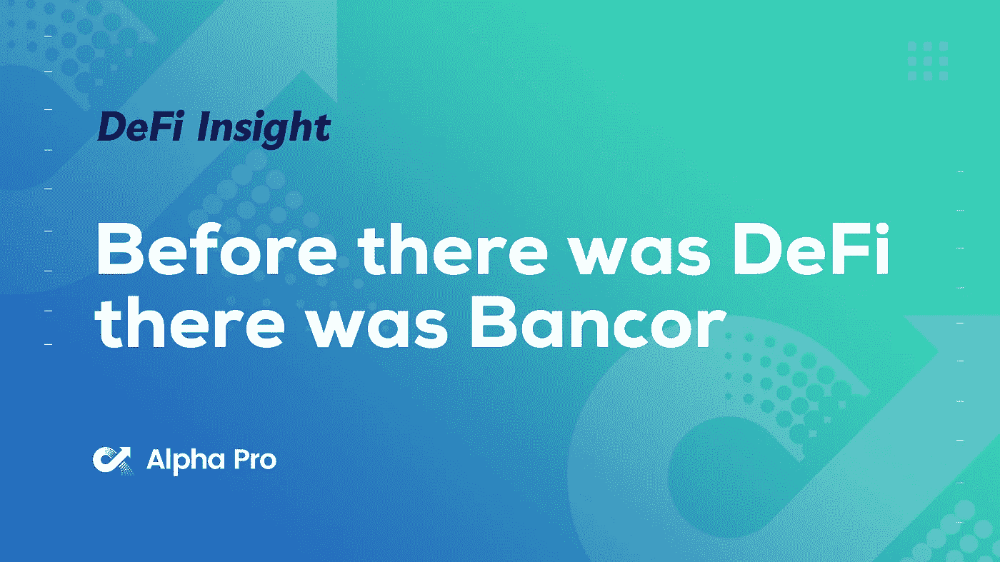
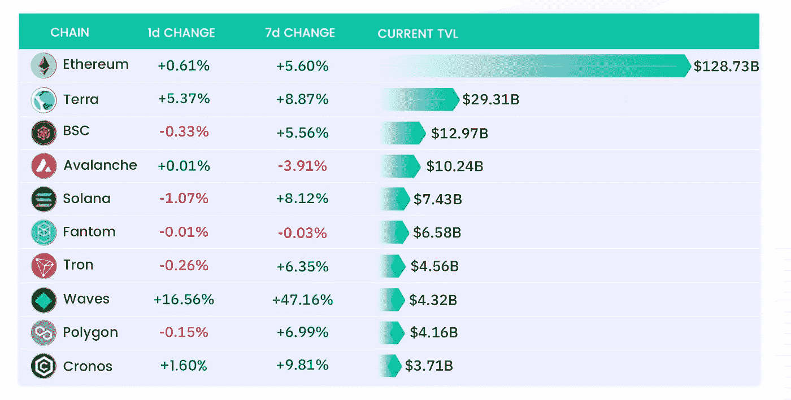
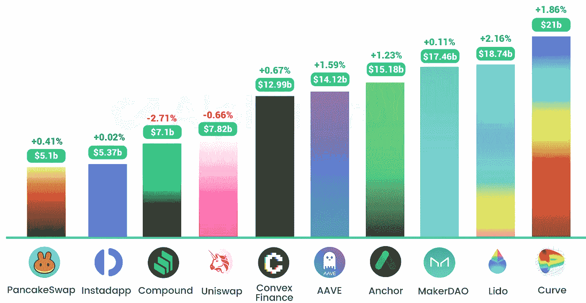
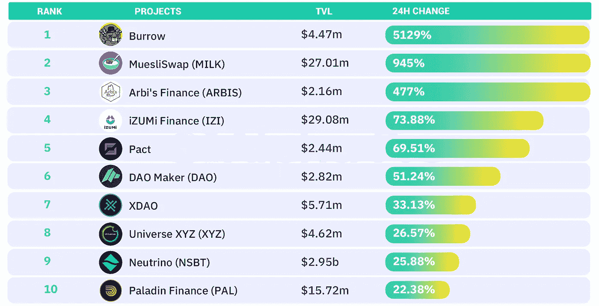
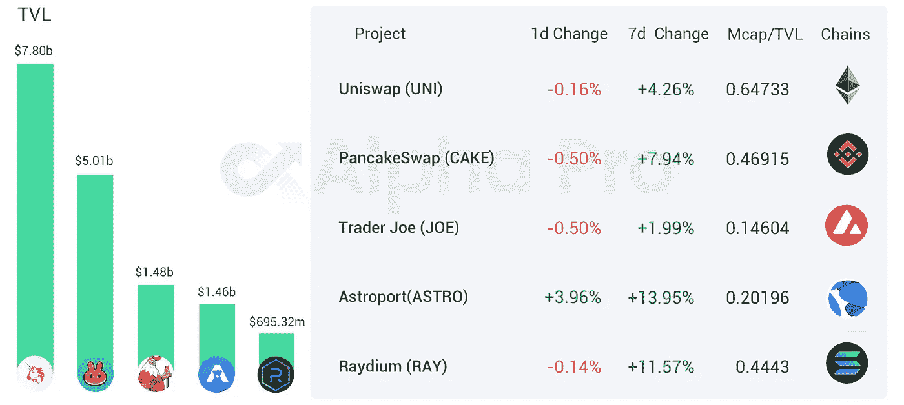
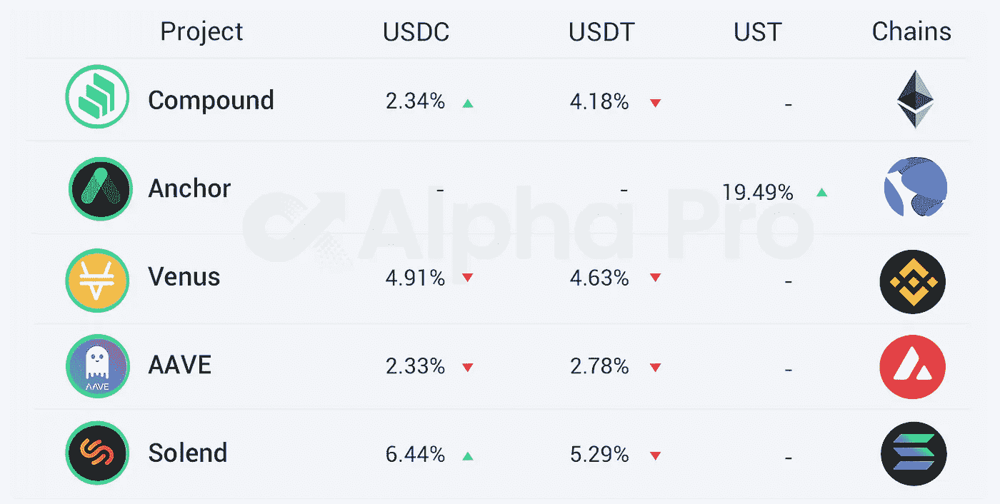

# DeFi Insight |在有 DeFi 之前，有 Bancor

> 原文：<https://medium.com/coinmonks/defi-insight-before-there-was-defi-there-was-bancor-d17750017403?source=collection_archive---------21----------------------->

## 2022 年 3 月 30 日

*今日 DeFi 数据&由 DeFi Insight 为您带来的新闻。*

> Bancor 是最容易被忽视和误解的 DeFi 本地项目之一，其复杂性甚至会让最精明的 DeFi 本地人摸不着头脑。也就是说，一年多来，它一直保持着超过 100 万美元的 TVL 1B，并继续拥有该领域最强大、最多元化的团队之一。【 [**来源**](https://research.thetie.io/bancor-history/)

# 最新消息

## 定义

民意调查发现，53%的美国人认为加密将是“金融的未来”

Euronin 利用索拉纳区块链改善欧洲的加密货币支付

[卡达诺](https://beincrypto.com/cardano-surpasses-300m-tvl-ada-price-bounces-back/)链上锁定头寸的总额超过 3 亿美元

Ankr 和 CelerNetwork 联合推出首个基于 BNB 链的[侧链](https://www.bnbchain.world/en/blog/ankr-celer-and-nodereal-launch-bas-testnet-a-bnb-chain-sidechain-framework/)测试网

Polygon 启动用户识别服务 [Polygon ID](https://blog.polygon.technology/introducing-polygon-id-zero-knowledge-own-your-identity-for-web3/)

## 稳定币

Terra 创始人:我们将是除中本聪之外全球最大的 BTC 持有者

## 指标

完成一轮 2300 万美元的投资

Matcha 在 Polygon 上的累计交易额超过 10 亿美元

## 贷款

**Terra 生态贷款协议 [Edge 协议](https://twitter.com/EdgeProtocol/status/1508482803671138304?s=20&t=8qlGquMfMYxxlfyB0ETInw)将支持 stLUNA 和 pLUNA 贷款业务**

****Nexo 允许投资者[在无聊的猿启发代币上赚取收益](https://blockworks.co/nexo-to-allow-investors-to-earn-yields-on-bored-ape-inspired-token/)****

******,**德尔福实验室提议[玛氏协议](https://twitter.com/mars_protocol/status/1508876094593810435)增加 ANC 作为贷款抵押品****

****自从 [V3 升级](https://finance.yahoo.com/news/defi-lender-aave-token-surged-052244710.html)以来，Aave(AAVE)的价格已经上涨了 80%以上****

## ****桥梁****

******币安升级区块链桥[连接 DeFi 和 CeFi](https://www.coindesk.com/business/2022/03/29/binance-upgrades-blockchain-bridge-to-connect-defi-and-cefi/)******

********、**跨链资产协议[任协议](https://twitter.com/tokenterminal/status/1508893769084682247?s=20&t=qy7869am6Voub1KHtAS49g)总交易额超过 100 亿美元******

## ****打桩****

******/**[丽都财经](https://twitter.com/lidofinance/status/1508775969846435842)即将上市 stSOL 的地图令牌 bSOL 在 Terra 生态系统中****

## ****空投****

******[原产地协议](https://blog.originprotocol.com/hello-ogv-details-on-the-upcoming-airdrop-for-ogn-holders-2660dab47757)列举了 OUSD 治理令牌 OGV，将空投 OGN 持有者******

## ******伙伴关系******

********、**、 [StarkWare 与均衡的合作伙伴](https://twitter.com/StarkWareLtd/status/1508775738421436418?s=20&t=mDFZtZbfPdIwH86vAO76lA)、分散的网络基础设施******

## ****|警报****

****研究人员发现木马[加密钱包](https://cointelegraph.com/news/13-apps-removed-after-researchers-uncover-trojan-crypto-wallet-scheme)方案后，13 款应用被移除****

## ****NFT****

******Axie Infinity 的浪人网络遭受[6.25 亿美元的剥削](https://www.coindesk.com/tech/2022/03/29/axie-infinitys-ronin-network-suffers-625m-exploit/)******

******作为 NFT 发射的一部分，杰弗·昆斯的雕塑作品将登上月球******

********史泰龙启动个人 NFT 项目[狡猾的家伙](https://twitter.com/TheSlyStallone/status/1504783550972899329?s=20&t=t3nIfm1rG8kM-GKcZ01eXg)********

********[签证项目](https://www.coindesk.com/business/2022/03/30/visa-program-aims-to-help-creative-entrepreneurs-build-their-businesses-with-nfts/)帮助创意人员利用非技术创新创业********

********NFT 数据市场 [Synesis One](/synesis-one/the-game-b210fe673367) 将在 NFT 推出可播放的图形小说《量子预言》********

********[**DC 漫画**](https://nft.dcuniverse.com/splash)**和棕榈 NFT 工作室将于 4 月 26 日发布蝙蝠侠主题的 NFT**********

******OpenSea 将基于 Solana 推出 NFT******

******志那都红豆#9605 以 420.7 ETH 成交，为历史最高价******

********韩国[韩国 SBS](https://www.aliens.com/livenews/latest/south-koreas-sbs-tv-station-will-launch-the-nft-business) 电视台将推出 NFT 业务********

## ******基金******

********Hedera，新近与 EVM 兼容，用[1 . 55 亿美元 HBAR 基金](https://www.coindesk.com/business/2022/03/29/hedera-newly-evm-compatible-woos-defi-with-155m-hbar-fund/)拉拢 DeFi********

********,**以太坊第二层 DeFi 货币市场 zkLend Lands[500 万美元加注](https://decrypt.co/96285/ethereum-layer-2-defi-money-market-zklend-lands-5m-raise)******

******Embily 为[商业客户](https://finance.yahoo.com/news/embily-launches-crypto-operations-otc-051200710.html)推出加密操作 OTC 服务******

# ******数据和分析******

## ******TVL 增长排名前 10 的连锁店******

************

## ******最新 TVL 十大项目******

************

## ******过去 24 小时 TVL 变化的前 10 个项目******

************

## ******德克斯 TVL 排名******

******DEX 中涨幅最大的是 [Astroport](https://defillama.com/protocol/astroport) ，上涨 3.96 **%********

********

## ****APY DeFi 贷款公司****

*****USDC:最高贷款利率:* [*索伦德*](https://solend.fi/dashboard)*6.44% APY*****

*****USDT:最高贷款利率:* [*索伦德*](https://solend.fi/dashboard)*APY*****

********

# ****深潜****

******解析** [**浪人**](https://metaversal.banklesshq.com/p/analyzing-the-ronin-bridge-hack?s=r) **桥段黑客******

**** [## 分析浪人桥黑客

### 亲爱的无银行国家，领先的 NFT 游戏 Axie Infinity 的创造者 Sky Mavis，被一个巨大的黑客袭击了…

metaversal.banklesshq.com](https://metaversal.banklesshq.com/p/analyzing-the-ronin-bridge-hack?s=r) 

**[**DeFi**](https://doseofdefi.substack.com/)**创新停滞了吗？****

** [## 一剂 DeFi | Chris Powers | Substack

### 不，当然，但是你想从我们这里得到什么？线索就在名字里！但是，即使是长期的 DeFi 倡导者，如…

doseofdefi.substack.com](https://doseofdefi.substack.com/) 

**[**multi coin Capital**](https://www.readthegeneralist.com/briefing/multicoin-capital-2)**:如何做一个逆势者****

** [## Multicoin Capital:如何成为反向投资者

### 成为一名伟大的风险投资家的诀窍在于保持非共识和正确。Multicoin Capital 就是一个完美的例子…

www.readthegeneralist.com](https://www.readthegeneralist.com/briefing/multicoin-capital-2) 

**幕后窥视:** [**加密基础设施**](https://jumpcrypto.com/peeking-under-the-hood/) 的关键支柱

 [## 隐藏的秘密:加密基础设施的关键支柱

### 随着交叉链桥、新的测试框架和其他加密协议的迅速出现，有效地…

jumpcrypto.com](https://jumpcrypto.com/peeking-under-the-hood/) 

# 报告

**绘制出范式的作品集**[**@ the block research**](https://www.theblockresearch.com/mapping-out-paradigms-portfolio-2-139699)

*   Paradigm 是一家专注于加密的基金，由 Fred Ehrsam 和 Matt Huang 于 2018 年创立。在创建 Paradigm 之前，Ehrsam 与他人共同创建了加密交易所比特币基地，Matt Huang 是红杉资本的合伙人
*   在 2022 年第一季度，Paradigm 参与了至少 13 笔投资交易
*   总的来说，该公司已经公开向 13 个垂直行业的至少 61 家初创公司和协议部署了资本。

**渗透:在宇宙生态系统中扩散流动性** [**@messari.io**](https://messari.io/article/osmosis-diffusing-liquidity-across-the-cosmos-ecosystem)

*   渗透是一个分散的交换，建立在宇宙生态系统中它自己独立的、可互操作的第一层区块链上
*   这是第一个在生态系统中看到大量 IBC 转移量和 kickstarted DEX 活动的应用链
*   DEX 的显著特点包括高度可定制的池参数、超流桩和将 MEV 阻力纳入其基础架构的计划
*   该协议由本机 OSMO 令牌提供支持，可用于打桩和治理。OSMO 奖励也通过对有限合伙人的流动性激励来发放

一场 **回合:**

DeFi Insight 是顶级 DeFi 和加密新闻和更新的来源。

**https://twitter.com/AlphaPro_io 推特:**

****❤RSS:**[**https://medium.com/feed/@alphapro.project**](https://medium.com/feed/@alphapro.project)**

**提供的信息应被视为发展新闻，而不是投资建议。**

> **加入 Coinmonks [电报频道](https://t.me/coincodecap)和 [Youtube 频道](https://www.youtube.com/c/coinmonks/videos)了解加密交易和投资**

# **另外，阅读**

*   **[Bookmap 评论](https://coincodecap.com/bookmap-review-2021-best-trading-software) | [美国 5 大最佳加密交易所](https://coincodecap.com/crypto-exchange-usa)**
*   **[如何在 FTX 交易所交易期货](https://coincodecap.com/ftx-futures-trading) | [OKEx vs 币安](https://coincodecap.com/okex-vs-binance)**
*   **[CoinLoan 审查](https://coincodecap.com/coinloan-review) | [YouHodler 审查](/coinmonks/youhodler-4-easy-ways-to-make-money-98969b9689f2) | [BlockFi 审查](https://coincodecap.com/blockfi-review)**
*   **XT.COM 评论 | [币安评论](https://coincodecap.com/xt-com-review)**
*   **[SmithBot 评论](https://coincodecap.com/smithbot-review) | [4 款最佳免费开源交易机器人](https://coincodecap.com/free-open-source-trading-bots)**
*   **[比特币基地僵尸程序](/coinmonks/coinbase-bots-ac6359e897f3) | [AscendEX 审查](/coinmonks/ascendex-review-53e829cf75fa) | [OKEx 交易僵尸程序](/coinmonks/okex-trading-bots-234920f61e60)**********