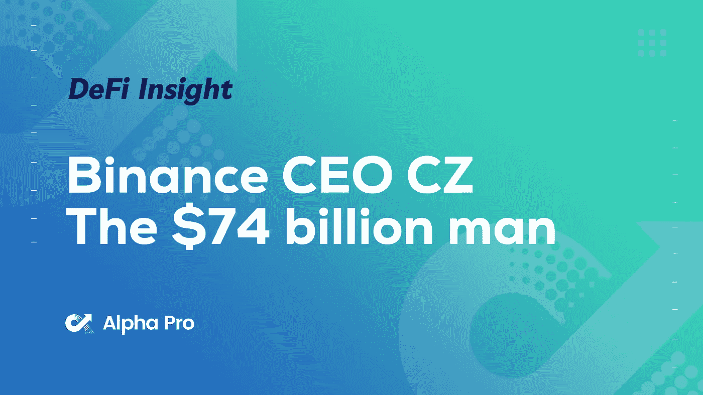
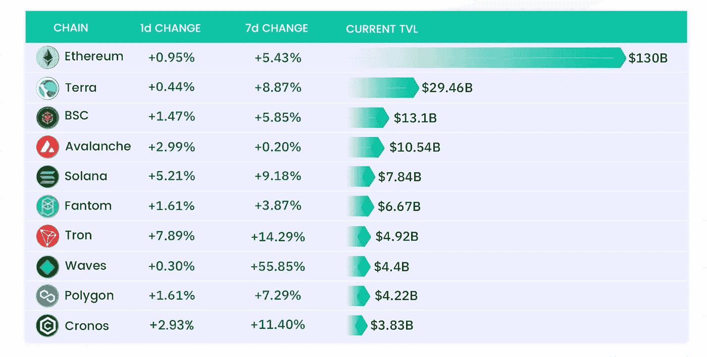
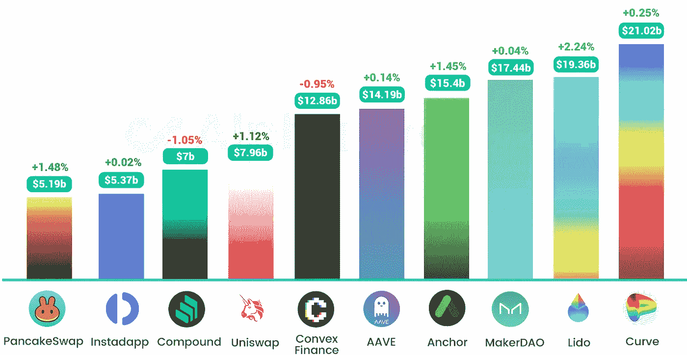
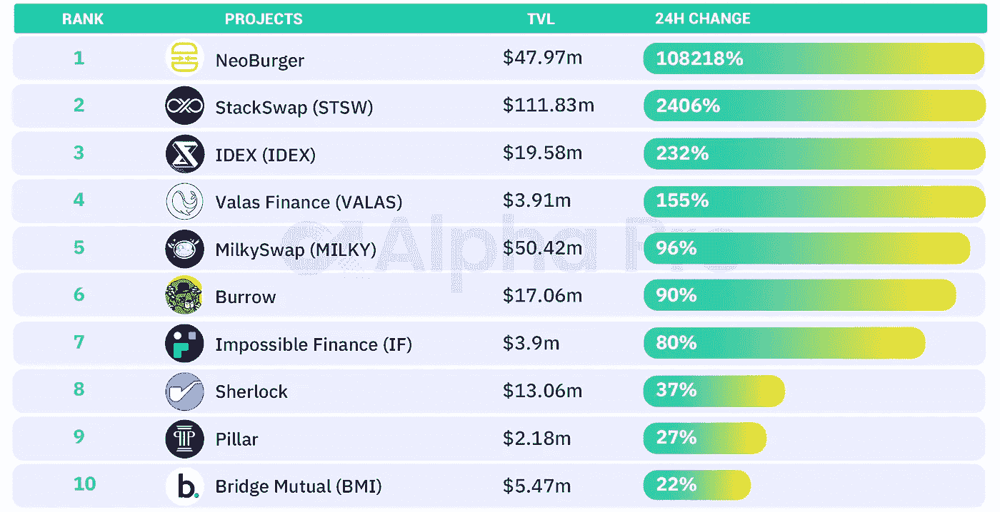
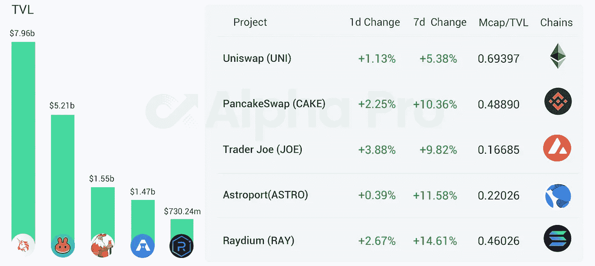
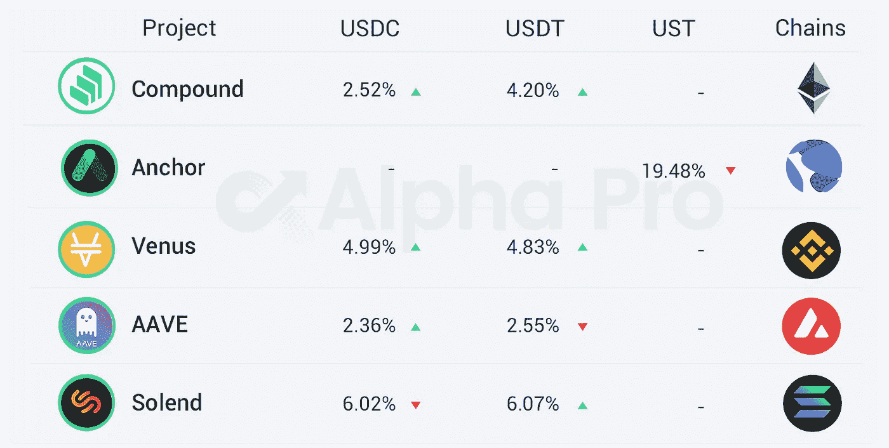

# 币安首席执行官 CZ 以 740 亿美元的财富登上福布斯杂志封面

> 原文：<https://medium.com/coinmonks/defi-insight-binance-ceo-cz-goes-on-the-cover-of-forbes-magazine-with-a-fortune-of-74-billion-f141159d1927?source=collection_archive---------30----------------------->

## 2022 年 3 月 31 日

*今日 DeFi 数据&由 DeFi Insight 为您带来的新闻。*

> [CZ 公司币安的创始人兼首席执行官](https://twitter.com/cz_binance/status/1509418888378867715)登上了《福布斯》杂志的封面，强调他拥有 740 亿美元的财富。对此，CZ 在推特上回应称，很荣幸能上封面，但真的没那么多钱。【[来源 ](https://fortune.com/longform/binance-changpeng-cz-zhao-net-worth-crypto-exchange-trading/)

# 最新消息

## 定义

华盛顿州通过法案，旨在扩大当地[区块链收养](https://cointelegraph.com/news/washington-state-passes-bill-aiming-to-expand-local-blockchain-adoption)

国际货币基金组织:我们需要在[加密法规](https://news.bitcoin.com/imf-we-need-a-lot-more-work-done-on-crypto-regulation/)方面做更多的工作

NBC 调查:五分之一的美国成年人投资、交易或使用过[加密货币](https://www.cnbc.com/2022/03/31/cryptocurrency-news-21percent-of-adults-have-traded-or-used-crypto-nbc-poll-shows.html)

银河数码首席执行官期望立法者在加密问题上采取更温和的立场

立法者提议将不受监管的加密公司从欧盟金融系统中移除

## 互换

卡瓦互换已经激活了 ATOM 等流动性池的激增奖励

## 贷款

**,**[城堡金融](https://twitter.com/CharlieYouAI/status/1508842093514567687)开发者在 Solana 的生态 DeFi lending protocol Jet Protocol 中发现了一个重大漏洞，目前已经修复

**[主播协议](https://forum.anchorprotocol.com/t/proposal-onboarding-batom-as-collateral/3786)对追加 bATOM 作为抵押物的提案进行投票**

## **FVM**

****、** Fantom 将启动兼容 Solidity 的[虚拟机](https://twitter.com/stader_ftm/status/1509240812990865416)**

## **甲骨文**

****Oracle 解决方案[python 网络](https://twitter.com/PythNetwork/status/1509167150929432582)增加对 NEAR 的支持****

## ****支付****

****凤凰城郊区现在接受比特币支付[水电费](https://www.coindesk.com/policy/2022/03/30/phoenix-suburb-now-takes-bitcoin-for-utility-bills/)****

## ****空投****

******TeamAzuki 向[志那都红豆持有者空投新的 NFT 系列](https://opensea.io/)******

## ******钱包******

********,**Brave 现在提供了新的侧边栏和[自定义标签背景](https://brave.com/1.37-release/)******

## ****道****

******[APE coin DAO](https://snapshot.org/#/apecoin.eth)五个初始议案结束表决，APE 质押及分配议案未通过******

********、**、 [Uniswap 社区](https://gov.uniswap.org/t/temperature-check-deploy-uniswap-v3-on-moonbeam/16572)发起将 Uniswap V3 部署到 Moonbeam 的新提案******

## ****|警报****

****PeckShield: [Ola Finance](https://twitter.com/peckshield/status/1509434048283783178) 遭遇黑客攻击，损失约 360 万美元****

******block sec:Lending protocol[Voltage Finance](https://twitter.com/BlockSecAlert/status/1509408651760480260?s=20&t=sxH5_JL3ZctKtcZff95BHg)被黑，损失约 400 万美元******

## ******NFT******

********、**食品行业巨头肯德基、塔可钟和必胜客申请 [NFTs 和元宇宙商标](https://finbold.com/food-industry-giants-kfc-taco-bell-and-pizza-hut-file-nfts-and-metaverse-trademarks/)******

****柴犬的元宇宙将会有超过 10 万块土地****

****拳击手迈克·泰森加入 Metalk DAO 成为新的社区大使****

## ****基金****

******[可组合金融](https://composablefi.medium.com/composable-finance-raises-32-million-in-series-a-39e70aeff23a)A 轮融资 3200 万美元******

********加密资产管理器 Hashdex 与 [web3 ETF](https://www.theblockcrypto.com/linked/139964/crypto-asset-manager-hashdex-goes-live-with-web3-etf) 一起上线********

********/**[DFlow](https://dflow.net/blog/announce-seed)完成由 Multicoin Capital 和 Framework Ventures 领投的 200 万美元种子轮投资******

******/**选股专家准备好基本面加密对冲基金[至少有 5000 万美元](https://blockworks.co/stock-picking-vets-readying-fundamental-crypto-hedge-fund-with-at-least-50m/)****

******、** Multicoin、Animoca Brands 和其他公司为 [LayerZero Labs](https://multicoin.capital/2022/03/30/building-bridges/) 提供 A+轮融资****

****Blockchain.com 筹集新资金[140 亿美元估值](https://www.bloomberg.com/news/articles/2022-03-30/blockchain-com-in-talks-for-new-funding-at-14-billion-valuation)****

******[good ghosting](/goodghosting/completing-our-seed-funding-round-f41b9ce63bc4)完成 125 万美元融资******

******令牌和股权管理初创公司[萌芽](https://techcrunch.com/2022/03/30/equity-and-token-management-startup-sprout-raises-3m/)融资 300 万美元******

********Eldridge，A16z 领投 Fintech 的 6.2 亿美元融资 [Cross River Bank](https://www.coindesk.com/business/2022/03/30/eldridge-a16z-lead-620m-financing-round-for-fintech-cross-river-bank/?utm_medium=referral&utm_source=feedly&utm_campaign=headlines)********

******红杉、FTX 风险投资和 A16z 领投 1.35 亿美元投资密码公司，打破区块链之间的壁垒******

********DeFi Technologies 子公司 Valour [在 AUM 投资超过 2.74 亿美元](https://cointelegraph.com/news/defi-technologies-subsidiary-valour-surpasses-274-million-in-aum)********

# ******数据和分析******

## ******TVL 增长排名前 10 的连锁店******

************

## ******最新 TVL 十大项目******

************

## ******过去 24 小时 TVL 变化的前 10 个项目******

************

## ******德克斯 TVL 排名******

******DEX 中涨幅最大的是[交易员乔](https://defillama.com/protocol/trader-joe)，上涨 3.88 **%********

********

## ****APY DeFi 贷款公司****

*****USDC:最高贷款利率:* [*索伦德*](https://solend.fi/dashboard)*6.02% APY*****

*****USDT:最高贷款利率:* [*索伦德*](https://solend.fi/dashboard)*APY*****

********

# ****深潜****

******为什么你应该(和不应该)害怕一个收益率** [**曲线反转**](https://apricitas.substack.com/p/why-you-should-and-shouldnt-fear?s=r)****

**** [## 为什么你应该(和不应该)害怕收益率曲线反转

### 本博客表达的观点完全是我个人的，不一定代表劳动局的观点…

apricitas.substack.com](https://apricitas.substack.com/p/why-you-should-and-shouldnt-fear?s=r) 

**[**PoS vs PoW**](https://newsletter.banklesshq.com/p/4-misconceptions-about-pos-vs-pow?s=r)的 4 个误区**

** [## 关于 PoS 与 PoW 的 4 个误解

### 亲爱的无银行国家，合并将在今年夏天到来。一举，合并…

newsletter.banklesshq.com](https://newsletter.banklesshq.com/p/4-misconceptions-about-pos-vs-pow?s=r)** 

# **报告**

****看看 Arbitrum any trust Chains—**[**the block research**](https://www.theblockresearch.com/a-look-at-arbitrum-anytrust-chains-139619)**

****以太坊就像纽约最好和最差的地方—** [**灰度**](https://cointelegraph.com/news/ethereum-is-like-the-best-and-worst-parts-of-new-york-grayscale)**

****GameFi 货币化:一个重新定义游戏挣钱的框架—**[**messari**](https://messari.io/article/gamefi-monetization-a-framework-for-redefining-play-to-earn)**

****宇迦实验室 NFTs 如何成为市值 81 亿美元的主导力量—**[**dappradar**](https://dappradar.com/blog/how-yuga-labs-nfts-became-a-dominant-force-with-an-8-1b-market-cap)**

**一场一场**的较量:****

**DeFi Insight 是顶级 DeFi 和加密新闻和更新的来源。**

****https://twitter.com/AlphaPro_io 推特:****

******https://medium.com/feed/@alphapro.project**RSS:****

******提供的信息应被视为发展新闻，而不是投资建议。******

> ******加入 Coinmonks [电报频道](https://t.me/coincodecap)和 [Youtube 频道](https://www.youtube.com/c/coinmonks/videos)了解加密交易和投资******

# ******另外，阅读******

*   ******[3 商业评论](/coinmonks/3commas-review-an-excellent-crypto-trading-bot-2020-1313a58bec92) | [Pionex 评论](https://coincodecap.com/pionex-review-exchange-with-crypto-trading-bot) | [Coinrule 评论](/coinmonks/coinrule-review-2021-a-beginner-friendly-crypto-trading-bot-daf0504848ba)******
*   ******[莱杰 vs n rave](/coinmonks/ledger-vs-ngrave-zero-7e40f0c1d694)|[莱杰 nano s vs x](/coinmonks/ledger-nano-s-vs-x-battery-hardware-price-storage-59a6663fe3b0) | [币安评论](/coinmonks/binance-review-ee10d3bf3b6e)******
*   ******[Bybit Exchange 审查](/coinmonks/bybit-exchange-review-dbd570019b71) | [Bityard 审查](https://coincodecap.com/bityard-reivew) | [Jet-Bot 审查](https://coincodecap.com/jet-bot-review)******
*   ******[3 commas vs crypto hopper](/coinmonks/3commas-vs-pionex-vs-cryptohopper-best-crypto-bot-6a98d2baa203)|[赚取加密利息](/coinmonks/earn-crypto-interest-b10b810fdda3)******
*   ******最好的比特币[硬件钱包](/coinmonks/hardware-wallets-dfa1211730c6) | [BitBox02 回顾](/coinmonks/bitbox02-review-your-swiss-bitcoin-hardware-wallet-c36c88fff29)**********