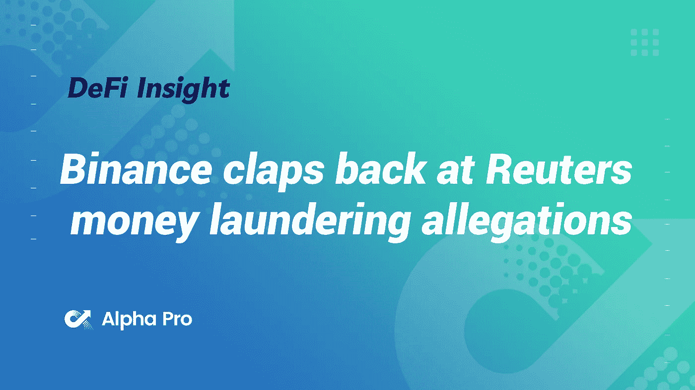
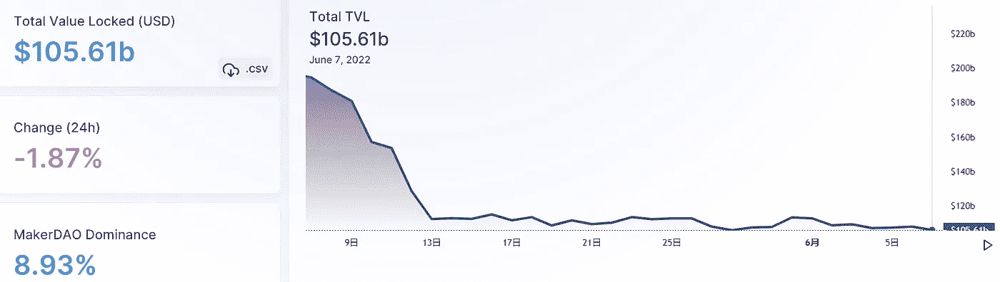
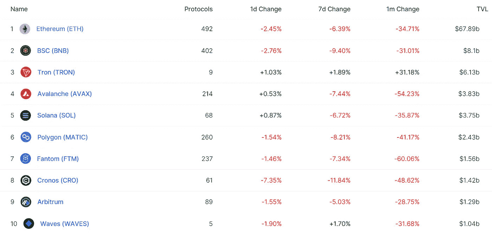
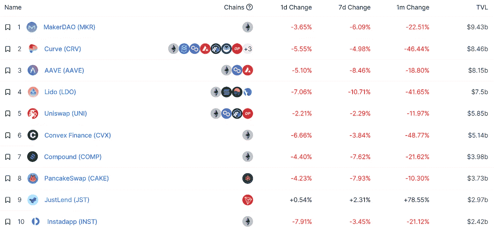
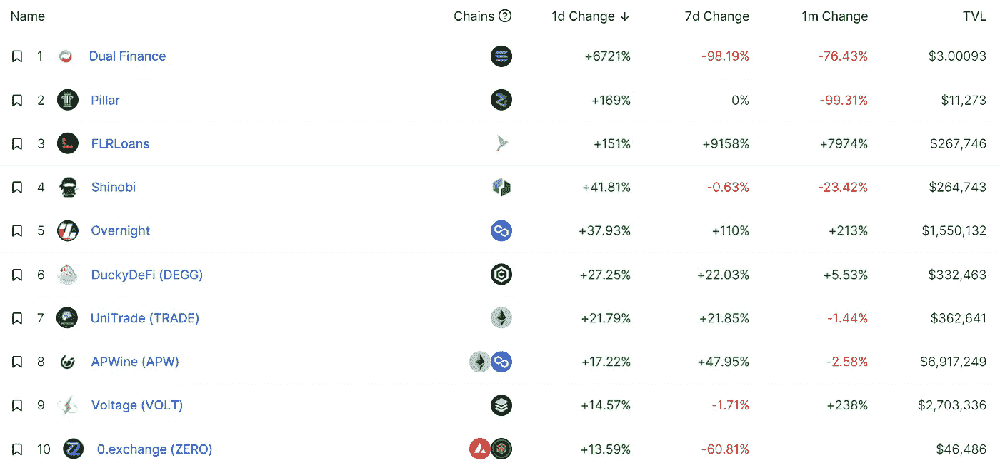
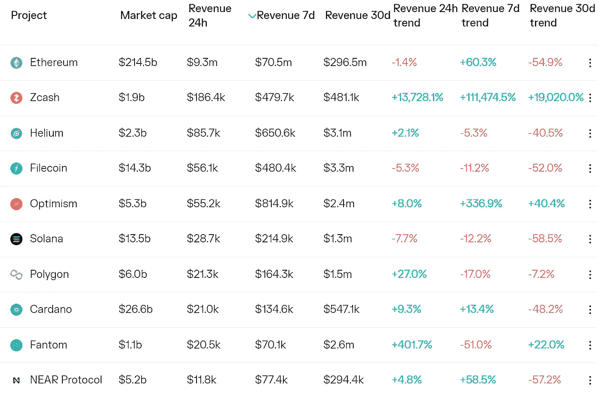
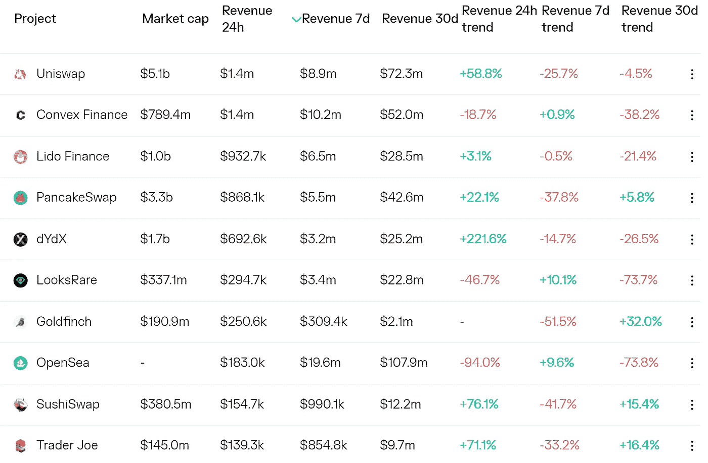
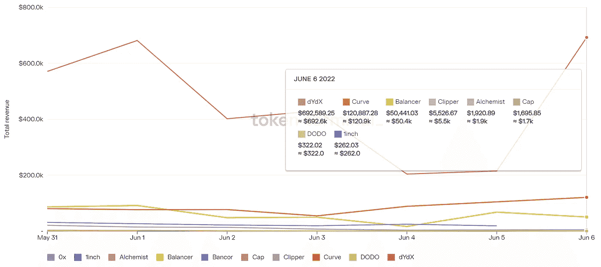
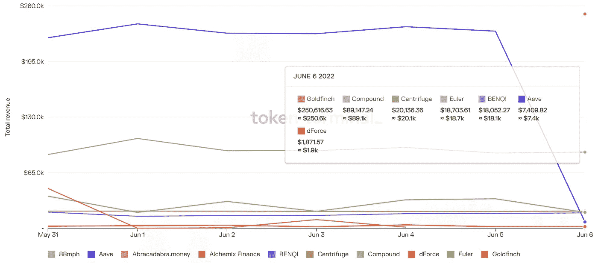

# 币安回击路透社的洗钱指控

> 原文：<https://medium.com/coinmonks/defi-insight-binance-claps-back-at-reuters-money-laundering-allegations-de6490c7b500?source=collection_archive---------39----------------------->

2022 年 6 月 7 日

*今日 DeFi 数据&由 DeFi Insight 为您带来的新闻*

> *币安对路透社的一项调查进行了反击，该调查指控加密交易所充当了价值至少 23 亿美元的非法资金的渠道，称该报告是一篇“令人窒息的珍珠紧握”的文章。*“@*[*来源*](https://forkast.news/headlines/binance-reuters-money-laundering-allegation/?utm_source=blockworks-research)*

# *最新消息*

## *外汇*

***[币安](https://blockworks.co/binance-under-sec-investigation-over-its-2017-ico-listing-report/?utm_source=blockworks-research)因 2017 年 ICO 上市接受 SEC 调查:报告***

***美国调查币安的代币，代币现在是世界第五大***

## ***交叉链***

*****猎户座金钱项目的下一步*****

## *****保险*****

*****DeFi 保险协议保险公司对 UST 脱联集团索赔的投票现在开始*****

## *****支付*****

*****巴西足球强国圣保罗足球俱乐部允许球迷使用比特币购买门票*****

*******、**乌干达跨境加密法定货币转账应用程序 [EverSend](https://bitcoinke.io/2022/06/eversend-rebrands/) ，因其计划增长而重新命名*****

## *****资产管理*****

*******[3iQ](https://blockworks.co/3iq-latest-crypto-etf-fund-manager-to-join-australian-market/)最新加密 ETF 基金经理加入澳洲市场*******

## *******采矿*******

*********,**比特币采矿:[肯尼亚](https://beincrypto.com/bitcoin-mining-kenya-offers-renewable-energy-sources-to-miners/)向矿工提供可再生能源*******

## *****政策与法规*****

*****日本可能修改法律，没收非法获得的加密资产*****

*******澳大利亚市长称**地方税收的秘密支付正在进行中*****

*****美国新法案希望将加密技术融入传统金融系统*****

*******[美国加密法案](https://watcher.guru/news/us-crypto-bill-allegedly-leaked-regulators-to-go-hard-this-time)涉嫌泄露；监管机构这次要“强硬”了？*******

## *******NFT*******

*******贾斯汀·阿弗萨诺的量子画廊在洛杉矶开设实体 NFT 画廊，以“提升其他艺术家”*******

## *******基金*******

*******尽管 GameFi 遭遇熊市，但 Illuvium 通过卖地筹集了 7200 万美元*******

*******印度尼西亚授权的加密资产平台 B 轮融资 1 . 13 亿美元*******

*******Crypto 筹集 1000 万美元让加密会计变得更容易*******

*******来源:BlockFi 正以 10 亿美元的估值进行融资*******

# *******数据和分析*******

## *******锁定的总价值(TVL)*******

*******目前全网 DeFi 总锁定量为 1056.1 亿美元，24 小时下降 1.87%。*******

**************

## *******TVL 评出的十大连锁酒店*******

**************

## *******|最新 TVL 十大项目*******

**************

## *******|过去 24 小时内 TVL 增长的前 10 个项目*******

**************

## *******协议收入*******

## *******|累计总收入最高的项目(24H)_ 区块链(L1)*******

**************

## *******|累计总收入最高的项目(24H) _Dapps (L2)*******

**************

## *******|前 10 大交易所的每日收入*******

**************

## *******|十大贷款协议的每日收入*******

**************

# *******深潜*******

*********[**比特币挖矿行业的周期性**](https://coinshares.com/research/cyclicality-in-the-bitcoin-mining-industry-can-have-a-small-but-notable-impact-on-the-bitcoin-price) **能对比特币价格产生微小但显著的影响***********

***** [## 比特币采矿业的周期性会对比特币价格产生微小但显著的影响

### 在本帖中，我们将简要解释比特币采矿业的周期性以及它对…

coinshares.com](https://coinshares.com/research/cyclicality-in-the-bitcoin-mining-industry-can-have-a-small-but-notable-impact-on-the-bitcoin-price) 

**[**矿工收入**](https://insights.glassnode.com/the-week-onchain-week-23-2022/) **压力下****

** [## 矿工收入面临压力

### 随着市场交易接近 2021-22 周期的价格低点，绝大多数投资者现在都持有…

insights.glassnode.com](https://insights.glassnode.com/the-week-onchain-week-23-2022/) 

**[**分散文件存储**](https://defieducation.substack.com/p/introduction-to-decentralized-file?utm_source=%2Finbox&utm_medium=reader2&s=r) 简介**

** [## 分散式文件存储简介

### 随着监管的加强，从地缘政治的角度来看，世界变得越来越不稳定，真的…

defieducation.substack.com](https://defieducation.substack.com/p/introduction-to-decentralized-file?utm_source=%2Finbox&utm_medium=reader2&s=r) 

**[**转型**](https://tokeninsight.com/en/research/market-analysis/transforming-the-bond-market-with-defi) **有 DeFi 的债券市场****

** [## TokenInsight _ 区块链评级 _ 区块链投资研究 _ 加密货币评级

### 作为一家数据和技术驱动的区块链技术公司，TokenInsight 提供专业的区块链数据、评级…

tokeninsight.com](https://tokeninsight.com/en/research/market-analysis/transforming-the-bond-market-with-defi) 

**看看**[**Filecoin**](https://www.theblockresearch.com/a-look-at-filecoins-ecosystem-developments-148896)**的生态系统发展**

 [## 看一看 Filecoin 的生态系统发展

### 2022 年 6 月 6 日，美国东部时间中午 12:25 Quick Take Filecoin 是新一代区块链和…

www.theblockresearch.com](https://www.theblockresearch.com/a-look-at-filecoins-ecosystem-developments-148896) 

# 报告

**[**定义驱动的投机**](https://blog.chainalysis.com/reports/defi-dexs-web3/) **推动分散交易所的链上交易量通过集中平台**_ Chain analysis**

> **在过去的五年里，分散交易所(dex)已经成为加密货币投资者交易的自我保管、程序化方式。dex 允许用户在没有中介的情况下在数百个交易对之间进行互换。15 个月前，这些 dex 在链上交易量上首次超过了集中式交易所(cex)。**

****[**【有效期】ZK**](https://members.delphidigital.io/reports/zk-validity-rollups-entering-the-general-purpose-era)**:进入通用时代** _delphidigital****

******猿猴的内心:** [**菲斯克**](https://www.nansen.ai/research/inside-the-mind-of-an-ape-fiskantes)_ 南森****

******[**估值框架**](https://coinshares.com/research/valuation-framework-for-public-blockchains) **面向公众区块链** _coinshares******

******[**Alethea AI**](https://messari.io/article/alethea-ai-intelligent-nfts)**:融合智能于 NFTs** _messari******

> ****加入 Coinmonks [电报频道](https://t.me/coincodecap)和 [Youtube 频道](https://www.youtube.com/c/coinmonks/videos)了解加密交易和投资****

******关于:******

****DeFi Insight 是顶级 DeFi 和加密新闻和更新的来源。****

******https://twitter.com/AlphaPro_io**❤****

********https://medium.com/feed/@alphapro.project**RSS:******

******提供的信息应被视为发展新闻，而不是投资建议。*****************