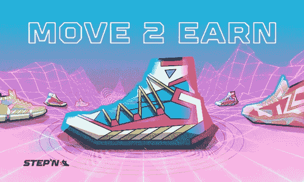
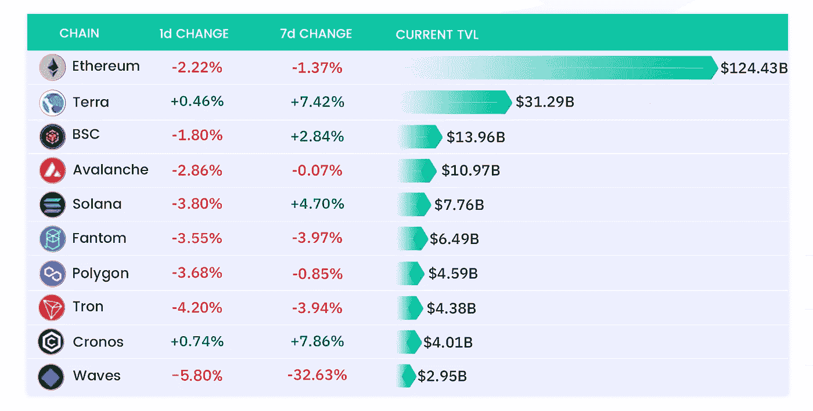
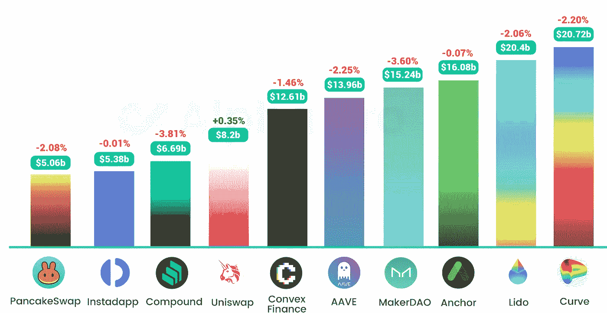
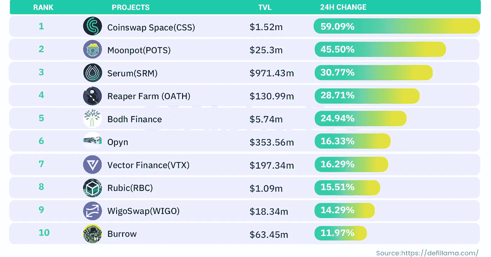
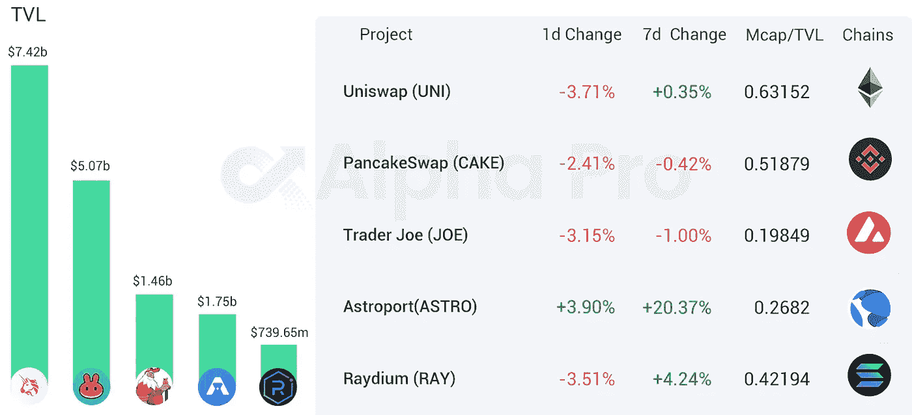
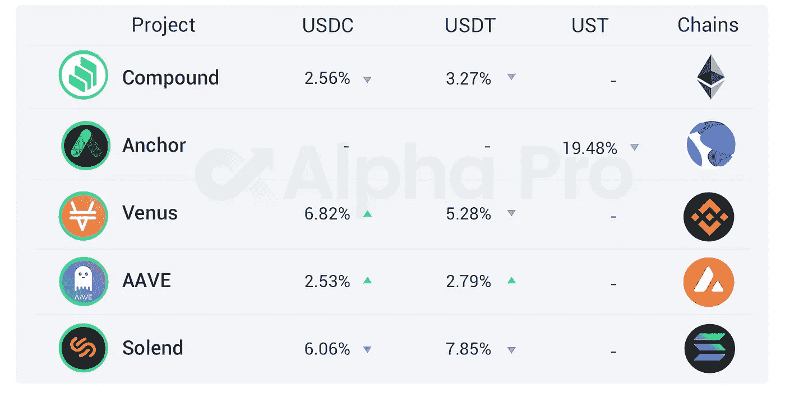

# DeFi Insight |币安实验室对 STEPN 进行战略投资

> 原文：<https://medium.com/coinmonks/defi-insight-binance-labs-makes-strategic-investment-in-stepn-9901dd0d8c6e?source=collection_archive---------22----------------------->

## 2022 年 4 月 6 日

*今日 DeFi 数据&由 DeFi Insight 为您带来的新闻。*

> 币安实验室宣布投资 [STEPN](https://twitter.com/Stepnofficial) 由 FindSatoshi 实验室。
> 
> STEPN 是一个 web3 移动赚取应用程序，用户可以从他们迈出的每一步中赚取利润。凭借其独特的游戏和社交元素，STEPN 在过去几个月里增长了 100 倍。
> 
> STEPN 将利用所得来帮助开发其应用程序，并进一步发展社区。[**来源**](https://www.binance.com/en/blog/ecosystem/binance-labs-makes-strategic-investment-in-stepn-421499824684903657)

# 最新消息

## 定义

本周，比特币 2022 在迈阿密拉开帷幕

财政部的耶伦将首次就美国经济中的加密问题发表演讲

联邦检察官没收了与非法暗网活动有关的 3400 万美元的加密

## 贷款

**[**主播协议的**](https://app.anchorprotocol.com/poll/22)**追加 bATOM 作为抵押物的议案通过****

## ****桥梁****

******巨嘴鸟的碳生态系统即将到来 [Celo](https://blog.toucan.earth/toucans-carbon-ecosystem-celo/)******

## ******打桩******

******币安将与由 Terra 提供的固定费率协议 Anchor Protocol 合作推出一项 UST 赌注服务******

## ******稳定币******

******跆拳道宣布他已经在 BTC 买下了 2 . 3 亿美元******

## ******TVL******

********[浪潮中的 TVL](https://defillama.com/chain/Waves)为 29.4 亿美元，较历史高点下跌 38%********

## ******钱包******

********/**[幻影](https://phantom.app/blog/product-updates-recent-activity-notifications-performance-and-more)钱包将显示最近的事件和推送通知******

******莱杰在沙盒中购买土地，作为元宇宙推动教育[密码新手](https://decrypt.co/96980/ledger-buys-land-the-sandbox-metaverse-push-educate-crypto-newbs)的一部分******

## ******地址******

********、**南森:前 10 名网络 7 天总活跃地址约 893 万， [Arbitrum](https://twitter.com/nansen_ai/status/1511260886249664512) 增长显著******

## ****副链****

******/**用于 [Polkadot parachain](/astar-network/dapp-portal-v2-the-next-chapter-of-astar-network-971c97535ff8?source=rss----482978dd8aa8---4) 的 Astar 网络部署门户 Astar dApp 门户版本 2****

******/**Polkadot DeFi 协议[离心机](https://twitter.com/centrifuge/status/1511496411182866434)已成功迁移至 Polkadot 副链****

## ****鲸鱼****

******、**根据 whalestats.com 的数据，在过去一周排名前 1000 的以太坊巨鲸地址持有的代币中， [SAND 排名第六](https://www.whalestats.com/analysis-of-the-top-100-eth-wallets)除了 ETH 和 Stablecoin****

## ****NFT****

****根据霍华德·舒尔茨的消息，星巴克正在进入“NFT 商业”****

****兰博基尼将为最后一辆 Aventador Ultimae Coupé发布无关税同盟****

******[vee friends 系列 2](https://blog.veefriends.com/everything-you-need-to-know-on-when-and-how-to-get-a-veefriends-series-2-d38f0228bd46) NFT 系列将于 4 月 12 日开始铸造******

******即将离职的华纳媒体首席执行官说，区块链是好莱坞的未来******

## ******基金******

********小说，为公司创建 NFT，[融资 600 万美元](https://www.wsj.com/articles/novel-which-creates-nfts-for-companies-raises-6-million-11649154601?mod=lead_feature_below_a_pos1)********

********[波巴网](https://boba.network/boba-network-closes-45m-series-a-round/)以 15 亿美元估值完成 4500 万美元 A 轮融资********

********[**Strata**](https://decrypt.co/96918/strata-solana-no-code-token-launchpad-seed)**筹集 150 万美元在索拉纳建造一个无代码令牌发射台**********

******高盛计划将场外加密期权交易扩展到以太网******

# ******数据和分析******

## ******TVL 增长排名前 10 的连锁店******

************

## ******最新 TVL 十大项目******

************

## ******过去 24 小时 TVL 变化的前 10 个项目******

************

## ******德克斯 TVL 排名******

******指数中涨幅最大的是 [Astroport](https://defillama.com/protocol/astroport) *，*上涨 3.9 **%********

********

## ****APY DeFi 贷款公司****

*****USDC:最高贷款利率:* [*索伦德*](https://solend.fi/dashboard)*6.06% APY*****

*****USDT:最高贷款利率:* [*索伦德*](https://solend.fi/dashboard)*APY*****

********

# ****深潜****

******如何去杠杆** [**ETH**](https://newsletter.banklesshq.com/p/how-to-go-leveraged-long-on-eth?s=r)****

**** [## 如何在 ETH 上做多

### 亲爱的无银行国家，我们已经令人作呕地谈论了为什么合并会在…

newsletter.banklesshq.com](https://newsletter.banklesshq.com/p/how-to-go-leveraged-long-on-eth?s=r) 

**了解 omni chain**[**NFTs**](https://metaversal.banklesshq.com/p/omnichain-nfts?s=r)

 [## 全链 NFTs

### 亲爱的无银行国家，最近每个人都在谈论 omnichain NFTs。然而，什么是 omnichain NFTs 呢？如果你在…

metaversal.banklesshq.com](https://metaversal.banklesshq.com/p/omnichain-nfts?s=r) 

**直出 DeFi—**[**R . w . a**](https://defieducation.substack.com/p/straight-outta-defi-rwa?s=r)

 [## 直接离开 DeFi - R.W.A

### 今天的帖子是关于 R.W.A..真实世界的资产，一个 100 倍以上、数万亿美元的大规模市场机会…

defieducation.substack.com](https://defieducation.substack.com/p/straight-outta-defi-rwa?s=r) 

**[**脱离周期性**](https://theknower.substack.com/p/breaking-away-from-cyclicality?s=r)**

** [## 摆脱周期性

### “我把它留给你们，朋友和邻居，特别是不朽的基尔戈鳟鱼:想想那些愚蠢的方式…

theknower.substack.com](https://theknower.substack.com/p/breaking-away-from-cyclicality?s=r)** 

# **报告**

****看看雪崩子网 _**[**block research**](https://www.theblockresearch.com/a-look-at-avalanche-subnets-139204)**

> **Avalanche 是加密领域发展最快的 L1 之一，因为它具有 EVM 兼容性、低费用和延迟，以及快速的交易终结性。
> 为了进一步增强雪崩区块链的可扩展性，艾娃实验室引入了子网的概念，其中雪崩网络中的独特生态系统可以由不同组的验证器来操作。Avalanche 上的热门游戏 Crabada 最近在 Fuji testnet 上推出了自己的本地子网，带有自己的一套验证器。
> 子网对于扩展雪崩是有用的，因为它们允许来自主网络的验证器的选择子集验证它们自己的区块链集。**

****制定 Coatue Management 的加密组合 _**[**block research**](https://www.theblockresearch.com/mapping-out-coatue-managements-crypto-portfolio-140671)**

****英特尔洞察:Cosmos Hub 上的链间账户 _**[**messari**](https://messari.io/article/intel-insights-interchain-accounts-on-the-cosmos-hub)**

**一场一场**的较量:****

**DeFi Insight 是顶级 DeFi 和加密新闻和更新的来源。**

****https://twitter.com/AlphaPro_io**❤**

******https://medium.com/feed/@alphapro.project RSS:******

******提供的信息应被视为发展新闻，而不是投资建议。******

> ******加入 Coinmonks [电报频道](https://t.me/coincodecap)和 [Youtube 频道](https://www.youtube.com/c/coinmonks/videos)了解加密交易和投资******

# ******另外，阅读******

*   ******[密码本交易平台](/coinmonks/top-10-crypto-copy-trading-platforms-for-beginners-d0c37c7d698c) | [Coinmama 审核](/coinmonks/coinmama-review-ace5641bde6e)******
*   ******[印度加密交易所](/coinmonks/bitcoin-exchange-in-india-7f1fe79715c9) | [比特币储蓄账户](/coinmonks/bitcoin-savings-account-e65b13f92451)******
*   ******[OKEx vs KuCoin](https://coincodecap.com/okex-kucoin) | [摄氏替代品](https://coincodecap.com/celsius-alternatives) | [如何购买 VeChain](https://coincodecap.com/buy-vechain)******
*   ******[币安期货交易](https://coincodecap.com/binance-futures-trading)|[3 comas vs Mudrex vs eToro](https://coincodecap.com/mudrex-3commas-etoro)******
*   ******[如何购买 Monero](https://coincodecap.com/buy-monero) | [IDEX 评论](https://coincodecap.com/idex-review) | [BitKan 交易机器人](https://coincodecap.com/bitkan-trading-bot)**********