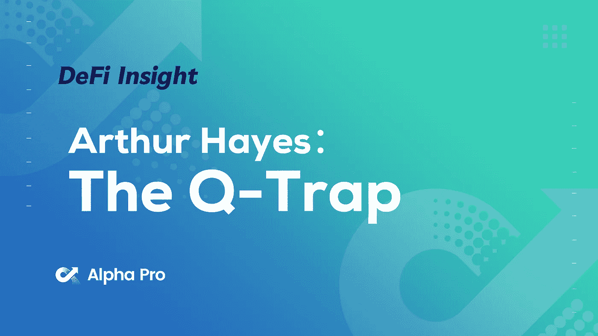
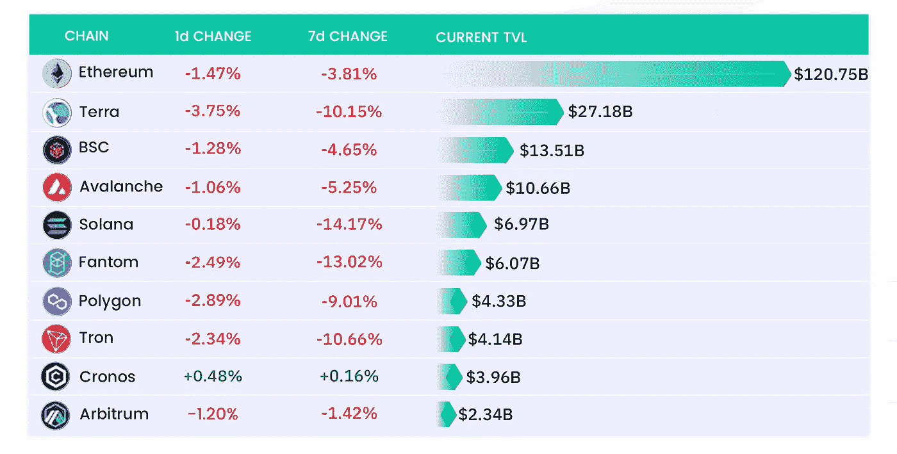
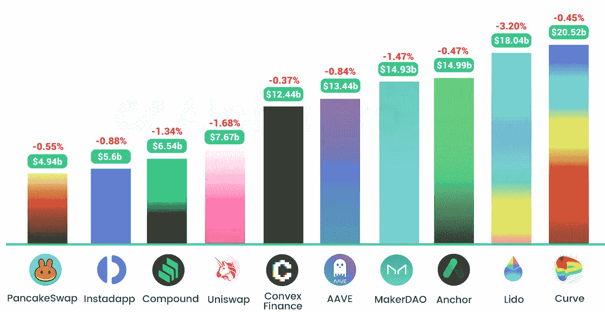
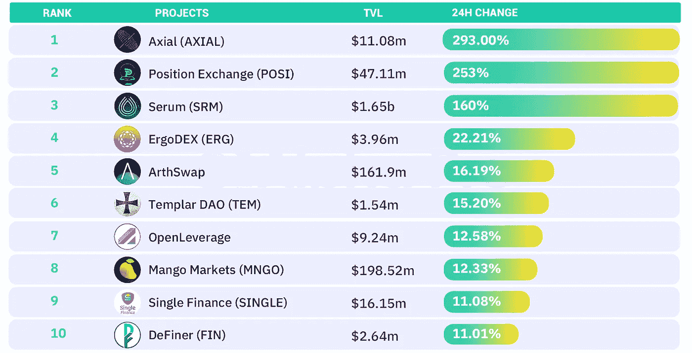
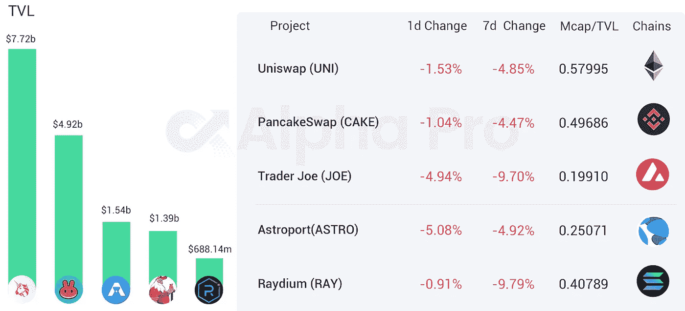
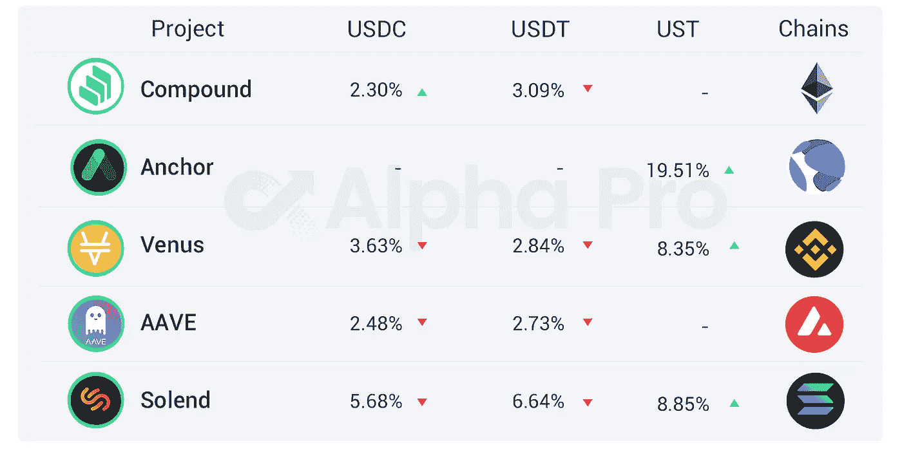

# DeFi Insight |BitMEX 创始人:加密市场将与纳斯达克同步下跌

> 原文：<https://medium.com/coinmonks/defi-insight-bitmex-founder-the-crypto-market-will-fall-in-tandem-with-nasdaq-7de84478a047?source=collection_archive---------39----------------------->

## 2022 年 4 月 11 日

*今日 DeFi 数据&由 DeFi Insight 为您带来的新闻。*

> BitMEX 创始人 Arthur Hayes 发布了一篇新的博客文章，讨论了他对加密市场的最新展望。海斯认为，由于加密市场在现阶段仍与纳斯达克高度相关，一旦美联储加息周期开始，两者可能会同步下跌。因此，海斯认为比特币将跌至 3 万美元，以太坊将跌至 2500 美元。这位 BitMEX 创始人后来表示，随着下一次全球衰退的到来，本轮流动性收紧带来的同步下降将标志着加密货币和主权资产之间的分化。“加密资本市场是全球仅存的自由市场，”海斯写道。“因此，当我们陷入低迷时，它们将引领股市走低，而当我们走出低迷时，它们将引领股市走高。”【 [**来源**](https://cryptohayes.medium.com/)

# 最新消息

## 链条

和谐为新用户提供 500 万美元的一次性代币作为奖励

## EVM

**Jump Crypto 研发负责人宣布离职启动 [EVM 生态系统](https://twitter.com/keoneHD/status/1513315992339984387?s=20&t=Jt7mnGnjQRdHgbEqQ8BsyA)**

## **指标**

**基于 Fantom 的 DEX [SpookySwap](https://twitter.com/TarotFinance/status/1512530333312368643) 启动 Terra Pool 和 Farm**

****[雷迪姆](https://twitter.com/RaydiumProtocol/status/1513132385021227016)用内斯塔的奖励启动内斯塔-USDC 融合池****

******100 万美元**Bancor[3 Bug 赏金&代码发布](https://blog.bancor.network/1-million-bancor-3-bug-bounty-code-release-6ebfbcba03f4)****

## ****产量****

******,**[白鲸](https://forum.balancer.fi/t/proposal-whitelist-beluga-fi-on-balancer-votingescrow/2921)在平衡器社区发布提案，寻求加入维巴尔锁白名单****

## ****稳定币****

******[露娜基金会](https://www.oklink.com/zh-cn/btc/address/bc1q9d4ywgfnd8h43da5tpcxcn6ajv590cg6d3tg6axemvljvt2k76zs50tv4q)今日新增 4130 BTC******

## ******支付******

********[比特币基地](https://economictimes.indiatimes.com/markets/cryptocurrency/coinbase-suspends-payments-via-upi-in-india/articleshow/90762861.cms)暂停通过合众国际社在印度的支付********

********Ark Invest 抛售 PayPal 股份支持[现金应用](https://cointelegraph.com/news/cathie-wood-s-ark-invest-dumps-paypal-favoring-bitcoin-friendly-cash-app)********

******今年 DHL 美国将支持莱特币付款******

## ******钱包******

********[币安](https://twitter.com/binance/status/1513396468744278019?s=20&t=wKsrn9dVVBdI3wGDQ44M5A)在 4 月 14 日安排多个网络的钱包维护********

## ******|警报******

******THORChain 警告符文持有者不要与 DeTHOR 之类的未知令牌互动******

******佩克希尔说合同有“根本性的缺陷”******

## ******政策与法规******

******南韩的“加密友好”总统寻求 IEO STO 的监督******

## ******NFT******

********[索拉纳·NFT](https://twitter.com/0xMert_/status/1512862616808525831)概述********

******比特币基地即将推出的 NFT 平台有 400 万人在等待名单上******

******商业航天公司已经启动了 NFT 市场，并将在太空制造 NFT******

********AniCube 于 4 月 18 日免费开放注册 [NFT 空投](https://twitter.com/EvanLuthra/status/1512509199766466560)********

******双子座首席运营官:在 NFT 的空间里有很多的效用和潜力******

## ******基金******

********新的 BitDAO 提案提议投资 650 万美元于加密艺术收藏平台[pleaserdao](https://discourse.bitdao.io/t/proposal-pleasrdao-x-bitdao/2043)********

********前花旗数字资产[高管](https://www.coindesk.com/business/2022/04/09/former-citi-digital-asset-execs-launch-crypto-focused-fund/)推出专注于加密的基金********

# ******数据和分析******

## ******TVL 增长排名前 10 的连锁店******

************

## ******最新 TVL 十大项目******

************

## ******过去 24 小时 TVL 变化的前 10 个项目******

************

## ******德克斯 TVL 排名******

*******DEX 跌幅最大的是*[*astro port*](https://defillama.com/protocol/astroport)**，损失了 5.08%********

**************

## *******APY DeFi 贷款公司*******

********USDC:最高贷款利率:**[*索伦德*](https://solend.fi/dashboard)*5.68% APY*********

*********USDT:最高贷款利率:* [*索伦德*](https://solend.fi/dashboard) *为 6.64% APY*********

****************

# ********深潜********

**********[**稳定**](https://newsletter.banklesshq.com/p/the-stablecoin-wars?s=r) **战争************

****** [## 稳定的货币战争

### 亲爱的无银行国家，注册加入造币厂名单，稳定硬币占加密总市场的 10%以上…

newsletter.banklesshq.com](https://newsletter.banklesshq.com/p/the-stablecoin-wars?s=r) 

**[**甲骨文操纵**](https://defieducation.substack.com/p/oracle-manipulation-what-you-need?s=r) **:你需要知道的****

** [## 甲骨文操作:你需要知道什么

### 欢迎头像！区块链依靠 oracles 来桥接链上的非链上数据(不是在区块链上捕获的数据)

defieducation.substack.com](https://defieducation.substack.com/p/oracle-manipulation-what-you-need?s=r) 

**[**甲骨文**](https://mirror.xyz/0xd8159c4DD43FEe99FA86D0BAaCA7a9cC33334864/LsDDiq07n1OmZtenrNqtIx1wi3NAW2nUVi6lu9Zj_Tk) **如何让 Web3 变得更好？****

** [## 甲骨文如何让 Web3 变得更好？

### Oracle 通常被认为是链上和链下数据的桥梁和窗口。简而言之，oracle 是一个中间件…

镜像. xyz](https://mirror.xyz/0xd8159c4DD43FEe99FA86D0BAaCA7a9cC33334864/LsDDiq07n1OmZtenrNqtIx1wi3NAW2nUVi6lu9Zj_Tk) 

**暖** [**隐**](https://galaxyrtk.substack.com/p/warm-crypto?s=r)

 [## 暖密码

### 在风险投资中，如同在生活中一样，在翻牌和翻牌之间穿梭是一场伟大游戏。如果意义…

galaxyrtk.substack.com](https://galaxyrtk.substack.com/p/warm-crypto?s=r) 

**从加密推特**获取 [**更多阿尔法**](https://twitter.com/alpha_pls/status/1513186416104468484) **的 6 种方式**

**深潜:** [**AMMs**](https://twitter.com/LeftsideEmiri/status/1513148290967437312)

**[**Synapse 协议指南**](https://twitter.com/Route2FI/status/1513124629577183233) **( $SYN)****

****如何运行一个** [**ETH 节点**](https://twitter.com/kamilsadik/status/1513157600019288072)**

# **报告**

> ****[**Fantom**](https://messari.io/article/fantom-of-the-crypto-ecosystem-peeking-behind-the-curtain)**密码生态圈:幕后窥视 _ messari . io**
> 
> Fantom 在 2018 年 ICO 热潮期间推出。该协议在建立其技术堆栈的几年里一直很安静，直到 2021 年和 2022 年专注于 DeFi 时才获得动力。****
> 
> ****该项目的技术可以从根本上改进现有的方法。Fantom 试图通过对其节点使用有向无环图(DAG)结构来解决区块链三难问题，这种结构能够提高协议的吞吐量。虽然 TVL 在 2021 年和 2022 年初取得了令人印象深刻的增长，但主要贡献者 Andre Cronje 的离开恰逢 TVL 和每日新地址的急剧下降。开发商活跃度和交易量也有所下降。****
> 
> ****相对于同行，收入、价格与销售额之比和 TVL 与市值之比等基本指标仍然强劲，但这些指标是否在很大程度上受到 Andre 的影响仍有待观察。****

****一场一场**的较量:******

****DeFi Insight 是顶级 DeFi 和加密新闻和更新的来源。****

******https://twitter.com/AlphaPro_io**❤****

********❤RSS:**[**https://medium.com/feed/@alphapro.project**](https://medium.com/feed/@alphapro.project)******

****提供的信息应被视为发展新闻，而不是投资建议。****

> ****加入 Coinmonks [电报频道](https://t.me/coincodecap)和 [Youtube 频道](https://www.youtube.com/c/coinmonks/videos)了解加密交易和投资****

# ****另外，阅读****

*   ****[Bookmap 点评](https://coincodecap.com/bookmap-review-2021-best-trading-software) | [美国 5 大最佳加密交易所](https://coincodecap.com/crypto-exchange-usa)****
*   ****最佳加密[硬件钱包](/coinmonks/hardware-wallets-dfa1211730c6) | [Bitbns 评论](/coinmonks/bitbns-review-38256a07e161)****
*   ****[新加坡十大最佳加密交易所](https://coincodecap.com/crypto-exchange-in-singapore) | [购买 AXS](https://coincodecap.com/buy-axs-token)****
*   ****[红狗赌场评论](https://coincodecap.com/red-dog-casino-review) | [Swyftx 评论](https://coincodecap.com/swyftx-review) | [CoinGate 评论](https://coincodecap.com/coingate-review)****
*   ****[投资印度的最佳密码](https://coincodecap.com/best-crypto-to-invest-in-india-in-2021)|[WazirX P2P](https://coincodecap.com/wazirx-p2p)|[Hi Dollar Review](https://coincodecap.com/hi-dollar-review)**************