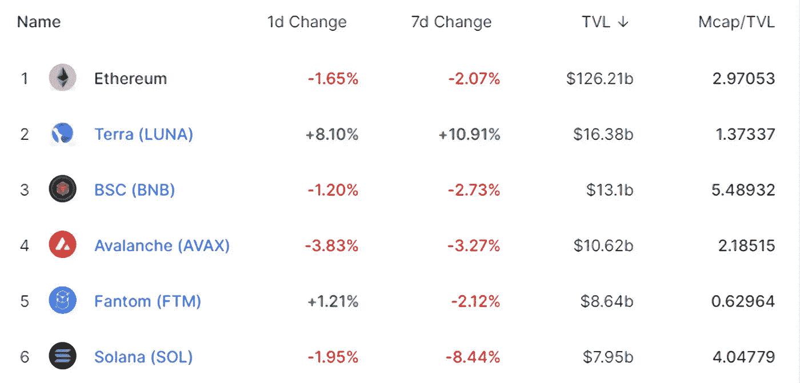
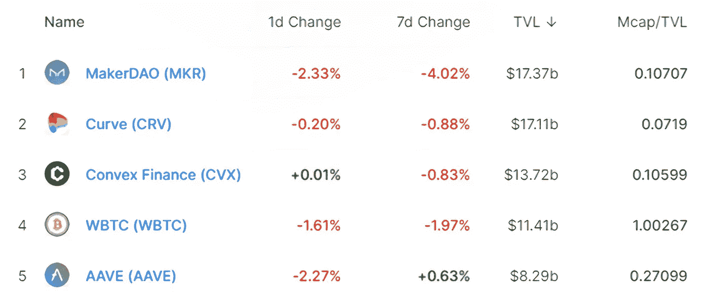

# DeFi Insight | BNB 连锁宣布成立 DeFi 联盟；关于雪崩的 5 个最有潜力的 dapps 协议

> 原文：<https://medium.com/coinmonks/defi-insight-bnb-chain-announces-formation-of-defi-league-5-most-potential-dapps-protocols-on-3ecaef699b79?source=collection_archive---------13----------------------->

## 2022 年 2 月 17 日

*今日 DeFi 数据&由 DeFi Insight 为您带来的新闻。*

**宏观趋势:**多家加密货币公司联合发布洗钱和隐私计划新规[【信托】](https://www.coindesk.com/policy/2022/02/16/crypto-heavyweights-coinbase-fidelity-and-robinhood-join-us-anti-money-laundering-group/)

**TVL 走势:**价值锁定德菲受到打击， [TVL 在 24 小时内下跌 1.33%](https://defillama.com/)

**DEX 动态:***DEX 跌幅最大的是* [乔氏](https://defillama.com/protocol/trader-joe) *，下跌 33.33%*

**Stablecoin:** Angle 协议提出新提案，在 Aave V3 上增加 [agEUR 支持](https://governance.aave.com/t/listing-proposal-add-ageur-on-aave-v3-on-polygon/7325)

# 最新消息

## 定义

BNB 连锁宣布成立 DeFi 联盟

> BNB·钱恩宣布成立“DeFi 联盟”，这是一个旨在加强分散金融的安全性和使用案例的联盟。该联盟将专注于创新、社区和安全，同时促进在 DeFi 协议设计中充分考虑用户需求。

2022 年，你可能会因为这些令人惊讶的事情而欠下[秘密税](https://www.coindesk.com/learn/you-may-owe-crypto-taxes-on-these-surprising-things-in-2022/)

## 互换

1 英寸网络推出现货价格聚合器

*[Liquid](https://twitter.com/Liquid_Global/status/1493858986243805189)列出 FTT/USDT、FTT/日元和 FTT/BTC 现货交易对

## 稳定币

停滞在 XRP 分类账上发行[欧元稳定币](https://www.pymnts.com/cryptocurrency/2022/stasis-to-issue-euro-stablecoin-on-xrp-ledger/)

## 协议

*[Banger Games](https://u.today/banger-games-raises-eu10-million-from-top-vcs-teases-crypto-games-hub-launch)与 Avalanche 等完成€1000 万战略融资

加密副本交易协议[家猫](https://www.theblockbeats.info/flash/67653)带着 350 万美元的资金秘密现身

*[应用区块链](https://algorand.foundation/news/applied-blockchain-bridge-grant)获得阿尔格兰德基金会对伦敦桥解决方案的资助

*[Tartarus](https://www.theblockbeats.info/newsflash)与领先的加密和区块链风投完成战略投资

GS 宣布与抵押 NFT 借贷分散平台 [Strip Finance](https://genesis-shards.medium.com/gs-announces-partnership-with-collateralized-nft-borrowing-and-lending-decentralised-platform-885553632a62) 合作

/[MISO](https://twitter.com/SushiSwap/status/1494109274422841344)现已上线&解锁无权限启动和谐

哈希流现在在 Arbitrum 上直播

索拉纳数据现已在[沙丘](https://dune.xyz/blog/solana-beta)上发布

p take 的治理令牌[$ p take](https://twitter.com/pStakeFinance/status/1493944093826818051)将于 2022 年 2 月 24 日上线

# 数据和分析

## 锁定的总价值(TVL)

## TVL 的六大连锁品牌

*哪些*链/协议*当前将最多的资产存放在它们的智能合同中？*

> TVL 的五大协议

> TVL 的五大协议

> TVL 的五大协议

> **# BNB**TVL 五大协议

> TVL 的五大协议

> TVL 的五大礼仪

## 德克斯 TVL 排名

*DEX 跌幅最大的是* [乔氏](https://defillama.com/protocol/trader-joe) *，跌了 33.33%*

## APY DeFi 贷款公司

*USDC:最高贷款人:索伦德，利率为 3.93% APY*

*USDT:最高贷款人:索伦德，利率为 4.52% APY*

# 深潜

## ⭐DeFi 研究人员:雪崩的 5 个最有潜力的 dapps 协议

一个 **值得信赖的资源，为一切事物 DeFi**

> 一场回合:
> 
> 分散金融(DeFi)指的是从传统的中央金融系统向区块链促成的点对点金融系统的转变。
> 
> DeFi Insight 是顶级 DeFi 和加密新闻和更新的来源。
> 
> 提供的信息应被视为发展新闻，而不是投资建议。

> 加入 Coinmonks [电报频道](https://t.me/coincodecap)和 [Youtube 频道](https://www.youtube.com/c/coinmonks/videos)了解加密交易和投资

## 另外，阅读

*   [赢取注册奖金——10 大最佳加密平台](https://coincodecap.com/earn-sign-up-bonus)
*   [Blockfi vs 比特币基地](https://coincodecap.com/blockfi-vs-coinbase) | [BitKan 点评](https://coincodecap.com/bitkan-review) | [Bexplus 点评](https://coincodecap.com/bexplus-review)
*   [南非的加密交易所](https://coincodecap.com/crypto-exchanges-in-south-africa) | [BitMEX 加密信号](https://coincodecap.com/bitmex-crypto-signals)
*   [MoonXBT 副本交易](https://coincodecap.com/moonxbt-copy-trading) | [阿联酋的加密钱包](https://coincodecap.com/crypto-wallets-in-uae)
*   [雷米塔诺评论](https://coincodecap.com/remitano-review)|[1 英寸协议指南](https://coincodecap.com/1inch)
*   [iTop VPN 审查](https://coincodecap.com/itop-vpn-review) | [曼陀罗交易所审查](https://coincodecap.com/mandala-exchange-review)
*   [40 个最佳电报频道](https://coincodecap.com/best-telegram-channels) | [喜美元评论](https://coincodecap.com/hi-dollar-review)
*   [折叠 App 审核](https://coincodecap.com/fold-app-review) | [StealthEX 审核](/coinmonks/stealthex-review-396c67309988) | [Stormgain 审核](https://coincodecap.com/stormgain-review)
*   [购买 PancakeSwap(蛋糕)](https://coincodecap.com/buy-pancakeswap) | [俱吠罗评论](/coinmonks/coinswitch-kuber-review-1a8dc5c7a739)