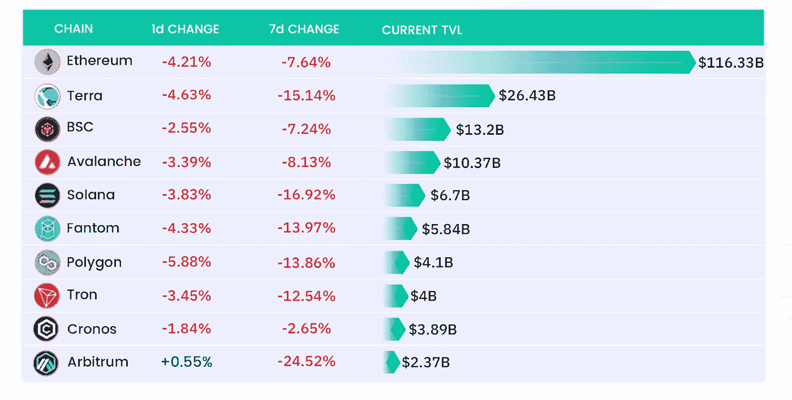

# 无聊猿 NFT 所有者起诉 OpenSea 盗窃资产

> 原文：<https://medium.com/coinmonks/defi-insight-bored-ape-nft-owners-sue-opensea-over-stolen-assets-7e1adf506c78?source=collection_archive---------25----------------------->

## 2022 年 4 月 12 日

*今日 DeFi 数据&由 DeFi Insight 为您带来的新闻。*

> NFT 市场 OpenSea 现在正面临三起独立的诉讼，原告都是 NFT 海湾石油公司的所有者。其中，来自德克萨斯州的 Timmy McKimmy 和来自纽约的 Michael Valise 声称，他们的 BAYC NFTs 在一次黑客攻击中丢失，该攻击是通过 OpenSea 代码中的一个已知漏洞实现的。另一方面，内华达州的 Robert Armijo 说，他失去了他的猿类，这是他认为 OpenSea 的无能未能阻止的社会工程攻击的结果。McKimmy 在法庭文件中表示，他多次联系 OpenSea，试图收回他的资产或赔偿他的损失。他声称，到目前为止，他还没有收到任何报价，尽管据称 OpenSea 告诉他，它正在“积极调查”这个问题。OpenSea 的置评请求没有立即得到回复。【 [**来源**](https://www.artnews.com/art-news/news/bored-ape-owners-sue-opensea-1234624875/)

# 最新消息

## 贷款

**[Mars 协议](https://mars-protocol.medium.com/anchor-protocol-anc-added-to-red-bank-24ee1a709e13)增加了 Anchor 的治理令牌$ANC 作为抵押品**

****仲裁贷款协议[维斯塔金融](https://twitter.com/vestafinance/status/1513653787247857671)增加 DPX 作为抵押品****

******,**DeFi 借贷协议 Alchemix 推出算法[市场运营商药剂](https://twitter.com/AlchemixFi/status/1513447740822687755?s=20&t=vBnNMDBOUMRE2kSA22yMVw)****

## ****产量****

****以太坊收益产品[冰之 AUM](https://dune.xyz/queries/569498/1087483) 超过 700 万美元****

## ****打桩****

******[**丽都金融**](https://research.lido.fi/t/announcement-onboarding-for-ethereum-wave-4/2024)**开通以太坊跑马圈地节点新运营商申请********

## ******稳定币******

******伏特协议为“抗通胀稳定币”筹集 200 万美元******

********[TiTi 协议](https://www.securities.io/titi-protocol-secures-3-5-million-to-build-the-first-use-to-earn-algorithm-stablecoin/)获得 350 万美元来构建第一个使用赚取算法 Stablecoin********

## ******桥梁******

******dYdX 在[轨道器](https://twitter.com/Orbiter_Finance/status/1513490335825301507)上直播******

## ******DAPP******

********Astar Network[build 2 learn](/astar-network/introducing-build2earn-what-is-dapp-staking-and-why-it-matters-for-web3-fbe20f74ed78):什么是 dApp Staking，为什么它对 Web3 很重要********

## ******叉子******

******第一届以太坊主网[影叉](https://twitter.com/vdWijden/status/1513447176344588295)昨天举行******

## ******钱包******

********[发件人钱包](/@senderlabs/sender-wallet-announces-seed-round-financing-from-binance-labs-and-metaweb-ventures-997b82aed231)宣布获得币安实验室和 MetaWeb Ventures 的种子轮融资********

## ******| IDO******

********、**自动定义策略[鹰眼](https://twitter.com/RaydiumProtocol/status/1513715503042162688)至油门上的 IDO******

## ****生态系统****

******[仲量联行](https://twitter.com/arbitrum/status/1513654472165240835?s=20&t=4nUqevdEyEH0FtvOcsLk6A)推出生态体验奖励计划******

## ******|警报******

********block sec 警告[新的不和谐骗局风险](https://twitter.com/BlockSecAlert/status/1513762068658532354?s=20&t=U_lxHsKvQZdtFsuD5RsoEQ)，用户需要警惕来自未知来源的私人信息图片********

## ******政策与法规******

******伊朗将[不允许加密支付](https://news.bitcoin.com/iran-will-not-allow-crypto-payments-prepares-to-pilot-digital-rial/)，准备试行数字里亚尔******

## ******NFT******

********[**STEPN 和 ASICS**](https://twitter.com/TheBinanceNFT/status/1513701246451924994) **在币安 IGO 联合发布虚拟运动鞋 NFT**********

********多个印度官方推特账号被黑， [NFT 发布内容](https://www.coindesk.com/tech/2022/04/11/multiple-indian-official-twitter-accounts-hacked-nft-content-posted/)********

********NFT 金融所有权市场 Solv 协议列出 Arbitrum 并推出 [$2M 债券凭证 IVO](https://twitter.com/SolvProtocol/status/1513505191458336776?s=20&t=nW0aK3ttyuT35ddr7UAUBQ)********

******NBA 的首席密码官排名第二。Eth 域名作为联盟文件申请 [4 个 NFT 商标](https://www.coindesk.com/business/2022/04/11/nbas-crypto-chief-registers-second-eth-domain-as-league-files-for-4-nft-trademarks/)******

********斯派克·李发布“她一定要有[这不公平](https://www.hollywoodreporter.com/lifestyle/arts/spike-lee-nfts-shes-gotta-have-it-1235128097/)********

******带着比特币基地制作的电影三部曲去好莱坞******

******Rabby 的 [NFT 发送](https://twitter.com/Rabby_io/status/1513502752701251585)功能现已上线******

********[福布斯](https://www.forbes.com/sites/forbespr/2022/04/11/forbes-expands-into-metaverse-with-launch-of-virtual-billionaires-nft-collection-on-ftx/?sh=7cef71876156)进军元宇宙，在 FTX 推出虚拟亿万富翁 NFT 收藏********

## ******基金******

********[Vovo Finance](https://twitter.com/VovoFinance/status/1513741427624529925)筹集 200 万美元种子资金，由 IOSG 风险投资公司牵头********

******PayMaya 所有者[航海家创新](https://techcrunch.com/2022/04/11/paymaya-owner-voyager-innovations-raises-210m-at-a-valuation-of-1-4b/)以 14 亿美元的估值融资 2.1 亿美元******

******纳斯达克调查:Spot [Crypto ETF](https://blockworks.co/nasdaq-survey-spot-crypto-etf-would-speed-adviser-allocation/) 将加速顾问配置******

********、** Uniswap 实验室成立风险部门[投资 web3 项目](https://www.theblockcrypto.com/post/141485/uniswap-labs-launches-venture-unit-to-invest-in-web3-projects?utm_source=twitter&utm_medium=social)******

****巴西金融科技公司 Stark Bank 启动了由 Ribbit Capital 和 Bezos Expeditions 牵头的 4500 万美元融资****

******、**新的 2.5 亿美元的 TONcoin 基金瞄准了德克斯和 NFT 工具公司的[吨区块链](https://cointelegraph.com/news/new-250m-toncoin-fund-targets-dex-and-nft-tools-on-ton-blockchain)****

******[育碧](https://www.theblockcrypto.com/post/141245/ubisoft-anchors-white-star-capitals-second-crypto-fund)主持白星资本的第二个加密基金******

# ******数据和分析******

## ******TVL 增长排名前 10 的连锁店******

************

## ******最新 TVL 十大项目******

************

## ******过去 24 小时 TVL 变化的前 10 个项目******

************

## ******德克斯 TVL 排名******

*******DEX 跌幅最大的是*[*Raydium*](https://defillama.com/protocol/raydium)*，损失了 5.50%*******

************

## ******APY DeFi 贷款公司******

*******USDC:最高贷款利率:**[*索伦德*](https://solend.fi/dashboard)*4.86% APY********

********USDT:最高贷款利率:* [*索伦德*](https://solend.fi/dashboard) *为 6.53% APY********

**************

# *******深潜*******

*********[**跆拳道的卢娜赌注**](https://www.paradigm.co/blog/do-kwons-luna-bet-a-quantitative-analysis-of-aping-into-a-twitter-wager) **:阿平成碎碎念赌注的量化分析***********

***** [## 权道的 Luna 赌注:模拟推特赌注的定量分析

### 几周前，一个匿名的加密交易者，唤醒 Algod，在加密推特上引起了一些争议，他提出…

www.paradigm.co](https://www.paradigm.co/blog/do-kwons-luna-bet-a-quantitative-analysis-of-aping-into-a-twitter-wager) 

**资产风险评估:** [**固定外汇**](https://cryptorisks.substack.com/p/asset-risk-assessment-fixed-forex?s=r)

 [## 资产风险评估:固定外汇

### fixed forex docs-Security Iron Bank Unitroller-可以添加或删除资产和 oracle。由铁银行 Multisig 控制…

cryptorisks.substack.com](https://cryptorisks.substack.com/p/asset-risk-assessment-fixed-forex?s=r) 

**WTF 是**[**Crypto Biz Dev**](https://shuyao.substack.com/p/wtf-is-crypto-biz-dev?s=w)**？**

 [## WTF 是加密业务开发？

### 大多数大冰的读者都知道冰哥是 Decrypt 的中国加密专栏作家，但是写作更多的是一种个人激情…

shuyao.substack.com](https://shuyao.substack.com/p/wtf-is-crypto-biz-dev?s=w) 

**影响你** [**秘密决策**](https://twitter.com/thedefiedge/status/1513502158016163850) 的 14 种认知偏差

# 报告

**[**unis WAP Q1 2022**](https://messari.io/article/state-of-uniswap-q1-2022)**_**messari . io**

> **随着 2021 年第四季度以来对加密和 NFT 的兴趣消退，▫总交易量以及相应的流动性提供商费用在 2022 年第一季度下降。
> polygon 上的▫ Uniswap 实现了有机增长，并以交易量成为 V3 的领先非以太坊平台，尽管它是最新上线的网络；在即将到来的季度，额外的流动性挖掘激励措施将继续推动增长。
> ▫社区正在探索进一步扩展到 Celo 和 Gnosis 链的领域。
> ▫uni swap 赠款计划在第 6 波中发出了其历史上最大的赠款浪潮，其中包括自 2021 年底以来的各种赠款提案。**

****数字** [**资产资金流向【coinshares.com】**](https://blog.coinshares.com/volume-74-digital-asset-fund-flows-weekly-report-c08b9c235c17)**周报 _****

****[**铸造厂**](https://www.theblockresearch.com/foundry-company-intelligence-141330) **公司情报 _**theblockresearch.com****

******[**新 Dapps 报道**](https://dappradar.com/blog/new-dapps-report-beanz-surprise-airdrop-from-azuki)**:BEANZ——来自 dappradar.com 志那都红豆的惊喜空投 _********

****一场 **回合:******

****DeFi Insight 是顶级 DeFi 和加密新闻和更新的来源。****

******https://twitter.com/AlphaPro_io**❤****

******❤RSS:**[**https://medium.com/feed/@alphapro.project**](https://medium.com/feed/@alphapro.project)****

****提供的信息应被视为发展新闻，而不是投资建议。****

> ****加入 Coinmonks [电报频道](https://t.me/coincodecap)和 [Youtube 频道](https://www.youtube.com/c/coinmonks/videos)了解加密交易和投资****

# ****另外，阅读****

*   ****[TraderWagon 回顾](https://coincodecap.com/traderwagon-review) | [北海巨妖 vs 双子星 vs BitYard](https://coincodecap.com/kraken-vs-gemini-vs-bityard)****
*   ****[如何在 FTX 交易所交易期货](https://coincodecap.com/ftx-futures-trading) | [OKEx vs 币安](https://coincodecap.com/okex-vs-binance)****
*   ****[OKEx vs KuCoin](https://coincodecap.com/okex-kucoin) | [摄氏替代品](https://coincodecap.com/celsius-alternatives) | [如何购买 VeChain](https://coincodecap.com/buy-vechain)****
*   ****[ProfitFarmers 点评](https://coincodecap.com/profitfarmers-review) | [如何使用 Cornix 交易机器人](https://coincodecap.com/cornix-trading-bot)****
*   ****[如何匿名购买比特币](https://coincodecap.com/buy-bitcoin-anonymously) | [比特币现金钱包](https://coincodecap.com/bitcoin-cash-wallets)*********