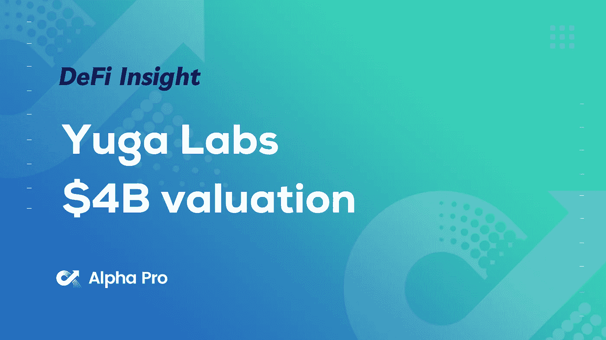
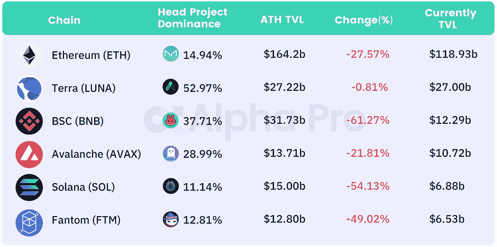
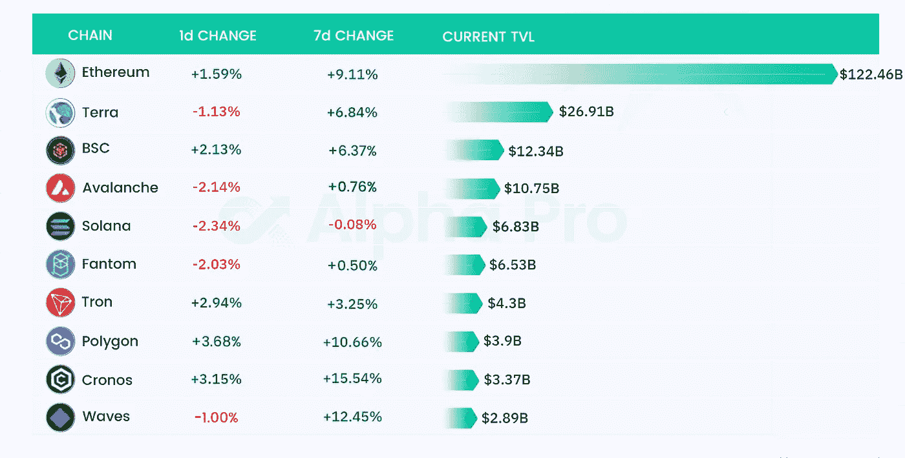
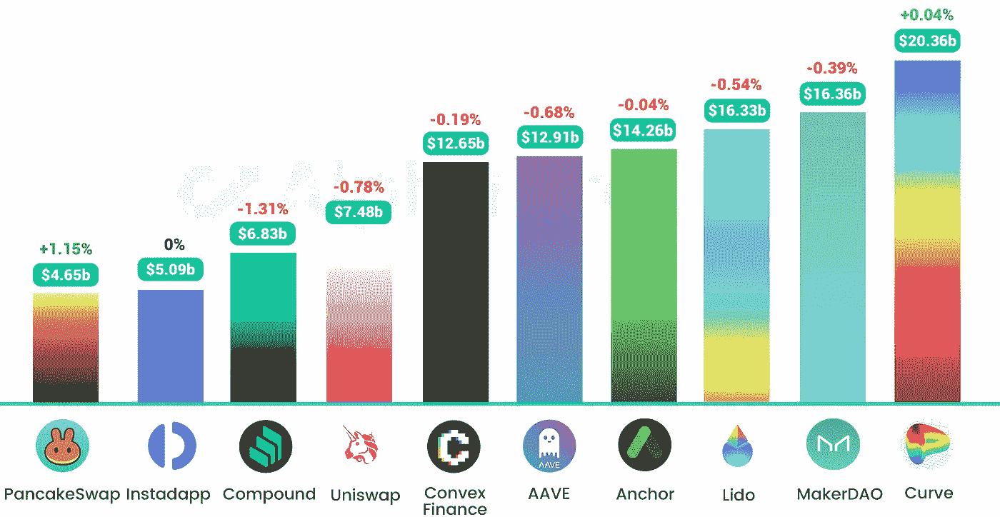
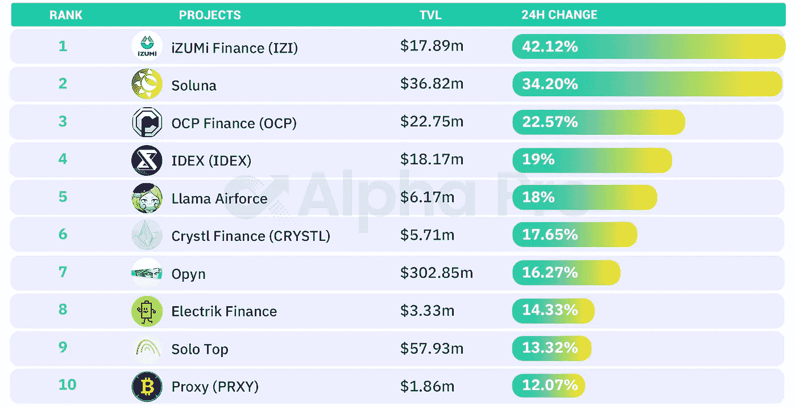
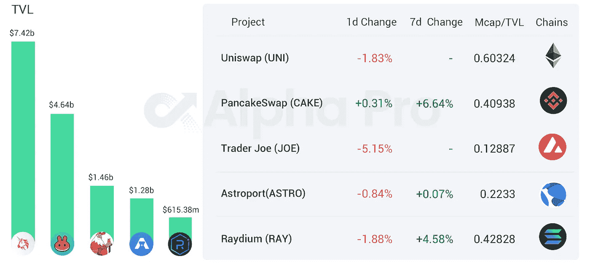
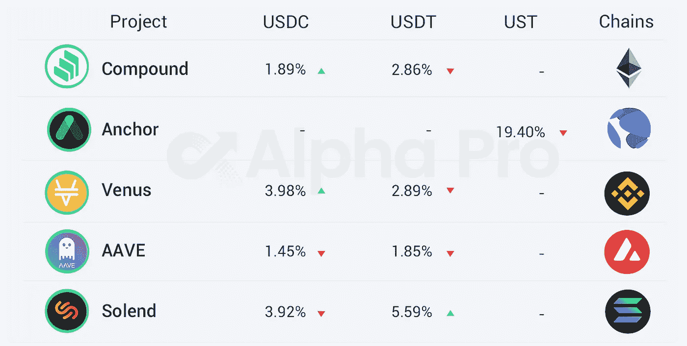

# DeFi Insight | Bored Apes NFT 初创公司宇迦实验室以 40 亿美元的估值筹集种子资金

> 原文：<https://medium.com/coinmonks/defi-insight-bored-apes-nft-startup-yuga-labs-raises-seed-round-at-monster-4b-valuation-39b7fc8f86c9?source=collection_archive---------32----------------------->

## 2022 年 3 月 23 日

*今日 DeFi 数据&由 DeFi Insight 为您带来的新闻。*

> 宇迦实验室是价值数百万美元的猴子 JPEGs 图片的制造商，许多 NFT 怀疑论者喜欢恨它，该公司周二宣布，刚刚从安德森·霍洛维茨融资 4.5 亿美元，估值为 40 亿美元。
> 
> Bored Apes Yacht Club 背后的 NFT 公司此前没有筹集到资金，尽管这家初创公司长期以来一直吸引着渴望支持 NFT 热潮中一个主要参与者的风投的关注。这轮投资的其他投资者包括 Animoca Brands、LionTree、Sound Ventures、Thrive Capital、FTX 和 MoonPay。

# 最新消息

## 定义

摩根士丹利认为 DeFi 仍然[【相当小】](https://translate.google.cn/?sl=en&tl=zh-CN&text=Morgan%20Stanley%20Sees%20DeFi%20Remaining%20%E2%80%98Fairly%20Small%E2%80%99%20as%20Growth%20to%20Slow&op=translate)增长放缓

**web 3 基础设施初创公司 Mysten Labs 发布其[第 1 层区块链](https://www.theblockcrypto.com/linked/138813/web3-infrastructure-startup-mysten-labs-unveils-its-layer-1-blockchain?utm_source=twitter&utm_medium=social)**

**纽约州的立法者正在权衡暂停加密开采，而一些人则期待州长的行政命令**

**交易所 18.3%的 ETH(2018 年以来未见的水平)。27.6%的以太坊锁定在[智能合约](https://twitter.com/Negentropic_/status/1505942284197584898)**

**国际足联与 Crypto.com 签署赞助协议[卡塔尔世界杯](https://www.reuters.com/lifestyle/sports/fifa-signs-sponsorship-deal-with-cryptocom-qatar-world-cup-2022-03-22/?taid=623a31d252440400013be9c5&utm_campaign=trueAnthem:+Trending+Content&utm_medium=trueAnthem&utm_source=twitter)**

## **指标**

**之字形:[zksyn 的 TVL](https://twitter.com/ZigZagExchange/status/1505879302985981953) 目前在 L2 以太坊排名第五，将推出 NFT 市场**

## **贷款**

***[Anchor Protocol](https://forum.anchorprotocol.com/t/proposal-onboarding-batom-as-collateral/3786)计划与 pSTAKE Finance 合作，将引入 ATOM 并将其作为抵押品**

***[Aave 社区](https://governance.aave.com/t/arc-strategic-partnership-with-balancer/7617)提出与 Balancer 战略合作，购买 30 万 BAL**

**锚协议增加了对 [sAVAX 的支持，作为抵押品](https://twitter.com/anchor_protocol/status/1506433876872220673?s=20&t=vEioIGJJ1FVB6KBvdlIUSQ)**

## **产量**

**DeFi 收益率聚合器[earning . finance](https://twitter.com/iearnfinance/status/1506419973731676161)推出新的以太坊跳马曲线火箭池**

## **桥梁**

***[ConsenSys](https://consensys.net/blog/news/consensys-partners-with-palm-on-new-bridge-feature/?utm_source=rss&utm_medium=rss&utm_campaign=consensys-partners-with-palm-on-new-bridge-feature)与 Palm 合作开发新的桥接功能**

***[雪崩桥](/avalancheavax/avalanche-bridge-to-add-native-support-for-bitcoin-expanding-opportunities-for-btc-in-avalanche-38b2314d6e7d)增加对比特币的本地支持，扩大 BTC 在雪崩中的机会**

**阿拉米达的联合首席执行官:购买了所有由 [Stargate](https://mobile.twitter.com/AlamedaTrabucco/status/1506306852396617732) 公开发行的 STG，3 年内不会出售**

**3 月 31 日,[星门](https://twitter.com/StargateFinance/status/1506337289772933130)将再次开始公开发售**

## **保险**

**保险协议 [Degis](https://degis.medium.com/naughty-price-intro-db957c77e772) 将于 4 月 1 日启动主网络，同时启动 AVAX 价格波动保险**

## **钱包**

**DeFi wallet Frontier 现在支持[泰佐斯区块链](https://coingape.com/mobile-first-crypto-wallet-frontier-integrates-with-tezos-to-boost-user-defi-experience/)**

## **道**

**多边形团队:宣布以太坊[采用刀](https://blog.polygon.technology/announcing-the-ethereum-adoption-dao/?utm_source=Twitter-Main&utm_medium=Post&utm_campaign=Tier-1-Announcement)**

**部落刀 x [NEU 区块链](https://neublockchain.medium.com/tribe-dao-x-neu-blockchain-efd6b47bb12a)**

## **稳定币**

****系绳在 TRON 上额外发放 10 亿[USDT](https://twitter.com/paoloardoino/status/1506546241429254144)****

## ****NFT****

******不变的联合创始人:2022 年第一季度 NFT 交易额达到[260 亿美元](https://www.youtube.com/watch?v=74LjNsLb9v0)******

********无聊猿 NFT 创业公司[宇迦实验室](https://techcrunch.com/2022/03/22/bored-apes-nft-startup-yuga-labs-raises-at-monster-4-billion-valuation/)以 40 亿美元的估值筹集种子资金********

********,**Polychain Capital 领投 2200 万美元投资 NFT 评估协议[结果](https://www.coindesk.com/business/2022/03/22/polychain-leads-22m-investment-in-nft-appraisal-protocol-upshot/)******

******美国银行的市场主管以 103.9ETH 的价格收购了 [BAYC #4097](https://twitter.com/KateFernandez87/status/1506445571225276418)******

********、**宝格丽意大利奢侈品牌在 [Polygon 区块链上推出 NFTs](https://u.today/bulgari-italian-luxury-brand-launches-nfts-on-polygon-blockchain)******

******NFT 平台的 [VeVe 系统](https://twitter.com/veve_official/status/1506462179150622722)被恶意使用，市场已被暂时关闭******

## ******基金******

******Nexo 推出 1.5 亿美元的 Web3 投资基金******

********、**赛弗资本推出 1 亿美元[区块链基金](https://www.prnewswire.com/news-releases/cypher-capital-launches-usd100-million-blockchain-fund-301506759.html?utm_source=dlvr.it&utm_medium=twitter)******

******、**安德里森·霍洛维茨、科斯拉在一笔交易中将代币估价为[、30 亿美元](https://www.theinformation.com/articles/andreessen-horowitz-khosla-back-worldcoin-in-deal-valuing-tokens-at-3-billion)****

# ****数据和分析****

## ****TVL 和 ATH 排名前六的连锁酒店对比****

********

****[https://defillama.com/](https://defillama.com/)****

## ****TVL 增长排名前 10 的连锁店****

********

****[https://defillama.com/chains](https://defillama.com/chains)****

## ****最新 TVL 十大项目****

********

****[https://defillama.com/](https://defillama.com/)****

## ****过去 24 小时 TVL 变化的前 10 个项目****

********

****[https://defillama.com/](https://defillama.com/)****

## ****德克斯 TVL 排名****

*****DEX 跌幅最大的是* [乔氏](https://defillama.com/protocol/trader-joe) *，跌了 5.15%*****

********

****[https://defillama.com/protocol/trader-joe](https://defillama.com/protocol/trader-joe)****

## ****APY DeFi 贷款公司****

*****USDC:最高贷款利率:* [*金星*](https://app.venus.io/market/USDC)*3.98% APY*****

*****USDT:最高贷款利率:* [*索伦德*](https://solend.fi/dashboard)*5.59% APY*****

********

# ****深潜****

******黑客集团跟踪 NFTs******

**** [## 黑客组织跟踪 NFTs

### 亲爱的无银行国家，3 月 21 日，星期一，亚瑟·昌，也就是迪法恩斯资本公司的创始人，面临着…

metaversal.banklesshq.com](https://metaversal.banklesshq.com/p/hacker-group-stalks-nfts?s=r) 

**[**宇宙**](https://newsletter.banklesshq.com/p/a-beginners-guide-to-cosmos?s=r) 初级指南**

** [## 宇宙初学者指南

### 亲爱的无银行国家，我是以太坊和比特币的忠实拥护者...但是不，我不是…

newsletter.banklesshq.com](https://newsletter.banklesshq.com/p/a-beginners-guide-to-cosmos?s=r) 

**[**Terra**](https://incentivized.substack.com/p/how-terra-could-change-the-game?s=r)**如何改变游戏****

** [## Terra 如何改变游戏

### 稳定密码在密码经济中起着至关重要的作用，它体现了分散金融的安全保障，同时也体现了信息安全

incentivized.substack.com](https://incentivized.substack.com/p/how-terra-could-change-the-game?s=r) 

**梅蒂斯仙女座—L2 自转**

** [## 梅蒂斯仙女座——L2 旋转

### 虽然 2021 年是 L1 的故事，但 2022 年似乎是 L2 的故事。仲裁机构首先兴风作浪，这是理所当然的…

richmorecapital.substack.com](https://richmorecapital.substack.com/p/metis-andromeda-the-l2-rotation?s=r)** 

# **报告**

****[**EIP-1559 和 CBDCs**](https://content-hub-static.crypto.com/wp-content/uploads/2022/03/20220321_Research-Scholar_EIP1559_CBDCs-1.pdf) **:解析以太坊的 EIP-1559 和麻省理工的汉密尔顿计划******

> ****加密货币和区块链学术研究已经开始成为主流，全球顶尖大学都在从事加密相关主题的前沿研究。****
> 
> ****本报告概述了两篇重要的区块链研究论文，一篇关于以太坊的 EIP-1559(由杜克大学和北京大学完成)，另一篇关于汉密尔顿项目(由波士顿联邦储备银行和麻省理工学院 DCI 分校联合开展的关于中央银行数字货币(CBDCs)的研究项目)。****
> 
> ****EIP-1559 论文回答了关于 EIP-1559 对以太坊交易费用、交易等待时间和安全性的影响的三个关键问题。汉密尔顿项目论文概述了波士顿联邦储备银行和麻省理工学院 DCI 分校在为 CBDCs 设计高性能支付处理系统方面取得的进展。****

****一场 **回合:******

****DeFi Insight 是顶级 DeFi 和加密新闻和更新的来源。****

******https://twitter.com/AlphaPro_io**❤****

********❤RSS:**[**https://medium.com/feed/@alphapro.project**](https://medium.com/feed/@alphapro.project)******

****提供的信息应被视为发展新闻，而不是投资建议。****

> ****加入 Coinmonks [电报频道](https://t.me/coincodecap)和 [Youtube 频道](https://www.youtube.com/c/coinmonks/videos)了解加密交易和投资****

# ****另外，阅读****

*   ****[my constant Review](https://coincodecap.com/myconstant-review)|[8 款最佳摇摆交易机器人](https://coincodecap.com/best-swing-trading-bots)****
*   ****[我的密码交易经验](/coinmonks/my-experience-with-crypto-copy-trading-d6feb2ce3ac5) | [AAX 交易所评论](/coinmonks/aax-exchange-review-2021-67c5ea09330c)****
*   ****[逐位融资融券交易](/coinmonks/bybit-margin-trading-e5071676244e) | [币安融资融券交易](/coinmonks/binance-margin-trading-c9eb5e9d2116) | [超位审核](/coinmonks/overbit-review-9446ed4f2188)****
*   ****[有哪些交易信号？](https://coincodecap.com/trading-signal) | [比特斯坦普 vs 比特币基地](https://coincodecap.com/bitstamp-coinbase)************